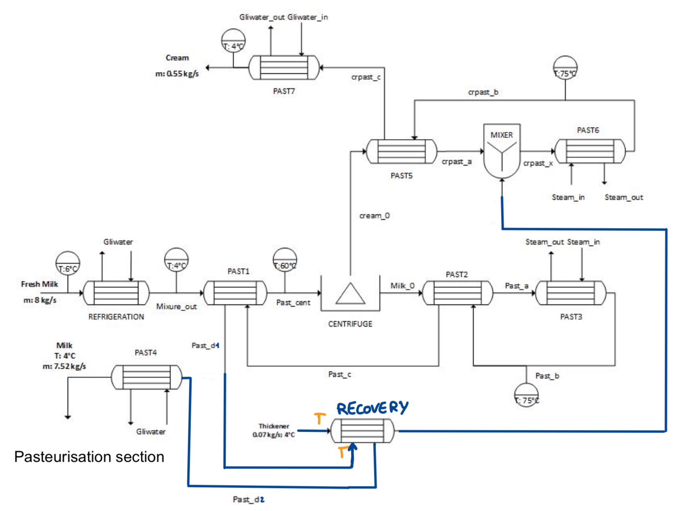
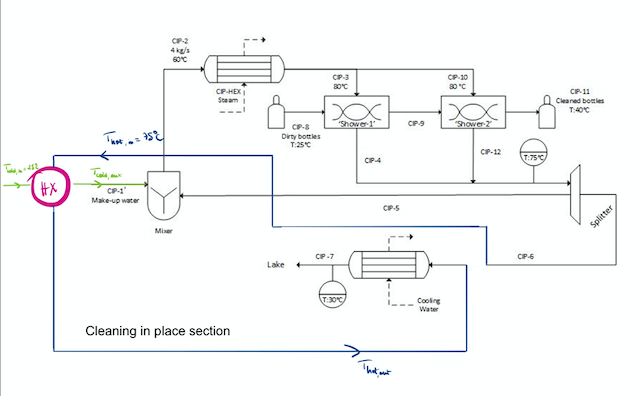
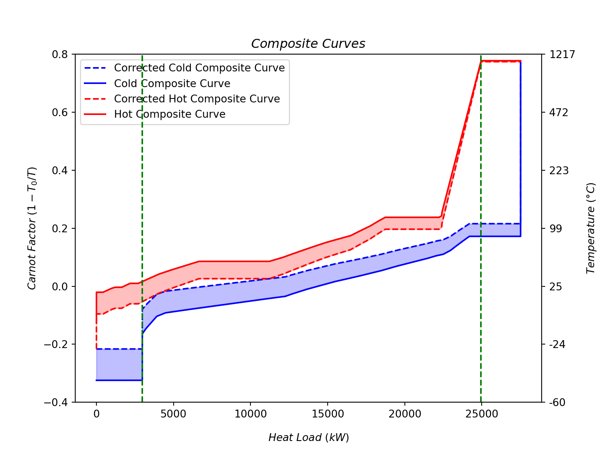
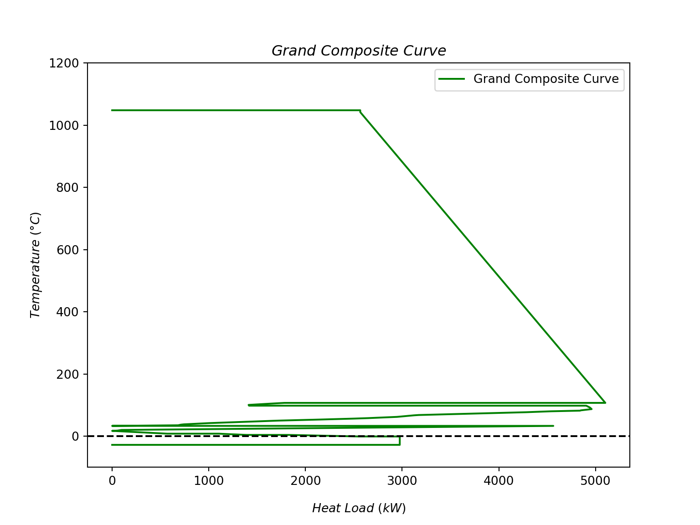

# Pinch analysis
Starting from this chapter, you will embark on optimizing the energy efficiency of the dairy factory. This section is divided into two parts:

- Optimization of the minimum temperature difference ($\Delta$T) in heat exchangers.
- Determining the minimum energy requirement of the factory through the application of pinch analysis.

## Optimization of $\Delta$T minimum

<!---
> **Task Instructions**
>
>This section corresponds to Task 4 of your [project](https://ipese-lectures.epfl.ch/advanced-energetics/project-description/project-5.html#industrial-round-table-4). In this segment, you are required to include the following elements:
>
>- Theoretical Background: Provide a thorough theoretical foundation for your optimization problem. Explain concepts such as how to calculate heat exchanger area and how to estimate heat exchanger investment. Offer insights into the underlying principles and equations involved.
>- Assumptions: Clearly outline the assumptions you have made regarding the parameters and variables within your optimization formulas. This includes assumptions related to heat exchanger characteristics, costs, and other relevant factors.
>- Optimization Results: Present your optimization outcomes using graphical representations or tables. If possible, consider leveraging R and Python libraries to create figures and visualizations, as this may enhance your presentation. **You will receive bonus points if you meet to do so.**
--->

The goal of this part is to determine an optimized dTmin such that costs are minimized. 
In all scenarios we will do the following:

- Determine the area of the HX in term of the dTmin
- Determine the cost of the HX in term of the the Area

The costs will be computed for both France and Germany and will be composed of CAPEX and OPEX.

The idea is too be able to determine if this optimized dTmin enables costs reduction compared to the assumed ∆Tmin of 5K in the Mass/Energy Balances and Energy Bill.

Four different scenarios will be considered:

- Past 5 only
- Past 1 + Past 5 combined
- An addditional heat recovery for pasteurization
- Heat Recovery in Cleaning In Place (CIP) process

The three first scenari focus on the pasterization process whereas the later is about the CIP process.

### General Method

#### Initialisation
First, the T-h diagram of the cold and hot streams is plotted to determined if the dTmin is on the left or right of the diagram (i.e. between $T_{hot,in}$ and $T_{cold,out}$ or between $T_{hot,out}$ and $T_{cold,in}$). This will influence in the following formulas of CAPEX.

In the case of $h_1 < h_2$. The equation of T-h diagram is:

$$
T_{cold}(h) = \frac{h}{m_1 c_{p,1}} + T_{1} - \frac{h_1}{m_1 c_{p,1}}
$${#eq-slope_cold}

$$
T_{hot}(h) = \frac{h}{m_2 c_{p,2}} + T_{2} - \frac{h_2}{m_2 c_{p,2}}
$${#eq-slope_hot}

Then, the dTmin is graphically determined on the right or on the left as the minimum difference between the two curves.

If dTmin is on the right:
$$
T_{cold,out} = T_{hot,in} - dT
$${#eq-right1}
$$
T_{cold,in} = T_{cold}(h_1)
$${#eq-right2}

If dTmin is on the left:
$$
T_{cold,out} = T_{cold}(h_2)
$${#eq-left1}
$$
T_{cold,in} = T_{cold,in} + dT
$${#eq-left2}

#### Investement cost (CAPEX)

The heat exchanger area needs to be computed to get the CAPEX. 

$$
A_{ex} = \frac{Q_{ex}}{U \cdot LMTD}
$${#eq-Aex}

where:

- Qex is the heat exchanged between the two streams

$$
Q = m_{cold} \cdot c_{p,c} \cdot (T_{c,in}-T_{c,out})
  = m_{hot} \cdot c_{p,h} \cdot (T_{h,out}-T_{h,in})
$${#eq-Q}

- U, the total heat transfer coefficient, is assumed to be the half of the heat transfer coefficient of water ($1000 W/m^2K$) since the heat exchanger thickness is way smaller than 1 meter.
$$
U = \frac{\alpha}{2}
$${#eq-U}

- LMTD, the logarithmic mean temperature difference, is computed as follow:

$$
LMTD = \frac{(T_{h,in}-T_{c,out})-(T_{c,in}-T_{h,out})}{\ln(\frac{T_{h,in}-T_{c,out}}{T_{c,in}-T_{h,out}})}
$$

Knowing the heat exchanger area, the CAPEX can be computed as follow:

$$
CAPEX = F_{BM} \cdot C_p \cdot e \cdot a_n
$${#eq-CAPEX}

where:

- $F_{BM}$ is the bare module factor, which is assumed to be 4.74 since a fluid flows in the heat exchanger (Slide 10, T4.1)

- $C_p$ is the cost of the heat exchanger, which is computed as follow: $$C_p = \frac{I_t}{I_{t,ref}} \cdot 10^{k_1+k_2 \cdot \log(A_{ex})}$${#eq-Cp}
    - $I_t = 603.1$ is the investment cost index of the year of interest (2019) @noauthor_fluid_nodate
    - $I_{t,ref} = 389.5$ is the investment cost index of the reference year (1998) @noauthor_fluid_nodate
    - $k_1 = 3.6788$ and $k_2 = 0.4412$ are the constants of the equation (Slide 12, T4.1) for a spiral plate heat exchanger. This type of heat exchanger is assumed because of the area range.

- $e = 0.92 €/\$$ is the exchange rate between us dollar and euro.

- $a_n$ is the annualization factor, which is computed as follow: $$a_n = \frac{i(1+i)^n}{(1+i)^n-1} $${#eq-a_n}
    - $i = 0.05$ is the interest rate (Slide 8, T4.2)
    - $n = 20$ is the lifetime of the heat exchanger

#### Operating cost (OPEX)

Operating cost depends on three factors:

- Natural gas consumption for heating: $$c_{heating} = c_{gas} \cdot Q_{HEX} \cdot t_{op}$${#eq-heating}
    - $c_{gas} = 0.08 €/kWh$ is the price of natural gas in France and Germany
    - $Q_{HEX}$ is the heat exchanged between the two streams
    - $t_{op} = 24 \cdot 0.95 \cdot 365 h/year$ is the operating time of the heat exchanger
    - Assumption: $\eta_{boiler} = 1$

- Electricity consumption for cooling: $$c_{cooling} = c_{elec} \cdot \frac{Q_{HEX}}{COP} \cdot t_{op}$${#eq-cooling}
    - $c_{elec} = 0.12 €/kWh$ is the price of electricity in France, $0.21 €/kWh$ in Germany
    - $Q_{HEX}$ is the heat exchanged between the two streams
    - $COP = 3.5$ is the coefficient of performance of the heat pump

- Water consumption. However, water is considered as being used in a closed loop. Therefore, the cost in not considered in operation cost. It is neglected in CAPEX since the cost is small compared to the heat exchanger cost.

### Past 5 only

Here, Past 5 heat exchanger cost is optimized with respect to dTmin. In the following code, 1 stands for cold stream, and 2 for hot stream. When there is a T_#number, it is related to the entrance of the stream and _prime relate to the exiting. The _Number stands for the past number. 

Example: T2_prime_2 stands for the $T_{hot,out}$ of the past2 HX, T1_5 stands for the $T_{cold,in}$ of the past5 HX.

In this case, $T_{c,in} = 333K$ and $T_{h,in} = 348K$ are known. 


::: {.cell}

```{.python .cell-code}

### Determine the area of the HX in term of the dTmin
import matplotlib
matplotlib.use('Agg')
import numpy as np
import pandas as pd
import matplotlib.pyplot as plt
import plotly.express as px
import plotly.graph_objects as go
from IPython.display import display, HTML
from codes_01_energy_bill.coolprop_functions import mixture

#####
def Dtmin(dT, T1, T1v, T2v, T2, m1, m2, cp1, cp2, position, pastnb):

    if position == 'right':
        T1_prime = T2 - dT
        T2_prime = T2v.min()
    elif position == 'left':
        T1_prime = T1v.max()
        T2_prime = T1 + dT #T1v.max()
    
    #Find the minimum Area of the HX
    Q = m2*cp2*(T2-T2_prime)
    #print('Q = ', round(Q, 3), 'W')
    alpha= 1000 #W/m^2°C, assumption based on alpha_H20
    U = alpha/2
    dtA = abs(T2-T1_prime)  # to be sure we have a positive value in the ln() of the LMTD
    dtB = abs(T1-T2_prime)
    LMTD = (dtA-dtB)/np.log(dtA/dtB)
    Area = Q/(U*LMTD)

    #Find the CAPEX

    CEPCI2019=603.1 
    CEPCI1998=389.5 #https://personalpages.manchester.ac.uk/staff/tom.rodgers/Interactive_graphs/CEPCI.html?reactors/CEPCI/index.html
    K1=3.6788 #sl 12 T4.1 assumption spiral plate HX
    K2=0.4412
    FBM=4.74 #assumption fluid sl 10 T4.1
    i=0.05 #sl 8 T4.2
    e=0.92 #€/$ exchange rate 2023 Nov 
    n=20

    Cp = CEPCI2019/CEPCI1998 * 10**(K1+K2*np.log(Area))

    CBM = Cp*FBM*e

    ANNUALIZATIONFACTOR = (i*(1+i)**n)/((1+i)**n-1)

    CAPEX = ANNUALIZATIONFACTOR*CBM

    #Find the OPEX
    top = 24*0.95*365 #h/year
    gas_fr = 0.08 # €/kWh
    gas_ger = 0.08 # €/kWh 
    elec_fr = 0.12 # €/kWh
    elec_ger = 0.21 # €/kWh
    COP = 3.5 #same assumption in Energy Bill

    if pastnb == 5:
        Qpast6 = m2*cp2*(T2-T1_prime)
        OP6_fr = gas_fr * Qpast6/1000 * top
        OP6_ger = gas_ger * Qpast6/1000 * top

        Qpast7 = m2*cp2*(T2_prime-277)  #T7 = 4°C = 277K
        Wpast7 = Qpast7/COP

        OP7_fr = elec_fr * Wpast7/1000 * top  
        OP7_ger = elec_ger * Wpast7/1000 * top 

        OPEX_fr = OP6_fr + OP7_fr
        OPEX_ger = OP6_ger + OP7_ger

    elif pastnb == 1:
        Qpast2 = m2*cp2*5 # dt = 5 in past 2
        Tpast2out = T1_prime + Qpast2/(m2*cp2)

        Qpast3 = m2*cp2*(Tpast2out-348)

        OP3_fr = gas_fr * Qpast3/1000 * top
        OP3_ger = gas_ger * Qpast3/1000 * top

        Qpast4 = m2*cp2*(T2_prime-277)  #T7 = 4°C = 277K
        Wpast4 = Qpast4/COP

        OP4_fr = elec_fr * Wpast4/1000 * top  
        OP4_ger = elec_ger * Wpast4/1000 * top 

        OPEX_fr = OP3_fr + OP4_fr
        OPEX_ger = OP3_ger + OP4_ger
    
    elif pastnb == 'cip':

        t_cip5 = 348
        t_cip2 = T1_prime
        t_cip1 = T1_prime
        m_cip2 = 4 
        m_cip1 = m1
        m_cip1 = m_cip2*(t_cip2-t_cip5)/(t_cip1-t_cip5) 
        m_cip5 = m_cip2-m_cip1

        Qsteam = m_cip2*cp1*(353-t_cip2)
        OP_steam_cip_fr = gas_fr * Qsteam/1000 * top
        OP_steam_cip_ger = gas_ger * Qsteam/1000 * top

        Qcool = m2*cp2*(T2_prime-303)
        Wcool = Qcool/COP
        OP_cool_cip_fr = elec_fr * Wcool/1000 * top
        OP_cool_cip_ger = elec_ger * Wcool/1000 * top

        OPEX_fr = OP_steam_cip_fr + OP_cool_cip_fr
        OPEX_ger = OP_steam_cip_ger + OP_cool_cip_ger

    elif pastnb == 'HX':

        tpasta = 273+65.9
        cppasta = 3400
        mpastx = 0.55
        mpasta = 0.48
        cppastx = 3498.64
        tpastx = (tpasta*mpasta*cppasta+T1_prime*m1*cp1)/(mpastx*cppastx)

        Qpast6 = mpastx*cppastx*(348-tpastx)

        OP6_fr = gas_fr * Qpast6/1000 * top
        OP6_ger = gas_ger * Qpast6/1000 * top

        Qpast4 = m2*cp2*(T2_prime-277)  #T7 = 4°C = 277K
        Wpast4 = Qpast4/COP

        OP4_fr = elec_fr * Wpast4/1000 * top  
        OP4_ger = elec_ger * Wpast4/1000 * top 

        OPEX_fr = OP6_fr + OP4_fr
        OPEX_ger = OP6_ger + OP4_ger

    #Find the TOTEX
    TOTEX_fr = CAPEX + OPEX_fr
    TOTEX_ger = CAPEX + OPEX_ger

    return CAPEX, OPEX_fr, OPEX_ger, TOTEX_fr, TOTEX_ger, Area, T1_prime, T2_prime
```
:::

::: {.cell}

```{.python .cell-code}
# Scenario 1: dTmin for the past5

T1_5 = 333
T2_5 = 348

p1_5 = 100000

m1_5 = 0.48
m2_5 = 0.55

State_Cold_1_5 = mixture(T=T1_5, P=p1_5, frac_water=0.65, frac_fat=0.35)
State_Cold_2_5 = mixture(T=T2_5, P=p1_5, frac_water=0.65, frac_fat=0.35)

h1_5 = State_Cold_1_5["enthalpy"] * m1_5  #from mixture with dry = 35% and wet = 65%
h2_5 = State_Cold_2_5["enthalpy"] * m2_5

cp1_5 = State_Cold_1_5["cpmass"]
cp2_5 = State_Cold_2_5["cpmass"]

slope1_5 = 1/(m1_5*cp1_5)
slope2_5 = 1/(m2_5*cp2_5)

#Plot the two lines with T on the y-axis and h on the x-axis
#h is the enthalpy of the stream between h1 and h2
N = 100
h_5 = np.linspace(h1_5, h2_5, N)

C1_5 = T1_5 - slope1_5*h1_5
T1v_5 = slope1_5*h_5 + C1_5

C2_5 = T2_5 - slope2_5*h2_5
T2v_5 = slope2_5*h_5 + C2_5


# Create trace for Cold Stream
trace_cold = go.Scatter(x=h_5, y=T1v_5, mode='lines', name='Cold Stream')
# Create trace for Hot Stream
trace_hot = go.Scatter(x=h_5, y=T2v_5, mode='lines', name='Hot Stream')
# Create layout
layout = go.Layout(
    title='Temperature vs Enthalpy',
    xaxis=dict(title='Enthalpy (J)'),
    yaxis=dict(title='Temperature (K)'),
    legend=dict(x=0, y=1, traceorder='normal'),
    showlegend=True
)
# Create figure
fig = go.Figure(data=[trace_cold, trace_hot], layout=layout)
# Plot the vertical line at dTmin
dt_5 = T2v_5 - T1v_5
dTmin_5 = dt_5.min()
min_index_5 = dt_5.argmin()
fig.add_shape(
    type='line',
    x0=h_5[min_index_5],
    x1=h_5[min_index_5],
    y0=min(T1v_5[min_index_5], T2v_5[min_index_5]),
    y1=max(T1v_5[min_index_5], T2v_5[min_index_5]),
    line=dict(color='red', dash='dash')
)
```

::: {.cell-output-display}
```{=html}
<div>                        <script type="text/javascript">window.PlotlyConfig = {MathJaxConfig: 'local'};</script>
        <script src="https://cdn.plot.ly/plotly-2.18.2.min.js"></script>                <div id="c8ad68c9-b74f-419b-9df5-1ceb8c9fdc06" class="plotly-graph-div" style="height:100%; width:100%;"></div>            <script type="text/javascript">                                    window.PLOTLYENV=window.PLOTLYENV || {};                                    if (document.getElementById("c8ad68c9-b74f-419b-9df5-1ceb8c9fdc06")) {                    Plotly.newPlot(                        "c8ad68c9-b74f-419b-9df5-1ceb8c9fdc06",                        [{"mode":"lines","name":"Cold Stream","x":[-43690.12955155219,-43464.81882485353,-43239.50809815487,-43014.1973714562,-42788.886644757535,-42563.57591805887,-42338.26519136021,-42112.95446466155,-41887.64373796288,-41662.333011264214,-41437.02228456555,-41211.71155786689,-40986.40083116823,-40761.090104469564,-40535.779377770894,-40310.46865107223,-40085.15792437357,-39859.847197674906,-39634.53647097624,-39409.22574427757,-39183.91501757891,-38958.60429088025,-38733.293564181586,-38507.98283748292,-38282.67211078426,-38057.36138408559,-37832.05065738693,-37606.739930688265,-37381.4292039896,-37156.11847729093,-36930.80775059227,-36705.49702389361,-36480.186297194945,-36254.87557049628,-36029.56484379762,-35804.25411709896,-35578.94339040029,-35353.632663701625,-35128.32193700296,-34903.0112103043,-34677.70048360563,-34452.38975690697,-34227.079030208304,-34001.76830350964,-33776.45757681098,-33551.146850112316,-33325.836123413654,-33100.525396714984,-32875.21467001632,-32649.90394331766,-32424.593216618992,-32199.28248992033,-31973.971763221663,-31748.661036523,-31523.35030982434,-31298.039583125676,-31072.72885642701,-30847.418129728343,-30622.10740302968,-30396.796676331018,-30171.485949632355,-29946.17522293369,-29720.864496235026,-29495.55376953636,-29270.243042837697,-29044.932316139035,-28819.62158944037,-28594.310862741706,-28369.00013604304,-28143.689409344377,-27918.378682645714,-27693.06795594705,-27467.757229248386,-27242.446502549723,-27017.135775851057,-26791.825049152394,-26566.51432245373,-26341.203595755065,-26115.892869056403,-25890.582142357736,-25665.271415659074,-25439.96068896041,-25214.649962261745,-24989.339235563082,-24764.028508864416,-24538.717782165753,-24313.40705546709,-24088.096328768424,-23862.78560206976,-23637.4748753711,-23412.164148672433,-23186.85342197377,-22961.542695275108,-22736.23196857644,-22510.92124187778,-22285.610515179113,-22060.29978848045,-21834.989061781787,-21609.67833508312,-21384.36760838446],"y":[333.0,333.13525572440415,333.27051144880824,333.4057671732124,333.54102289761653,333.6762786220206,333.81153434642476,333.94679007082885,334.082045795233,334.2173015196371,334.35255724404124,334.4878129684454,334.6230686928495,334.7583244172536,334.8935801416577,335.02883586606185,335.164091590466,335.2993473148701,335.43460303927424,335.5698587636783,335.7051144880825,335.8403702124866,335.9756259368907,336.11088166129485,336.24613738569894,336.3813931101031,336.51664883450724,336.6519045589113,336.7871602833155,336.92241600771956,337.0576717321237,337.19292745652785,337.32818318093194,337.4634389053361,337.5986946297402,337.7339503541443,337.8692060785485,338.00446180295256,338.1397175273567,338.2749732517608,338.41022897616494,338.5454847005691,338.6807404249732,338.8159961493773,338.9512518737814,339.08650759818556,339.2217633225897,339.3570190469938,339.49227477139794,339.62753049580203,339.7627862202062,339.8980419446103,340.0332976690144,340.16855339341856,340.30380911782265,340.4390648422268,340.57432056663094,340.70957629103503,340.8448320154392,340.98008773984327,341.1153434642474,341.25059918865156,341.38585491305565,341.5211106374598,341.6563663618639,341.79162208626803,341.9268778106722,342.06213353507627,342.1973892594804,342.3326449838845,342.46790070828865,342.6031564326928,342.7384121570969,342.87366788150104,343.0089236059051,343.14417933030927,343.2794350547134,343.4146907791175,343.54994650352165,343.68520222792574,343.8204579523299,343.955713676734,344.0909694011381,344.22622512554227,344.36148084994636,344.4967365743505,344.6319922987546,344.76724802315874,344.9025037475629,345.037759471967,345.1730151963711,345.3082709207752,345.44352664517936,345.5787823695835,345.7140380939876,345.84929381839174,345.98454954279583,346.1198052672,346.2550609916041,346.3903167160082],"type":"scatter"},{"mode":"lines","name":"Hot Stream","x":[-43690.12955155219,-43464.81882485353,-43239.50809815487,-43014.1973714562,-42788.886644757535,-42563.57591805887,-42338.26519136021,-42112.95446466155,-41887.64373796288,-41662.333011264214,-41437.02228456555,-41211.71155786689,-40986.40083116823,-40761.090104469564,-40535.779377770894,-40310.46865107223,-40085.15792437357,-39859.847197674906,-39634.53647097624,-39409.22574427757,-39183.91501757891,-38958.60429088025,-38733.293564181586,-38507.98283748292,-38282.67211078426,-38057.36138408559,-37832.05065738693,-37606.739930688265,-37381.4292039896,-37156.11847729093,-36930.80775059227,-36705.49702389361,-36480.186297194945,-36254.87557049628,-36029.56484379762,-35804.25411709896,-35578.94339040029,-35353.632663701625,-35128.32193700296,-34903.0112103043,-34677.70048360563,-34452.38975690697,-34227.079030208304,-34001.76830350964,-33776.45757681098,-33551.146850112316,-33325.836123413654,-33100.525396714984,-32875.21467001632,-32649.90394331766,-32424.593216618992,-32199.28248992033,-31973.971763221663,-31748.661036523,-31523.35030982434,-31298.039583125676,-31072.72885642701,-30847.418129728343,-30622.10740302968,-30396.796676331018,-30171.485949632355,-29946.17522293369,-29720.864496235026,-29495.55376953636,-29270.243042837697,-29044.932316139035,-28819.62158944037,-28594.310862741706,-28369.00013604304,-28143.689409344377,-27918.378682645714,-27693.06795594705,-27467.757229248386,-27242.446502549723,-27017.135775851057,-26791.825049152394,-26566.51432245373,-26341.203595755065,-26115.892869056403,-25890.582142357736,-25665.271415659074,-25439.96068896041,-25214.649962261745,-24989.339235563082,-24764.028508864416,-24538.717782165753,-24313.40705546709,-24088.096328768424,-23862.78560206976,-23637.4748753711,-23412.164148672433,-23186.85342197377,-22961.542695275108,-22736.23196857644,-22510.92124187778,-22285.610515179113,-22060.29978848045,-21834.989061781787,-21609.67833508312,-21384.36760838446],"y":[336.3533412184958,336.4709842364908,336.5886272544858,336.70627027248077,336.8239132904758,336.94155630847075,337.0591993264658,337.17684234446074,337.29448536245576,337.4121283804507,337.52977139844575,337.6474144164407,337.7650574344357,337.8827004524307,338.00034347042566,338.1179864884207,338.23562950641565,338.35327252441067,338.47091554240563,338.58855856040066,338.7062015783956,338.82384459639064,338.9414876143856,339.05913063238063,339.1767736503756,339.2944166683706,339.4120596863656,339.5297027043606,339.64734572235557,339.76498874035053,339.88263175834555,340.0002747763405,340.11791779433554,340.2355608123305,340.3532038303255,340.4708468483205,340.5884898663155,340.7061328843105,340.8237759023055,340.94141892030046,341.0590619382955,341.17670495629045,341.2943479742855,341.41199099228044,341.52963401027546,341.6472770282704,341.7649200462654,341.8825630642604,342.0002060822554,342.1178491002504,342.23549211824536,342.3531351362404,342.47077815423535,342.58842117223037,342.70606419022533,342.82370720822036,342.9413502262153,343.05899324421034,343.1766362622053,343.2942792802003,343.4119222981953,343.5295653161903,343.6472083341853,343.7648513521803,343.88249437017527,344.00013738817023,344.11778040616525,344.2354234241602,344.35306644215524,344.4707094601502,344.5883524781452,344.7059954961402,344.8236385141352,344.9412815321302,345.0589245501252,345.17656756812016,345.2942105861152,345.41185360411015,345.52949662210517,345.64713964010014,345.76478265809516,345.8824256760901,346.00006869408514,346.1177117120801,346.2353547300751,346.3529977480701,346.47064076606506,346.5882837840601,346.70592680205505,346.82356982005007,346.94121283804503,347.05885585604005,347.176498874035,347.29414189203004,347.411784910025,347.52942792802,347.647070946015,347.76471396401,347.882356982005,348.0],"type":"scatter"}],                        {"legend":{"traceorder":"normal","x":0,"y":1},"showlegend":true,"title":{"text":"Temperature vs Enthalpy"},"xaxis":{"title":{"text":"Enthalpy (J)"}},"yaxis":{"title":{"text":"Temperature (K)"}},"template":{"data":{"histogram2dcontour":[{"type":"histogram2dcontour","colorbar":{"outlinewidth":0,"ticks":""},"colorscale":[[0.0,"#0d0887"],[0.1111111111111111,"#46039f"],[0.2222222222222222,"#7201a8"],[0.3333333333333333,"#9c179e"],[0.4444444444444444,"#bd3786"],[0.5555555555555556,"#d8576b"],[0.6666666666666666,"#ed7953"],[0.7777777777777778,"#fb9f3a"],[0.8888888888888888,"#fdca26"],[1.0,"#f0f921"]]}],"choropleth":[{"type":"choropleth","colorbar":{"outlinewidth":0,"ticks":""}}],"histogram2d":[{"type":"histogram2d","colorbar":{"outlinewidth":0,"ticks":""},"colorscale":[[0.0,"#0d0887"],[0.1111111111111111,"#46039f"],[0.2222222222222222,"#7201a8"],[0.3333333333333333,"#9c179e"],[0.4444444444444444,"#bd3786"],[0.5555555555555556,"#d8576b"],[0.6666666666666666,"#ed7953"],[0.7777777777777778,"#fb9f3a"],[0.8888888888888888,"#fdca26"],[1.0,"#f0f921"]]}],"heatmap":[{"type":"heatmap","colorbar":{"outlinewidth":0,"ticks":""},"colorscale":[[0.0,"#0d0887"],[0.1111111111111111,"#46039f"],[0.2222222222222222,"#7201a8"],[0.3333333333333333,"#9c179e"],[0.4444444444444444,"#bd3786"],[0.5555555555555556,"#d8576b"],[0.6666666666666666,"#ed7953"],[0.7777777777777778,"#fb9f3a"],[0.8888888888888888,"#fdca26"],[1.0,"#f0f921"]]}],"heatmapgl":[{"type":"heatmapgl","colorbar":{"outlinewidth":0,"ticks":""},"colorscale":[[0.0,"#0d0887"],[0.1111111111111111,"#46039f"],[0.2222222222222222,"#7201a8"],[0.3333333333333333,"#9c179e"],[0.4444444444444444,"#bd3786"],[0.5555555555555556,"#d8576b"],[0.6666666666666666,"#ed7953"],[0.7777777777777778,"#fb9f3a"],[0.8888888888888888,"#fdca26"],[1.0,"#f0f921"]]}],"contourcarpet":[{"type":"contourcarpet","colorbar":{"outlinewidth":0,"ticks":""}}],"contour":[{"type":"contour","colorbar":{"outlinewidth":0,"ticks":""},"colorscale":[[0.0,"#0d0887"],[0.1111111111111111,"#46039f"],[0.2222222222222222,"#7201a8"],[0.3333333333333333,"#9c179e"],[0.4444444444444444,"#bd3786"],[0.5555555555555556,"#d8576b"],[0.6666666666666666,"#ed7953"],[0.7777777777777778,"#fb9f3a"],[0.8888888888888888,"#fdca26"],[1.0,"#f0f921"]]}],"surface":[{"type":"surface","colorbar":{"outlinewidth":0,"ticks":""},"colorscale":[[0.0,"#0d0887"],[0.1111111111111111,"#46039f"],[0.2222222222222222,"#7201a8"],[0.3333333333333333,"#9c179e"],[0.4444444444444444,"#bd3786"],[0.5555555555555556,"#d8576b"],[0.6666666666666666,"#ed7953"],[0.7777777777777778,"#fb9f3a"],[0.8888888888888888,"#fdca26"],[1.0,"#f0f921"]]}],"mesh3d":[{"type":"mesh3d","colorbar":{"outlinewidth":0,"ticks":""}}],"scatter":[{"fillpattern":{"fillmode":"overlay","size":10,"solidity":0.2},"type":"scatter"}],"parcoords":[{"type":"parcoords","line":{"colorbar":{"outlinewidth":0,"ticks":""}}}],"scatterpolargl":[{"type":"scatterpolargl","marker":{"colorbar":{"outlinewidth":0,"ticks":""}}}],"bar":[{"error_x":{"color":"#2a3f5f"},"error_y":{"color":"#2a3f5f"},"marker":{"line":{"color":"#E5ECF6","width":0.5},"pattern":{"fillmode":"overlay","size":10,"solidity":0.2}},"type":"bar"}],"scattergeo":[{"type":"scattergeo","marker":{"colorbar":{"outlinewidth":0,"ticks":""}}}],"scatterpolar":[{"type":"scatterpolar","marker":{"colorbar":{"outlinewidth":0,"ticks":""}}}],"histogram":[{"marker":{"pattern":{"fillmode":"overlay","size":10,"solidity":0.2}},"type":"histogram"}],"scattergl":[{"type":"scattergl","marker":{"colorbar":{"outlinewidth":0,"ticks":""}}}],"scatter3d":[{"type":"scatter3d","line":{"colorbar":{"outlinewidth":0,"ticks":""}},"marker":{"colorbar":{"outlinewidth":0,"ticks":""}}}],"scattermapbox":[{"type":"scattermapbox","marker":{"colorbar":{"outlinewidth":0,"ticks":""}}}],"scatterternary":[{"type":"scatterternary","marker":{"colorbar":{"outlinewidth":0,"ticks":""}}}],"scattercarpet":[{"type":"scattercarpet","marker":{"colorbar":{"outlinewidth":0,"ticks":""}}}],"carpet":[{"aaxis":{"endlinecolor":"#2a3f5f","gridcolor":"white","linecolor":"white","minorgridcolor":"white","startlinecolor":"#2a3f5f"},"baxis":{"endlinecolor":"#2a3f5f","gridcolor":"white","linecolor":"white","minorgridcolor":"white","startlinecolor":"#2a3f5f"},"type":"carpet"}],"table":[{"cells":{"fill":{"color":"#EBF0F8"},"line":{"color":"white"}},"header":{"fill":{"color":"#C8D4E3"},"line":{"color":"white"}},"type":"table"}],"barpolar":[{"marker":{"line":{"color":"#E5ECF6","width":0.5},"pattern":{"fillmode":"overlay","size":10,"solidity":0.2}},"type":"barpolar"}],"pie":[{"automargin":true,"type":"pie"}]},"layout":{"autotypenumbers":"strict","colorway":["#636efa","#EF553B","#00cc96","#ab63fa","#FFA15A","#19d3f3","#FF6692","#B6E880","#FF97FF","#FECB52"],"font":{"color":"#2a3f5f"},"hovermode":"closest","hoverlabel":{"align":"left"},"paper_bgcolor":"white","plot_bgcolor":"#E5ECF6","polar":{"bgcolor":"#E5ECF6","angularaxis":{"gridcolor":"white","linecolor":"white","ticks":""},"radialaxis":{"gridcolor":"white","linecolor":"white","ticks":""}},"ternary":{"bgcolor":"#E5ECF6","aaxis":{"gridcolor":"white","linecolor":"white","ticks":""},"baxis":{"gridcolor":"white","linecolor":"white","ticks":""},"caxis":{"gridcolor":"white","linecolor":"white","ticks":""}},"coloraxis":{"colorbar":{"outlinewidth":0,"ticks":""}},"colorscale":{"sequential":[[0.0,"#0d0887"],[0.1111111111111111,"#46039f"],[0.2222222222222222,"#7201a8"],[0.3333333333333333,"#9c179e"],[0.4444444444444444,"#bd3786"],[0.5555555555555556,"#d8576b"],[0.6666666666666666,"#ed7953"],[0.7777777777777778,"#fb9f3a"],[0.8888888888888888,"#fdca26"],[1.0,"#f0f921"]],"sequentialminus":[[0.0,"#0d0887"],[0.1111111111111111,"#46039f"],[0.2222222222222222,"#7201a8"],[0.3333333333333333,"#9c179e"],[0.4444444444444444,"#bd3786"],[0.5555555555555556,"#d8576b"],[0.6666666666666666,"#ed7953"],[0.7777777777777778,"#fb9f3a"],[0.8888888888888888,"#fdca26"],[1.0,"#f0f921"]],"diverging":[[0,"#8e0152"],[0.1,"#c51b7d"],[0.2,"#de77ae"],[0.3,"#f1b6da"],[0.4,"#fde0ef"],[0.5,"#f7f7f7"],[0.6,"#e6f5d0"],[0.7,"#b8e186"],[0.8,"#7fbc41"],[0.9,"#4d9221"],[1,"#276419"]]},"xaxis":{"gridcolor":"white","linecolor":"white","ticks":"","title":{"standoff":15},"zerolinecolor":"white","automargin":true,"zerolinewidth":2},"yaxis":{"gridcolor":"white","linecolor":"white","ticks":"","title":{"standoff":15},"zerolinecolor":"white","automargin":true,"zerolinewidth":2},"scene":{"xaxis":{"backgroundcolor":"#E5ECF6","gridcolor":"white","linecolor":"white","showbackground":true,"ticks":"","zerolinecolor":"white","gridwidth":2},"yaxis":{"backgroundcolor":"#E5ECF6","gridcolor":"white","linecolor":"white","showbackground":true,"ticks":"","zerolinecolor":"white","gridwidth":2},"zaxis":{"backgroundcolor":"#E5ECF6","gridcolor":"white","linecolor":"white","showbackground":true,"ticks":"","zerolinecolor":"white","gridwidth":2}},"shapedefaults":{"line":{"color":"#2a3f5f"}},"annotationdefaults":{"arrowcolor":"#2a3f5f","arrowhead":0,"arrowwidth":1},"geo":{"bgcolor":"white","landcolor":"#E5ECF6","subunitcolor":"white","showland":true,"showlakes":true,"lakecolor":"white"},"title":{"x":0.05},"mapbox":{"style":"light"}}},"shapes":[{"line":{"color":"red","dash":"dash"},"type":"line","x0":-21384.36760838446,"x1":-21384.36760838446,"y0":346.3903167160082,"y1":348.0}]},                        {"responsive": true}                    )                };                            </script>        </div>
```
:::

```{.python .cell-code}
#print('dTmin =', round(dTmin_5, 3), 'K at h =', round(h_5[min_index_5], 3), 'kJ/kg')

#Redo the CAPEX/OPEX/TOTEX for different dT and plot the results

CAPEXv_5 = []
OPEX_frv_5 = []
OPEX_gerv_5 = []
TOTEX_frv_5 = []
TOTEX_gerv_5 = []
Areav_5 = []

dt_5 = np.linspace(0.1, 30, 300)

for t in dt_5:
    CAPEX_5, OPEX_fr_5, OPEX_ger_5, TOTEX_fr_5, TOTEX_ger_5, Area_5 = Dtmin(t, T1_5, T1v_5, T2v_5, T2_5, m1_5, m2_5, cp1_5, cp2_5, 'right', 5)[0:6]
    CAPEXv_5.append(CAPEX_5)
    OPEX_frv_5.append(OPEX_fr_5)
    OPEX_gerv_5.append(OPEX_ger_5)
    TOTEX_frv_5.append(TOTEX_fr_5)
    TOTEX_gerv_5.append(TOTEX_ger_5)
    Areav_5.append(Area_5)

#plot the results with respect to the dt values

# Create traces for each cost component
trace_capex = go.Scatter(x=dt_5, y=CAPEXv_5, mode='lines', name='CAPEX', line=dict(color='black'))
trace_opex_france = go.Scatter(x=dt_5, y=OPEX_frv_5, mode='lines', name='OPEX (France)', line=dict(color='blue'))
trace_opex_germany = go.Scatter(x=dt_5, y=OPEX_gerv_5, mode='lines', name='OPEX (Germany)', line=dict(color='red'))
trace_totex_france = go.Scatter(x=dt_5, y=TOTEX_frv_5, mode='lines', name='TOTEX (France)', line=dict(color='blue', dash='dash'))
trace_totex_germany = go.Scatter(x=dt_5, y=TOTEX_gerv_5, mode='lines', name='TOTEX (Germany)', line=dict(color='red', dash='dash'))

# Create layout
layout = go.Layout(
    title='Costs vs dTmin',
    xaxis=dict(title='dTmin (K)'),
    yaxis=dict(title='Costs (€)'),
    legend=dict(x=0, y=-0.2, traceorder='normal', orientation='h'),
    showlegend=True
)

# Create figure
fig = go.Figure(data=[trace_capex, trace_opex_france, trace_opex_germany, trace_totex_france, trace_totex_germany], layout=layout)

# Mark the minima points for both France and Germany
min_index_fr_5 = np.argmin(TOTEX_frv_5)
fig = fig.add_trace(go.Scatter(x=[dt_5[min_index_fr_5]], y=[TOTEX_frv_5[min_index_fr_5]], mode='markers', marker=dict(color='blue'), name='Min TOTEX (France)'))

min_index_ger_5 = np.argmin(TOTEX_gerv_5)
fig = fig.add_trace(go.Scatter(x=[dt_5[min_index_ger_5]], y=[TOTEX_gerv_5[min_index_ger_5]], mode='markers', marker=dict(color='red'), name='Min TOTEX (Germany)'))

# Show the figure
fig.show()
```

::: {.cell-output-display}
```{=html}
<div>                        <script type="text/javascript">window.PlotlyConfig = {MathJaxConfig: 'local'};</script>
        <script src="https://cdn.plot.ly/plotly-2.18.2.min.js"></script>                <div id="b98489e1-fd19-49c3-bc14-c767efb50260" class="plotly-graph-div" style="height:100%; width:100%;"></div>            <script type="text/javascript">                                    window.PLOTLYENV=window.PLOTLYENV || {};                                    if (document.getElementById("b98489e1-fd19-49c3-bc14-c767efb50260")) {                    Plotly.newPlot(                        "b98489e1-fd19-49c3-bc14-c767efb50260",                        [{"line":{"color":"black"},"mode":"lines","name":"CAPEX","x":[0.1,0.2,0.3,0.4,0.5,0.6,0.7,0.7999999999999999,0.8999999999999999,0.9999999999999999,1.0999999999999999,1.2,1.3,1.4,1.5,1.5999999999999999,1.7,1.8,1.9,2.0,2.0999999999999996,2.1999999999999997,2.3,2.4,2.5,2.6,2.6999999999999997,2.8,2.9,3.0,3.0999999999999996,3.1999999999999997,3.3,3.4,3.5,3.5999999999999996,3.6999999999999997,3.8,3.9,3.9999999999999996,4.1,4.199999999999999,4.299999999999999,4.3999999999999995,4.499999999999999,4.6,4.699999999999999,4.799999999999999,4.8999999999999995,4.999999999999999,5.1,5.199999999999999,5.299999999999999,5.3999999999999995,5.499999999999999,5.599999999999999,5.699999999999999,5.799999999999999,5.8999999999999995,5.999999999999999,6.099999999999999,6.199999999999999,6.299999999999999,6.3999999999999995,6.499999999999999,6.599999999999999,6.699999999999999,6.799999999999999,6.8999999999999995,6.999999999999999,7.099999999999999,7.199999999999999,7.299999999999999,7.3999999999999995,7.499999999999999,7.599999999999999,7.699999999999999,7.799999999999999,7.899999999999999,7.999999999999999,8.1,8.2,8.299999999999999,8.399999999999999,8.499999999999998,8.6,8.7,8.799999999999999,8.899999999999999,8.999999999999998,9.1,9.2,9.299999999999999,9.399999999999999,9.499999999999998,9.6,9.7,9.799999999999999,9.899999999999999,9.999999999999998,10.1,10.2,10.299999999999999,10.399999999999999,10.499999999999998,10.6,10.7,10.799999999999999,10.899999999999999,10.999999999999998,11.099999999999998,11.2,11.299999999999999,11.399999999999999,11.499999999999998,11.599999999999998,11.7,11.799999999999999,11.899999999999999,11.999999999999998,12.099999999999998,12.2,12.299999999999999,12.399999999999999,12.499999999999998,12.599999999999998,12.7,12.799999999999999,12.899999999999999,12.999999999999998,13.099999999999998,13.2,13.299999999999999,13.399999999999999,13.499999999999998,13.599999999999998,13.7,13.799999999999999,13.899999999999999,13.999999999999998,14.099999999999998,14.2,14.299999999999999,14.399999999999999,14.499999999999998,14.599999999999998,14.7,14.799999999999999,14.899999999999999,14.999999999999998,15.099999999999998,15.199999999999998,15.299999999999999,15.399999999999999,15.499999999999998,15.599999999999998,15.699999999999998,15.799999999999999,15.899999999999999,15.999999999999998,16.099999999999998,16.2,16.3,16.4,16.5,16.6,16.7,16.8,16.9,17.0,17.1,17.2,17.3,17.4,17.5,17.6,17.7,17.8,17.9,18.0,18.1,18.2,18.3,18.4,18.5,18.6,18.7,18.8,18.9,19.0,19.1,19.2,19.3,19.4,19.5,19.6,19.7,19.8,19.9,20.0,20.1,20.2,20.3,20.4,20.5,20.6,20.7,20.8,20.9,21.0,21.1,21.2,21.3,21.4,21.5,21.599999999999998,21.7,21.8,21.9,22.0,22.099999999999998,22.2,22.3,22.4,22.5,22.599999999999998,22.7,22.8,22.9,23.0,23.099999999999998,23.2,23.3,23.4,23.5,23.599999999999998,23.7,23.8,23.9,24.0,24.099999999999998,24.2,24.3,24.4,24.5,24.599999999999998,24.7,24.8,24.9,25.0,25.099999999999998,25.2,25.3,25.4,25.5,25.599999999999998,25.7,25.8,25.9,26.0,26.099999999999998,26.2,26.3,26.4,26.5,26.599999999999998,26.7,26.8,26.9,27.0,27.099999999999998,27.2,27.3,27.4,27.5,27.599999999999998,27.7,27.8,27.9,28.0,28.099999999999998,28.2,28.3,28.4,28.5,28.599999999999998,28.7,28.8,28.9,29.0,29.099999999999998,29.2,29.3,29.4,29.5,29.599999999999998,29.7,29.8,29.9,30.0],"y":[132479.42388167555,109380.29608757317,96528.10873162409,87772.4863555941,81215.56349855707,76023.4042329277,71756.72335329538,68156.39790602289,65057.16487161147,62347.398064381225,59948.30378230105,57802.28566717774,55866.02807347415,54106.17750842032,52496.53505449859,51016.1682251713,49648.10401968179,48378.40152059968,47195.479417497925,46089.61901633929,45052.59069507034,44077.368885391166,43157.91164103977,42288.988062468765,41466.041682021656,40685.08121738248,39942.59239793738,39235.4661909274,38560.939916607815,37916.54858552838,37300.08441131624,36709.562913355156,36143.19437007749,35599.359646257115,35076.58961874906,34573.54758036313,34089.01412233491,33621.87409057523,33171.105285661695,32735.768635971242,32314.999620913095,31908.000759468283,31514.035010213625,31132.419954194214,30762.522652599335,30403.755088131016,30055.57011291468,29717.45783738853,29388.94240425429,29069.57909962295,28758.95176026783,28456.67044157972,28162.369315644723,27875.704772945504,27596.353704656456,27324.011945477618,27058.392859481424,26799.226053629875,26546.25620549795,26299.24199335119,26057.955118135185,25822.179408143744,25591.709998193564,25366.352576055753,25145.922689695155,24930.245109579664,24719.153240935564,24512.488581370824,24310.100219769334,24111.84437277624,23917.58395557739,23727.188183997565,23540.53220524355,23357.496754877204,23177.967837833592,23001.836431512445,22828.998209151177,22659.353281856576,22492.80595782141,22329.26451738207,22168.64100269795,22010.851020936556,21855.81355994858,21703.450815503562,21553.688029234996,21406.45333651834,21261.677623565476,21119.29439308238,20979.239637888004,20841.4517219398,20705.871268258183,20572.441053279606,20441.10590720524,20311.81261994778,20184.50985230485,20059.1480520206,19935.679374417934,19814.057607309944,19694.2380999205,19576.177695561044,19459.83466783231,19345.168660133193,19232.140628275578,19120.71278601903,19010.84855334873,18902.51250733704,18795.670335435,18690.288791053514,18586.335651302878,18483.779676766506,18382.590573194524,18282.73895500952,18184.196310523315,18086.934968771413,17990.928067875568,17896.149524853015,17802.57400679389,17710.176903333584,17618.93430035333,17528.822954842453,17439.820270864107,17351.904276565798,17265.053602182415,17179.247458981423,17094.465619101917,17010.68839624408,16927.89662716599,16846.07165394848,16765.195306991027,16685.24988870182,16606.218157850963,16528.083314552823,16450.82898584907,16374.439211864317,16298.898432506623,16224.191474688674,16150.30354004527,16077.22019312388,16004.92735002836,15933.411267493508,15862.658532373003,15792.656051520838,15723.391042050016,15654.851021951654,15587.023801058187,15519.897472337207,15453.46040350017,15387.70122891365,15322.608841799998,15258.172386715018,15194.381252291416,15131.225064236973,15068.693678576365,15006.777175127683,14945.465851202813,14884.750215524156,14824.62098234724,14765.069065782467,14706.085574307375,14647.661805461841,14589.789240719436,14532.459540527878,14475.664539511607,14419.396241831373,14363.646816693095,14308.408594002301,14253.674060156949,14199.435853974166,14145.686762746242,14092.419718420211,14039.62779389713,13987.304199446291,13935.44227923043,13884.035507937651,13833.077487516251,13782.561944009101,13732.482724483463,13682.833794052991,13633.609232989238,13584.803233918668,13536.410099102846,13488.424237798343,13440.840163694143,13393.652492423742,13346.855939148802,13300.445316213003,13254.415530862685,13208.761583032647,13163.478563194612,13118.561650266609,13074.006109580672,13029.807290907756,12985.960626536993,12942.461629408474,12899.305891297132,12856.489081046491,12814.00694285039,12771.855294581172,12730.030026163351,12688.527097990305,12647.342539383932,12606.472447094568,12565.912983841068,12525.66037688909,12485.710916666541,12446.06095541543,12406.706905878278,12367.645240018708,12328.872487775026,12290.385235845271,12252.18012650361,12214.253856446621,12176.603175668433,12139.224886364591,12102.115841862798,12065.27294558076,12028.693150009432,11992.373455721623,11956.310910404804,11920.502607917637,11884.945687369316,11849.637332221588,11814.574769411829,11779.755268497796,11745.176140822392,11710.834738698635,11676.728454613702,11642.854720451878,11609.211006735803,11575.794821885349,11542.603711493915,11509.635257621534,11476.88707810399,11444.356825878393,11412.042188323609,11379.940886616285,11348.050675101165,11316.369340675636,11284.894702188492,11253.624609851862,11222.556944666372,11191.689617859223,11161.020570334562,11130.547772136226,11100.269221921946,11070.18294644952,11040.287000073882,11010.579464255126,10981.058447077427,10951.722082778064,10922.56853128668,10893.595977774488,10864.802632212892,10836.186728941733,10807.746526246336,10779.480305943878,10751.386372978208,10723.463055023018,10695.708702093576,10668.121686166362,10640.70040080659,10613.443260803406,10586.348701812525,10559.415180006403,10532.64117173115,10506.025173170778,10479.565700018089,10453.26128715209,10427.110488322167,10401.111875838234,10375.264040267364,10349.565590136337,10324.015151639864,10298.61136835508,10273.352900960963,10248.238426963972,10223.2666404285,10198.436251712668,10173.745987209562,10149.194589093051,10124.78081506876,10100.50343812973,10076.361246316694,10052.353042483059,10028.477644064249,10004.733882851422,9981.120604769456,9957.636669659138,9934.280951063382,9911.0523360175,9887.949724843316,9864.972030947147,9842.118180621386,9819.387112849994,9796.777779117254,9774.289143220338,9751.92018108499,9729.669880584752,9707.537241363449,9685.521274660781],"type":"scatter"},{"line":{"color":"blue"},"mode":"lines","name":"OPEX (France)","x":[0.1,0.2,0.3,0.4,0.5,0.6,0.7,0.7999999999999999,0.8999999999999999,0.9999999999999999,1.0999999999999999,1.2,1.3,1.4,1.5,1.5999999999999999,1.7,1.8,1.9,2.0,2.0999999999999996,2.1999999999999997,2.3,2.4,2.5,2.6,2.6999999999999997,2.8,2.9,3.0,3.0999999999999996,3.1999999999999997,3.3,3.4,3.5,3.5999999999999996,3.6999999999999997,3.8,3.9,3.9999999999999996,4.1,4.199999999999999,4.299999999999999,4.3999999999999995,4.499999999999999,4.6,4.699999999999999,4.799999999999999,4.8999999999999995,4.999999999999999,5.1,5.199999999999999,5.299999999999999,5.3999999999999995,5.499999999999999,5.599999999999999,5.699999999999999,5.799999999999999,5.8999999999999995,5.999999999999999,6.099999999999999,6.199999999999999,6.299999999999999,6.3999999999999995,6.499999999999999,6.599999999999999,6.699999999999999,6.799999999999999,6.8999999999999995,6.999999999999999,7.099999999999999,7.199999999999999,7.299999999999999,7.3999999999999995,7.499999999999999,7.599999999999999,7.699999999999999,7.799999999999999,7.899999999999999,7.999999999999999,8.1,8.2,8.299999999999999,8.399999999999999,8.499999999999998,8.6,8.7,8.799999999999999,8.899999999999999,8.999999999999998,9.1,9.2,9.299999999999999,9.399999999999999,9.499999999999998,9.6,9.7,9.799999999999999,9.899999999999999,9.999999999999998,10.1,10.2,10.299999999999999,10.399999999999999,10.499999999999998,10.6,10.7,10.799999999999999,10.899999999999999,10.999999999999998,11.099999999999998,11.2,11.299999999999999,11.399999999999999,11.499999999999998,11.599999999999998,11.7,11.799999999999999,11.899999999999999,11.999999999999998,12.099999999999998,12.2,12.299999999999999,12.399999999999999,12.499999999999998,12.599999999999998,12.7,12.799999999999999,12.899999999999999,12.999999999999998,13.099999999999998,13.2,13.299999999999999,13.399999999999999,13.499999999999998,13.599999999999998,13.7,13.799999999999999,13.899999999999999,13.999999999999998,14.099999999999998,14.2,14.299999999999999,14.399999999999999,14.499999999999998,14.599999999999998,14.7,14.799999999999999,14.899999999999999,14.999999999999998,15.099999999999998,15.199999999999998,15.299999999999999,15.399999999999999,15.499999999999998,15.599999999999998,15.699999999999998,15.799999999999999,15.899999999999999,15.999999999999998,16.099999999999998,16.2,16.3,16.4,16.5,16.6,16.7,16.8,16.9,17.0,17.1,17.2,17.3,17.4,17.5,17.6,17.7,17.8,17.9,18.0,18.1,18.2,18.3,18.4,18.5,18.6,18.7,18.8,18.9,19.0,19.1,19.2,19.3,19.4,19.5,19.6,19.7,19.8,19.9,20.0,20.1,20.2,20.3,20.4,20.5,20.6,20.7,20.8,20.9,21.0,21.1,21.2,21.3,21.4,21.5,21.599999999999998,21.7,21.8,21.9,22.0,22.099999999999998,22.2,22.3,22.4,22.5,22.599999999999998,22.7,22.8,22.9,23.0,23.099999999999998,23.2,23.3,23.4,23.5,23.599999999999998,23.7,23.8,23.9,24.0,24.099999999999998,24.2,24.3,24.4,24.5,24.599999999999998,24.7,24.8,24.9,25.0,25.099999999999998,25.2,25.3,25.4,25.5,25.599999999999998,25.7,25.8,25.9,26.0,26.099999999999998,26.2,26.3,26.4,26.5,26.599999999999998,26.7,26.8,26.9,27.0,27.099999999999998,27.2,27.3,27.4,27.5,27.599999999999998,27.7,27.8,27.9,28.0,28.099999999999998,28.2,28.3,28.4,28.5,28.599999999999998,28.7,28.8,28.9,29.0,29.099999999999998,29.2,29.3,29.4,29.5,29.599999999999998,29.7,29.8,29.9,30.0],"y":[32561.60269623051,32689.10951470846,32816.616333186474,32944.123151664426,33071.62997014244,33199.13678862046,33326.643607098405,33454.15042557642,33581.65724405437,33709.164062532385,33836.67088101041,33964.177699488355,34091.68451796637,34219.19133644432,34346.698154922335,34474.20497340035,34601.711791878304,34729.21861035632,34856.72542883427,34984.232247312284,35111.7390657903,35239.245884268246,35366.752702746264,35494.259521224216,35621.76633970223,35749.27315818025,35876.779976658196,36004.28679513621,36131.79361361416,36259.300432092175,36386.8072505702,36514.314069048145,36641.82088752616,36769.32770600411,36896.834524482125,37024.34134296014,37151.84816143809,37279.35497991611,37406.86179839406,37534.368616872074,37661.87543535009,37789.38225382804,37916.889072306054,38044.395890784,38171.90270926202,38299.40952774004,38426.916346217986,38554.423164696,38681.92998317395,38809.436801651966,38936.94362012998,39064.450438607935,39191.95725708595,39319.4640755639,39446.970894041915,39574.47771251993,39701.98453099788,39829.491349475895,39956.99816795385,40084.504986431864,40212.01180490988,40339.51862338783,40467.025441865844,40594.53226034379,40722.03907882181,40849.54589729983,40977.052715777776,41104.55953425579,41232.06635273374,41359.573171211756,41487.07998968977,41614.58680816772,41742.09362664574,41869.60044512369,41997.107263601705,42124.61408207972,42252.12090055767,42379.62771903569,42507.13453751363,42634.641355991655,42762.14817446967,42889.65499294762,43017.161811425634,43144.66862990358,43272.175448381604,43399.682266859614,43527.189085337566,43654.695903815584,43782.20272229353,43909.709540771546,44037.21635924956,44164.72317772751,44292.22999620553,44419.73681468348,44547.24363316149,44674.75045163951,44802.25727011746,44929.764088595475,45057.27090707343,45184.77772555144,45312.28454402946,45439.79136250741,45567.298180985425,45694.80499946338,45822.31181794139,45949.818636419404,46077.32545489735,46204.832273375374,46332.33909185332,46459.845910331336,46587.352728809354,46714.8595472873,46842.36636576532,46969.87318424326,47097.380002721286,47224.8868211993,47352.39363967725,47479.900458155265,47607.40727663321,47734.914095111235,47862.42091358925,47989.9277320672,48117.434550545215,48244.94136902316,48372.44818750118,48499.955005979195,48627.46182445715,48754.96864293516,48882.47546141311,49009.98227989113,49137.489098369144,49264.99591684709,49392.502735325106,49520.00955380306,49647.516372281076,49775.02319075909,49902.53000923704,50030.036827715056,50157.543646193,50285.050464671025,50412.55728314904,50540.06410162699,50667.570920105005,50795.07773858294,50922.58455706097,51050.09137553899,51177.59819401693,51305.105012494954,51432.61183097289,51560.11864945092,51687.625467928934,51815.13228640688,51942.6391048849,52070.14592336284,52197.652741840866,52325.15956031888,52452.66637879683,52580.17319727485,52707.68001575279,52835.18683423081,52962.693652708826,53090.20047118678,53217.707289664795,53345.21410814274,53472.72092662076,53600.227745098775,53727.73456357673,53855.241382054744,53982.74820053269,54110.25501901071,54237.761837488724,54365.26865596666,54492.77547444469,54620.28229292264,54747.78911140065,54875.29592987867,55002.80274835661,55130.309566834636,55257.81638531258,55385.3232037906,55512.83002226862,55640.33684074656,55767.843659224585,55895.35047770252,56022.85729618055,56150.36411465857,56277.87093313651,56405.37775161453,56532.88457009247,56660.39138857049,56787.898207048514,56915.40502552646,57042.91184400448,57170.41866248242,57297.92548096044,57425.432299438464,57552.93911791641,57680.445936394426,57807.95275487237,57935.45957335038,58062.966391828406,58190.47321030636,58317.98002878437,58445.48684726232,58572.99366574033,58700.500484218355,58828.00730269631,58955.51412117432,59083.02093965227,59210.52775813028,59338.034576608305,59465.54139508625,59593.04821356427,59720.55503204221,59848.06185052023,59975.56866899825,60103.07548747619,60230.582305954216,60358.08912443216,60485.59594291018,60613.102761388196,60740.60957986614,60868.11639834416,60995.62321682211,61123.13003530013,61250.636853778145,61378.14367225609,61505.6504907341,61633.15730921205,61760.66412769008,61888.17094616809,62015.67776464604,62143.18458312405,62270.691401602,62398.19822008003,62525.70503855804,62653.21185703599,62780.718675514,62908.225493991944,63035.732312469976,63163.239130947986,63290.74594942593,63418.25276790395,63545.75958638189,63673.26640485991,63800.773223337936,63928.28004181588,64055.7868602939,64183.29367877185,64310.80049724986,64438.30731572788,64565.81413420583,64693.32095268385,64820.82777116179,64948.33458963981,65075.84140811783,65203.34822659578,65330.8550450738,65458.36186355174,65585.86868202976,65713.37550050777,65840.88231898572,65968.38913746373,66095.89595594168,66223.4027744197,66350.90959289772,66478.41641137566,66605.92322985368,66733.43004833163,66860.93686680966,66988.44368528767,67115.95050376562,67243.45732224363,67370.96414072158,67498.47095919959,67625.97777767762,67753.48459615555,67880.99141463358,68008.49823311153,68136.00505158956,68263.51187006757,68391.01868854552,68518.52550702353,68646.03232550148,68773.53914397949,68901.04596245752,69028.55278093545,69156.05959941348,69283.56641789142,69411.07323636944,69538.58005484747,69666.0868733254,69793.59369180343,69921.10051028137,70048.60732875939,70176.11414723741,70303.62096571535,70431.12778419338,70558.63460267131,70686.14142114934],"type":"scatter"},{"line":{"color":"red"},"mode":"lines","name":"OPEX (Germany)","x":[0.1,0.2,0.3,0.4,0.5,0.6,0.7,0.7999999999999999,0.8999999999999999,0.9999999999999999,1.0999999999999999,1.2,1.3,1.4,1.5,1.5999999999999999,1.7,1.8,1.9,2.0,2.0999999999999996,2.1999999999999997,2.3,2.4,2.5,2.6,2.6999999999999997,2.8,2.9,3.0,3.0999999999999996,3.1999999999999997,3.3,3.4,3.5,3.5999999999999996,3.6999999999999997,3.8,3.9,3.9999999999999996,4.1,4.199999999999999,4.299999999999999,4.3999999999999995,4.499999999999999,4.6,4.699999999999999,4.799999999999999,4.8999999999999995,4.999999999999999,5.1,5.199999999999999,5.299999999999999,5.3999999999999995,5.499999999999999,5.599999999999999,5.699999999999999,5.799999999999999,5.8999999999999995,5.999999999999999,6.099999999999999,6.199999999999999,6.299999999999999,6.3999999999999995,6.499999999999999,6.599999999999999,6.699999999999999,6.799999999999999,6.8999999999999995,6.999999999999999,7.099999999999999,7.199999999999999,7.299999999999999,7.3999999999999995,7.499999999999999,7.599999999999999,7.699999999999999,7.799999999999999,7.899999999999999,7.999999999999999,8.1,8.2,8.299999999999999,8.399999999999999,8.499999999999998,8.6,8.7,8.799999999999999,8.899999999999999,8.999999999999998,9.1,9.2,9.299999999999999,9.399999999999999,9.499999999999998,9.6,9.7,9.799999999999999,9.899999999999999,9.999999999999998,10.1,10.2,10.299999999999999,10.399999999999999,10.499999999999998,10.6,10.7,10.799999999999999,10.899999999999999,10.999999999999998,11.099999999999998,11.2,11.299999999999999,11.399999999999999,11.499999999999998,11.599999999999998,11.7,11.799999999999999,11.899999999999999,11.999999999999998,12.099999999999998,12.2,12.299999999999999,12.399999999999999,12.499999999999998,12.599999999999998,12.7,12.799999999999999,12.899999999999999,12.999999999999998,13.099999999999998,13.2,13.299999999999999,13.399999999999999,13.499999999999998,13.599999999999998,13.7,13.799999999999999,13.899999999999999,13.999999999999998,14.099999999999998,14.2,14.299999999999999,14.399999999999999,14.499999999999998,14.599999999999998,14.7,14.799999999999999,14.899999999999999,14.999999999999998,15.099999999999998,15.199999999999998,15.299999999999999,15.399999999999999,15.499999999999998,15.599999999999998,15.699999999999998,15.799999999999999,15.899999999999999,15.999999999999998,16.099999999999998,16.2,16.3,16.4,16.5,16.6,16.7,16.8,16.9,17.0,17.1,17.2,17.3,17.4,17.5,17.6,17.7,17.8,17.9,18.0,18.1,18.2,18.3,18.4,18.5,18.6,18.7,18.8,18.9,19.0,19.1,19.2,19.3,19.4,19.5,19.6,19.7,19.8,19.9,20.0,20.1,20.2,20.3,20.4,20.5,20.6,20.7,20.8,20.9,21.0,21.1,21.2,21.3,21.4,21.5,21.599999999999998,21.7,21.8,21.9,22.0,22.099999999999998,22.2,22.3,22.4,22.5,22.599999999999998,22.7,22.8,22.9,23.0,23.099999999999998,23.2,23.3,23.4,23.5,23.599999999999998,23.7,23.8,23.9,24.0,24.099999999999998,24.2,24.3,24.4,24.5,24.599999999999998,24.7,24.8,24.9,25.0,25.099999999999998,25.2,25.3,25.4,25.5,25.599999999999998,25.7,25.8,25.9,26.0,26.099999999999998,26.2,26.3,26.4,26.5,26.599999999999998,26.7,26.8,26.9,27.0,27.099999999999998,27.2,27.3,27.4,27.5,27.599999999999998,27.7,27.8,27.9,28.0,28.099999999999998,28.2,28.3,28.4,28.5,28.599999999999998,28.7,28.8,28.9,29.0,29.099999999999998,29.2,29.3,29.4,29.5,29.599999999999998,29.7,29.8,29.9,30.0],"y":[56887.17460454489,57014.681423022834,57142.18824150085,57269.6950599788,57397.20187845682,57524.70869693484,57652.21551541278,57779.7223338908,57907.229152368745,58034.73597084676,58162.24278932479,58289.74960780273,58417.25642628075,58544.763244758695,58672.27006323671,58799.77688171473,58927.28370019268,59054.7905186707,59182.297337148644,59309.80415562666,59437.31097410468,59564.817792582624,59692.32461106064,59819.83142953859,59947.33824801661,60074.84506649463,60202.35188497257,60329.85870345059,60457.365521928536,60584.87234040655,60712.37915888458,60839.88597736252,60967.39279584054,61094.899614318485,61222.4064327965,61349.91325127452,61477.420069752465,61604.92688823049,61732.433706708434,61859.94052518645,61987.44734366447,62114.954162142414,62242.46098062043,62369.96779909838,62497.4746175764,62624.98143605442,62752.48825453236,62879.99507301038,63007.501891488326,63135.00870996634,63262.51552844436,63390.02234692231,63517.52916540033,63645.035983878275,63772.54280235629,63900.04962083431,64027.556439312255,64155.06325779027,64282.570076268225,64410.07689474624,64537.58371322426,64665.090531702204,64792.59735018022,64920.10416865817,65047.610987136184,65175.11780561421,65302.624624092154,65430.13144257017,65557.63826104812,65685.14507952613,65812.65189800416,65940.1587164821,66067.66553496012,66195.17235343806,66322.67917191608,66450.18599039411,66577.69280887205,66705.19962735007,66832.70644582801,66960.21326430603,67087.72008278404,67215.226901262,67342.73371974,67470.24053821796,67597.74735669598,67725.25417517399,67852.76099365194,67980.26781212995,68107.7746306079,68235.28144908593,68362.78826756394,68490.2950860419,68617.8019045199,68745.30872299786,68872.81554147587,69000.32235995389,69127.82917843184,69255.33599690985,69382.8428153878,69510.34963386582,69637.85645234384,69765.36327082178,69892.8700892998,70020.37690777775,70147.88372625576,70275.39054473379,70402.89736321173,70530.40418168975,70657.9110001677,70785.41781864571,70912.92463712374,71040.43145560168,71167.9382740797,71295.44509255764,71422.95191103566,71550.45872951367,71677.96554799163,71805.47236646965,71932.97918494759,72060.48600342561,72187.99282190362,72315.49964038157,72443.0064588596,72570.51327733754,72698.02009581556,72825.52691429357,72953.03373277152,73080.54055124953,73208.04736972749,73335.55418820551,73463.06100668352,73590.56782516147,73718.07464363948,73845.58146211744,73973.08828059546,74100.59509907347,74228.10191755142,74355.60873602943,74483.11555450739,74610.62237298541,74738.12919146342,74865.63600994137,74993.14282841938,75120.64964689732,75248.15646537534,75375.66328385337,75503.1701023313,75630.67692080933,75758.18373928727,75885.6905577653,76013.1973762433,76140.70419472126,76268.21101319927,76395.71783167722,76523.22465015524,76650.73146863325,76778.2382871112,76905.74510558923,77033.25192406717,77160.75874254518,77288.2655610232,77415.77237950116,77543.27919797917,77670.78601645712,77798.29283493513,77925.79965341315,78053.3064718911,78180.81329036911,78308.32010884707,78435.82692732508,78563.3337458031,78690.84056428104,78818.34738275906,78945.85420123702,79073.36101971503,79200.86783819305,79328.37465667099,79455.88147514901,79583.38829362695,79710.89511210498,79838.401930583,79965.90874906094,80093.41556753896,80220.9223860169,80348.42920449493,80475.93602297295,80603.44284145089,80730.94965992891,80858.45647840685,80985.96329688487,81113.4701153629,81240.97693384084,81368.48375231886,81495.9905707968,81623.49738927482,81751.00420775285,81878.51102623079,82006.01784470881,82133.52466318675,82261.03148166476,82388.53830014278,82516.04511862074,82643.55193709875,82771.0587555767,82898.56557405471,83026.07239253273,83153.57921101068,83281.0860294887,83408.59284796665,83536.09966644466,83663.60648492268,83791.11330340063,83918.62012187864,84046.1269403566,84173.6337588346,84301.14057731262,84428.64739579057,84556.1542142686,84683.66103274655,84811.16785122456,84938.67466970257,85066.18148818052,85193.68830665853,85321.1951251365,85448.7019436145,85576.20876209252,85703.71558057047,85831.22239904848,85958.72921752643,86086.23603600445,86213.74285448247,86341.24967296042,86468.75649143843,86596.26330991638,86723.7701283944,86851.27694687241,86978.78376535037,87106.29058382838,87233.79740230631,87361.30422078435,87488.81103926236,87616.3178577403,87743.82467621833,87871.33149469626,87998.83831317429,88126.34513165231,88253.85195013025,88381.35876860828,88508.86558708623,88636.37240556424,88763.87922404226,88891.3860425202,89018.89286099822,89146.39967947616,89273.90649795419,89401.41331643221,89528.92013491015,89656.42695338817,89783.93377186611,89911.44059034414,90038.94740882216,90166.4542273001,90293.96104577812,90421.46786425606,90548.97468273409,90676.4815012121,90803.98831969005,90931.49513816807,91059.00195664601,91186.50877512404,91314.01559360205,91441.52241208,91569.02923055801,91696.53604903596,91824.04286751398,91951.549685992,92079.05650446995,92206.56332294796,92334.07014142591,92461.57695990393,92589.08377838194,92716.5905968599,92844.0974153379,92971.60423381586,93099.11105229388,93226.6178707719,93354.12468924985,93481.63150772787,93609.1383262058,93736.64514468382,93864.15196316183,93991.65878163978,94119.16560011779,94246.67241859574,94374.17923707375,94501.68605555178,94629.19287402973,94756.69969250775,94884.2065109857,95011.71332946372],"type":"scatter"},{"line":{"color":"blue","dash":"dash"},"mode":"lines","name":"TOTEX (France)","x":[0.1,0.2,0.3,0.4,0.5,0.6,0.7,0.7999999999999999,0.8999999999999999,0.9999999999999999,1.0999999999999999,1.2,1.3,1.4,1.5,1.5999999999999999,1.7,1.8,1.9,2.0,2.0999999999999996,2.1999999999999997,2.3,2.4,2.5,2.6,2.6999999999999997,2.8,2.9,3.0,3.0999999999999996,3.1999999999999997,3.3,3.4,3.5,3.5999999999999996,3.6999999999999997,3.8,3.9,3.9999999999999996,4.1,4.199999999999999,4.299999999999999,4.3999999999999995,4.499999999999999,4.6,4.699999999999999,4.799999999999999,4.8999999999999995,4.999999999999999,5.1,5.199999999999999,5.299999999999999,5.3999999999999995,5.499999999999999,5.599999999999999,5.699999999999999,5.799999999999999,5.8999999999999995,5.999999999999999,6.099999999999999,6.199999999999999,6.299999999999999,6.3999999999999995,6.499999999999999,6.599999999999999,6.699999999999999,6.799999999999999,6.8999999999999995,6.999999999999999,7.099999999999999,7.199999999999999,7.299999999999999,7.3999999999999995,7.499999999999999,7.599999999999999,7.699999999999999,7.799999999999999,7.899999999999999,7.999999999999999,8.1,8.2,8.299999999999999,8.399999999999999,8.499999999999998,8.6,8.7,8.799999999999999,8.899999999999999,8.999999999999998,9.1,9.2,9.299999999999999,9.399999999999999,9.499999999999998,9.6,9.7,9.799999999999999,9.899999999999999,9.999999999999998,10.1,10.2,10.299999999999999,10.399999999999999,10.499999999999998,10.6,10.7,10.799999999999999,10.899999999999999,10.999999999999998,11.099999999999998,11.2,11.299999999999999,11.399999999999999,11.499999999999998,11.599999999999998,11.7,11.799999999999999,11.899999999999999,11.999999999999998,12.099999999999998,12.2,12.299999999999999,12.399999999999999,12.499999999999998,12.599999999999998,12.7,12.799999999999999,12.899999999999999,12.999999999999998,13.099999999999998,13.2,13.299999999999999,13.399999999999999,13.499999999999998,13.599999999999998,13.7,13.799999999999999,13.899999999999999,13.999999999999998,14.099999999999998,14.2,14.299999999999999,14.399999999999999,14.499999999999998,14.599999999999998,14.7,14.799999999999999,14.899999999999999,14.999999999999998,15.099999999999998,15.199999999999998,15.299999999999999,15.399999999999999,15.499999999999998,15.599999999999998,15.699999999999998,15.799999999999999,15.899999999999999,15.999999999999998,16.099999999999998,16.2,16.3,16.4,16.5,16.6,16.7,16.8,16.9,17.0,17.1,17.2,17.3,17.4,17.5,17.6,17.7,17.8,17.9,18.0,18.1,18.2,18.3,18.4,18.5,18.6,18.7,18.8,18.9,19.0,19.1,19.2,19.3,19.4,19.5,19.6,19.7,19.8,19.9,20.0,20.1,20.2,20.3,20.4,20.5,20.6,20.7,20.8,20.9,21.0,21.1,21.2,21.3,21.4,21.5,21.599999999999998,21.7,21.8,21.9,22.0,22.099999999999998,22.2,22.3,22.4,22.5,22.599999999999998,22.7,22.8,22.9,23.0,23.099999999999998,23.2,23.3,23.4,23.5,23.599999999999998,23.7,23.8,23.9,24.0,24.099999999999998,24.2,24.3,24.4,24.5,24.599999999999998,24.7,24.8,24.9,25.0,25.099999999999998,25.2,25.3,25.4,25.5,25.599999999999998,25.7,25.8,25.9,26.0,26.099999999999998,26.2,26.3,26.4,26.5,26.599999999999998,26.7,26.8,26.9,27.0,27.099999999999998,27.2,27.3,27.4,27.5,27.599999999999998,27.7,27.8,27.9,28.0,28.099999999999998,28.2,28.3,28.4,28.5,28.599999999999998,28.7,28.8,28.9,29.0,29.099999999999998,29.2,29.3,29.4,29.5,29.599999999999998,29.7,29.8,29.9,30.0],"y":[165041.02657790607,142069.40560228162,129344.72506481057,120716.60950725852,114287.19346869951,109222.54102154815,105083.36696039379,101610.5483315993,98638.82211566584,96056.5621269136,93784.97466331147,91766.4633666661,89957.71259144052,88325.36884486463,86843.23320942093,85490.37319857164,84249.8158115601,83107.620130956,82052.2048463322,81073.85126365157,80164.32976086065,79316.61476965941,78524.66434378603,77783.24758369298,77087.80802172389,76434.35437556273,75819.37237459558,75239.75298606361,74692.73353022197,74175.84901762055,73686.89166188645,73223.87698240331,72785.01525760365,72368.68735226121,71973.42414323118,71597.88892332328,71240.86228377299,70901.22907049133,70577.96708405575,70270.13725284331,69976.87505626319,69697.38301329632,69430.92408251968,69176.8158449782,68934.42536186136,68703.16461587106,68482.48645913266,68271.88100208453,68070.87238742824,67879.01590127492,67695.89538039782,67521.12088018766,67354.32657273067,67195.1688485094,67043.32459869837,66898.48965799755,66760.3773904793,66628.71740310577,66503.2543734518,66383.74697978306,66269.96692304507,66161.69803153157,66058.7354400594,65960.88483639955,65867.96176851697,65779.7910068795,65696.20595671334,65617.04811562662,65542.16657250308,65471.41754398799,65404.663945267166,65341.77499216529,65282.625831889294,65227.09720000089,65175.0751014353,65126.450513592164,65081.119109708845,65038.981000892265,64999.94049533504,64963.905873373726,64930.78917716762,64900.50601388417,64872.97537137421,64848.11944540714,64825.8634776166,64806.13560337796,64788.86670890304,64773.99029689796,64761.442360181536,64751.16126271135,64743.087627507746,64737.16423100712,64733.33590341077,64731.54943463126,64731.75348546634,64733.89850366011,64737.936644535395,64743.82169590542,64751.50900699393,64760.95542111248,64772.11921186178,64784.960022640604,64799.438809261,64815.51778548241,64833.16037129011,64852.33114375644,64872.99579033235,64895.12106442889,64918.674743156196,64943.62558709784,64969.94330200388,64997.59850229682,65026.56267628864,65056.808153014674,65088.30807059685,65121.03634605232,65154.96764647114,65190.077361488846,65226.34157698654,65263.73704995369,65302.24118445336,65341.83200863299,65382.48815272763,65424.18882800458,65466.913806603094,65510.64340222327,65555.35845162313,65601.04029688364,65647.67076840413,65695.23216859295,65743.7072562201,65793.07923139991,65843.33172117418,65894.44876566737,65946.4148047877,65999.21466544777,66052.83354928231,66107.25702083894,66162.47099622135,66218.46173216453,66275.21581552204,66332.72015314782,66390.96196215502,66449.92876053459,66509.60835811915,66569.9888478762,66631.0585975171,66692.8062414086,66755.22067277289,66818.29103616593,66882.00672022035,66946.35735064386,67011.33278346126,67076.92309849053,67143.11859304368,67209.90977584304,67277.28736114407,67345.24226305733,67413.76559006017,67482.84863969265,67552.48289342826,67622.66001171466,67693.37182917641,67764.61034997411,67836.36774331385,67908.63633910108,67981.40862373367,68054.67723602892,68128.43496327894,68202.67473743092,68277.38963138586,68352.57285541296,68428.21775367511,68504.31780086028,68580.8665989169,68657.85787388777,68735.28547284007,68813.14336088763,68891.42561830182,68970.12643770926,69049.24012137146,69128.7610785449,69208.68382291873,69289.00297012627,69369.71323532934,69450.80943087158,69532.28646399919,69614.13933464717,69696.36313328709,69778.95303883709,69861.90431662918,69945.21231643422,70028.87247054146,70112.88029189089,70197.23137225758,70281.92138048496,70366.9460607668,70452.3012309756,70537.98278103572,70623.98667134068,70710.30893121233,70796.94565740092,70883.89301262544,70971.14722415141,71058.70458240688,71146.56143963379,71234.71420857459,71323.15936119303,71411.89342742729,71500.91299397555,71590.21470311191,71679.79525153287,71769.6513892327,71859.7799184068,71950.17769238303,72040.84161457901,72131.76863748563,72222.95576167584,72314.40003483696,72406.09855082781,72498.04844875752,72590.24691208772,72682.69116775598,72775.3784853199,72868.30617612253,72961.47159247678,73054.8721268698,73148.50521118598,73242.36831594785,73336.45894957543,73430.774657662,73525.31302226757,73620.07166122804,73715.0482274804,73810.24040840364,73905.64592517432,74001.26253213716,74097.08801618963,74193.12019618043,74289.35692232184,74385.79607561436,74482.43556728515,74579.2733382385,74676.30735851813,74773.53562678186,74870.95616978746,74968.56704188976,75066.36632454902,75164.35212584928,75262.52258002793,75360.87584701455,75459.41011198032,75558.12358489673,75657.01450010353,75756.08111588615,75855.3217140617,75954.73459957399,76054.31810009682,76154.07056564532,76253.99036819612,76354.07590131435,76454.32557978913,76554.73783927626,76655.31113594808,76756.04394615084,76856.9347660685,76957.98211139375,77059.18451700578,77160.5405366538,77262.0487426479,77363.70772555502,77465.51609390196,77567.47247388349,77669.57550907666,77771.82386016056,77874.21620464159,77976.75123658405,78079.42766634625,78182.2442203211,78285.19964068261,78388.29268513633,78491.52212667525,78594.88675334022,78698.38536798453,78802.01678804374,78905.77984530893,79009.67338570491,79113.69626907262,79217.8473689548,79322.12557238694,79426.52977969078,79531.05890427255,79635.71187242481,79740.48762313135,79845.38510787665,79950.40329045775,80055.54114680034,80160.79766477813,80266.17184403476,80371.66269581013],"type":"scatter"},{"line":{"color":"red","dash":"dash"},"mode":"lines","name":"TOTEX (Germany)","x":[0.1,0.2,0.3,0.4,0.5,0.6,0.7,0.7999999999999999,0.8999999999999999,0.9999999999999999,1.0999999999999999,1.2,1.3,1.4,1.5,1.5999999999999999,1.7,1.8,1.9,2.0,2.0999999999999996,2.1999999999999997,2.3,2.4,2.5,2.6,2.6999999999999997,2.8,2.9,3.0,3.0999999999999996,3.1999999999999997,3.3,3.4,3.5,3.5999999999999996,3.6999999999999997,3.8,3.9,3.9999999999999996,4.1,4.199999999999999,4.299999999999999,4.3999999999999995,4.499999999999999,4.6,4.699999999999999,4.799999999999999,4.8999999999999995,4.999999999999999,5.1,5.199999999999999,5.299999999999999,5.3999999999999995,5.499999999999999,5.599999999999999,5.699999999999999,5.799999999999999,5.8999999999999995,5.999999999999999,6.099999999999999,6.199999999999999,6.299999999999999,6.3999999999999995,6.499999999999999,6.599999999999999,6.699999999999999,6.799999999999999,6.8999999999999995,6.999999999999999,7.099999999999999,7.199999999999999,7.299999999999999,7.3999999999999995,7.499999999999999,7.599999999999999,7.699999999999999,7.799999999999999,7.899999999999999,7.999999999999999,8.1,8.2,8.299999999999999,8.399999999999999,8.499999999999998,8.6,8.7,8.799999999999999,8.899999999999999,8.999999999999998,9.1,9.2,9.299999999999999,9.399999999999999,9.499999999999998,9.6,9.7,9.799999999999999,9.899999999999999,9.999999999999998,10.1,10.2,10.299999999999999,10.399999999999999,10.499999999999998,10.6,10.7,10.799999999999999,10.899999999999999,10.999999999999998,11.099999999999998,11.2,11.299999999999999,11.399999999999999,11.499999999999998,11.599999999999998,11.7,11.799999999999999,11.899999999999999,11.999999999999998,12.099999999999998,12.2,12.299999999999999,12.399999999999999,12.499999999999998,12.599999999999998,12.7,12.799999999999999,12.899999999999999,12.999999999999998,13.099999999999998,13.2,13.299999999999999,13.399999999999999,13.499999999999998,13.599999999999998,13.7,13.799999999999999,13.899999999999999,13.999999999999998,14.099999999999998,14.2,14.299999999999999,14.399999999999999,14.499999999999998,14.599999999999998,14.7,14.799999999999999,14.899999999999999,14.999999999999998,15.099999999999998,15.199999999999998,15.299999999999999,15.399999999999999,15.499999999999998,15.599999999999998,15.699999999999998,15.799999999999999,15.899999999999999,15.999999999999998,16.099999999999998,16.2,16.3,16.4,16.5,16.6,16.7,16.8,16.9,17.0,17.1,17.2,17.3,17.4,17.5,17.6,17.7,17.8,17.9,18.0,18.1,18.2,18.3,18.4,18.5,18.6,18.7,18.8,18.9,19.0,19.1,19.2,19.3,19.4,19.5,19.6,19.7,19.8,19.9,20.0,20.1,20.2,20.3,20.4,20.5,20.6,20.7,20.8,20.9,21.0,21.1,21.2,21.3,21.4,21.5,21.599999999999998,21.7,21.8,21.9,22.0,22.099999999999998,22.2,22.3,22.4,22.5,22.599999999999998,22.7,22.8,22.9,23.0,23.099999999999998,23.2,23.3,23.4,23.5,23.599999999999998,23.7,23.8,23.9,24.0,24.099999999999998,24.2,24.3,24.4,24.5,24.599999999999998,24.7,24.8,24.9,25.0,25.099999999999998,25.2,25.3,25.4,25.5,25.599999999999998,25.7,25.8,25.9,26.0,26.099999999999998,26.2,26.3,26.4,26.5,26.599999999999998,26.7,26.8,26.9,27.0,27.099999999999998,27.2,27.3,27.4,27.5,27.599999999999998,27.7,27.8,27.9,28.0,28.099999999999998,28.2,28.3,28.4,28.5,28.599999999999998,28.7,28.8,28.9,29.0,29.099999999999998,29.2,29.3,29.4,29.5,29.599999999999998,29.7,29.8,29.9,30.0],"y":[189366.59848622044,166394.97751059599,153670.29697312493,145042.1814155729,138612.7653770139,133548.11292986255,129408.93886870817,125936.1202399137,122964.39402398022,120382.134035228,118110.54657162583,116092.03527498047,114283.2844997549,112650.94075317902,111168.8051177353,109815.94510688604,108575.38771987447,107433.19203927038,106377.77675464656,105399.42317196596,104489.90166917501,103642.18667797379,102850.23625210041,102108.81949200736,101413.37993003827,100759.92628387711,100144.94428290994,99565.32489437799,99018.30543853635,98501.42092593493,98012.46357020081,97549.44889071767,97110.58716591803,96694.2592605756,96298.99605154556,95923.46083163764,95566.43419208738,95226.80097880572,94903.53899237013,94595.70916115769,94302.44696457757,94022.9549216107,93756.49599083405,93502.3877532926,93259.99727017574,93028.73652418543,92808.05836744704,92597.45291039892,92396.4442957426,92204.5878095893,92021.46728871219,91846.69278850203,91679.89848104505,91520.74075682378,91368.89650701275,91224.06156631192,91085.94929879368,90954.28931142014,90828.82628176617,90709.31888809743,90595.53883135944,90487.26993984595,90384.30734837378,90286.45674471391,90193.53367683134,90105.36291519387,90021.77786502772,89942.620023941,89867.73848081745,89796.98945230237,89730.23585358154,89667.34690047966,89608.19774020367,89552.66910831525,89500.64700974968,89452.02242190656,89406.69101802322,89364.55290920664,89325.51240364942,89289.4777816881,89256.361085482,89226.07792219854,89198.54727968859,89173.69135372152,89151.43538593098,89131.70751169234,89114.43861721741,89099.56220521234,89087.01426849591,89076.73317102573,89068.65953582212,89062.7361393215,89058.90781172515,89057.12134294564,89057.32539378072,89059.47041197449,89063.50855284977,89069.3936042198,89077.08091530831,89086.52732942686,89097.69112017615,89110.53193095497,89125.01071757538,89141.08969379679,89158.73227960449,89177.90305207083,89198.56769864673,89220.69297274327,89244.24665147057,89269.19749541223,89295.51521031826,89323.1704106112,89352.13458460302,89382.38006132905,89413.87997891122,89446.60825436669,89480.53955478552,89515.64926980324,89551.91348530092,89589.30895826807,89627.81309276773,89667.40391694737,89708.06006104202,89749.76073631896,89792.48571491748,89836.21531053765,89880.93035993751,89926.612205198,89973.24267671851,90020.80407690733,90069.27916453448,90118.65113971429,90168.90362948856,90220.02067398175,90271.98671310209,90324.78657376215,90378.40545759669,90432.82892915331,90488.04290453575,90544.03364047891,90600.78772383643,90658.29206146221,90716.5338704694,90775.50066884898,90835.18026643353,90895.56075619058,90956.63050583148,91018.37814972298,91080.79258108727,91143.86294448031,91207.57862853471,91271.92925895823,91336.90469177564,91402.49500680491,91468.69050135805,91535.4816841574,91602.85926945845,91670.81417137169,91739.33749837455,91808.42054800702,91878.05480174263,91948.23192002904,92018.94373749077,92090.18225828849,92161.93965162823,92234.20824741546,92306.98053204805,92380.24914434328,92454.0068715933,92528.24664574528,92602.96153970023,92678.14476372732,92753.78966198949,92829.88970917466,92906.43850723127,92983.42978220215,93060.85738115445,93138.715269202,93216.9975266162,93295.69834602365,93374.81202968585,93454.33298685928,93534.2557312331,93614.57487844065,93695.28514364373,93776.38133918596,93857.85837231357,93939.71124296155,94021.93504160146,94104.52494715148,94187.47622494357,94270.7842247486,94354.44437885586,94438.45220020527,94522.80328057196,94607.49328879933,94692.51796908118,94777.87313928998,94863.5546893501,94949.55857965506,95035.88083952671,95122.5175657153,95209.46492093982,95296.71913246579,95384.27649072125,95472.13334794817,95560.28611688896,95648.7312695074,95737.46533574167,95826.48490228993,95915.78661142629,96005.36715984726,96095.22329754708,96185.35182672119,96275.74960069741,96366.41352289337,96457.3405458,96548.52766999022,96639.97194315135,96731.67045914219,96823.62035707188,96915.81882040211,97008.26307607036,97100.9503936343,97193.8780844369,97287.04350079116,97380.44403518416,97474.07711950036,97567.94022426223,97662.0308578898,97756.34656597638,97850.88493058195,97945.64356954242,98040.62013579477,98135.81231671802,98231.2178334887,98326.83444045154,98422.65992450401,98518.69210449481,98614.92883063621,98711.36798392874,98808.00747559953,98904.84524655288,99001.87926683249,99099.10753509623,99196.52807810184,99294.13895020413,99391.93823286341,99489.92403416365,99588.0944883423,99686.44775532895,99784.98202029469,99883.69549321111,99982.58640841789,100081.65302420052,100180.89362237608,100280.30650788835,100379.8900084112,100479.64247395968,100579.56227651049,100679.64780962875,100779.89748810351,100880.30974759065,100980.88304426246,101081.61585446523,101182.50667438288,101283.55401970814,101384.75642532017,101486.11244496818,101587.62065096227,101689.27963386942,101791.08800221633,101893.04438219787,101995.14741739104,102097.39576847495,102199.78811295597,102302.32314489844,102404.99957466063,102507.81612863547,102610.77154899699,102713.86459345071,102817.09403498963,102920.4586616546,103023.95727629891,103127.58869635813,103231.35175362331,103335.2452940193,103439.26817738701,103543.41927726917,103647.69748070132,103752.10168800515,103856.63081258693,103961.28378073918,104066.05953144573,104170.95701619101,104275.97519877211,104381.11305511472,104486.36957309251,104591.74375234915,104697.2346041245],"type":"scatter"},{"marker":{"color":"blue"},"mode":"markers","name":"Min TOTEX (France)","x":[9.399999999999999],"y":[64731.54943463126],"type":"scatter"},{"marker":{"color":"red"},"mode":"markers","name":"Min TOTEX (Germany)","x":[9.399999999999999],"y":[89057.12134294564],"type":"scatter"}],                        {"legend":{"orientation":"h","traceorder":"normal","x":0,"y":-0.2},"showlegend":true,"title":{"text":"Costs vs dTmin"},"xaxis":{"title":{"text":"dTmin (K)"}},"yaxis":{"title":{"text":"Costs (\u20ac)"}},"template":{"data":{"histogram2dcontour":[{"type":"histogram2dcontour","colorbar":{"outlinewidth":0,"ticks":""},"colorscale":[[0.0,"#0d0887"],[0.1111111111111111,"#46039f"],[0.2222222222222222,"#7201a8"],[0.3333333333333333,"#9c179e"],[0.4444444444444444,"#bd3786"],[0.5555555555555556,"#d8576b"],[0.6666666666666666,"#ed7953"],[0.7777777777777778,"#fb9f3a"],[0.8888888888888888,"#fdca26"],[1.0,"#f0f921"]]}],"choropleth":[{"type":"choropleth","colorbar":{"outlinewidth":0,"ticks":""}}],"histogram2d":[{"type":"histogram2d","colorbar":{"outlinewidth":0,"ticks":""},"colorscale":[[0.0,"#0d0887"],[0.1111111111111111,"#46039f"],[0.2222222222222222,"#7201a8"],[0.3333333333333333,"#9c179e"],[0.4444444444444444,"#bd3786"],[0.5555555555555556,"#d8576b"],[0.6666666666666666,"#ed7953"],[0.7777777777777778,"#fb9f3a"],[0.8888888888888888,"#fdca26"],[1.0,"#f0f921"]]}],"heatmap":[{"type":"heatmap","colorbar":{"outlinewidth":0,"ticks":""},"colorscale":[[0.0,"#0d0887"],[0.1111111111111111,"#46039f"],[0.2222222222222222,"#7201a8"],[0.3333333333333333,"#9c179e"],[0.4444444444444444,"#bd3786"],[0.5555555555555556,"#d8576b"],[0.6666666666666666,"#ed7953"],[0.7777777777777778,"#fb9f3a"],[0.8888888888888888,"#fdca26"],[1.0,"#f0f921"]]}],"heatmapgl":[{"type":"heatmapgl","colorbar":{"outlinewidth":0,"ticks":""},"colorscale":[[0.0,"#0d0887"],[0.1111111111111111,"#46039f"],[0.2222222222222222,"#7201a8"],[0.3333333333333333,"#9c179e"],[0.4444444444444444,"#bd3786"],[0.5555555555555556,"#d8576b"],[0.6666666666666666,"#ed7953"],[0.7777777777777778,"#fb9f3a"],[0.8888888888888888,"#fdca26"],[1.0,"#f0f921"]]}],"contourcarpet":[{"type":"contourcarpet","colorbar":{"outlinewidth":0,"ticks":""}}],"contour":[{"type":"contour","colorbar":{"outlinewidth":0,"ticks":""},"colorscale":[[0.0,"#0d0887"],[0.1111111111111111,"#46039f"],[0.2222222222222222,"#7201a8"],[0.3333333333333333,"#9c179e"],[0.4444444444444444,"#bd3786"],[0.5555555555555556,"#d8576b"],[0.6666666666666666,"#ed7953"],[0.7777777777777778,"#fb9f3a"],[0.8888888888888888,"#fdca26"],[1.0,"#f0f921"]]}],"surface":[{"type":"surface","colorbar":{"outlinewidth":0,"ticks":""},"colorscale":[[0.0,"#0d0887"],[0.1111111111111111,"#46039f"],[0.2222222222222222,"#7201a8"],[0.3333333333333333,"#9c179e"],[0.4444444444444444,"#bd3786"],[0.5555555555555556,"#d8576b"],[0.6666666666666666,"#ed7953"],[0.7777777777777778,"#fb9f3a"],[0.8888888888888888,"#fdca26"],[1.0,"#f0f921"]]}],"mesh3d":[{"type":"mesh3d","colorbar":{"outlinewidth":0,"ticks":""}}],"scatter":[{"fillpattern":{"fillmode":"overlay","size":10,"solidity":0.2},"type":"scatter"}],"parcoords":[{"type":"parcoords","line":{"colorbar":{"outlinewidth":0,"ticks":""}}}],"scatterpolargl":[{"type":"scatterpolargl","marker":{"colorbar":{"outlinewidth":0,"ticks":""}}}],"bar":[{"error_x":{"color":"#2a3f5f"},"error_y":{"color":"#2a3f5f"},"marker":{"line":{"color":"#E5ECF6","width":0.5},"pattern":{"fillmode":"overlay","size":10,"solidity":0.2}},"type":"bar"}],"scattergeo":[{"type":"scattergeo","marker":{"colorbar":{"outlinewidth":0,"ticks":""}}}],"scatterpolar":[{"type":"scatterpolar","marker":{"colorbar":{"outlinewidth":0,"ticks":""}}}],"histogram":[{"marker":{"pattern":{"fillmode":"overlay","size":10,"solidity":0.2}},"type":"histogram"}],"scattergl":[{"type":"scattergl","marker":{"colorbar":{"outlinewidth":0,"ticks":""}}}],"scatter3d":[{"type":"scatter3d","line":{"colorbar":{"outlinewidth":0,"ticks":""}},"marker":{"colorbar":{"outlinewidth":0,"ticks":""}}}],"scattermapbox":[{"type":"scattermapbox","marker":{"colorbar":{"outlinewidth":0,"ticks":""}}}],"scatterternary":[{"type":"scatterternary","marker":{"colorbar":{"outlinewidth":0,"ticks":""}}}],"scattercarpet":[{"type":"scattercarpet","marker":{"colorbar":{"outlinewidth":0,"ticks":""}}}],"carpet":[{"aaxis":{"endlinecolor":"#2a3f5f","gridcolor":"white","linecolor":"white","minorgridcolor":"white","startlinecolor":"#2a3f5f"},"baxis":{"endlinecolor":"#2a3f5f","gridcolor":"white","linecolor":"white","minorgridcolor":"white","startlinecolor":"#2a3f5f"},"type":"carpet"}],"table":[{"cells":{"fill":{"color":"#EBF0F8"},"line":{"color":"white"}},"header":{"fill":{"color":"#C8D4E3"},"line":{"color":"white"}},"type":"table"}],"barpolar":[{"marker":{"line":{"color":"#E5ECF6","width":0.5},"pattern":{"fillmode":"overlay","size":10,"solidity":0.2}},"type":"barpolar"}],"pie":[{"automargin":true,"type":"pie"}]},"layout":{"autotypenumbers":"strict","colorway":["#636efa","#EF553B","#00cc96","#ab63fa","#FFA15A","#19d3f3","#FF6692","#B6E880","#FF97FF","#FECB52"],"font":{"color":"#2a3f5f"},"hovermode":"closest","hoverlabel":{"align":"left"},"paper_bgcolor":"white","plot_bgcolor":"#E5ECF6","polar":{"bgcolor":"#E5ECF6","angularaxis":{"gridcolor":"white","linecolor":"white","ticks":""},"radialaxis":{"gridcolor":"white","linecolor":"white","ticks":""}},"ternary":{"bgcolor":"#E5ECF6","aaxis":{"gridcolor":"white","linecolor":"white","ticks":""},"baxis":{"gridcolor":"white","linecolor":"white","ticks":""},"caxis":{"gridcolor":"white","linecolor":"white","ticks":""}},"coloraxis":{"colorbar":{"outlinewidth":0,"ticks":""}},"colorscale":{"sequential":[[0.0,"#0d0887"],[0.1111111111111111,"#46039f"],[0.2222222222222222,"#7201a8"],[0.3333333333333333,"#9c179e"],[0.4444444444444444,"#bd3786"],[0.5555555555555556,"#d8576b"],[0.6666666666666666,"#ed7953"],[0.7777777777777778,"#fb9f3a"],[0.8888888888888888,"#fdca26"],[1.0,"#f0f921"]],"sequentialminus":[[0.0,"#0d0887"],[0.1111111111111111,"#46039f"],[0.2222222222222222,"#7201a8"],[0.3333333333333333,"#9c179e"],[0.4444444444444444,"#bd3786"],[0.5555555555555556,"#d8576b"],[0.6666666666666666,"#ed7953"],[0.7777777777777778,"#fb9f3a"],[0.8888888888888888,"#fdca26"],[1.0,"#f0f921"]],"diverging":[[0,"#8e0152"],[0.1,"#c51b7d"],[0.2,"#de77ae"],[0.3,"#f1b6da"],[0.4,"#fde0ef"],[0.5,"#f7f7f7"],[0.6,"#e6f5d0"],[0.7,"#b8e186"],[0.8,"#7fbc41"],[0.9,"#4d9221"],[1,"#276419"]]},"xaxis":{"gridcolor":"white","linecolor":"white","ticks":"","title":{"standoff":15},"zerolinecolor":"white","automargin":true,"zerolinewidth":2},"yaxis":{"gridcolor":"white","linecolor":"white","ticks":"","title":{"standoff":15},"zerolinecolor":"white","automargin":true,"zerolinewidth":2},"scene":{"xaxis":{"backgroundcolor":"#E5ECF6","gridcolor":"white","linecolor":"white","showbackground":true,"ticks":"","zerolinecolor":"white","gridwidth":2},"yaxis":{"backgroundcolor":"#E5ECF6","gridcolor":"white","linecolor":"white","showbackground":true,"ticks":"","zerolinecolor":"white","gridwidth":2},"zaxis":{"backgroundcolor":"#E5ECF6","gridcolor":"white","linecolor":"white","showbackground":true,"ticks":"","zerolinecolor":"white","gridwidth":2}},"shapedefaults":{"line":{"color":"#2a3f5f"}},"annotationdefaults":{"arrowcolor":"#2a3f5f","arrowhead":0,"arrowwidth":1},"geo":{"bgcolor":"white","landcolor":"#E5ECF6","subunitcolor":"white","showland":true,"showlakes":true,"lakecolor":"white"},"title":{"x":0.05},"mapbox":{"style":"light"}}}},                        {"responsive": true}                    )                };                            </script>        </div>
```
:::

```{.python .cell-code}
#print the optimum values for dt, area, CAPEX, OPEX, TOTEX for both France and Germany (NB: even if we have the same CAPEX fct for both countries, the optimum CAPEX will be different in both countries because of the electricity/gas rate)

dtmin_fr_opt_5 = dt_5[min_index_fr_5]
dtmin_ger_opt_5 = dt_5[min_index_ger_5]
area_fr_opt_5 = Areav_5[min_index_fr_5]
area_ger_opt_5 = Areav_5[min_index_ger_5]
CAPEX_fr_opt_5 = CAPEXv_5[min_index_fr_5]
CAPEX_ger_opt_5 = CAPEXv_5[min_index_ger_5]
OPEX_fr_opt_5 = OPEX_frv_5[min_index_fr_5]
OPEX_ger_opt_5 = OPEX_gerv_5[min_index_ger_5]
TOTEX_fr_opt_5 = TOTEX_frv_5[min_index_fr_5]
TOTEX_ger_opt_5 = TOTEX_gerv_5[min_index_ger_5]

Past5_opt_fr_sc1 = pd.DataFrame({'dTmin_fr[K]': dtmin_fr_opt_5, 'Area_fr[m^2]': area_fr_opt_5, 'CAPEX_fr[€/yr]': CAPEX_fr_opt_5, 'OPEX_fr[€/yr]': OPEX_fr_opt_5, 'TOTEX_fr[€/yr]': TOTEX_fr_opt_5}, index=[0])
Past5_opt_fr_sc1 = Past5_opt_fr_sc1.round(2)
HTML(Past5_opt_fr_sc1.to_html(index=False))
```

::: {.cell-output-display}
```{=html}
<table border="1" class="dataframe">
  <thead>
    <tr style="text-align: right;">
      <th>dTmin_fr[K]</th>
      <th>Area_fr[m^2]</th>
      <th>CAPEX_fr[€/yr]</th>
      <th>OPEX_fr[€/yr]</th>
      <th>TOTEX_fr[€/yr]</th>
    </tr>
  </thead>
  <tbody>
    <tr>
      <td>9.4</td>
      <td>7.6</td>
      <td>20311.81</td>
      <td>44419.74</td>
      <td>64731.55</td>
    </tr>
  </tbody>
</table>
```
:::

```{.python .cell-code}
Past5_opt_ger_sc1 = pd.DataFrame({'dTmin_ger[K]': dtmin_ger_opt_5, 'Area_ger[m^2]': area_ger_opt_5, 'CAPEX_ger[€/yr]': CAPEX_ger_opt_5, 'OPEX_ger[€/yr]': OPEX_ger_opt_5, 'TOTEX_ger[€/yr]': TOTEX_ger_opt_5}, index=[0])
Past5_opt_ger_sc1 = Past5_opt_ger_sc1.round(2)
HTML(Past5_opt_ger_sc1.to_html(index=False))
```

::: {.cell-output-display}
```{=html}
<table border="1" class="dataframe">
  <thead>
    <tr style="text-align: right;">
      <th>dTmin_ger[K]</th>
      <th>Area_ger[m^2]</th>
      <th>CAPEX_ger[€/yr]</th>
      <th>OPEX_ger[€/yr]</th>
      <th>TOTEX_ger[€/yr]</th>
    </tr>
  </thead>
  <tbody>
    <tr>
      <td>9.4</td>
      <td>7.6</td>
      <td>20311.81</td>
      <td>68745.31</td>
      <td>89057.12</td>
    </tr>
  </tbody>
</table>
```
:::
:::


The T-h diagram shows that the dTmin is on the right of the curves. This determines the equations to use for the CAPEX.

The minimum value of TOTEX is graphically determined and is reported in the previous tables. The first table is for France and the second one for Germany.

### Past 1 + Past 5

This time only $T_{c,in}$ and $T_{c,out}$ are known but nothing about the hot streams is mentionned.
The exact same method as for past5 can't be reused since there $T_{h,in}$ and $T_{c,in}$ were known.
Then one first need to determine $T_{h,in}$ from the Past2 ∆T (assumed here at 5K for simplicity). This gives $T_{past,c} = 70°C$ which will be $T_{h,in}$ of past1.
Another important assumption in this scenario is to assume for past1 that $T_{c,out}=T_{past-cent,out} \ne 60°C$. Indeed, this temperature will instead be determined from the ∆Tmin optimization of past1.
From this new $T_{c,out}$, and because both past1 and past5 are linked by this flow, the ∆Tmin optimization of past5 will be recomputed.

#### Past 1 optimization


::: {.cell}

```{.python .cell-code}
from codes_01_energy_bill.coolprop_functions import mixture
# Scenario 2: dTmin for the past1+past5

####################################
############## PAST1 ##############
####################################

T1_1 = 277
T2_1 = 343

p1_1 = 100000

m1_1 = 8
m2_1 = 7.52

State_Cold_1_1 = mixture(T=T1_1, P=p1_1, frac_water=0.883, frac_fat=0.117)
State_Cold_2_1 = mixture(T=T2_1, P=p1_1, frac_water=0.883, frac_fat=0.117)

h1_1 = State_Cold_1_1["enthalpy"] * m1_1  #from mixture with dry = 11.7% and wet = 88.3%
h2_1 = State_Cold_2_1["enthalpy"] * m2_1

cp1_1 = State_Cold_1_1["cpmass"]
cp2_1 = State_Cold_2_1["cpmass"]

slope1_1 = 1/(m1_1*cp1_1)
slope2_1 = 1/(m2_1*cp2_1)

#Plot the two lines with T on the y-axis and h on the x-axis
#h is the enthalpy of the stream between h1 and h2
N = 100
h_1 = np.linspace(h1_1, h2_1, N)

C1_1 = T1_1 - slope1_1*h1_1
T1v_1 = slope1_1*h_1 + C1_1

C2_1 = T2_1 - slope2_1*h2_1
T2v_1 = slope2_1*h_1 + C2_1


# Create trace for Cold Stream
trace_cold = go.Scatter(x=h_1, y=T1v_1, mode='lines', name='Cold Stream')
# Create trace for Hot Stream
trace_hot = go.Scatter(x=h_1, y=T2v_1, mode='lines', name='Hot Stream')
# Create layout
layout = go.Layout(
    title='Temperature vs Enthalpy',
    xaxis=dict(title='Enthalpy (J)'),
    yaxis=dict(title='Temperature (K)'),
    legend=dict(x=0, y=1, traceorder='normal'),
    showlegend=True
)
# Create figure
fig = go.Figure(data=[trace_cold, trace_hot], layout=layout)
# Plot the vertical line at dTmin
dt_1 = abs(T2v_1 - T1v_1)
dTmin_1 = dt_1.min()
min_index_1 = dt_1.argmin()
fig = fig.add_shape(
    type='line',
    x0=h_1[min_index_1],
    x1=h_1[min_index_1],
    y0=min(T1v_1[min_index_1], T2v_1[min_index_1]),
    y1=max(T1v_1[min_index_1], T2v_1[min_index_1]),
    line=dict(color='red', dash='dash')
)
# Show the figure
fig.show()
```

::: {.cell-output-display}
```{=html}
<div>                        <script type="text/javascript">window.PlotlyConfig = {MathJaxConfig: 'local'};</script>
        <script src="https://cdn.plot.ly/plotly-2.18.2.min.js"></script>                <div id="bcaa012c-2631-4c4a-8f21-f540266d92ee" class="plotly-graph-div" style="height:100%; width:100%;"></div>            <script type="text/javascript">                                    window.PLOTLYENV=window.PLOTLYENV || {};                                    if (document.getElementById("bcaa012c-2631-4c4a-8f21-f540266d92ee")) {                    Plotly.newPlot(                        "bcaa012c-2631-4c4a-8f21-f540266d92ee",                        [{"mode":"lines","name":"Cold Stream","x":[-675361.0407013525,-655177.699016012,-634994.3573306715,-614811.015645331,-594627.6739599905,-574444.33227465,-554260.9905893095,-534077.6489039689,-513894.30721862835,-493710.96553328785,-473527.62384794734,-453344.28216260683,-433160.9404772663,-412977.5987919258,-392794.25710658525,-372610.91542124475,-352427.57373590424,-332244.23205056373,-312060.8903652232,-291877.54867988266,-271694.20699454215,-251510.86530920165,-231327.52362386114,-211144.18193852063,-190960.84025318013,-170777.49856783956,-150594.1568824991,-130410.81519715849,-110227.47351181798,-90044.13182647747,-69860.79014113697,-49677.44845579646,-29494.106770455954,-9310.765085115447,10872.57660022506,31055.918285565567,51239.259970906074,71422.60165624658,91605.9433415872,111789.28502692771,131972.62671226822,152155.96839760873,172339.31008294923,192522.65176828974,212705.99345363025,232889.33513897075,253072.67682431126,273256.01850965177,293439.3601949923,313622.7018803329,333806.0435656734,353989.3852510139,374172.7269363543,394356.0686216948,414539.41030703555,434722.75199237606,454906.09367771656,475089.43536305707,495272.7770483976,515456.1187337381,535639.4604190786,555822.8021044191,576006.1437897596,596189.4854751001,616372.8271604406,636556.1688457811,656739.5105311216,676922.8522164621,697106.1939018026,717289.5355871432,737472.8772724837,757656.2189578242,777839.5606431647,798022.9023285052,818206.2440138457,838389.5856991864,858572.9273845269,878756.2690698674,898939.610755208,919122.9524405485,939306.294125889,959489.6358112295,979672.97749657,999856.3191819105,1020039.660867251,1040223.0025525915,1060406.344237932,1080589.6859232725,1100773.027608613,1120956.3692939535,1141139.710979294,1161323.0526646345,1181506.394349975,1201689.7360353156,1221873.077720656,1242056.4194059966,1262239.761091337,1282423.1027766778,1302606.4444620183,1322789.7861473588],"y":[277.0,277.6365892572083,278.27317851441654,278.90976777162484,279.5463570288331,280.1829462860414,280.8195355432497,281.4561248004579,282.0927140576662,282.72930331487447,283.36589257208277,284.002481829291,284.6390710864993,285.27566034370756,285.91224960091586,286.5488388581241,287.1854281153324,287.8220173725407,288.45860662974894,289.09519588695724,289.7317851441655,290.3683744013738,291.004963658582,291.6415529157903,292.27814217299857,292.91473143020687,293.5513206874151,294.1879099446234,294.8244992018317,295.46108845903996,296.09767771624826,296.7342669734565,297.3708562306648,298.00744548787304,298.64403474508134,299.2806240022896,299.9172132594979,300.5538025167061,301.1903917739144,301.8269810311227,302.46357028833097,303.10015954553927,303.7367488027475,304.3733380599558,305.00992731716406,305.64651657437236,306.2831058315806,306.9196950887889,307.55628434599714,308.19287360320544,308.82946286041374,309.466052117622,310.1026413748303,310.7392306320385,311.3758198892468,312.01240914645507,312.64899840366337,313.2855876608716,313.9221769180799,314.5587661752882,315.19535543249646,315.83194468970476,316.468533946913,317.1051232041213,317.74171246132954,318.37830171853784,319.0148909757461,319.6514802329544,320.2880694901626,320.9246587473709,321.56124800457917,322.19783726178747,322.83442651899577,323.471015776204,324.1076050334123,324.74419429062056,325.38078354782886,326.0173728050371,326.6539620622454,327.2905513194537,327.92714057666194,328.56372983387024,329.2003190910785,329.8369083482868,330.473497605495,331.1100868627033,331.74667611991157,332.38326537711987,333.0198546343281,333.6564438915364,334.2930331487447,334.92962240595295,335.5662116631612,336.2028009203695,336.8393901775778,337.47597943478604,338.11256869199434,338.7491579492026,339.3857472064109,340.0223364636191],"type":"scatter"},{"mode":"lines","name":"Hot Stream","x":[-675361.0407013525,-655177.699016012,-634994.3573306715,-614811.015645331,-594627.6739599905,-574444.33227465,-554260.9905893095,-534077.6489039689,-513894.30721862835,-493710.96553328785,-473527.62384794734,-453344.28216260683,-433160.9404772663,-412977.5987919258,-392794.25710658525,-372610.91542124475,-352427.57373590424,-332244.23205056373,-312060.8903652232,-291877.54867988266,-271694.20699454215,-251510.86530920165,-231327.52362386114,-211144.18193852063,-190960.84025318013,-170777.49856783956,-150594.1568824991,-130410.81519715849,-110227.47351181798,-90044.13182647747,-69860.79014113697,-49677.44845579646,-29494.106770455954,-9310.765085115447,10872.57660022506,31055.918285565567,51239.259970906074,71422.60165624658,91605.9433415872,111789.28502692771,131972.62671226822,152155.96839760873,172339.31008294923,192522.65176828974,212705.99345363025,232889.33513897075,253072.67682431126,273256.01850965177,293439.3601949923,313622.7018803329,333806.0435656734,353989.3852510139,374172.7269363543,394356.0686216948,414539.41030703555,434722.75199237606,454906.09367771656,475089.43536305707,495272.7770483976,515456.1187337381,535639.4604190786,555822.8021044191,576006.1437897596,596189.4854751001,616372.8271604406,636556.1688457811,656739.5105311216,676922.8522164621,697106.1939018026,717289.5355871432,737472.8772724837,757656.2189578242,777839.5606431647,798022.9023285052,818206.2440138457,838389.5856991864,858572.9273845269,878756.2690698674,898939.610755208,919122.9524405485,939306.294125889,959489.6358112295,979672.97749657,999856.3191819105,1020039.660867251,1040223.0025525915,1060406.344237932,1080589.6859232725,1100773.027608613,1120956.3692939535,1141139.710979294,1161323.0526646345,1181506.394349975,1201689.7360353156,1221873.077720656,1242056.4194059966,1262239.761091337,1282423.1027766778,1302606.4444620183,1322789.7861473588],"y":[275.76427715177465,276.4434258674133,277.1225745830519,277.80172329869055,278.4808720143292,279.1600207299678,279.83916944560644,280.51831816124513,281.19746687688377,281.8766155925224,282.55576430816103,283.23491302379966,283.9140617394383,284.5932104550769,285.2723591707156,285.95150788635425,286.6306566019929,287.3098053176315,287.98895403327015,288.6681027489088,289.3472514645474,290.0264001801861,290.70554889582473,291.38469761146337,292.063846327102,292.74299504274063,293.42214375837926,294.1012924740179,294.7804411896566,295.4595899052952,296.13873862093385,296.8178873365725,297.4970360522111,298.17618476784975,298.8553334834884,299.53448219912707,300.2136309147657,300.89277963040433,301.57192834604297,302.2510770616816,302.93022577732023,303.60937449295886,304.28852320859755,304.9676719242362,305.6468206398748,306.32596935551345,307.0051180711521,307.6842667867907,308.36341550242935,309.04256421806804,309.72171293370667,310.4008616493453,311.08001036498393,311.75915908062257,312.4383077962612,313.11745651189983,313.7966052275385,314.47575394317715,315.1549026588158,315.8340513744544,316.51320009009305,317.1923488057317,317.8714975213703,318.55064623700895,319.22979495264764,319.90894366828627,320.5880923839249,321.26724109956353,321.94638981520217,322.6255385308408,323.30468724647943,323.98383596211806,324.66298467775675,325.3421333933954,326.021282109034,326.70043082467265,327.3795795403113,328.0587282559499,328.7378769715886,329.41702568722724,330.09617440286587,330.7753231185045,331.45447183414313,332.13362054978177,332.8127692654204,333.49191798105903,334.1710666966977,334.85021541233635,335.529364127975,336.2085128436136,336.88766155925225,337.5668102748909,338.2459589905295,338.9251077061682,339.60425642180684,340.28340513744547,340.9625538530841,341.64170256872274,342.32085128436137,343.0],"type":"scatter"}],                        {"legend":{"traceorder":"normal","x":0,"y":1},"showlegend":true,"title":{"text":"Temperature vs Enthalpy"},"xaxis":{"title":{"text":"Enthalpy (J)"}},"yaxis":{"title":{"text":"Temperature (K)"}},"template":{"data":{"histogram2dcontour":[{"type":"histogram2dcontour","colorbar":{"outlinewidth":0,"ticks":""},"colorscale":[[0.0,"#0d0887"],[0.1111111111111111,"#46039f"],[0.2222222222222222,"#7201a8"],[0.3333333333333333,"#9c179e"],[0.4444444444444444,"#bd3786"],[0.5555555555555556,"#d8576b"],[0.6666666666666666,"#ed7953"],[0.7777777777777778,"#fb9f3a"],[0.8888888888888888,"#fdca26"],[1.0,"#f0f921"]]}],"choropleth":[{"type":"choropleth","colorbar":{"outlinewidth":0,"ticks":""}}],"histogram2d":[{"type":"histogram2d","colorbar":{"outlinewidth":0,"ticks":""},"colorscale":[[0.0,"#0d0887"],[0.1111111111111111,"#46039f"],[0.2222222222222222,"#7201a8"],[0.3333333333333333,"#9c179e"],[0.4444444444444444,"#bd3786"],[0.5555555555555556,"#d8576b"],[0.6666666666666666,"#ed7953"],[0.7777777777777778,"#fb9f3a"],[0.8888888888888888,"#fdca26"],[1.0,"#f0f921"]]}],"heatmap":[{"type":"heatmap","colorbar":{"outlinewidth":0,"ticks":""},"colorscale":[[0.0,"#0d0887"],[0.1111111111111111,"#46039f"],[0.2222222222222222,"#7201a8"],[0.3333333333333333,"#9c179e"],[0.4444444444444444,"#bd3786"],[0.5555555555555556,"#d8576b"],[0.6666666666666666,"#ed7953"],[0.7777777777777778,"#fb9f3a"],[0.8888888888888888,"#fdca26"],[1.0,"#f0f921"]]}],"heatmapgl":[{"type":"heatmapgl","colorbar":{"outlinewidth":0,"ticks":""},"colorscale":[[0.0,"#0d0887"],[0.1111111111111111,"#46039f"],[0.2222222222222222,"#7201a8"],[0.3333333333333333,"#9c179e"],[0.4444444444444444,"#bd3786"],[0.5555555555555556,"#d8576b"],[0.6666666666666666,"#ed7953"],[0.7777777777777778,"#fb9f3a"],[0.8888888888888888,"#fdca26"],[1.0,"#f0f921"]]}],"contourcarpet":[{"type":"contourcarpet","colorbar":{"outlinewidth":0,"ticks":""}}],"contour":[{"type":"contour","colorbar":{"outlinewidth":0,"ticks":""},"colorscale":[[0.0,"#0d0887"],[0.1111111111111111,"#46039f"],[0.2222222222222222,"#7201a8"],[0.3333333333333333,"#9c179e"],[0.4444444444444444,"#bd3786"],[0.5555555555555556,"#d8576b"],[0.6666666666666666,"#ed7953"],[0.7777777777777778,"#fb9f3a"],[0.8888888888888888,"#fdca26"],[1.0,"#f0f921"]]}],"surface":[{"type":"surface","colorbar":{"outlinewidth":0,"ticks":""},"colorscale":[[0.0,"#0d0887"],[0.1111111111111111,"#46039f"],[0.2222222222222222,"#7201a8"],[0.3333333333333333,"#9c179e"],[0.4444444444444444,"#bd3786"],[0.5555555555555556,"#d8576b"],[0.6666666666666666,"#ed7953"],[0.7777777777777778,"#fb9f3a"],[0.8888888888888888,"#fdca26"],[1.0,"#f0f921"]]}],"mesh3d":[{"type":"mesh3d","colorbar":{"outlinewidth":0,"ticks":""}}],"scatter":[{"fillpattern":{"fillmode":"overlay","size":10,"solidity":0.2},"type":"scatter"}],"parcoords":[{"type":"parcoords","line":{"colorbar":{"outlinewidth":0,"ticks":""}}}],"scatterpolargl":[{"type":"scatterpolargl","marker":{"colorbar":{"outlinewidth":0,"ticks":""}}}],"bar":[{"error_x":{"color":"#2a3f5f"},"error_y":{"color":"#2a3f5f"},"marker":{"line":{"color":"#E5ECF6","width":0.5},"pattern":{"fillmode":"overlay","size":10,"solidity":0.2}},"type":"bar"}],"scattergeo":[{"type":"scattergeo","marker":{"colorbar":{"outlinewidth":0,"ticks":""}}}],"scatterpolar":[{"type":"scatterpolar","marker":{"colorbar":{"outlinewidth":0,"ticks":""}}}],"histogram":[{"marker":{"pattern":{"fillmode":"overlay","size":10,"solidity":0.2}},"type":"histogram"}],"scattergl":[{"type":"scattergl","marker":{"colorbar":{"outlinewidth":0,"ticks":""}}}],"scatter3d":[{"type":"scatter3d","line":{"colorbar":{"outlinewidth":0,"ticks":""}},"marker":{"colorbar":{"outlinewidth":0,"ticks":""}}}],"scattermapbox":[{"type":"scattermapbox","marker":{"colorbar":{"outlinewidth":0,"ticks":""}}}],"scatterternary":[{"type":"scatterternary","marker":{"colorbar":{"outlinewidth":0,"ticks":""}}}],"scattercarpet":[{"type":"scattercarpet","marker":{"colorbar":{"outlinewidth":0,"ticks":""}}}],"carpet":[{"aaxis":{"endlinecolor":"#2a3f5f","gridcolor":"white","linecolor":"white","minorgridcolor":"white","startlinecolor":"#2a3f5f"},"baxis":{"endlinecolor":"#2a3f5f","gridcolor":"white","linecolor":"white","minorgridcolor":"white","startlinecolor":"#2a3f5f"},"type":"carpet"}],"table":[{"cells":{"fill":{"color":"#EBF0F8"},"line":{"color":"white"}},"header":{"fill":{"color":"#C8D4E3"},"line":{"color":"white"}},"type":"table"}],"barpolar":[{"marker":{"line":{"color":"#E5ECF6","width":0.5},"pattern":{"fillmode":"overlay","size":10,"solidity":0.2}},"type":"barpolar"}],"pie":[{"automargin":true,"type":"pie"}]},"layout":{"autotypenumbers":"strict","colorway":["#636efa","#EF553B","#00cc96","#ab63fa","#FFA15A","#19d3f3","#FF6692","#B6E880","#FF97FF","#FECB52"],"font":{"color":"#2a3f5f"},"hovermode":"closest","hoverlabel":{"align":"left"},"paper_bgcolor":"white","plot_bgcolor":"#E5ECF6","polar":{"bgcolor":"#E5ECF6","angularaxis":{"gridcolor":"white","linecolor":"white","ticks":""},"radialaxis":{"gridcolor":"white","linecolor":"white","ticks":""}},"ternary":{"bgcolor":"#E5ECF6","aaxis":{"gridcolor":"white","linecolor":"white","ticks":""},"baxis":{"gridcolor":"white","linecolor":"white","ticks":""},"caxis":{"gridcolor":"white","linecolor":"white","ticks":""}},"coloraxis":{"colorbar":{"outlinewidth":0,"ticks":""}},"colorscale":{"sequential":[[0.0,"#0d0887"],[0.1111111111111111,"#46039f"],[0.2222222222222222,"#7201a8"],[0.3333333333333333,"#9c179e"],[0.4444444444444444,"#bd3786"],[0.5555555555555556,"#d8576b"],[0.6666666666666666,"#ed7953"],[0.7777777777777778,"#fb9f3a"],[0.8888888888888888,"#fdca26"],[1.0,"#f0f921"]],"sequentialminus":[[0.0,"#0d0887"],[0.1111111111111111,"#46039f"],[0.2222222222222222,"#7201a8"],[0.3333333333333333,"#9c179e"],[0.4444444444444444,"#bd3786"],[0.5555555555555556,"#d8576b"],[0.6666666666666666,"#ed7953"],[0.7777777777777778,"#fb9f3a"],[0.8888888888888888,"#fdca26"],[1.0,"#f0f921"]],"diverging":[[0,"#8e0152"],[0.1,"#c51b7d"],[0.2,"#de77ae"],[0.3,"#f1b6da"],[0.4,"#fde0ef"],[0.5,"#f7f7f7"],[0.6,"#e6f5d0"],[0.7,"#b8e186"],[0.8,"#7fbc41"],[0.9,"#4d9221"],[1,"#276419"]]},"xaxis":{"gridcolor":"white","linecolor":"white","ticks":"","title":{"standoff":15},"zerolinecolor":"white","automargin":true,"zerolinewidth":2},"yaxis":{"gridcolor":"white","linecolor":"white","ticks":"","title":{"standoff":15},"zerolinecolor":"white","automargin":true,"zerolinewidth":2},"scene":{"xaxis":{"backgroundcolor":"#E5ECF6","gridcolor":"white","linecolor":"white","showbackground":true,"ticks":"","zerolinecolor":"white","gridwidth":2},"yaxis":{"backgroundcolor":"#E5ECF6","gridcolor":"white","linecolor":"white","showbackground":true,"ticks":"","zerolinecolor":"white","gridwidth":2},"zaxis":{"backgroundcolor":"#E5ECF6","gridcolor":"white","linecolor":"white","showbackground":true,"ticks":"","zerolinecolor":"white","gridwidth":2}},"shapedefaults":{"line":{"color":"#2a3f5f"}},"annotationdefaults":{"arrowcolor":"#2a3f5f","arrowhead":0,"arrowwidth":1},"geo":{"bgcolor":"white","landcolor":"#E5ECF6","subunitcolor":"white","showland":true,"showlakes":true,"lakecolor":"white"},"title":{"x":0.05},"mapbox":{"style":"light"}}},"shapes":[{"line":{"color":"red","dash":"dash"},"type":"line","x0":-90044.13182647747,"x1":-90044.13182647747,"y0":295.4595899052952,"y1":295.46108845903996}]},                        {"responsive": true}                    )                };                            </script>        </div>
```
:::

```{.python .cell-code}
#print('dTmin = ', round(dTmin_1,3), 'K at h = ', round(h_1[min_index_1],3), 'kJ/kg')

#This time the the dTmin is on the left of the curves and thus dTmin = T_hout-T_cin (instead of T_hin-Tcout as in past6)

#Redo the CAPEX/OPEX/TOTEX for different dT and plot the results

CAPEXv_1 = []
OPEX_frv_1 = []
OPEX_gerv_1 = []
TOTEX_frv_1 = []
TOTEX_gerv_1 = []
Areav_1 = []

dt_1 = np.linspace(10, 65, 500)

for t in dt_1:
    CAPEX_1, OPEX_fr_1, OPEX_ger_1, TOTEX_fr_1, TOTEX_ger_1, Area_1 = Dtmin(t, T1_1, T1v_1, T2v_1, T2_1, m1_1, m2_1, cp1_1, cp2_1, 'left', 1)[0:6]
    CAPEXv_1.append(CAPEX_1)
    OPEX_frv_1.append(OPEX_fr_1)
    OPEX_gerv_1.append(OPEX_ger_1)
    TOTEX_frv_1.append(TOTEX_fr_1)
    TOTEX_gerv_1.append(TOTEX_ger_1)
    Areav_1.append(Area_1)

#plot the results with respect to the dt values

# Create traces for each cost component
trace_capex = go.Scatter(x=dt_1, y=CAPEXv_1, mode='lines', name='CAPEX', line=dict(color='black'))
trace_opex_france = go.Scatter(x=dt_1, y=OPEX_frv_1, mode='lines', name='OPEX (France)', line=dict(color='blue'))
trace_opex_germany = go.Scatter(x=dt_1, y=OPEX_gerv_1, mode='lines', name='OPEX (Germany)', line=dict(color='red'))
trace_totex_france = go.Scatter(x=dt_1, y=TOTEX_frv_1, mode='lines', name='TOTEX (France)', line=dict(color='blue', dash='dash'))
trace_totex_germany = go.Scatter(x=dt_1, y=TOTEX_gerv_1, mode='lines', name='TOTEX (Germany)', line=dict(color='red', dash='dash'))

# Create layout
layout = go.Layout(
    title='Costs vs dTmin',
    xaxis=dict(title='dTmin (K)'),
    yaxis=dict(title='Costs (€)'),
    legend=dict(x=0, y=-0.2, traceorder='normal', orientation='h'),
    showlegend=True
)

# Create figure
fig = go.Figure(data=[trace_capex, trace_opex_france, trace_opex_germany, trace_totex_france, trace_totex_germany], layout=layout)

# Mark the minima points
min_index_fr_1 = np.argmin(TOTEX_frv_1)
fig = fig.add_trace(go.Scatter(x=[dt_1[min_index_fr_1]], y=[TOTEX_frv_1[min_index_fr_1]], mode='markers', marker=dict(color='blue'), name='Min TOTEX (France)'))

min_index_ger_1 = np.argmin(TOTEX_gerv_1)
fig = fig.add_trace(go.Scatter(x=[dt_1[min_index_ger_1]], y=[TOTEX_gerv_1[min_index_ger_1]], mode='markers', marker=dict(color='red'), name='Min TOTEX (Germany)'))

# Show the figure
fig.show()
```

::: {.cell-output-display}
```{=html}
<div>                        <script type="text/javascript">window.PlotlyConfig = {MathJaxConfig: 'local'};</script>
        <script src="https://cdn.plot.ly/plotly-2.18.2.min.js"></script>                <div id="e68be90f-23ec-4c09-a593-434eddfd0a41" class="plotly-graph-div" style="height:100%; width:100%;"></div>            <script type="text/javascript">                                    window.PLOTLYENV=window.PLOTLYENV || {};                                    if (document.getElementById("e68be90f-23ec-4c09-a593-434eddfd0a41")) {                    Plotly.newPlot(                        "e68be90f-23ec-4c09-a593-434eddfd0a41",                        [{"line":{"color":"black"},"mode":"lines","name":"CAPEX","x":[10.0,10.110220440881763,10.220440881763526,10.330661322645291,10.440881763527054,10.551102204408817,10.661322645290582,10.771543086172345,10.881763527054108,10.991983967935871,11.102204408817634,11.2124248496994,11.322645290581162,11.432865731462925,11.54308617234469,11.653306613226453,11.763527054108216,11.87374749498998,11.983967935871743,12.094188376753507,12.20440881763527,12.314629258517034,12.424849699398798,12.535070140280562,12.645290581162325,12.755511022044088,12.86573146292585,12.975951903807616,13.086172344689379,13.196392785571142,13.306613226452907,13.41683366733467,13.527054108216433,13.637274549098196,13.747494989979959,13.857715430861724,13.967935871743487,14.07815631262525,14.188376753507015,14.298597194388778,14.408817635270541,14.519038076152304,14.629258517034067,14.739478957915832,14.849699398797595,14.959919839679358,15.070140280561123,15.180360721442886,15.29058116232465,15.400801603206412,15.511022044088175,15.62124248496994,15.731462925851703,15.841683366733466,15.951903807615231,16.062124248496993,16.172344689378757,16.282565130260522,16.392785571142284,16.50300601202405,16.613226452905813,16.723446893787575,16.83366733466934,16.943887775551104,17.054108216432866,17.164328657314627,17.274549098196392,17.384769539078157,17.494989979959918,17.605210420841683,17.715430861723448,17.82565130260521,17.935871743486974,18.04609218436874,18.1563126252505,18.266533066132265,18.37675350701403,18.48697394789579,18.597194388777556,18.70741482965932,18.817635270541082,18.927855711422843,19.03807615230461,19.148296593186373,19.258517034068134,19.3687374749499,19.478957915831664,19.589178356713425,19.69939879759519,19.809619238476955,19.919839679358716,20.03006012024048,20.140280561122246,20.250501002004007,20.360721442885772,20.470941883767537,20.5811623246493,20.69138276553106,20.801603206412825,20.91182364729459,21.02204408817635,21.132264529058116,21.24248496993988,21.352705410821642,21.462925851703407,21.57314629258517,21.683366733466933,21.793587174348698,21.903807615230463,22.014028056112224,22.12424849699399,22.234468937875754,22.344689378757515,22.454909819639276,22.56513026052104,22.675350701402806,22.785571142284567,22.895791583166332,23.006012024048097,23.11623246492986,23.226452905811623,23.336673346693388,23.44689378757515,23.557114228456914,23.66733466933868,23.77755511022044,23.887775551102205,23.99799599198397,24.10821643286573,24.218436873747493,24.328657314629258,24.438877755511022,24.549098196392784,24.65931863727455,24.769539078156313,24.879759519038075,24.98997995991984,25.100200400801604,25.210420841683366,25.32064128256513,25.430861723446895,25.541082164328657,25.65130260521042,25.761523046092186,25.871743486973948,25.98196392785571,26.092184368737474,26.20240480961924,26.312625250501,26.422845691382765,26.53306613226453,26.64328657314629,26.753507014028056,26.86372745490982,26.973947895791582,27.084168336673347,27.194388777555112,27.304609218436873,27.414829659318638,27.5250501002004,27.635270541082164,27.74549098196393,27.85571142284569,27.965931863727455,28.076152304609217,28.18637274549098,28.296593186372746,28.406813627254508,28.517034068136272,28.627254509018037,28.7374749498998,28.847695390781563,28.95791583166333,29.06813627254509,29.178356713426854,29.288577154308616,29.39879759519038,29.509018036072145,29.619238476953907,29.72945891783567,29.839679358717433,29.949899799599198,30.060120240480963,30.170340681362724,30.28056112224449,30.390781563126254,30.501002004008015,30.61122244488978,30.721442885771545,30.831663326653306,30.94188376753507,31.052104208416832,31.162324649298597,31.272545090180362,31.382765531062123,31.492985971943888,31.60320641282565,31.713426853707414,31.82364729458918,31.93386773547094,32.0440881763527,32.15430861723447,32.26452905811623,32.374749498998,32.48496993987976,32.59519038076152,32.705410821643284,32.815631262525045,32.92585170340681,33.03607214428858,33.14629258517034,33.256513026052104,33.366733466933866,33.47695390781563,33.587174348697395,33.69739478957916,33.807615230460925,33.91783567134269,34.02805611222445,34.13827655310621,34.24849699398798,34.35871743486974,34.46893787575151,34.57915831663327,34.68937875751503,34.79959919839679,34.90981963927855,35.02004008016032,35.13026052104208,35.24048096192385,35.35070140280561,35.46092184368737,35.571142284569135,35.6813627254509,35.791583166332664,35.90180360721443,36.012024048096194,36.122244488977955,36.23246492985972,36.34268537074148,36.452905811623246,36.563126252505015,36.673346693386776,36.78356713426854,36.8937875751503,37.00400801603206,37.11422845691383,37.22444889779559,37.33466933867736,37.44488977955912,37.55511022044088,37.66533066132264,37.77555110220441,37.88577154308617,37.99599198396794,38.1062124248497,38.21643286573146,38.326653306613224,38.436873747494985,38.547094188376754,38.657314629258515,38.76753507014028,38.877755511022045,38.987975951903806,39.09819639278557,39.208416833667336,39.3186372745491,39.428857715430865,39.53907815631263,39.64929859719439,39.75951903807615,39.86973947895791,39.97995991983968,40.09018036072145,40.20040080160321,40.31062124248497,40.42084168336673,40.53106212424849,40.64128256513026,40.75150300601202,40.86172344689379,40.97194388777555,41.08216432865731,41.192384769539075,41.30260521042084,41.412825651302605,41.52304609218437,41.633266533066134,41.743486973947896,41.85370741482966,41.96392785571142,42.07414829659319,42.18436873747495,42.294589178356716,42.40480961923848,42.51503006012024,42.625250501002,42.73547094188377,42.84569138276553,42.95591182364729,43.06613226452906,43.17635270541082,43.28657314629258,43.39679358717435,43.50701402805611,43.61723446893787,43.72745490981964,43.8376753507014,43.947895791583164,44.05811623246493,44.168336673346694,44.278557114228455,44.388777555110224,44.498997995991985,44.609218436873746,44.71943887775551,44.829659318637276,44.93987975951904,45.0501002004008,45.16032064128257,45.27054108216433,45.38076152304609,45.49098196392786,45.60120240480962,45.71142284569138,45.82164328657315,45.93186372745491,46.04208416833667,46.15230460921843,46.2625250501002,46.37274549098196,46.482965931863724,46.59318637274549,46.703406813627254,46.813627254509015,46.92384769539078,47.034068136272545,47.144288577154306,47.254509018036075,47.364729458917836,47.4749498997996,47.585170340681366,47.69539078156313,47.80561122244489,47.91583166332666,48.02605210420842,48.13627254509018,48.24649298597194,48.35671342685371,48.46693386773547,48.57715430861723,48.687374749499,48.79759519038076,48.90781563126252,49.01803607214429,49.12825651302605,49.23847695390781,49.34869739478958,49.45891783567134,49.569138276553105,49.679358717434866,49.789579158316634,49.899799599198396,50.01002004008016,50.120240480961925,50.23046092184369,50.34068136272545,50.450901803607216,50.56112224448898,50.67134268537074,50.78156312625251,50.89178356713427,51.00200400801603,51.1122244488978,51.22244488977956,51.33266533066132,51.44288577154309,51.55310621242485,51.66332665330661,51.77354709418837,51.88376753507014,51.9939879759519,52.104208416833664,52.21442885771543,52.324649298597194,52.434869739478955,52.545090180360724,52.655310621242485,52.765531062124246,52.875751503006015,52.985971943887776,53.09619238476954,53.2064128256513,53.31663326653307,53.42685370741483,53.53707414829659,53.64729458917836,53.75751503006012,53.86773547094188,53.97795591182365,54.08817635270541,54.19839679358717,54.30861723446894,54.4188376753507,54.52905811623246,54.63927855711423,54.74949899799599,54.859719438877754,54.96993987975952,55.08016032064128,55.190380761523045,55.300601202404806,55.410821643286575,55.521042084168336,55.6312625250501,55.741482965931866,55.85170340681363,55.96192384769539,56.07214428857716,56.18236472945892,56.29258517034068,56.40280561122245,56.51302605210421,56.62324649298597,56.73346693386773,56.8436873747495,56.95390781563126,57.06412825651302,57.17434869739479,57.28456913827655,57.394789579158314,57.50501002004008,57.61523046092184,57.725450901803605,57.83567134268537,57.945891783567134,58.056112224448896,58.166332665330664,58.276553106212425,58.38677354709419,58.496993987975955,58.607214428857716,58.71743486973948,58.82765531062124,58.93787575150301,59.04809619238477,59.15831663326653,59.2685370741483,59.37875751503006,59.48897795591182,59.59919839679359,59.70941883767535,59.81963927855711,59.92985971943888,60.04008016032064,60.1503006012024,60.260521042084164,60.37074148296593,60.480961923847694,60.591182364729455,60.701402805611224,60.811623246492985,60.921843687374746,61.032064128256515,61.142284569138276,61.25250501002004,61.362725450901806,61.47294589178357,61.58316633266533,61.6933867735471,61.80360721442886,61.91382765531062,62.02404809619239,62.13426853707415,62.24448897795591,62.35470941883767,62.46492985971944,62.5751503006012,62.68537074148296,62.79559118236473,62.90581162324649,63.016032064128254,63.12625250501002,63.236472945891784,63.346693386773545,63.45691382765531,63.567134268537075,63.677354709418836,63.7875751503006,63.897795591182366,64.00801603206412,64.11823647294588,64.22845691382766,64.33867735470942,64.44889779559118,64.55911823647295,64.66933867735472,64.77955911823648,64.88977955911824,65.0],"y":[1642828.919926988,1628644.0730715632,1614677.0865283194,1600922.4366158226,1587374.7943867673,1574029.0168569547,1560880.1387141412,1547923.3644756917,1535154.0610666522,1522567.7507917006,1510160.104676551,1497926.936155861,1485864.1950866038,1473967.9620671105,1462234.4430435235,1450659.9641865308,1439240.9670224779,1427974.0038041153,1416855.7331069633,1405882.9156385586,1395052.410248335,1384361.170127002,1373806.2391846934,1363384.748598182,1353093.9135177005,1342931.029924892,1332893.4716335374,1322978.6874256784,1313184.1983156817,1303507.594935758,1293946.5350364915,1284498.7410964104,1275161.9980351084,1265934.151024524,1256813.1033935517,1247796.8146211747,1238883.2984138527,1230070.6208628905,1221356.8986779833,1212740.2974931353,1204219.030241559,1195791.3555961791,1187455.576472647,1179210.0385919935,1171053.129099969,1162983.2752406357,1154998.9430815142,1147098.6362880953,1139280.8949453332,1131544.2944241269,1123887.4442906324,1116308.9872566613,1108807.5981691706,1101381.9830373037,1094030.8780952094,1086753.0488991458,1079547.2894574283,1072412.4213917297,1065347.29312848,1058350.7791190592,1051421.7790876005,1044559.2173052079,1037762.0418895667,1031029.2241288186,1024359.757828821,1017752.6586826891,1011206.9636619049,1004721.7304279646,998296.0367638379,991928.9800244592,985619.676605423,979367.2614292906,973170.8874486956,967029.7251657207,960942.962166803,954909.8026727018,948929.4671028226,943001.1916534927,937124.227889523,931297.84234871,925521.316158671,919793.944665617,914115.0370746499,908483.916101083,902899.9176324948,897362.3904010082,891870.6956655488,886424.2069036172,881022.3095123395,875664.4005183676,870349.8882964207,865078.1922960752,859848.7427765941,854660.9805494613,849514.3567283689,844408.3324864588,839342.37882047,834315.9763216617,829328.6149531975,824379.7938338653,819469.0210278137,814595.8133402162,809759.6961185836,804960.203059597,800196.8760212302,795469.2648400468,790776.9271534575,786119.428226795,781496.3407850745,776907.2448492448,772351.7275768404,767829.383106838,763339.8124086604,758882.6231351164,754457.429479222,750063.8520347319,745701.5176603182,741370.0593472327,737069.1160903885,732798.3327627414,728557.359992845,724345.854045557,720163.4767057025,716009.8951647133,711884.7819100504,707787.8146174328,703718.6760456774,699677.0539341889,695662.6409029388,691675.1343548793,687714.2363807552,683779.653666226,679871.0974012034,675988.2831913716,672130.9309718615,668298.7649229167,664491.5133876167,660708.9087915107,656950.687564147,653216.590062438,649506.3604958253,645819.7468531582,642156.5008312709,638516.3777652197,634899.1365600864,631304.5396243795,627732.3528048954,624182.3453231163,620654.2897129832,617147.9617601056,613663.1404423136,610199.6078715338,606757.1492369579,603335.5527494652,599934.6095872696,596554.1138427462,593193.8624704421,589853.655236187,586533.2946673316,583232.5860040386,579951.3371516423,576689.358634001,573446.4635478682,570222.4675182133,567017.1886545061,563830.4475078961,560662.067029326,557511.8725284844,554379.691633634,551265.3542522842,548168.6925326353,545089.5408258697,542027.7356491718,538983.1156495357,535955.5215682869,532944.7962063432,529950.7843901566,526973.3329383694,524012.2906291056,521067.5081679462,518138.83815652895,515226.1350617649,512329.25518568297,509448.05663584603,506582.3992963722,503732.1447994977,500897.1564977192,498077.299436454,495272.4403272526,492482.44752150634,489707.1909846795,486946.5422710187,484200.37449875945,481468.56232579524,478750.9819258103,476047.5109648683,473358.02857842686,470682.41534881387,468020.55328308337,465372.32579132344,462737.61766534136,460116.3150577568,457508.3054614751,454913.47768954025,452331.7218553531,449762.9293532624,447206.99283949606,444663.8062134433,442133.26459927764,439615.2643279147,437109.70291928604,434616.4790649274,432135.4926109032,429666.64454099396,427209.83696022705,424764.9730786596,422331.95719547593,419910.6946833451,417501.09197306744,415103.056538482,412716.49688162835,410341.3225181899,407977.4439631618,405624.77271678497,403283.22125071473,400952.7029944271,398633.13232185773,396324.4245382736,394026.4958673545,391739.26343850855,389462.64527439396,387196.5602786512,384940.92822384863,382695.6697396087,380460.7063009666,378235.96021688555,376021.35461899376,373816.81345048535,371622.2614552217,369437.6241669927,367262.8278989751,365097.7997333469,362942.46751108445,360796.7598219058,358660.6059944059,356533.93608632224,354416.680874974,352308.7718478541,350210.14119336527,348120.72179171053,346040.4472059236,343969.2516730503,341907.07009545417,339853.8380322818,337809.4916910395,335773.9679193225,333747.2041966564,331729.13862648053,329719.70992824965,327718.8574296552,325726.5210589771,323742.641337542,321767.15937231155,319800.0168485686,317841.1560227331,315890.51971527026,313948.05130372645,312013.6947158513,310087.3944228395,308169.09543266817,306258.74328353547,304356.28403740225,302461.6642736211,300574.83108267625,298695.7320600003,296824.3152998983,294960.5293895518,293104.32340311754,291255.6468959097,289414.4498986771,287580.6829119497,285754.29690048465,283935.2432877816,282123.4739506864,280318.9412140702,278521.5978455824,276731.39705049316,274948.2924665932,273172.2381591825,271403.1886161217,269641.09874296363,267885.9238581422,266137.61968824884,264396.1423633567,262661.44841242966,260933.49475878247,259212.23871561713,257497.63798161517,255789.65063659442,254088.23513723374,252393.35031284546,250704.95536122168,249023.0098445268,247347.47368526185,245678.30716226788,244015.47090680368,242358.92589866387,240708.63346236365,239064.55526336454,237426.653304364,235794.88992163137,234169.2277813919,232549.62987627048,230936.0595217724,229328.48035282778,227726.8563203679,226131.15168796183,224541.33102849164,222957.35922088064,221379.20144685742,219806.82318777565,218240.1902214664,216679.2686191447,215124.0247423508,213574.4252399366,212030.43704509386,210492.02737242222,208959.16371504086,207431.8138417319,205909.94579413667,204393.52788397306,202882.52869030894,201376.9170568592,199876.6620893303,198381.73315279136,196892.0998690938,195407.73211431602,193928.60001624568,192454.67395190473,190985.92454509647,189522.32266399686,188063.83941877368,186610.44615924283,185162.1144725515,183718.81618090192,182280.52333930114,180847.2082333427,179418.84337702295,177995.40151058717,176576.85559840512,175163.17882687476,173754.3446023657,172350.3265491771,170951.09850754254,169556.63453164595,168166.90888768426,166781.89605194164,165401.57070890767,164025.9077494134,162654.8822687968,161288.46956509943,159926.6451372899,158569.38468351154,157216.6640993593,155868.45947618547,154524.74709942634,153185.5034469642,151850.70518750697,150520.32917900095,149194.3524670641,147872.75228345318,146555.50604454929,145242.59134987104,143933.98598061805,142629.66789823706,141329.6152430139,140033.8063326901,138742.2196611103,137454.8338968882,136171.62788210713,134892.5806310371,133617.67132888758,132346.87933057666,131080.1841595358,129817.56550653442,128559.0032285318,127304.47734755812,126053.96804962281,124807.45568364699,123564.92076042271,122326.34395160587,121091.70608872813,119860.98816224658,118634.17132061336,117411.2368693812,116192.16627033254,114976.94114064368,113765.54325207652,112557.95453020034,111354.15705364646,110154.13305339793,108957.86491210641,107765.33516344402,106576.52649149572,105391.42173017592,104210.00386269274,103032.2560210379,101858.1614855274,100687.70368436736,99520.86619327274,98357.63273512073,97197.98717964665,96041.9135431884,94889.39598847649,93740.41882446721,92594.96650622883,91453.02363488177,90314.57495758486,89179.60536758568,88048.09990432161,86920.04375358828,85795.42224776397,84674.22086610811,83556.42523512334,82442.02112899143,81330.99447008739,80223.33132957421,79119.01792807903,78018.04063645915,76920.38597666612,75826.04062270146,74734.99140168562,73647.22529502893,72562.72943972911,71481.49112978538,70403.49781775089,69328.73711642345,68257.19680068396,67188.86480950097,66123.7292480975,65061.77839030943,64003.00068112864,62947.38473946507,61894.91936112439,60845.59352203286,59799.39638171525,58756.317287057704,57716.345776363894,56679.47158374286,55645.68464384255,54614.97509696446,53587.333294593605,52562.74980537038,51541.215421556386,50522.721166022675,49507.2582998265,48494.81833041151,47485.39302051078,46478.97439780154,45475.554765405046,44475.12671329899,43477.683130753605,42483.217219887076,41491.72251046609,40503.192876094006,39517.62255193239,38535.00615414758,37555.338701271765,36578.615637728064,35604.83285977167,34633.986744174195,33666.074179993586,32701.09260386358,31739.040039272928,30779.915140420726,29823.71724130499,28870.446410844324,27920.1035149759,26972.690286842986,26028.20940643279,25086.66459127575,24148.060700195387,23212.403852504092,22279.701565628286,21349.96291482518,20423.198719602617,19499.421762618906,18578.647048448056,17660.892111667825,16746.177386583295,15834.526654774318,14925.967592024244,14020.532443809343,13118.258869414745,12219.191010772796,11323.38086608279,10430.89008519747,9541.792362147235,8656.176695771761,7774.151951973989],"type":"scatter"},{"line":{"color":"blue"},"mode":"lines","name":"OPEX (France)","x":[10.0,10.110220440881763,10.220440881763526,10.330661322645291,10.440881763527054,10.551102204408817,10.661322645290582,10.771543086172345,10.881763527054108,10.991983967935871,11.102204408817634,11.2124248496994,11.322645290581162,11.432865731462925,11.54308617234469,11.653306613226453,11.763527054108216,11.87374749498998,11.983967935871743,12.094188376753507,12.20440881763527,12.314629258517034,12.424849699398798,12.535070140280562,12.645290581162325,12.755511022044088,12.86573146292585,12.975951903807616,13.086172344689379,13.196392785571142,13.306613226452907,13.41683366733467,13.527054108216433,13.637274549098196,13.747494989979959,13.857715430861724,13.967935871743487,14.07815631262525,14.188376753507015,14.298597194388778,14.408817635270541,14.519038076152304,14.629258517034067,14.739478957915832,14.849699398797595,14.959919839679358,15.070140280561123,15.180360721442886,15.29058116232465,15.400801603206412,15.511022044088175,15.62124248496994,15.731462925851703,15.841683366733466,15.951903807615231,16.062124248496993,16.172344689378757,16.282565130260522,16.392785571142284,16.50300601202405,16.613226452905813,16.723446893787575,16.83366733466934,16.943887775551104,17.054108216432866,17.164328657314627,17.274549098196392,17.384769539078157,17.494989979959918,17.605210420841683,17.715430861723448,17.82565130260521,17.935871743486974,18.04609218436874,18.1563126252505,18.266533066132265,18.37675350701403,18.48697394789579,18.597194388777556,18.70741482965932,18.817635270541082,18.927855711422843,19.03807615230461,19.148296593186373,19.258517034068134,19.3687374749499,19.478957915831664,19.589178356713425,19.69939879759519,19.809619238476955,19.919839679358716,20.03006012024048,20.140280561122246,20.250501002004007,20.360721442885772,20.470941883767537,20.5811623246493,20.69138276553106,20.801603206412825,20.91182364729459,21.02204408817635,21.132264529058116,21.24248496993988,21.352705410821642,21.462925851703407,21.57314629258517,21.683366733466933,21.793587174348698,21.903807615230463,22.014028056112224,22.12424849699399,22.234468937875754,22.344689378757515,22.454909819639276,22.56513026052104,22.675350701402806,22.785571142284567,22.895791583166332,23.006012024048097,23.11623246492986,23.226452905811623,23.336673346693388,23.44689378757515,23.557114228456914,23.66733466933868,23.77755511022044,23.887775551102205,23.99799599198397,24.10821643286573,24.218436873747493,24.328657314629258,24.438877755511022,24.549098196392784,24.65931863727455,24.769539078156313,24.879759519038075,24.98997995991984,25.100200400801604,25.210420841683366,25.32064128256513,25.430861723446895,25.541082164328657,25.65130260521042,25.761523046092186,25.871743486973948,25.98196392785571,26.092184368737474,26.20240480961924,26.312625250501,26.422845691382765,26.53306613226453,26.64328657314629,26.753507014028056,26.86372745490982,26.973947895791582,27.084168336673347,27.194388777555112,27.304609218436873,27.414829659318638,27.5250501002004,27.635270541082164,27.74549098196393,27.85571142284569,27.965931863727455,28.076152304609217,28.18637274549098,28.296593186372746,28.406813627254508,28.517034068136272,28.627254509018037,28.7374749498998,28.847695390781563,28.95791583166333,29.06813627254509,29.178356713426854,29.288577154308616,29.39879759519038,29.509018036072145,29.619238476953907,29.72945891783567,29.839679358717433,29.949899799599198,30.060120240480963,30.170340681362724,30.28056112224449,30.390781563126254,30.501002004008015,30.61122244488978,30.721442885771545,30.831663326653306,30.94188376753507,31.052104208416832,31.162324649298597,31.272545090180362,31.382765531062123,31.492985971943888,31.60320641282565,31.713426853707414,31.82364729458918,31.93386773547094,32.0440881763527,32.15430861723447,32.26452905811623,32.374749498998,32.48496993987976,32.59519038076152,32.705410821643284,32.815631262525045,32.92585170340681,33.03607214428858,33.14629258517034,33.256513026052104,33.366733466933866,33.47695390781563,33.587174348697395,33.69739478957916,33.807615230460925,33.91783567134269,34.02805611222445,34.13827655310621,34.24849699398798,34.35871743486974,34.46893787575151,34.57915831663327,34.68937875751503,34.79959919839679,34.90981963927855,35.02004008016032,35.13026052104208,35.24048096192385,35.35070140280561,35.46092184368737,35.571142284569135,35.6813627254509,35.791583166332664,35.90180360721443,36.012024048096194,36.122244488977955,36.23246492985972,36.34268537074148,36.452905811623246,36.563126252505015,36.673346693386776,36.78356713426854,36.8937875751503,37.00400801603206,37.11422845691383,37.22444889779559,37.33466933867736,37.44488977955912,37.55511022044088,37.66533066132264,37.77555110220441,37.88577154308617,37.99599198396794,38.1062124248497,38.21643286573146,38.326653306613224,38.436873747494985,38.547094188376754,38.657314629258515,38.76753507014028,38.877755511022045,38.987975951903806,39.09819639278557,39.208416833667336,39.3186372745491,39.428857715430865,39.53907815631263,39.64929859719439,39.75951903807615,39.86973947895791,39.97995991983968,40.09018036072145,40.20040080160321,40.31062124248497,40.42084168336673,40.53106212424849,40.64128256513026,40.75150300601202,40.86172344689379,40.97194388777555,41.08216432865731,41.192384769539075,41.30260521042084,41.412825651302605,41.52304609218437,41.633266533066134,41.743486973947896,41.85370741482966,41.96392785571142,42.07414829659319,42.18436873747495,42.294589178356716,42.40480961923848,42.51503006012024,42.625250501002,42.73547094188377,42.84569138276553,42.95591182364729,43.06613226452906,43.17635270541082,43.28657314629258,43.39679358717435,43.50701402805611,43.61723446893787,43.72745490981964,43.8376753507014,43.947895791583164,44.05811623246493,44.168336673346694,44.278557114228455,44.388777555110224,44.498997995991985,44.609218436873746,44.71943887775551,44.829659318637276,44.93987975951904,45.0501002004008,45.16032064128257,45.27054108216433,45.38076152304609,45.49098196392786,45.60120240480962,45.71142284569138,45.82164328657315,45.93186372745491,46.04208416833667,46.15230460921843,46.2625250501002,46.37274549098196,46.482965931863724,46.59318637274549,46.703406813627254,46.813627254509015,46.92384769539078,47.034068136272545,47.144288577154306,47.254509018036075,47.364729458917836,47.4749498997996,47.585170340681366,47.69539078156313,47.80561122244489,47.91583166332666,48.02605210420842,48.13627254509018,48.24649298597194,48.35671342685371,48.46693386773547,48.57715430861723,48.687374749499,48.79759519038076,48.90781563126252,49.01803607214429,49.12825651302605,49.23847695390781,49.34869739478958,49.45891783567134,49.569138276553105,49.679358717434866,49.789579158316634,49.899799599198396,50.01002004008016,50.120240480961925,50.23046092184369,50.34068136272545,50.450901803607216,50.56112224448898,50.67134268537074,50.78156312625251,50.89178356713427,51.00200400801603,51.1122244488978,51.22244488977956,51.33266533066132,51.44288577154309,51.55310621242485,51.66332665330661,51.77354709418837,51.88376753507014,51.9939879759519,52.104208416833664,52.21442885771543,52.324649298597194,52.434869739478955,52.545090180360724,52.655310621242485,52.765531062124246,52.875751503006015,52.985971943887776,53.09619238476954,53.2064128256513,53.31663326653307,53.42685370741483,53.53707414829659,53.64729458917836,53.75751503006012,53.86773547094188,53.97795591182365,54.08817635270541,54.19839679358717,54.30861723446894,54.4188376753507,54.52905811623246,54.63927855711423,54.74949899799599,54.859719438877754,54.96993987975952,55.08016032064128,55.190380761523045,55.300601202404806,55.410821643286575,55.521042084168336,55.6312625250501,55.741482965931866,55.85170340681363,55.96192384769539,56.07214428857716,56.18236472945892,56.29258517034068,56.40280561122245,56.51302605210421,56.62324649298597,56.73346693386773,56.8436873747495,56.95390781563126,57.06412825651302,57.17434869739479,57.28456913827655,57.394789579158314,57.50501002004008,57.61523046092184,57.725450901803605,57.83567134268537,57.945891783567134,58.056112224448896,58.166332665330664,58.276553106212425,58.38677354709419,58.496993987975955,58.607214428857716,58.71743486973948,58.82765531062124,58.93787575150301,59.04809619238477,59.15831663326653,59.2685370741483,59.37875751503006,59.48897795591182,59.59919839679359,59.70941883767535,59.81963927855711,59.92985971943888,60.04008016032064,60.1503006012024,60.260521042084164,60.37074148296593,60.480961923847694,60.591182364729455,60.701402805611224,60.811623246492985,60.921843687374746,61.032064128256515,61.142284569138276,61.25250501002004,61.362725450901806,61.47294589178357,61.58316633266533,61.6933867735471,61.80360721442886,61.91382765531062,62.02404809619239,62.13426853707415,62.24448897795591,62.35470941883767,62.46492985971944,62.5751503006012,62.68537074148296,62.79559118236473,62.90581162324649,63.016032064128254,63.12625250501002,63.236472945891784,63.346693386773545,63.45691382765531,63.567134268537075,63.677354709418836,63.7875751503006,63.897795591182366,64.00801603206412,64.11823647294588,64.22845691382766,64.33867735470942,64.44889779559118,64.55911823647295,64.66933867735472,64.77955911823648,64.88977955911824,65.0],"y":[25880.37001083669,26814.981780371934,27749.593549906713,28684.205319441957,29618.81708897669,30553.42885851192,31488.0406280467,32422.65239758193,33357.26416711671,34291.87593665194,35226.4877061867,36161.099475721945,37095.71124525671,38030.32301479195,38964.93478432721,39899.54655386196,40834.158323397205,41768.77009293197,42703.38186246721,43637.99363200198,44572.605401537236,45507.217171071985,46441.828940607214,47376.44071014199,48311.05247967722,49245.66424921197,50180.276018747245,51114.88778828249,52049.499557817224,52984.11132735247,53918.723096887246,54853.33486642249,55787.94663595724,56722.5584054925,57657.17017502725,58591.78194456248,59526.393714097256,60461.005483632485,61395.617253167264,62330.22902270251,63264.84079223775,64199.4525617725,65134.064331307745,66068.67610084251,67003.28787037775,67937.89963991253,68872.51140944778,69807.12317898253,70741.73494851777,71676.34671805252,72610.95848758776,73545.57025712256,74480.18202665779,75414.79379619304,76349.40556572778,77284.01733526301,78218.6291047978,79153.24087433303,80087.85264386782,81022.46441340305,81957.07618293779,82891.68795247302,83826.29972200778,84760.91149154307,85695.5232610778,86630.13503061303,87564.74680014829,88499.35856968306,89433.97033921829,90368.58210875305,91303.19387828831,92237.80564782307,93172.4174173583,94107.02918689307,95041.6409564283,95976.25272596306,96910.86449549829,97845.47626503308,98780.08803456831,99714.69980410357,100649.31157363833,101583.92334317356,102518.5351127083,103453.14688224356,104387.75865177835,105322.37042131358,106256.98219084834,107191.59396038357,108126.20572991834,109060.81749945357,109995.42926898836,110930.04103852359,111864.65280805885,112799.26457759361,113733.87634712884,114668.48811666358,115603.09988619886,116537.71165573363,117472.32342526886,118406.93519480362,119341.54696433888,120276.15873387361,121210.77050340884,122145.38227294364,123079.99404247887,124014.60581201412,124949.21758154889,125883.82935108412,126818.44112061882,127753.05289015414,128687.66465968887,129622.2764292241,130556.88819875887,131491.4999682941,132426.11173782888,133360.7235073641,134295.33527689887,135229.9470464341,136164.5588159694,137099.17058550415,138033.78235503938,138968.39412457414,139903.00589410937,140837.61766364414,141772.22943317937,142706.84120271413,143641.45297224936,144576.0647417846,145510.6765113194,146445.28828085418,147379.9000503894,148314.51181992464,149249.1235894594,150183.73535899463,151118.3471285294,152052.95889806468,152987.57066759944,153922.18243713467,154856.79420666938,155791.40597620467,156726.0177457399,157660.62951527466,158595.24128480995,159529.8530543447,160464.46482387994,161399.0765934147,162333.68836294994,163268.3001324847,164202.91190201993,165137.5236715547,166072.13544108992,167006.7472106247,167941.35898015997,168875.9707496952,169810.58251922997,170745.1942887652,171679.80605829996,172614.41782783525,173549.02959736995,174483.64136690518,175418.25313643995,176352.86490597518,177287.47667550994,178222.08844504517,179156.70021457993,180091.31198411522,181025.92375365045,181960.53552318522,182895.14729272044,183829.7590622552,184764.3708317905,185698.9826013252,186633.5943708605,187568.20614039525,188502.81790993048,189437.4296794652,190372.04144900048,191306.65321853524,192241.26498807047,193175.8767576057,194110.48852714046,195045.10029667575,195979.71206621052,196914.32383574574,197848.9356052805,198783.54737481574,199718.1591443505,200652.77091388573,201587.3826834205,202521.99445295573,203456.60622249055,204391.21799202578,205325.829761561,206260.44153109577,207195.053300631,208129.66507016582,209064.27683970105,209998.88860923576,210933.500378771,211868.11214830575,212802.72391784104,213737.3356873758,214671.94745691103,215606.5592264458,216541.17099598097,217475.78276551625,218410.39453505108,219345.00630458584,220279.61807412107,221214.22984365636,222148.841613191,223083.45338272623,224018.06515226106,224952.6769217963,225887.2886913311,226821.90046086628,227756.51223040104,228691.12399993633,229625.7357694715,230560.34753900638,231494.95930854155,232429.57107807638,233364.1828476116,234298.79461714625,235233.4063866816,236168.0181562163,237102.6299257516,238037.24169528636,238971.8534648216,239906.4652343563,240841.07700389158,241775.6887734268,242710.30054296163,243644.91231249686,244579.52408203157,245514.13585156685,246448.74762110156,247383.3593906368,248317.9711601716,249252.58292970684,250187.19469924166,251121.80646877683,252056.4182383116,252991.0300078469,253925.64177738206,254860.25354691694,255794.8653164521,256729.47708598687,257664.0888555221,258598.7006250568,259533.3123945921,260467.92416412686,261402.53593366215,262337.1477031969,263271.75947273214,264206.3712422669,265140.98301180213,266075.59478133736,267010.2065508722,267944.8183204075,268879.4300899421,269814.04185947747,270748.6536290121,271683.26539854734,272617.8771680822,273552.4889376174,274487.1007071522,275421.7124766874,276356.32424622215,277290.93601575744,278225.54778529267,279160.1595548275,280094.7713243627,281029.3830938975,281963.9948634327,282898.6066329673,283833.2184025026,284767.8301720374,285702.44194157264,286637.0537111074,287571.66548064264,288506.2772501774,289440.8890197127,290375.50078924786,291310.1125587827,292244.72432831797,293179.3360978527,294113.94786738796,295048.5596369226,295983.1714064579,296917.7831759927,297852.3949455279,298787.0067150627,299721.6184845979,300656.2302541327,301590.84202366794,302525.45379320317,303460.06556273793,304394.67733227316,305329.289101808,306263.9008713432,307198.5126408779,308133.12441041315,309067.7361799479,310002.34794948314,310936.95971901796,311871.5714885532,312806.18325808796,313740.79502762324,314675.4067971584,315610.0185666932,316544.63033622847,317479.24210576323,318413.8538752985,319348.46564483317,320283.07741436845,321217.6891839032,322152.3009534384,323086.91272297327,324021.5244925085,324956.13626204326,325890.7480315785,326825.3598011137,327759.9715706485,328694.5833401837,329629.19510971854,330563.80687925377,331498.4186487885,332433.03041832376,333367.64218785847,334302.2539573937,335236.8657269285,336171.4774964638,337106.0892659985,338040.7010355338,338975.31280506897,339909.92457460373,340844.536344139,341779.1481136738,342713.7598832091,343648.3716527438,344582.98342227907,345517.5951918138,346452.20696134894,347386.81873088423,348321.43050041905,349256.0422699538,350190.65403948905,351125.2658090243,352059.87757855904,352994.48934809427,353929.1011176291,354863.7128871643,355798.3246566991,356732.9364262343,357667.548195769,358602.15996530425,359536.77173483954,360471.38350437436,361405.99527390907,362340.60704344435,363275.2188129796,364209.83058251435,365144.4423520496,366079.05412158434,367013.6658911196,367948.2776606544,368882.8894301896,369817.50119972427,370752.11296925944,371686.7247387947,372621.33650832955,373555.9482778643,374490.56004739954,375425.17181693483,376359.78358646954,377294.3953560048,378229.0071255396,379163.6188950748,380098.23066460964,381032.8424341448,381967.4542036796,382902.06597321475,383836.6777427501,384771.28951228486,385705.90128181956,386640.51305135485,387575.1248208901,388509.73659042484,389444.3483599601,390378.96012949484,391313.5718990301,392248.1836685649,393182.7954381001,394117.4072076348,395052.0189771701,395986.63074670534,396921.2425162401,397855.85428577487,398790.4660553101,399725.0778248454,400659.6895943801,401594.3013639154,402528.9131334501,403463.5249029853,404398.1366725202,405332.74844205537,406267.3602115902,407201.97198112536,408136.58375066065,409071.19552019535,410005.8072897301,410940.4190592654,411875.03082880063,412809.6425983354,413744.2543678706,414678.86613740533,415613.4779069406,416548.08967647544,417482.7014460107,418417.31321554544,419351.9249850807,420286.5367546159,421221.1485241506,422155.7602936854,423090.37206322065,424024.98383275594,424959.59560229065,425894.20737182593,426828.81914136064,427763.43091089587,428698.04268043075,429632.6544499659,430567.26621950074,431501.877989036,432436.4897585712,433371.1015281059,434305.7132976411,435240.32506717596,436174.9368367112,437109.54860624595,438044.1603757812,438978.7721453159,439913.3839148512,440847.995684386,441782.6074539212,442717.219223456,443651.8309929913,444586.44276252645,445521.05453206116,446455.66630159644,447390.2780711312,448324.8898406665,449259.5016102012,450194.1133797365,451128.7251492712,452063.3369188065,452997.9486883413,453932.5604578765,454867.1722274113,455801.7839969465,456736.39576648176,457671.0075360165,458605.6193055518,459540.23107508646,460474.8428446217,461409.45461415645,462344.0663836917,463278.6781532265,464213.2899227617,465147.90169229655,466082.5134618318,467017.12523136655,467951.7370009018,468886.348770437,469820.96053997177,470755.572309507,471690.18407904176,472624.795848577,473559.40761811176,474494.019387647,475428.63115718175,476363.242926717,477297.85469625174,478232.466465787,479167.07823532174,480101.6900048571,481036.3017743923,481970.91354392696,482905.5253134622,483840.13708299707,484774.7488525323,485709.36062206706,486643.9723916024,487578.58416113706,488513.1959306723,489447.8077002075,490382.4194697423,491317.03123927716,492251.6430088123],"type":"scatter"},{"line":{"color":"red"},"mode":"lines","name":"OPEX (Germany)","x":[10.0,10.110220440881763,10.220440881763526,10.330661322645291,10.440881763527054,10.551102204408817,10.661322645290582,10.771543086172345,10.881763527054108,10.991983967935871,11.102204408817634,11.2124248496994,11.322645290581162,11.432865731462925,11.54308617234469,11.653306613226453,11.763527054108216,11.87374749498998,11.983967935871743,12.094188376753507,12.20440881763527,12.314629258517034,12.424849699398798,12.535070140280562,12.645290581162325,12.755511022044088,12.86573146292585,12.975951903807616,13.086172344689379,13.196392785571142,13.306613226452907,13.41683366733467,13.527054108216433,13.637274549098196,13.747494989979959,13.857715430861724,13.967935871743487,14.07815631262525,14.188376753507015,14.298597194388778,14.408817635270541,14.519038076152304,14.629258517034067,14.739478957915832,14.849699398797595,14.959919839679358,15.070140280561123,15.180360721442886,15.29058116232465,15.400801603206412,15.511022044088175,15.62124248496994,15.731462925851703,15.841683366733466,15.951903807615231,16.062124248496993,16.172344689378757,16.282565130260522,16.392785571142284,16.50300601202405,16.613226452905813,16.723446893787575,16.83366733466934,16.943887775551104,17.054108216432866,17.164328657314627,17.274549098196392,17.384769539078157,17.494989979959918,17.605210420841683,17.715430861723448,17.82565130260521,17.935871743486974,18.04609218436874,18.1563126252505,18.266533066132265,18.37675350701403,18.48697394789579,18.597194388777556,18.70741482965932,18.817635270541082,18.927855711422843,19.03807615230461,19.148296593186373,19.258517034068134,19.3687374749499,19.478957915831664,19.589178356713425,19.69939879759519,19.809619238476955,19.919839679358716,20.03006012024048,20.140280561122246,20.250501002004007,20.360721442885772,20.470941883767537,20.5811623246493,20.69138276553106,20.801603206412825,20.91182364729459,21.02204408817635,21.132264529058116,21.24248496993988,21.352705410821642,21.462925851703407,21.57314629258517,21.683366733466933,21.793587174348698,21.903807615230463,22.014028056112224,22.12424849699399,22.234468937875754,22.344689378757515,22.454909819639276,22.56513026052104,22.675350701402806,22.785571142284567,22.895791583166332,23.006012024048097,23.11623246492986,23.226452905811623,23.336673346693388,23.44689378757515,23.557114228456914,23.66733466933868,23.77755511022044,23.887775551102205,23.99799599198397,24.10821643286573,24.218436873747493,24.328657314629258,24.438877755511022,24.549098196392784,24.65931863727455,24.769539078156313,24.879759519038075,24.98997995991984,25.100200400801604,25.210420841683366,25.32064128256513,25.430861723446895,25.541082164328657,25.65130260521042,25.761523046092186,25.871743486973948,25.98196392785571,26.092184368737474,26.20240480961924,26.312625250501,26.422845691382765,26.53306613226453,26.64328657314629,26.753507014028056,26.86372745490982,26.973947895791582,27.084168336673347,27.194388777555112,27.304609218436873,27.414829659318638,27.5250501002004,27.635270541082164,27.74549098196393,27.85571142284569,27.965931863727455,28.076152304609217,28.18637274549098,28.296593186372746,28.406813627254508,28.517034068136272,28.627254509018037,28.7374749498998,28.847695390781563,28.95791583166333,29.06813627254509,29.178356713426854,29.288577154308616,29.39879759519038,29.509018036072145,29.619238476953907,29.72945891783567,29.839679358717433,29.949899799599198,30.060120240480963,30.170340681362724,30.28056112224449,30.390781563126254,30.501002004008015,30.61122244488978,30.721442885771545,30.831663326653306,30.94188376753507,31.052104208416832,31.162324649298597,31.272545090180362,31.382765531062123,31.492985971943888,31.60320641282565,31.713426853707414,31.82364729458918,31.93386773547094,32.0440881763527,32.15430861723447,32.26452905811623,32.374749498998,32.48496993987976,32.59519038076152,32.705410821643284,32.815631262525045,32.92585170340681,33.03607214428858,33.14629258517034,33.256513026052104,33.366733466933866,33.47695390781563,33.587174348697395,33.69739478957916,33.807615230460925,33.91783567134269,34.02805611222445,34.13827655310621,34.24849699398798,34.35871743486974,34.46893787575151,34.57915831663327,34.68937875751503,34.79959919839679,34.90981963927855,35.02004008016032,35.13026052104208,35.24048096192385,35.35070140280561,35.46092184368737,35.571142284569135,35.6813627254509,35.791583166332664,35.90180360721443,36.012024048096194,36.122244488977955,36.23246492985972,36.34268537074148,36.452905811623246,36.563126252505015,36.673346693386776,36.78356713426854,36.8937875751503,37.00400801603206,37.11422845691383,37.22444889779559,37.33466933867736,37.44488977955912,37.55511022044088,37.66533066132264,37.77555110220441,37.88577154308617,37.99599198396794,38.1062124248497,38.21643286573146,38.326653306613224,38.436873747494985,38.547094188376754,38.657314629258515,38.76753507014028,38.877755511022045,38.987975951903806,39.09819639278557,39.208416833667336,39.3186372745491,39.428857715430865,39.53907815631263,39.64929859719439,39.75951903807615,39.86973947895791,39.97995991983968,40.09018036072145,40.20040080160321,40.31062124248497,40.42084168336673,40.53106212424849,40.64128256513026,40.75150300601202,40.86172344689379,40.97194388777555,41.08216432865731,41.192384769539075,41.30260521042084,41.412825651302605,41.52304609218437,41.633266533066134,41.743486973947896,41.85370741482966,41.96392785571142,42.07414829659319,42.18436873747495,42.294589178356716,42.40480961923848,42.51503006012024,42.625250501002,42.73547094188377,42.84569138276553,42.95591182364729,43.06613226452906,43.17635270541082,43.28657314629258,43.39679358717435,43.50701402805611,43.61723446893787,43.72745490981964,43.8376753507014,43.947895791583164,44.05811623246493,44.168336673346694,44.278557114228455,44.388777555110224,44.498997995991985,44.609218436873746,44.71943887775551,44.829659318637276,44.93987975951904,45.0501002004008,45.16032064128257,45.27054108216433,45.38076152304609,45.49098196392786,45.60120240480962,45.71142284569138,45.82164328657315,45.93186372745491,46.04208416833667,46.15230460921843,46.2625250501002,46.37274549098196,46.482965931863724,46.59318637274549,46.703406813627254,46.813627254509015,46.92384769539078,47.034068136272545,47.144288577154306,47.254509018036075,47.364729458917836,47.4749498997996,47.585170340681366,47.69539078156313,47.80561122244489,47.91583166332666,48.02605210420842,48.13627254509018,48.24649298597194,48.35671342685371,48.46693386773547,48.57715430861723,48.687374749499,48.79759519038076,48.90781563126252,49.01803607214429,49.12825651302605,49.23847695390781,49.34869739478958,49.45891783567134,49.569138276553105,49.679358717434866,49.789579158316634,49.899799599198396,50.01002004008016,50.120240480961925,50.23046092184369,50.34068136272545,50.450901803607216,50.56112224448898,50.67134268537074,50.78156312625251,50.89178356713427,51.00200400801603,51.1122244488978,51.22244488977956,51.33266533066132,51.44288577154309,51.55310621242485,51.66332665330661,51.77354709418837,51.88376753507014,51.9939879759519,52.104208416833664,52.21442885771543,52.324649298597194,52.434869739478955,52.545090180360724,52.655310621242485,52.765531062124246,52.875751503006015,52.985971943887776,53.09619238476954,53.2064128256513,53.31663326653307,53.42685370741483,53.53707414829659,53.64729458917836,53.75751503006012,53.86773547094188,53.97795591182365,54.08817635270541,54.19839679358717,54.30861723446894,54.4188376753507,54.52905811623246,54.63927855711423,54.74949899799599,54.859719438877754,54.96993987975952,55.08016032064128,55.190380761523045,55.300601202404806,55.410821643286575,55.521042084168336,55.6312625250501,55.741482965931866,55.85170340681363,55.96192384769539,56.07214428857716,56.18236472945892,56.29258517034068,56.40280561122245,56.51302605210421,56.62324649298597,56.73346693386773,56.8436873747495,56.95390781563126,57.06412825651302,57.17434869739479,57.28456913827655,57.394789579158314,57.50501002004008,57.61523046092184,57.725450901803605,57.83567134268537,57.945891783567134,58.056112224448896,58.166332665330664,58.276553106212425,58.38677354709419,58.496993987975955,58.607214428857716,58.71743486973948,58.82765531062124,58.93787575150301,59.04809619238477,59.15831663326653,59.2685370741483,59.37875751503006,59.48897795591182,59.59919839679359,59.70941883767535,59.81963927855711,59.92985971943888,60.04008016032064,60.1503006012024,60.260521042084164,60.37074148296593,60.480961923847694,60.591182364729455,60.701402805611224,60.811623246492985,60.921843687374746,61.032064128256515,61.142284569138276,61.25250501002004,61.362725450901806,61.47294589178357,61.58316633266533,61.6933867735471,61.80360721442886,61.91382765531062,62.02404809619239,62.13426853707415,62.24448897795591,62.35470941883767,62.46492985971944,62.5751503006012,62.68537074148296,62.79559118236473,62.90581162324649,63.016032064128254,63.12625250501002,63.236472945891784,63.346693386773545,63.45691382765531,63.567134268537075,63.677354709418836,63.7875751503006,63.897795591182366,64.00801603206412,64.11823647294588,64.22845691382766,64.33867735470942,64.44889779559118,64.55911823647295,64.66933867735472,64.77955911823648,64.88977955911824,65.0],"y":[89476.45269237882,91112.0232890655,92747.59388575137,94383.16448243802,96018.73507912383,97654.30567581048,99289.87627249635,100925.446869183,102561.01746586886,104196.58806255551,105832.15865924135,107467.72925592803,109103.29985261384,110738.87044930052,112374.44104598723,114010.01164267304,115645.58223935972,117281.15283604556,118916.72343273224,120552.29402941807,122187.86462610478,123823.43522279059,125459.00581947727,127094.57641616308,128730.14701284976,130365.7176095356,132001.28820622223,133636.85880290892,135272.42939959478,136907.99999628146,138543.57059296727,140179.14118965395,141814.71178633976,143450.28238302644,145085.8529797123,146721.423576399,148356.9941730848,149992.56476977147,151628.13536645728,153263.70596314402,154899.2765598307,156534.8471565165,158170.4177532032,159805.988349889,161441.55894657562,163077.12954326154,164712.70013994823,166348.27073663403,167983.8413333207,169619.41193000646,171254.9825266932,172890.55312337907,174526.12372006575,176161.69431675237,177797.26491343824,179432.83551012492,181068.40610681073,182703.9767034974,184339.54730018327,185975.11789686995,187610.68849355576,189246.25909024244,190881.82968692825,192517.40028361493,194152.97088030074,195788.54147698742,197424.1120736741,199059.6826703599,200695.2532670466,202330.82386373245,203966.39446041908,205601.965057105,207237.53565379162,208873.10625047755,210508.67684716417,212144.24744384998,213779.8180405366,215415.38863722252,217050.95923390915,218686.52983059583,220322.10042728175,221957.67102396837,223593.24162065412,225228.8122173408,226864.38281402673,228499.9534107134,230135.52400739922,231771.0946040859,233406.6652007717,235042.2357974584,236677.80639414425,238313.37699083093,239948.9475875176,241584.51818420342,243220.08878089004,244855.6593775759,246491.22997426265,248126.80057094846,249762.37116763514,251397.94176432095,253033.51236100763,254669.08295769343,256304.65355438011,257940.22415106598,259575.79474775266,261211.36534443928,262846.93594112515,264482.50653781183,266118.07713449764,267753.64773118444,269389.21832787007,271024.78892455675,272660.3595212427,274295.9301179293,275931.50071461516,277567.0713113019,279202.6419079876,280838.2125046743,282473.78310136095,284109.3536980469,285744.92429473356,287380.49489141937,289016.06548810605,290651.63608479185,292287.20668147854,293922.7772781644,295558.3478748511,297193.91847153776,298829.4890682236,300465.0596649094,302100.63026159606,303736.20085828274,305371.7714549686,307007.3420516552,308642.9126483411,310278.4832450278,311914.0538417136,313549.62443840026,315185.19503508613,316820.7656317728,318456.3362284595,320091.9068251453,321727.477421832,323363.04801851785,324998.6186152045,326634.18921189033,328269.75980857696,329905.3304052629,331540.90100194956,333176.4715986353,334812.042195322,336447.61279200786,338083.1833886945,339718.75398538116,341354.3245820671,342989.89517875377,344625.46577543946,346261.03637212625,347896.606968812,349532.1775654987,351167.74816218455,352803.31875887123,354438.88935555704,356074.4599522437,357710.0305489295,359345.6011456162,360981.1717423029,362616.74233898876,364252.31293567544,365887.8835323612,367523.4541290479,369159.0247257338,370794.5953224204,372430.1659191063,374065.73651579296,375701.3071124787,377336.87770916545,378972.44830585126,380608.01890253794,382243.5894992246,383879.1600959105,385514.73069259716,387150.30128928303,388785.8718859697,390421.44248265546,392057.01307934214,393692.58367602807,395328.15427271475,396963.7248694005,398599.2954660872,400234.86606277304,401870.43665945966,403506.00725614635,405141.5778528322,406777.1484495189,408412.7190462047,410048.2896428914,411683.8602395772,413319.43083626387,414955.0014329497,416590.57202963636,418226.1426263222,419861.7132230089,421497.28381969477,423132.85441638145,424768.42501306813,426403.99560975394,428039.5662064398,429675.1368031265,431310.70739981317,432946.277996499,434581.84859318554,436217.4191898714,437852.9897865581,439488.56038324395,441124.13097993063,442759.70157661644,444395.2721733031,446030.8427699898,447666.41336667567,449301.98396336235,450937.5545600483,452573.12515673495,454208.6957534206,455844.2663501074,457479.8369467932,459115.4075434799,460750.97814016574,462386.5487368524,464022.1193335381,465657.68993022497,467293.26052691153,468928.8311235974,470564.4017202841,472199.9723169698,473835.5429136566,475471.1135103424,477106.68410702905,478742.2547037149,480377.8253004016,482013.39589708747,483648.96649377403,485284.53709046,486920.1076871467,488555.67828383326,490191.2488805191,491826.8194772058,493462.3900738917,495097.96067057824,496733.5312672641,498369.1018639508,500004.67246063665,501640.2430573233,503275.8136540091,504911.3842506959,506546.95484738174,508182.5254440683,509818.0960407551,511453.66663744085,513089.23723412765,514724.8078308133,516360.3784275001,517995.94902418595,519631.5196208725,521267.0902175584,522902.66081424506,524538.2314109309,526173.8020076175,527809.3726043034,529444.9432009901,531080.5137976768,532716.0843943626,534351.6549910492,535987.2255877351,537622.7961844217,539258.3667811074,540893.9373777942,542529.5079744799,544165.0785711667,545800.6491678525,547436.219764539,549071.7903612251,550707.3609579117,552342.9315545985,553978.5021512843,555614.0727479708,557249.6433446568,558885.2139413434,560520.7845380292,562156.3551347159,563791.9257314017,565427.4963280883,567063.0669247742,568698.6375214609,570334.2081181466,571969.7787148334,573605.34931152,575240.919908206,576876.4905048927,578512.0611015784,580147.6316982652,581783.2022949508,583418.7728916376,585054.3434883235,586689.9140850101,588325.484681696,589961.0552783826,591596.6258750685,593232.1964717552,594867.7670684417,596503.3376651277,598138.9082618144,599774.4788585003,601410.0494551869,603045.6200518726,604681.1906485592,606316.7612452452,607952.3318419319,609587.9024386177,611223.4730353045,612859.0436319902,614494.6142286769,616130.1848253636,617765.7554220493,619401.3260187361,621036.896615422,622672.4672121088,624308.0378087944,625943.6084054811,627579.1790021668,629214.7495988535,630850.3201955395,632485.8907922262,634121.4613889119,635757.0319855986,637392.6025822853,639028.1731789712,640663.7437756578,642299.3143723436,643934.8849690303,645570.4555657163,647206.0261624029,648841.5967590886,650477.1673557754,652112.7379524619,653748.3085491478,655383.8791458338,657019.4497425203,658655.0203392071,660290.5909358929,661926.1615325795,663561.7321292654,665197.302725952,666832.873322638,668468.4439193247,670104.0145160103,671739.5851126971,673375.1557093837,675010.7263060695,676646.2969027555,678281.8674994422,679917.4380961289,681553.0086928146,683188.5792895013,684824.1498861872,686459.7204828738,688095.2910795596,689730.8616762464,691366.432272932,693002.0028696186,694637.5734663054,696273.1440629911,697908.7146596771,699544.2852563638,701179.8558530504,702815.4264497363,704450.9970464229,706086.5676431088,707722.1382397955,709357.7088364812,710993.279433168,712628.8500298538,714264.4206265404,715899.9912232272,717535.561819913,719171.1324165987,720806.7030132854,722442.2736099721,724077.844206658,725713.4148033448,727348.9854000305,728984.5559967173,730620.126593403,732255.6971900896,733891.2677867756,735526.8383834623,737162.4089801491,738797.9795768347,740433.5501735205,742069.1207702073,743704.6913668938,745340.2619635798,746975.8325602665,748611.4031569522,750246.973753639,751882.5443503248,753518.1149470115,755153.6855436973,756789.256140384,758424.8267370706,760060.3973337564,761695.9679304423,763331.5385271289,764967.1091238157,766602.6797205014,768238.2503171881,769873.8209138741,771509.3915105606,773144.9621072466,774780.5327039332,776416.1033006189,778051.6738973057,779687.2444939923,781322.8150906783,782958.385687364,784593.9562840507,786229.5268807374,787865.0974774231,789500.6680741098,791136.2386707957,792771.8092674824,794407.3798641682,796042.950460855,797678.5210575408,799314.0916542275,800949.6622509141,802585.2328475998,804220.8034442866,805856.3740409724,807491.9446376591,809127.515234345,810763.0858310316,812398.6564277175,814034.2270244041,815669.79762109,817305.3682177768,818940.9388144625,820576.5094111492,822212.0800078359,823847.6506045216,825483.2212012084,827118.7917978942,828754.3623945809,830389.9329912667,832025.5035879534,833661.0741846391,835296.644781326,836932.2153780117,838567.7859746984,840203.3565713844,841838.9271680709,843474.4977647577,845110.0683614435,846745.63895813,848381.2095548159,850016.7801515025,851652.3507481883,853287.921344875,854923.4919415608,856559.0625382476,858194.6331349334,859830.2037316201,861465.7743283061,863101.3449249928,864736.9155216794,866372.4861183652,868008.0567150519,869643.6273117375,871279.1979084242,872914.76850511,874550.3391017967,876185.9096984826,877821.4802951692,879457.0508918551,881092.6214885417,882728.1920852278,884363.7626819144,885999.3332786009,887634.9038752869,889270.4744719735,890906.0450686594,892541.615665346,894177.1862620318,895812.7568587186,897448.3274554044,899083.8980520911,900719.4686487778,902355.0392454637,903990.6098421494,905626.1804388361],"type":"scatter"},{"line":{"color":"blue","dash":"dash"},"mode":"lines","name":"TOTEX (France)","x":[10.0,10.110220440881763,10.220440881763526,10.330661322645291,10.440881763527054,10.551102204408817,10.661322645290582,10.771543086172345,10.881763527054108,10.991983967935871,11.102204408817634,11.2124248496994,11.322645290581162,11.432865731462925,11.54308617234469,11.653306613226453,11.763527054108216,11.87374749498998,11.983967935871743,12.094188376753507,12.20440881763527,12.314629258517034,12.424849699398798,12.535070140280562,12.645290581162325,12.755511022044088,12.86573146292585,12.975951903807616,13.086172344689379,13.196392785571142,13.306613226452907,13.41683366733467,13.527054108216433,13.637274549098196,13.747494989979959,13.857715430861724,13.967935871743487,14.07815631262525,14.188376753507015,14.298597194388778,14.408817635270541,14.519038076152304,14.629258517034067,14.739478957915832,14.849699398797595,14.959919839679358,15.070140280561123,15.180360721442886,15.29058116232465,15.400801603206412,15.511022044088175,15.62124248496994,15.731462925851703,15.841683366733466,15.951903807615231,16.062124248496993,16.172344689378757,16.282565130260522,16.392785571142284,16.50300601202405,16.613226452905813,16.723446893787575,16.83366733466934,16.943887775551104,17.054108216432866,17.164328657314627,17.274549098196392,17.384769539078157,17.494989979959918,17.605210420841683,17.715430861723448,17.82565130260521,17.935871743486974,18.04609218436874,18.1563126252505,18.266533066132265,18.37675350701403,18.48697394789579,18.597194388777556,18.70741482965932,18.817635270541082,18.927855711422843,19.03807615230461,19.148296593186373,19.258517034068134,19.3687374749499,19.478957915831664,19.589178356713425,19.69939879759519,19.809619238476955,19.919839679358716,20.03006012024048,20.140280561122246,20.250501002004007,20.360721442885772,20.470941883767537,20.5811623246493,20.69138276553106,20.801603206412825,20.91182364729459,21.02204408817635,21.132264529058116,21.24248496993988,21.352705410821642,21.462925851703407,21.57314629258517,21.683366733466933,21.793587174348698,21.903807615230463,22.014028056112224,22.12424849699399,22.234468937875754,22.344689378757515,22.454909819639276,22.56513026052104,22.675350701402806,22.785571142284567,22.895791583166332,23.006012024048097,23.11623246492986,23.226452905811623,23.336673346693388,23.44689378757515,23.557114228456914,23.66733466933868,23.77755511022044,23.887775551102205,23.99799599198397,24.10821643286573,24.218436873747493,24.328657314629258,24.438877755511022,24.549098196392784,24.65931863727455,24.769539078156313,24.879759519038075,24.98997995991984,25.100200400801604,25.210420841683366,25.32064128256513,25.430861723446895,25.541082164328657,25.65130260521042,25.761523046092186,25.871743486973948,25.98196392785571,26.092184368737474,26.20240480961924,26.312625250501,26.422845691382765,26.53306613226453,26.64328657314629,26.753507014028056,26.86372745490982,26.973947895791582,27.084168336673347,27.194388777555112,27.304609218436873,27.414829659318638,27.5250501002004,27.635270541082164,27.74549098196393,27.85571142284569,27.965931863727455,28.076152304609217,28.18637274549098,28.296593186372746,28.406813627254508,28.517034068136272,28.627254509018037,28.7374749498998,28.847695390781563,28.95791583166333,29.06813627254509,29.178356713426854,29.288577154308616,29.39879759519038,29.509018036072145,29.619238476953907,29.72945891783567,29.839679358717433,29.949899799599198,30.060120240480963,30.170340681362724,30.28056112224449,30.390781563126254,30.501002004008015,30.61122244488978,30.721442885771545,30.831663326653306,30.94188376753507,31.052104208416832,31.162324649298597,31.272545090180362,31.382765531062123,31.492985971943888,31.60320641282565,31.713426853707414,31.82364729458918,31.93386773547094,32.0440881763527,32.15430861723447,32.26452905811623,32.374749498998,32.48496993987976,32.59519038076152,32.705410821643284,32.815631262525045,32.92585170340681,33.03607214428858,33.14629258517034,33.256513026052104,33.366733466933866,33.47695390781563,33.587174348697395,33.69739478957916,33.807615230460925,33.91783567134269,34.02805611222445,34.13827655310621,34.24849699398798,34.35871743486974,34.46893787575151,34.57915831663327,34.68937875751503,34.79959919839679,34.90981963927855,35.02004008016032,35.13026052104208,35.24048096192385,35.35070140280561,35.46092184368737,35.571142284569135,35.6813627254509,35.791583166332664,35.90180360721443,36.012024048096194,36.122244488977955,36.23246492985972,36.34268537074148,36.452905811623246,36.563126252505015,36.673346693386776,36.78356713426854,36.8937875751503,37.00400801603206,37.11422845691383,37.22444889779559,37.33466933867736,37.44488977955912,37.55511022044088,37.66533066132264,37.77555110220441,37.88577154308617,37.99599198396794,38.1062124248497,38.21643286573146,38.326653306613224,38.436873747494985,38.547094188376754,38.657314629258515,38.76753507014028,38.877755511022045,38.987975951903806,39.09819639278557,39.208416833667336,39.3186372745491,39.428857715430865,39.53907815631263,39.64929859719439,39.75951903807615,39.86973947895791,39.97995991983968,40.09018036072145,40.20040080160321,40.31062124248497,40.42084168336673,40.53106212424849,40.64128256513026,40.75150300601202,40.86172344689379,40.97194388777555,41.08216432865731,41.192384769539075,41.30260521042084,41.412825651302605,41.52304609218437,41.633266533066134,41.743486973947896,41.85370741482966,41.96392785571142,42.07414829659319,42.18436873747495,42.294589178356716,42.40480961923848,42.51503006012024,42.625250501002,42.73547094188377,42.84569138276553,42.95591182364729,43.06613226452906,43.17635270541082,43.28657314629258,43.39679358717435,43.50701402805611,43.61723446893787,43.72745490981964,43.8376753507014,43.947895791583164,44.05811623246493,44.168336673346694,44.278557114228455,44.388777555110224,44.498997995991985,44.609218436873746,44.71943887775551,44.829659318637276,44.93987975951904,45.0501002004008,45.16032064128257,45.27054108216433,45.38076152304609,45.49098196392786,45.60120240480962,45.71142284569138,45.82164328657315,45.93186372745491,46.04208416833667,46.15230460921843,46.2625250501002,46.37274549098196,46.482965931863724,46.59318637274549,46.703406813627254,46.813627254509015,46.92384769539078,47.034068136272545,47.144288577154306,47.254509018036075,47.364729458917836,47.4749498997996,47.585170340681366,47.69539078156313,47.80561122244489,47.91583166332666,48.02605210420842,48.13627254509018,48.24649298597194,48.35671342685371,48.46693386773547,48.57715430861723,48.687374749499,48.79759519038076,48.90781563126252,49.01803607214429,49.12825651302605,49.23847695390781,49.34869739478958,49.45891783567134,49.569138276553105,49.679358717434866,49.789579158316634,49.899799599198396,50.01002004008016,50.120240480961925,50.23046092184369,50.34068136272545,50.450901803607216,50.56112224448898,50.67134268537074,50.78156312625251,50.89178356713427,51.00200400801603,51.1122244488978,51.22244488977956,51.33266533066132,51.44288577154309,51.55310621242485,51.66332665330661,51.77354709418837,51.88376753507014,51.9939879759519,52.104208416833664,52.21442885771543,52.324649298597194,52.434869739478955,52.545090180360724,52.655310621242485,52.765531062124246,52.875751503006015,52.985971943887776,53.09619238476954,53.2064128256513,53.31663326653307,53.42685370741483,53.53707414829659,53.64729458917836,53.75751503006012,53.86773547094188,53.97795591182365,54.08817635270541,54.19839679358717,54.30861723446894,54.4188376753507,54.52905811623246,54.63927855711423,54.74949899799599,54.859719438877754,54.96993987975952,55.08016032064128,55.190380761523045,55.300601202404806,55.410821643286575,55.521042084168336,55.6312625250501,55.741482965931866,55.85170340681363,55.96192384769539,56.07214428857716,56.18236472945892,56.29258517034068,56.40280561122245,56.51302605210421,56.62324649298597,56.73346693386773,56.8436873747495,56.95390781563126,57.06412825651302,57.17434869739479,57.28456913827655,57.394789579158314,57.50501002004008,57.61523046092184,57.725450901803605,57.83567134268537,57.945891783567134,58.056112224448896,58.166332665330664,58.276553106212425,58.38677354709419,58.496993987975955,58.607214428857716,58.71743486973948,58.82765531062124,58.93787575150301,59.04809619238477,59.15831663326653,59.2685370741483,59.37875751503006,59.48897795591182,59.59919839679359,59.70941883767535,59.81963927855711,59.92985971943888,60.04008016032064,60.1503006012024,60.260521042084164,60.37074148296593,60.480961923847694,60.591182364729455,60.701402805611224,60.811623246492985,60.921843687374746,61.032064128256515,61.142284569138276,61.25250501002004,61.362725450901806,61.47294589178357,61.58316633266533,61.6933867735471,61.80360721442886,61.91382765531062,62.02404809619239,62.13426853707415,62.24448897795591,62.35470941883767,62.46492985971944,62.5751503006012,62.68537074148296,62.79559118236473,62.90581162324649,63.016032064128254,63.12625250501002,63.236472945891784,63.346693386773545,63.45691382765531,63.567134268537075,63.677354709418836,63.7875751503006,63.897795591182366,64.00801603206412,64.11823647294588,64.22845691382766,64.33867735470942,64.44889779559118,64.55911823647295,64.66933867735472,64.77955911823648,64.88977955911824,65.0],"y":[1668709.2899378247,1655459.054851935,1642426.6800782261,1629606.6419352645,1616993.611475744,1604582.4457154665,1592368.179342188,1580346.0168732735,1568511.325233769,1556859.6267283524,1545386.5923827377,1534088.035631583,1522959.9063318605,1511998.2850819025,1501199.3778278506,1490559.5107403928,1480075.125345875,1469742.7738970474,1459559.1149694305,1449520.9092705606,1439625.0156498721,1429868.387298074,1420248.0681253006,1410761.1893083241,1401404.9659973776,1392176.694174104,1383073.7476522848,1374093.5752139608,1365233.6978734988,1356491.7062631105,1347865.2581333788,1339352.075962833,1330949.9446710658,1322656.7094300163,1314470.273568579,1306388.5965657372,1298409.69212795,1290531.626346523,1282752.5159311506,1275070.5265158378,1267483.8710337968,1259990.8081579516,1252589.6408039548,1245278.714692836,1238056.4169703468,1230921.1748805484,1223871.454490962,1216905.759467078,1210022.629893851,1203220.6411421793,1196498.4027782201,1189854.557513784,1183287.7801958283,1176796.7768334968,1170380.283660937,1164037.0662344089,1157765.918562226,1151565.6622660628,1145435.1457723477,1139373.2435324623,1133378.8552705382,1127450.905257681,1121588.3416115744,1115790.1356203617,1110055.2810898987,1104382.7937133021,1098771.7104620533,1093221.0889976476,1087730.0071030562,1082297.5621332123,1076922.8704837114,1071605.0670771138,1066343.3048660539,1061136.7543526138,1055984.6031232313,1050886.055398665,1045840.3315983209,1040846.6679185259,1035904.3159240914,1031012.5421528136,1026170.6277323094,1021377.8680087905,1016633.5721873583,1011937.0629833266,1007287.6762842732,1002684.7608223218,998127.6778563971,993615.8008640008,989148.5152422579,984725.2180178212,980345.317565409,976008.2333345987,971713.395584653,967460.245127055,963248.2330754978,959076.8206031224,954945.4787066688,950853.6879773954,946800.9383784664,942786.729028669,938810.5679921525,934871.9720740898,930970.4666219924,927105.5853325407,923276.8700637091,919483.8706520608,915726.1447350064,912003.2575778791,908314.7819056934,904660.297739399,901039.3922365293,897451.659536062,893896.7006074192,890374.1231034105,886883.541217051,883424.575542096,879996.8529372171,876600.0063936668,873233.6749063579,869897.5033482455,866591.1423478844,863314.2481701311,860066.4825998119,856847.5128283574,853657.0113432298,850494.6558201469,847360.1290179268,844253.1186759735,841173.3174142581,838120.4226357334,835094.1364311446,832094.1654861507,829120.2209906627,826172.0185503662,823249.2781003909,820351.7238209813,817479.0840552162,814631.0912286454,811807.4817708165,809007.9960386427,806232.3782415652,803480.3763684329,800751.7421160808,798046.2308195643,795363.6013839664,792703.6162177941,790066.0411678453,787450.6454556009,784857.2016150032,782285.4854316602,779735.2758834036,777206.3550821585,774698.5082171179,772211.5234991604,769745.1921064996,767299.3081315114,764873.668528742,762468.0730640222,760082.3242647016,757716.2273709438,755369.5902880823,753042.2235399762,750733.9402233781,748444.5559632585,746173.888869086,743921.7594920113,741687.9907829764,739472.4080516696,737274.8389263544,735095.1133145394,732933.0633644258,730788.5234271949,728661.3300200322,726551.3217899309,724458.3394782174,722382.2258858085,720322.8258391571,718279.9861569046,716253.555617176,714243.384925552,712249.3266836694,710271.2353584407,708308.9672518935,706362.3804715918,704431.3349016528,702515.6921743134,700615.3156420697,698730.0703503398,696859.823010673,695004.441974462,693163.79720717,691337.7602630445,689526.2042603204,687729.0038568911,685946.0352264412,684177.1760350341,682422.3054181279,680681.3039580496,678954.0536618544,677240.4379396292,675540.3415831823,673853.6507451326,672180.2529183861,670520.0369159861,668872.8928513341,667238.7121187786,665617.3873745471,664008.8125180291,662412.8826733987,660829.494171571,659258.544532477,657699.9324476536,656153.5577631643,654619.3214627902,653097.1256515582,651586.8735395259,650088.469425877,648601.8186832814,647126.8277425389,645663.4040774885,644211.4561901699,642770.8935962663,641341.6268107734,639923.5673339312,638516.6276373963,637120.7211506434,635735.7622476093,634361.66623356,632998.3493321761,631645.7286728648,630303.7222782855,628972.249052078,627651.2287668103,626340.5820521056,625040.2303829982,623750.0960684523,622470.1022400954,621200.1728411221,619940.2326153934,618690.2070966996,617450.0225982168,616219.6062021237,614998.885749396,613787.7898297526,612586.2477717879,611394.1896332392,610211.5461914261,609038.248933841,607874.2300488874,606719.4224167673,605573.7596005157,604437.1758371771,603309.6060291163,602190.9857354787,601081.2511637716,599980.3391615894,598888.1872084585,597804.7334078179,596729.9164791219,595663.6757500627,594605.9511489193,593556.6831970194,592515.8130013237,591483.2822471159,590459.0331908152,589443.0086528877,588435.1520108787,587435.4071925387,586443.7186690617,585460.0314484256,584484.2910688282,583516.4435922297,582556.4355979839,581604.2141765738,580659.726923433,579722.9219328656,578793.7477920544,577872.153575155,576958.0888374823,576051.5036097845,575152.3483925923,574260.574150662,573376.1323074943,572498.9747399343,571629.0537728529,570766.3221739004,569910.7331483458,569062.2403339811,568220.797796105,567386.3600225796,566558.8819189563,565738.3188036701,564924.6264033115,564117.7608479545,563317.6786665623,562524.3367824504,561737.6925088203,560957.7035443531,560184.3279688676,559417.5242390417,558657.2511841886,557903.4680020995,557156.13425494,556415.2098652098,555680.655111751,554952.4306258217,554230.4973872171,553514.8167204516,552805.3502909878,552102.0601015224,551404.9084883246,550713.8581176203,550028.8719820337,549349.913397071,548676.945997661,548009.9337347364,547348.840871865,546693.63198193,546044.2719438539,545400.7259393659,544762.9594498189,544130.9382530448,543504.6284202584,542883.9963129993,542269.0085801203,541659.6321548123,541055.834251676,540457.5823638294,539864.8442600557,539277.5879819952,538695.7818413668,538119.3944172375,537548.394553323,536982.7513553288,536422.4341883252,535867.4126741628,535317.6566889198,534773.1363603848,534233.8220655785,533699.6844283056,533170.6943167406,532646.8228410528,532128.0413510567,531614.3214339004,531105.6349117862,530601.9538397202,530103.2505032965,529609.497416512,529120.6673196114,528636.7331769641,528157.668174969,527683.4457199948,527214.0394363414,526749.4231642416,526289.5709578802,525834.4570834533,525384.0560172459,524938.3424437472,524497.2912537877,524060.87754270586,523629.07660854375,523201.8639502695,522779.21526602586,522361.1064514089,521947.5135977698,521538.41299054597,521133.7811076186,520733.5946176966,520337.8303787252,519946.46543632355,519559.4770222479,519176.84255287884,518798.5396277354,518424.5460280176,518054.8397151719,517689.3988294834,517328.2016886949,516971.2267866499,516618.452791963,516269.85854671674,515925.42306518194,515585.12553256715,515248.94530379144,514916.8619022859,514588.8550188193,514264.90451035136,513944.990398913,513629.09287051286,513317.19227407186,513009.2691203828,512705.30408110074,512405.2779877583,512109.1718308115,511816.9667587135,511528.64407701604,511244.18524750264,510963.571887349,510686.7857683166,510413.8088159752,510144.62310895656,509879.2108782433,509617.5545064865,509359.63652735937,509105.4396249458,508854.9466331612,508608.14053521294,508365.00446309324,508125.5216971176,507889.6756654927,507657.4499439334,507428.82825531607,507203.7944693768,506982.3326024538,506764.4268172771,506550.0614228026,506339.22087409947,506131.8897722871,505928.05286452547,505727.6950440611,505530.8013503323,505337.3569691337,505147.3472328447,504960.75762072403,504777.573759274,504597.78142267687,504421.36653330806,504248.31516233017,504078.6135303697,503912.24800828507,503749.20511802676,503589.47153359733,503433.0340821164,503279.87974499486,503129.99565922987,502983.36911882134,502839.9875763221,502699.83864452934,502562.91009832505,502429.18987667694,502298.6660848087,502171.3269965554,502047.1610569098,501926.15688478097,501808.3032759756,501693.58920641884,501582.0038356365,501473.5365105137,501368.1767693552,501265.91434626933,501166.7391759037,501070.6413985609,500977.6113657248,500887.6396460369,500800.7170317576,500716.83454575913,500635.9834490977,500558.155249218,500483.3417088521,500411.53485567804,500342.7269928163,500276.9107102455,500214.07889723533,500154.2247559036,500097.34181601787,500043.4239511805,499992.4653965541,499944.460768304,499899.4050849634,499857.2937909546,499818.12278253335,499781.88843647076,499748.5876418254,499718.2178352301,499690.7770401747,499666.2639108577,499644.67778127675,499626.01872035133,499610.2875940177,499597.48613542,499587.61702454457,499580.6839789227,499576.6918573771,499575.6467792211,499577.55626188003,499582.42938061216,499590.27695492434,499601.11176747596,499614.94882284035,499631.8056555948,499651.7027000455,499674.6637377714,499700.71644455654,499729.8930658764,499762.23126101715,499797.77517190983,499836.5767967551,499878.697785405,499924.2118318895,499973.2079350489,500025.79496078624],"type":"scatter"},{"line":{"color":"red","dash":"dash"},"mode":"lines","name":"TOTEX (Germany)","x":[10.0,10.110220440881763,10.220440881763526,10.330661322645291,10.440881763527054,10.551102204408817,10.661322645290582,10.771543086172345,10.881763527054108,10.991983967935871,11.102204408817634,11.2124248496994,11.322645290581162,11.432865731462925,11.54308617234469,11.653306613226453,11.763527054108216,11.87374749498998,11.983967935871743,12.094188376753507,12.20440881763527,12.314629258517034,12.424849699398798,12.535070140280562,12.645290581162325,12.755511022044088,12.86573146292585,12.975951903807616,13.086172344689379,13.196392785571142,13.306613226452907,13.41683366733467,13.527054108216433,13.637274549098196,13.747494989979959,13.857715430861724,13.967935871743487,14.07815631262525,14.188376753507015,14.298597194388778,14.408817635270541,14.519038076152304,14.629258517034067,14.739478957915832,14.849699398797595,14.959919839679358,15.070140280561123,15.180360721442886,15.29058116232465,15.400801603206412,15.511022044088175,15.62124248496994,15.731462925851703,15.841683366733466,15.951903807615231,16.062124248496993,16.172344689378757,16.282565130260522,16.392785571142284,16.50300601202405,16.613226452905813,16.723446893787575,16.83366733466934,16.943887775551104,17.054108216432866,17.164328657314627,17.274549098196392,17.384769539078157,17.494989979959918,17.605210420841683,17.715430861723448,17.82565130260521,17.935871743486974,18.04609218436874,18.1563126252505,18.266533066132265,18.37675350701403,18.48697394789579,18.597194388777556,18.70741482965932,18.817635270541082,18.927855711422843,19.03807615230461,19.148296593186373,19.258517034068134,19.3687374749499,19.478957915831664,19.589178356713425,19.69939879759519,19.809619238476955,19.919839679358716,20.03006012024048,20.140280561122246,20.250501002004007,20.360721442885772,20.470941883767537,20.5811623246493,20.69138276553106,20.801603206412825,20.91182364729459,21.02204408817635,21.132264529058116,21.24248496993988,21.352705410821642,21.462925851703407,21.57314629258517,21.683366733466933,21.793587174348698,21.903807615230463,22.014028056112224,22.12424849699399,22.234468937875754,22.344689378757515,22.454909819639276,22.56513026052104,22.675350701402806,22.785571142284567,22.895791583166332,23.006012024048097,23.11623246492986,23.226452905811623,23.336673346693388,23.44689378757515,23.557114228456914,23.66733466933868,23.77755511022044,23.887775551102205,23.99799599198397,24.10821643286573,24.218436873747493,24.328657314629258,24.438877755511022,24.549098196392784,24.65931863727455,24.769539078156313,24.879759519038075,24.98997995991984,25.100200400801604,25.210420841683366,25.32064128256513,25.430861723446895,25.541082164328657,25.65130260521042,25.761523046092186,25.871743486973948,25.98196392785571,26.092184368737474,26.20240480961924,26.312625250501,26.422845691382765,26.53306613226453,26.64328657314629,26.753507014028056,26.86372745490982,26.973947895791582,27.084168336673347,27.194388777555112,27.304609218436873,27.414829659318638,27.5250501002004,27.635270541082164,27.74549098196393,27.85571142284569,27.965931863727455,28.076152304609217,28.18637274549098,28.296593186372746,28.406813627254508,28.517034068136272,28.627254509018037,28.7374749498998,28.847695390781563,28.95791583166333,29.06813627254509,29.178356713426854,29.288577154308616,29.39879759519038,29.509018036072145,29.619238476953907,29.72945891783567,29.839679358717433,29.949899799599198,30.060120240480963,30.170340681362724,30.28056112224449,30.390781563126254,30.501002004008015,30.61122244488978,30.721442885771545,30.831663326653306,30.94188376753507,31.052104208416832,31.162324649298597,31.272545090180362,31.382765531062123,31.492985971943888,31.60320641282565,31.713426853707414,31.82364729458918,31.93386773547094,32.0440881763527,32.15430861723447,32.26452905811623,32.374749498998,32.48496993987976,32.59519038076152,32.705410821643284,32.815631262525045,32.92585170340681,33.03607214428858,33.14629258517034,33.256513026052104,33.366733466933866,33.47695390781563,33.587174348697395,33.69739478957916,33.807615230460925,33.91783567134269,34.02805611222445,34.13827655310621,34.24849699398798,34.35871743486974,34.46893787575151,34.57915831663327,34.68937875751503,34.79959919839679,34.90981963927855,35.02004008016032,35.13026052104208,35.24048096192385,35.35070140280561,35.46092184368737,35.571142284569135,35.6813627254509,35.791583166332664,35.90180360721443,36.012024048096194,36.122244488977955,36.23246492985972,36.34268537074148,36.452905811623246,36.563126252505015,36.673346693386776,36.78356713426854,36.8937875751503,37.00400801603206,37.11422845691383,37.22444889779559,37.33466933867736,37.44488977955912,37.55511022044088,37.66533066132264,37.77555110220441,37.88577154308617,37.99599198396794,38.1062124248497,38.21643286573146,38.326653306613224,38.436873747494985,38.547094188376754,38.657314629258515,38.76753507014028,38.877755511022045,38.987975951903806,39.09819639278557,39.208416833667336,39.3186372745491,39.428857715430865,39.53907815631263,39.64929859719439,39.75951903807615,39.86973947895791,39.97995991983968,40.09018036072145,40.20040080160321,40.31062124248497,40.42084168336673,40.53106212424849,40.64128256513026,40.75150300601202,40.86172344689379,40.97194388777555,41.08216432865731,41.192384769539075,41.30260521042084,41.412825651302605,41.52304609218437,41.633266533066134,41.743486973947896,41.85370741482966,41.96392785571142,42.07414829659319,42.18436873747495,42.294589178356716,42.40480961923848,42.51503006012024,42.625250501002,42.73547094188377,42.84569138276553,42.95591182364729,43.06613226452906,43.17635270541082,43.28657314629258,43.39679358717435,43.50701402805611,43.61723446893787,43.72745490981964,43.8376753507014,43.947895791583164,44.05811623246493,44.168336673346694,44.278557114228455,44.388777555110224,44.498997995991985,44.609218436873746,44.71943887775551,44.829659318637276,44.93987975951904,45.0501002004008,45.16032064128257,45.27054108216433,45.38076152304609,45.49098196392786,45.60120240480962,45.71142284569138,45.82164328657315,45.93186372745491,46.04208416833667,46.15230460921843,46.2625250501002,46.37274549098196,46.482965931863724,46.59318637274549,46.703406813627254,46.813627254509015,46.92384769539078,47.034068136272545,47.144288577154306,47.254509018036075,47.364729458917836,47.4749498997996,47.585170340681366,47.69539078156313,47.80561122244489,47.91583166332666,48.02605210420842,48.13627254509018,48.24649298597194,48.35671342685371,48.46693386773547,48.57715430861723,48.687374749499,48.79759519038076,48.90781563126252,49.01803607214429,49.12825651302605,49.23847695390781,49.34869739478958,49.45891783567134,49.569138276553105,49.679358717434866,49.789579158316634,49.899799599198396,50.01002004008016,50.120240480961925,50.23046092184369,50.34068136272545,50.450901803607216,50.56112224448898,50.67134268537074,50.78156312625251,50.89178356713427,51.00200400801603,51.1122244488978,51.22244488977956,51.33266533066132,51.44288577154309,51.55310621242485,51.66332665330661,51.77354709418837,51.88376753507014,51.9939879759519,52.104208416833664,52.21442885771543,52.324649298597194,52.434869739478955,52.545090180360724,52.655310621242485,52.765531062124246,52.875751503006015,52.985971943887776,53.09619238476954,53.2064128256513,53.31663326653307,53.42685370741483,53.53707414829659,53.64729458917836,53.75751503006012,53.86773547094188,53.97795591182365,54.08817635270541,54.19839679358717,54.30861723446894,54.4188376753507,54.52905811623246,54.63927855711423,54.74949899799599,54.859719438877754,54.96993987975952,55.08016032064128,55.190380761523045,55.300601202404806,55.410821643286575,55.521042084168336,55.6312625250501,55.741482965931866,55.85170340681363,55.96192384769539,56.07214428857716,56.18236472945892,56.29258517034068,56.40280561122245,56.51302605210421,56.62324649298597,56.73346693386773,56.8436873747495,56.95390781563126,57.06412825651302,57.17434869739479,57.28456913827655,57.394789579158314,57.50501002004008,57.61523046092184,57.725450901803605,57.83567134268537,57.945891783567134,58.056112224448896,58.166332665330664,58.276553106212425,58.38677354709419,58.496993987975955,58.607214428857716,58.71743486973948,58.82765531062124,58.93787575150301,59.04809619238477,59.15831663326653,59.2685370741483,59.37875751503006,59.48897795591182,59.59919839679359,59.70941883767535,59.81963927855711,59.92985971943888,60.04008016032064,60.1503006012024,60.260521042084164,60.37074148296593,60.480961923847694,60.591182364729455,60.701402805611224,60.811623246492985,60.921843687374746,61.032064128256515,61.142284569138276,61.25250501002004,61.362725450901806,61.47294589178357,61.58316633266533,61.6933867735471,61.80360721442886,61.91382765531062,62.02404809619239,62.13426853707415,62.24448897795591,62.35470941883767,62.46492985971944,62.5751503006012,62.68537074148296,62.79559118236473,62.90581162324649,63.016032064128254,63.12625250501002,63.236472945891784,63.346693386773545,63.45691382765531,63.567134268537075,63.677354709418836,63.7875751503006,63.897795591182366,64.00801603206412,64.11823647294588,64.22845691382766,64.33867735470942,64.44889779559118,64.55911823647295,64.66933867735472,64.77955911823648,64.88977955911824,65.0],"y":[1732305.3726193667,1719756.0963606287,1707424.6804140708,1695305.6010982606,1683393.5294658912,1671683.322532765,1660170.0149866375,1648848.8113448748,1637715.0785325211,1626764.338854256,1615992.2633357923,1605394.665411789,1594967.4949392176,1584706.832516411,1574608.8840895107,1564669.9758292038,1554886.5492618375,1545255.1566401608,1535772.4565396956,1526435.2096679767,1517240.2748744397,1508184.6053497926,1499265.2450041708,1490479.325014345,1481824.0605305503,1473296.7475344276,1464894.7598397597,1456615.5462285872,1448456.6277152766,1440415.5949320395,1432490.1056294588,1424677.8822860643,1416976.7098214482,1409384.4334075502,1401898.956373264,1394518.2381975737,1387240.2925869375,1380063.185632662,1372985.0340444406,1366004.0034562794,1359118.3068013897,1352326.2027526957,1345625.9942258503,1339016.0269418824,1332494.6880465448,1326060.4047838973,1319711.6432214624,1313446.9070247293,1307264.736278654,1301163.7063541333,1295142.4268173256,1289199.5403800404,1283333.7218892362,1277543.677354056,1271828.1430086475,1266185.8844092707,1260615.695564239,1255116.398095227,1249686.8404286632,1244325.8970159292,1239032.4675811562,1233805.4763954503,1228643.871576495,1223546.6244124335,1218512.7287091217,1213541.2001596764,1208631.075735579,1203781.4130983246,1198991.2900308846,1194259.8038881917,1189586.0710658422,1184969.2264863956,1180408.4231024873,1175902.8314161983,1171451.639013967,1167054.0501165518,1162709.285143359,1158416.5802907152,1154175.1871234323,1149984.3721793059,1145843.4165859527,1141751.6156895855,1137708.278695304,1133712.728318424,1129764.3004465215,1125862.3438117215,1122006.2196729481,1118195.301507703,1114428.9747131113,1110706.636315826,1107027.6946905649,1103391.5692869062,1099797.6903641117,1096245.4987336649,1092734.445509259,1089263.9918640347,1085833.6087947325,1082442.7768926101,1079090.9861208326,1075777.7355981863,1072502.5333888214,1069264.8962979096,1066064.3496729636,1062900.427210663,1059772.670768983,1056680.630184486,1053623.8630945827,1050601.9347646069,1047614.4179195722,1044660.8925804293,1041740.9459047106,1038854.1720313947,1036000.1719299031,1033178.5532530458,1030388.9301938373,1027630.9233460338,1024904.1595683058,1022208.271851907,1019542.8991917495,1016907.6864607882,1014302.2842875785,1011726.3489369764,1009179.5421938086,1006661.5312495051,1004171.988591529,1001710.5918955972,999277.0239205285,996870.9724057267,994492.1299711624,992140.1940197886,989814.8666423513,987515.8545245087,985242.868856172,982995.6252430268,980773.8436202025,978577.2481679444,976405.5672293303,974258.533229911,972135.8825992332,970037.3556942109,967962.6967242848,965911.6536783036,963883.9782531029,961879.4257837376,959897.7551752909,957938.7288362698,956002.1126134724,954087.6757283792,952195.1907149327,950324.4333587409,948475.1826376356,946647.2206635417,944840.3326256524,943054.3067348464,941288.9341693367,939544.0090215,937819.3282458815,936114.6916083132,934429.9016361437,932764.7635695373,931119.0853138268,929492.6773928723,927885.3529034252,926296.927470457,924727.2192034356,923176.0486535123,921643.2387716288,920128.6148674733,918632.0045693095,917153.2377846453,915692.1466616832,914248.5655516034,912822.3309715921,911413.281568642,910021.25808408,908646.1033188219,907287.6620993221,905945.7812442207,904620.3095316435,903311.0976671708,902017.9982524394,900740.8657543621,899479.556474966,898233.9285218157,897003.8417790276,895789.1578788399,894589.7401737473,893405.4537091688,892236.1651966531,891081.7429875935,889942.0570474525,888816.9789304784,887706.3817549058,886610.1401786275,885528.1303753292,884460.2300110729,883406.3182213183,882366.2755883911,881339.9841193473,880327.3272242731,879328.1896949777,878342.457684079,877370.0186844841,876410.761509235,875464.5762717345,874531.3543663305,873610.98844925,872703.372419883,871808.4014024041,870925.9717277279,870055.9809157851,869198.3276581129,868352.9118007746,867519.634327552,866698.397343471,865889.1040585903,865091.6587720923,864305.9668566482,863531.9347430572,862769.4699051577,862018.4808449907,861278.8770782382,860550.5691198967,859833.4684702056,859127.4876008221,858432.5399412203,857748.5398653375,857075.4026784394,856413.0446042069,855761.3827720466,855120.335204619,854489.8208055627,853869.759347446,853260.0714598928,852660.6786179364,852071.5031305421,851492.4681293361,850923.4975575143,850364.5161589365,849815.4494673943,849276.2237960626,848746.766227121,848227.0046015445,847716.8675090525,847216.2842782391,846725.1849668414,846243.5003521799,845771.1619217457,845308.1018639435,844854.2530589746,844409.5490698745,843973.9241336869,843547.3131527775,843129.6516862909,842720.8759417355,842320.9227667042,841929.7296407247,841547.2346672356,841173.3765656905,840808.0946637829,840451.3288897905,840103.019765042,839763.1083964976,839431.5364694411,839108.2462402915,838793.1805295153,838486.2827146573,838187.4967234689,837896.7670271429,837614.0386336583,837339.2570812122,837072.3684317649,836813.3192646704,836562.0566704113,836318.528244422,836082.6820810058,835854.466767346,835633.8313775975,835420.7254670764,835215.0990665297,835016.9026764887,834826.0872617099,834642.6042456933,834466.4055052849,834297.4433653544,834135.6705935532,833981.04039515,833833.5064079366,833693.0226972117,833559.5437508377,833433.0244743653,833313.4201862306,833200.686613023,833094.7798848175,832995.6565305763,832903.2734736159,832817.5880271371,832738.5578898211,832666.141141487,832600.2962388122,832540.9820111106,832488.1576561725,832441.7827361644,832401.8171735853,832368.2212472779,832340.9555884998,832319.9811770464,832305.2593374321,832296.7517351197,832294.4203728058,832298.227586759,832308.1360432063,832324.1087347707,832346.1089769594,832374.1004047004,832408.0469689271,832447.9129332071,832493.6628704235,832545.2616594983,832602.6744821619,832665.8668197659,832734.8044501432,832809.4534445083,832889.7801644001,832975.7512586727,833067.3336605158,833164.494584531,833267.2015238353,833375.422247213,833489.1247963035,833608.2774828266,833732.8488858484,833862.8078490854,833998.1234782422,834138.76513839,834284.702451379,834435.9052932872,834592.3437919035,834753.9883242483,834920.8095141267,835092.7782297131,835269.8655811766,835452.0429183315,835639.2818283269,835831.5541333639,836028.8318884489,836231.0873791765,836438.2931195432,836650.4218497943,836867.446534298,837089.3403594543,837316.0767316311,837547.6292751291,837783.9718301805,838025.0784509706,838270.9234036945,838521.4811646388,838776.7264182913,839036.6340554829,839301.1791715523,839570.3370645416,839844.0832334188,840122.3933763262,840405.2433888606,840692.6093623727,840984.4675823002,841280.7945265238,841581.5668637534,841886.761451933,842196.3553366826,842510.3257497586,842828.6501075404,843151.3060095481,843478.2712369818,843809.5237512875,844145.0416927503,844484.803379113,844828.7873042191,845176.9721366836,845529.3367185884,845885.8600642051,846246.5213587413,846611.2999571171,846980.175382763,847353.1273264474,847730.1356451305,848111.1803608435,848496.2416595949,848885.2998903049,849278.3355637675,849675.3293516363,850076.2620854455,850481.1147556496,850889.868510703,851302.5046561568,851719.0046537948,852139.3501207927,852563.5228289112,852991.5047037208,853423.2778238538,853858.8244202917,854298.1268756862,854741.1677237105,855187.929648448,855638.395483815,856092.5482130175,856550.3709680494,857011.8470292247,857476.9598247514,857945.6929303433,858418.0300688772,858893.9551100889,859373.4520703172,859856.5051122921,860343.0985449686,860833.2168234169,861326.8445487558,861823.9664681455,862324.5674748323,862828.6326082548,863336.1470542073,863847.0961450697,864361.4653601004,864879.2403258017,865400.4068163554,865924.9507541381,866452.8582103116,866984.1154055021,867518.708710569,868056.6246474618,868597.8498901839,869142.3712658539,869690.1757558839,870241.2504972699,870795.5827840129,871353.160068665,871913.9699640232,872478.0002449705,873045.2388504734,873615.6738857566,874189.2936246544,874766.0865121601,875346.0411671826,875929.1463855285,876515.3911431228,877104.764599492,877697.2561015203,878292.855187513,878891.5515915788,879493.3352483641,880098.1962981729,880706.1250924878,881317.1121999512,881931.1484128231,882548.2247539761,883168.3324844657,883791.4631117375,884417.6083985225,885046.7603724999,885678.9113367894,886314.0538813699,886952.1808955113,887593.2855813305,888237.3614685962,888884.4024309099,889534.4027034348,890187.3569023359,890843.2600461468,891502.1075792888,892163.8953980192,892828.6198791076,893496.2779116137,894166.8669321697,894840.3849642657,895516.8306621002,896196.2033596702,896878.5031258962,897563.7308267134,898251.8881952672,898942.9779115429,899637.0036930725,900333.970398678,901033.8841476733,901736.7524574834,902442.5844033669,903151.3908048305,903863.1844445333,904577.980327049,905295.7959869547,906016.6518585568,906740.5717234337,907467.5832573703,908197.7187058411,908931.0157281334,909667.5184661773,910407.2789181739,911150.3587339753,911896.8316076109,912646.7865379212,913400.3323908101],"type":"scatter"},{"marker":{"color":"blue"},"mode":"markers","name":"Min TOTEX (France)","x":[63.12625250501002],"y":[499575.6467792211],"type":"scatter"},{"marker":{"color":"red"},"mode":"markers","name":"Min TOTEX (Germany)","x":[44.05811623246493],"y":[832294.4203728058],"type":"scatter"}],                        {"legend":{"orientation":"h","traceorder":"normal","x":0,"y":-0.2},"showlegend":true,"title":{"text":"Costs vs dTmin"},"xaxis":{"title":{"text":"dTmin (K)"}},"yaxis":{"title":{"text":"Costs (\u20ac)"}},"template":{"data":{"histogram2dcontour":[{"type":"histogram2dcontour","colorbar":{"outlinewidth":0,"ticks":""},"colorscale":[[0.0,"#0d0887"],[0.1111111111111111,"#46039f"],[0.2222222222222222,"#7201a8"],[0.3333333333333333,"#9c179e"],[0.4444444444444444,"#bd3786"],[0.5555555555555556,"#d8576b"],[0.6666666666666666,"#ed7953"],[0.7777777777777778,"#fb9f3a"],[0.8888888888888888,"#fdca26"],[1.0,"#f0f921"]]}],"choropleth":[{"type":"choropleth","colorbar":{"outlinewidth":0,"ticks":""}}],"histogram2d":[{"type":"histogram2d","colorbar":{"outlinewidth":0,"ticks":""},"colorscale":[[0.0,"#0d0887"],[0.1111111111111111,"#46039f"],[0.2222222222222222,"#7201a8"],[0.3333333333333333,"#9c179e"],[0.4444444444444444,"#bd3786"],[0.5555555555555556,"#d8576b"],[0.6666666666666666,"#ed7953"],[0.7777777777777778,"#fb9f3a"],[0.8888888888888888,"#fdca26"],[1.0,"#f0f921"]]}],"heatmap":[{"type":"heatmap","colorbar":{"outlinewidth":0,"ticks":""},"colorscale":[[0.0,"#0d0887"],[0.1111111111111111,"#46039f"],[0.2222222222222222,"#7201a8"],[0.3333333333333333,"#9c179e"],[0.4444444444444444,"#bd3786"],[0.5555555555555556,"#d8576b"],[0.6666666666666666,"#ed7953"],[0.7777777777777778,"#fb9f3a"],[0.8888888888888888,"#fdca26"],[1.0,"#f0f921"]]}],"heatmapgl":[{"type":"heatmapgl","colorbar":{"outlinewidth":0,"ticks":""},"colorscale":[[0.0,"#0d0887"],[0.1111111111111111,"#46039f"],[0.2222222222222222,"#7201a8"],[0.3333333333333333,"#9c179e"],[0.4444444444444444,"#bd3786"],[0.5555555555555556,"#d8576b"],[0.6666666666666666,"#ed7953"],[0.7777777777777778,"#fb9f3a"],[0.8888888888888888,"#fdca26"],[1.0,"#f0f921"]]}],"contourcarpet":[{"type":"contourcarpet","colorbar":{"outlinewidth":0,"ticks":""}}],"contour":[{"type":"contour","colorbar":{"outlinewidth":0,"ticks":""},"colorscale":[[0.0,"#0d0887"],[0.1111111111111111,"#46039f"],[0.2222222222222222,"#7201a8"],[0.3333333333333333,"#9c179e"],[0.4444444444444444,"#bd3786"],[0.5555555555555556,"#d8576b"],[0.6666666666666666,"#ed7953"],[0.7777777777777778,"#fb9f3a"],[0.8888888888888888,"#fdca26"],[1.0,"#f0f921"]]}],"surface":[{"type":"surface","colorbar":{"outlinewidth":0,"ticks":""},"colorscale":[[0.0,"#0d0887"],[0.1111111111111111,"#46039f"],[0.2222222222222222,"#7201a8"],[0.3333333333333333,"#9c179e"],[0.4444444444444444,"#bd3786"],[0.5555555555555556,"#d8576b"],[0.6666666666666666,"#ed7953"],[0.7777777777777778,"#fb9f3a"],[0.8888888888888888,"#fdca26"],[1.0,"#f0f921"]]}],"mesh3d":[{"type":"mesh3d","colorbar":{"outlinewidth":0,"ticks":""}}],"scatter":[{"fillpattern":{"fillmode":"overlay","size":10,"solidity":0.2},"type":"scatter"}],"parcoords":[{"type":"parcoords","line":{"colorbar":{"outlinewidth":0,"ticks":""}}}],"scatterpolargl":[{"type":"scatterpolargl","marker":{"colorbar":{"outlinewidth":0,"ticks":""}}}],"bar":[{"error_x":{"color":"#2a3f5f"},"error_y":{"color":"#2a3f5f"},"marker":{"line":{"color":"#E5ECF6","width":0.5},"pattern":{"fillmode":"overlay","size":10,"solidity":0.2}},"type":"bar"}],"scattergeo":[{"type":"scattergeo","marker":{"colorbar":{"outlinewidth":0,"ticks":""}}}],"scatterpolar":[{"type":"scatterpolar","marker":{"colorbar":{"outlinewidth":0,"ticks":""}}}],"histogram":[{"marker":{"pattern":{"fillmode":"overlay","size":10,"solidity":0.2}},"type":"histogram"}],"scattergl":[{"type":"scattergl","marker":{"colorbar":{"outlinewidth":0,"ticks":""}}}],"scatter3d":[{"type":"scatter3d","line":{"colorbar":{"outlinewidth":0,"ticks":""}},"marker":{"colorbar":{"outlinewidth":0,"ticks":""}}}],"scattermapbox":[{"type":"scattermapbox","marker":{"colorbar":{"outlinewidth":0,"ticks":""}}}],"scatterternary":[{"type":"scatterternary","marker":{"colorbar":{"outlinewidth":0,"ticks":""}}}],"scattercarpet":[{"type":"scattercarpet","marker":{"colorbar":{"outlinewidth":0,"ticks":""}}}],"carpet":[{"aaxis":{"endlinecolor":"#2a3f5f","gridcolor":"white","linecolor":"white","minorgridcolor":"white","startlinecolor":"#2a3f5f"},"baxis":{"endlinecolor":"#2a3f5f","gridcolor":"white","linecolor":"white","minorgridcolor":"white","startlinecolor":"#2a3f5f"},"type":"carpet"}],"table":[{"cells":{"fill":{"color":"#EBF0F8"},"line":{"color":"white"}},"header":{"fill":{"color":"#C8D4E3"},"line":{"color":"white"}},"type":"table"}],"barpolar":[{"marker":{"line":{"color":"#E5ECF6","width":0.5},"pattern":{"fillmode":"overlay","size":10,"solidity":0.2}},"type":"barpolar"}],"pie":[{"automargin":true,"type":"pie"}]},"layout":{"autotypenumbers":"strict","colorway":["#636efa","#EF553B","#00cc96","#ab63fa","#FFA15A","#19d3f3","#FF6692","#B6E880","#FF97FF","#FECB52"],"font":{"color":"#2a3f5f"},"hovermode":"closest","hoverlabel":{"align":"left"},"paper_bgcolor":"white","plot_bgcolor":"#E5ECF6","polar":{"bgcolor":"#E5ECF6","angularaxis":{"gridcolor":"white","linecolor":"white","ticks":""},"radialaxis":{"gridcolor":"white","linecolor":"white","ticks":""}},"ternary":{"bgcolor":"#E5ECF6","aaxis":{"gridcolor":"white","linecolor":"white","ticks":""},"baxis":{"gridcolor":"white","linecolor":"white","ticks":""},"caxis":{"gridcolor":"white","linecolor":"white","ticks":""}},"coloraxis":{"colorbar":{"outlinewidth":0,"ticks":""}},"colorscale":{"sequential":[[0.0,"#0d0887"],[0.1111111111111111,"#46039f"],[0.2222222222222222,"#7201a8"],[0.3333333333333333,"#9c179e"],[0.4444444444444444,"#bd3786"],[0.5555555555555556,"#d8576b"],[0.6666666666666666,"#ed7953"],[0.7777777777777778,"#fb9f3a"],[0.8888888888888888,"#fdca26"],[1.0,"#f0f921"]],"sequentialminus":[[0.0,"#0d0887"],[0.1111111111111111,"#46039f"],[0.2222222222222222,"#7201a8"],[0.3333333333333333,"#9c179e"],[0.4444444444444444,"#bd3786"],[0.5555555555555556,"#d8576b"],[0.6666666666666666,"#ed7953"],[0.7777777777777778,"#fb9f3a"],[0.8888888888888888,"#fdca26"],[1.0,"#f0f921"]],"diverging":[[0,"#8e0152"],[0.1,"#c51b7d"],[0.2,"#de77ae"],[0.3,"#f1b6da"],[0.4,"#fde0ef"],[0.5,"#f7f7f7"],[0.6,"#e6f5d0"],[0.7,"#b8e186"],[0.8,"#7fbc41"],[0.9,"#4d9221"],[1,"#276419"]]},"xaxis":{"gridcolor":"white","linecolor":"white","ticks":"","title":{"standoff":15},"zerolinecolor":"white","automargin":true,"zerolinewidth":2},"yaxis":{"gridcolor":"white","linecolor":"white","ticks":"","title":{"standoff":15},"zerolinecolor":"white","automargin":true,"zerolinewidth":2},"scene":{"xaxis":{"backgroundcolor":"#E5ECF6","gridcolor":"white","linecolor":"white","showbackground":true,"ticks":"","zerolinecolor":"white","gridwidth":2},"yaxis":{"backgroundcolor":"#E5ECF6","gridcolor":"white","linecolor":"white","showbackground":true,"ticks":"","zerolinecolor":"white","gridwidth":2},"zaxis":{"backgroundcolor":"#E5ECF6","gridcolor":"white","linecolor":"white","showbackground":true,"ticks":"","zerolinecolor":"white","gridwidth":2}},"shapedefaults":{"line":{"color":"#2a3f5f"}},"annotationdefaults":{"arrowcolor":"#2a3f5f","arrowhead":0,"arrowwidth":1},"geo":{"bgcolor":"white","landcolor":"#E5ECF6","subunitcolor":"white","showland":true,"showlakes":true,"lakecolor":"white"},"title":{"x":0.05},"mapbox":{"style":"light"}}}},                        {"responsive": true}                    )                };                            </script>        </div>
```
:::

```{.python .cell-code}
dtmin_fr_opt_1 = dt_1[min_index_fr_1]
dtmin_ger_opt_1 = dt_1[min_index_ger_1]
area_fr_opt_1 = Areav_1[min_index_fr_1]
area_ger_opt_1 = Areav_1[min_index_ger_1]
CAPEX_fr_opt_1 = CAPEXv_1[min_index_fr_1]
CAPEX_ger_opt_1 = CAPEXv_1[min_index_ger_1]
OPEX_fr_opt_1 = OPEX_frv_1[min_index_fr_1]
OPEX_ger_opt_1 = OPEX_gerv_1[min_index_ger_1]
TOTEX_fr_opt_1 = TOTEX_frv_1[min_index_fr_1]
TOTEX_ger_opt_1 = TOTEX_gerv_1[min_index_ger_1]

Past1_opt_fr_sc2 = pd.DataFrame({'dTmin_fr[K]': dtmin_fr_opt_1, 'Area_fr[m^2]': area_fr_opt_1, 'CAPEX_fr[€/yr]': CAPEX_fr_opt_1, 'OPEX_fr[€/yr]': OPEX_fr_opt_1, 'TOTEX_fr[€/yr]': TOTEX_fr_opt_1}, index=[0])
Past1_opt_fr_sc2 = Past1_opt_fr_sc2.round(2)
HTML(Past1_opt_fr_sc2.to_html(index=False))
```

::: {.cell-output-display}
```{=html}
<table border="1" class="dataframe">
  <thead>
    <tr style="text-align: right;">
      <th>dTmin_fr[K]</th>
      <th>Area_fr[m^2]</th>
      <th>CAPEX_fr[€/yr]</th>
      <th>OPEX_fr[€/yr]</th>
      <th>TOTEX_fr[€/yr]</th>
    </tr>
  </thead>
  <tbody>
    <tr>
      <td>63.13</td>
      <td>8.67</td>
      <td>23212.4</td>
      <td>476363.24</td>
      <td>499575.65</td>
    </tr>
  </tbody>
</table>
```
:::

```{.python .cell-code}
Past1_opt_ger_sc2 = pd.DataFrame({'dTmin_ger[K]': dtmin_ger_opt_1, 'Area_ger[m^2]': area_ger_opt_1, 'CAPEX_ger[€/yr]': CAPEX_ger_opt_1, 'OPEX_ger[€/yr]': OPEX_ger_opt_1, 'TOTEX_ger[€/yr]': TOTEX_ger_opt_1}, index=[0])
Past1_opt_ger_sc2 = Past1_opt_ger_sc2.round(2)
HTML(Past1_opt_ger_sc2.to_html(index=False))
```

::: {.cell-output-display}
```{=html}
<table border="1" class="dataframe">
  <thead>
    <tr style="text-align: right;">
      <th>dTmin_ger[K]</th>
      <th>Area_ger[m^2]</th>
      <th>CAPEX_ger[€/yr]</th>
      <th>OPEX_ger[€/yr]</th>
      <th>TOTEX_ger[€/yr]</th>
    </tr>
  </thead>
  <tbody>
    <tr>
      <td>44.06</td>
      <td>85.54</td>
      <td>237426.65</td>
      <td>594867.77</td>
      <td>832294.42</td>
    </tr>
  </tbody>
</table>
```
:::
:::


The first graph show dT is on the left and thus the corresponding equation presented at the beginning of this section are used.

The optimisation gives a dTmin which varies between Germany and France. This leads to different CAPEX and OPEX for both countries.

For the OPEX, the costs of past3 (heating) and past 4 (cooling) were to be inluded. 
Past 3 equation becomes the following: $Q_{past3} = m_{hot}*cp_{hot}*(T_{past2,out}-348)$ where $m_{hot}$ is the flow coming out of past2. Past 4 equation becomes the following: $m_{hot}*cp_{hot}*(T_{hot,out,past1}-277)$
Of course the heating OPEX (past 3) will use gas costs whereas the cooling OPEX (past 4) will use electricity costs and consider a COP of 3 as in the energy bill section. Both processes again assume the same operating time as for Energy Bill.

#### Past 5 optimization

Now the same as above is reperformed but for past 5. This time because both past 1 and past 5 are connected it is assumed $T_{cold,in,past5}=T_{hot,out,past1}$


::: {.cell}

```{.python .cell-code}
####################################
############## PAST5 ##############
####################################

T1_prime_1_fr = Dtmin(dtmin_fr_opt_1, T1_1, T1v_1, T2v_1, T2_1, m1_1, m2_1, cp1_1, cp2_1, 'left', 1)[6]
T1_5 = T1_prime_1_fr #J'ai checké c'est 67°C donc bien inferieur au 70°C de T_hin=70° de past1 et bien inferieur au T_hint=75°C de past5
#Would be the same if we used dtmin_ger_opt_1 since T1_prime_1_ger = T1_prime_1_fr = T1v.max()


T2_5 = 348

p1_1 = 100000

m1_5 = 0.48
m2_5 = 0.55

State_Cold_1_5 = mixture(T=T1_5, P=p1_5, frac_water=0.65, frac_fat=0.35)
State_Cold_2_5 = mixture(T=T2_5, P=p1_5, frac_water=0.65, frac_fat=0.35)

h1_5 = State_Cold_1_5["enthalpy"] * m1_5  #from mixture with dry = 35% and wet = 65%
h2_5 = State_Cold_2_5["enthalpy"] * m2_5

cp1_5 = State_Cold_1_5["cpmass"]
cp2_5 = State_Cold_2_5["cpmass"]

slope1_5 = 1/(m1_5*cp1_5)
slope2_5 = 1/(m2_5*cp2_5)

#Plot the two lines with T on the y-axis and h on the x-axis
#h is the enthalpy of the stream between h1 and h2
N = 100
h_5 = np.linspace(h1_5, h2_5, N)

C1_5 = T1_5 - slope1_5*h1_5
T1v_5 = slope1_5*h_5 + C1_5

C2_5 = T2_5 - slope2_5*h2_5
T2v_5 = slope2_5*h_5 + C2_5


# Create trace for Cold Stream
trace_cold = go.Scatter(x=h_5, y=T1v_5, mode='lines', name='Cold Stream')
# Create trace for Hot Stream
trace_hot = go.Scatter(x=h_5, y=T2v_5, mode='lines', name='Hot Stream')
# Create layout
layout = go.Layout(
    title='Temperature vs Enthalpy',
    xaxis=dict(title='Enthalpy (J)'),
    yaxis=dict(title='Temperature (K)'),
    legend=dict(x=0, y=1, traceorder='normal'),
    showlegend=True
)
# Create figure
fig = go.Figure(data=[trace_cold, trace_hot], layout=layout)
# Plot the vertical line at dTmin
dt_5 = T2v_5 - T1v_5
dTmin_5 = dt_5.min()
min_index_5 = dt_5.argmin()
fig.add_shape(
    type='line',
    x0=h_5[min_index_5],
    x1=h_5[min_index_5],
    y0=min(T1v_5[min_index_5], T2v_5[min_index_5]),
    y1=max(T1v_5[min_index_5], T2v_5[min_index_5]),
    line=dict(color='red', dash='dash')
)
```

::: {.cell-output-display}
```{=html}
<div>                        <script type="text/javascript">window.PlotlyConfig = {MathJaxConfig: 'local'};</script>
        <script src="https://cdn.plot.ly/plotly-2.18.2.min.js"></script>                <div id="3c3a3215-8b74-4bec-ab7e-819d8b0e3699" class="plotly-graph-div" style="height:100%; width:100%;"></div>            <script type="text/javascript">                                    window.PLOTLYENV=window.PLOTLYENV || {};                                    if (document.getElementById("3c3a3215-8b74-4bec-ab7e-819d8b0e3699")) {                    Plotly.newPlot(                        "3c3a3215-8b74-4bec-ab7e-819d8b0e3699",                        [{"mode":"lines","name":"Cold Stream","x":[-31983.902907622432,-31876.836894498818,-31769.7708813752,-31662.704868251585,-31555.638855127967,-31448.572842004352,-31341.506828880738,-31234.44081575712,-31127.374802633505,-31020.30878950989,-30913.242776386272,-30806.176763262658,-30699.110750139043,-30592.044737015425,-30484.97872389181,-30377.912710768192,-30270.846697644578,-30163.780684520963,-30056.714671397345,-29949.64865827373,-29842.582645150113,-29735.516632026498,-29628.450618902883,-29521.384605779265,-29414.31859265565,-29307.252579532036,-29200.186566408418,-29093.120553284803,-28986.05454016119,-28878.98852703757,-28771.922513913956,-28664.856500790338,-28557.790487666723,-28450.72447454311,-28343.65846141949,-28236.592448295876,-28129.526435172258,-28022.460422048644,-27915.39440892503,-27808.328395801414,-27701.262382677796,-27594.196369554178,-27487.130356430564,-27380.06434330695,-27272.998330183334,-27165.932317059716,-27058.8663039361,-26951.800290812484,-26844.73427768887,-26737.668264565255,-26630.602251441636,-26523.53623831802,-26416.470225194404,-26309.40421207079,-26202.338198947175,-26095.27218582356,-25988.20617269994,-25881.140159576324,-25774.07414645271,-25667.008133329095,-25559.94212020548,-25452.876107081862,-25345.810093958247,-25238.74408083463,-25131.678067711015,-25024.6120545874,-24917.546041463782,-24810.480028340167,-24703.41401521655,-24596.348002092935,-24489.28198896932,-24382.215975845706,-24275.149962722087,-24168.08394959847,-24061.017936474855,-23953.95192335124,-23846.885910227626,-23739.819897104007,-23632.753883980393,-23525.687870856775,-23418.62185773316,-23311.555844609546,-23204.489831485927,-23097.423818362313,-22990.357805238695,-22883.29179211508,-22776.225778991466,-22669.15976586785,-22562.093752744233,-22455.027739620615,-22347.961726497,-22240.895713373386,-22133.82970024977,-22026.763687126153,-21919.69767400254,-21812.63166087892,-21705.565647755306,-21598.49963463169,-21491.433621508073,-21384.36760838446],"y":[340.0223364636191,340.08651526688413,340.1506940701492,340.21487287341427,340.27905167667933,340.34323047994434,340.4074092832094,340.47158808647447,340.53576688973953,340.59994569300454,340.6641244962696,340.7283032995347,340.7924821027997,340.85666090606475,340.9208397093298,340.9850185125949,341.0491973158599,341.11337611912495,341.17755492239,341.2417337256551,341.3059125289201,341.37009133218515,341.4342701354502,341.4984489387152,341.5626277419803,341.62680654524536,341.6909853485104,341.75516415177543,341.8193429550405,341.88352175830556,341.9477005615706,342.01187936483564,342.0760581681007,342.14023697136577,342.2044157746308,342.26859457789584,342.3327733811609,342.39695218442597,342.461130987691,342.52530979095604,342.5894885942211,342.6536673974862,342.7178462007512,342.78202500401625,342.8462038072813,342.9103826105463,342.9745614138114,343.03874021707645,343.1029190203415,343.1670978236065,343.2312766268716,343.29545543013666,343.35963423340166,343.42381303666673,343.4879918399318,343.55217064319686,343.61634944646187,343.68052824972693,343.744707052992,343.80888585625706,343.8730646595221,343.93724346278714,344.0014222660522,344.0656010693172,344.1297798725823,344.19395867584734,344.2581374791124,344.3223162823774,344.3864950856425,344.45067388890755,344.51485269217255,344.5790314954376,344.6432102987027,344.70738910196775,344.77156790523276,344.8357467084978,344.8999255117629,344.96410431502795,345.02828311829296,345.092461921558,345.1566407248231,345.2208195280881,345.28499833135317,345.34917713461823,345.4133559378833,345.4775347411483,345.54171354441337,345.60589234767843,345.6700711509435,345.7342499542085,345.7984287574736,345.86260756073864,345.92678636400365,345.9909651672687,346.0551439705338,346.11932277379884,346.18350157706385,346.2476803803289,346.311859183594,346.37603798685905],"type":"scatter"},{"mode":"lines","name":"Hot Stream","x":[-31983.902907622432,-31876.836894498818,-31769.7708813752,-31662.704868251585,-31555.638855127967,-31448.572842004352,-31341.506828880738,-31234.44081575712,-31127.374802633505,-31020.30878950989,-30913.242776386272,-30806.176763262658,-30699.110750139043,-30592.044737015425,-30484.97872389181,-30377.912710768192,-30270.846697644578,-30163.780684520963,-30056.714671397345,-29949.64865827373,-29842.582645150113,-29735.516632026498,-29628.450618902883,-29521.384605779265,-29414.31859265565,-29307.252579532036,-29200.186566408418,-29093.120553284803,-28986.05454016119,-28878.98852703757,-28771.922513913956,-28664.856500790338,-28557.790487666723,-28450.72447454311,-28343.65846141949,-28236.592448295876,-28129.526435172258,-28022.460422048644,-27915.39440892503,-27808.328395801414,-27701.262382677796,-27594.196369554178,-27487.130356430564,-27380.06434330695,-27272.998330183334,-27165.932317059716,-27058.8663039361,-26951.800290812484,-26844.73427768887,-26737.668264565255,-26630.602251441636,-26523.53623831802,-26416.470225194404,-26309.40421207079,-26202.338198947175,-26095.27218582356,-25988.20617269994,-25881.140159576324,-25774.07414645271,-25667.008133329095,-25559.94212020548,-25452.876107081862,-25345.810093958247,-25238.74408083463,-25131.678067711015,-25024.6120545874,-24917.546041463782,-24810.480028340167,-24703.41401521655,-24596.348002092935,-24489.28198896932,-24382.215975845706,-24275.149962722087,-24168.08394959847,-24061.017936474855,-23953.95192335124,-23846.885910227626,-23739.819897104007,-23632.753883980393,-23525.687870856775,-23418.62185773316,-23311.555844609546,-23204.489831485927,-23097.423818362313,-22990.357805238695,-22883.29179211508,-22776.225778991466,-22669.15976586785,-22562.093752744233,-22455.027739620615,-22347.961726497,-22240.895713373386,-22133.82970024977,-22026.763687126153,-21919.69767400254,-21812.63166087892,-21705.565647755306,-21598.49963463169,-21491.433621508073,-21384.36760838446],"y":[342.4655927384473,342.52149584209934,342.5773989457514,342.6333020494034,342.68920515305547,342.7451082567075,342.80101136035955,342.8569144640116,342.91281756766364,342.9687206713157,343.0246237749677,343.0805268786198,343.13642998227186,343.1923330859239,343.24823618957595,343.304139293228,343.36004239688003,343.4159455005321,343.4718486041841,343.52775170783616,343.5836548114882,343.63955791514024,343.69546101879234,343.7513641224444,343.8072672260964,343.86317032974847,343.9190734334005,343.97497653705256,344.0308796407046,344.08678274435664,344.1426858480087,344.1985889516607,344.25449205531277,344.31039515896487,344.3662982626169,344.42220136626895,344.478104469921,344.53400757357304,344.5899106772251,344.6458137808771,344.70171688452916,344.7576199881812,344.81352309183325,344.8694261954853,344.9253292991374,344.98123240278943,345.0371355064415,345.0930386100935,345.14894171374556,345.2048448173976,345.26074792104964,345.3166510247017,345.3725541283537,345.42845723200577,345.4843603356578,345.5402634393099,345.59616654296195,345.652069646614,345.70797275026604,345.7638758539181,345.8197789575701,345.87568206122216,345.9315851648742,345.98748826852625,346.0433913721783,346.09929447583033,346.15519757948243,346.2111006831345,346.2670037867865,346.32290689043856,346.3788099940906,346.43471309774264,346.4906162013947,346.54651930504673,346.60242240869877,346.6583255123508,346.71422861600286,346.77013171965496,346.826034823307,346.88193792695904,346.9378410306111,346.9937441342631,347.04964723791517,347.1055503415672,347.16145344521925,347.2173565488713,347.27325965252334,347.3291627561754,347.3850658598275,347.4409689634795,347.49687206713156,347.5527751707836,347.60867827443565,347.6645813780877,347.72048448173973,347.7763875853918,347.8322906890438,347.88819379269586,347.9440968963479,348.0],"type":"scatter"}],                        {"legend":{"traceorder":"normal","x":0,"y":1},"showlegend":true,"title":{"text":"Temperature vs Enthalpy"},"xaxis":{"title":{"text":"Enthalpy (J)"}},"yaxis":{"title":{"text":"Temperature (K)"}},"template":{"data":{"histogram2dcontour":[{"type":"histogram2dcontour","colorbar":{"outlinewidth":0,"ticks":""},"colorscale":[[0.0,"#0d0887"],[0.1111111111111111,"#46039f"],[0.2222222222222222,"#7201a8"],[0.3333333333333333,"#9c179e"],[0.4444444444444444,"#bd3786"],[0.5555555555555556,"#d8576b"],[0.6666666666666666,"#ed7953"],[0.7777777777777778,"#fb9f3a"],[0.8888888888888888,"#fdca26"],[1.0,"#f0f921"]]}],"choropleth":[{"type":"choropleth","colorbar":{"outlinewidth":0,"ticks":""}}],"histogram2d":[{"type":"histogram2d","colorbar":{"outlinewidth":0,"ticks":""},"colorscale":[[0.0,"#0d0887"],[0.1111111111111111,"#46039f"],[0.2222222222222222,"#7201a8"],[0.3333333333333333,"#9c179e"],[0.4444444444444444,"#bd3786"],[0.5555555555555556,"#d8576b"],[0.6666666666666666,"#ed7953"],[0.7777777777777778,"#fb9f3a"],[0.8888888888888888,"#fdca26"],[1.0,"#f0f921"]]}],"heatmap":[{"type":"heatmap","colorbar":{"outlinewidth":0,"ticks":""},"colorscale":[[0.0,"#0d0887"],[0.1111111111111111,"#46039f"],[0.2222222222222222,"#7201a8"],[0.3333333333333333,"#9c179e"],[0.4444444444444444,"#bd3786"],[0.5555555555555556,"#d8576b"],[0.6666666666666666,"#ed7953"],[0.7777777777777778,"#fb9f3a"],[0.8888888888888888,"#fdca26"],[1.0,"#f0f921"]]}],"heatmapgl":[{"type":"heatmapgl","colorbar":{"outlinewidth":0,"ticks":""},"colorscale":[[0.0,"#0d0887"],[0.1111111111111111,"#46039f"],[0.2222222222222222,"#7201a8"],[0.3333333333333333,"#9c179e"],[0.4444444444444444,"#bd3786"],[0.5555555555555556,"#d8576b"],[0.6666666666666666,"#ed7953"],[0.7777777777777778,"#fb9f3a"],[0.8888888888888888,"#fdca26"],[1.0,"#f0f921"]]}],"contourcarpet":[{"type":"contourcarpet","colorbar":{"outlinewidth":0,"ticks":""}}],"contour":[{"type":"contour","colorbar":{"outlinewidth":0,"ticks":""},"colorscale":[[0.0,"#0d0887"],[0.1111111111111111,"#46039f"],[0.2222222222222222,"#7201a8"],[0.3333333333333333,"#9c179e"],[0.4444444444444444,"#bd3786"],[0.5555555555555556,"#d8576b"],[0.6666666666666666,"#ed7953"],[0.7777777777777778,"#fb9f3a"],[0.8888888888888888,"#fdca26"],[1.0,"#f0f921"]]}],"surface":[{"type":"surface","colorbar":{"outlinewidth":0,"ticks":""},"colorscale":[[0.0,"#0d0887"],[0.1111111111111111,"#46039f"],[0.2222222222222222,"#7201a8"],[0.3333333333333333,"#9c179e"],[0.4444444444444444,"#bd3786"],[0.5555555555555556,"#d8576b"],[0.6666666666666666,"#ed7953"],[0.7777777777777778,"#fb9f3a"],[0.8888888888888888,"#fdca26"],[1.0,"#f0f921"]]}],"mesh3d":[{"type":"mesh3d","colorbar":{"outlinewidth":0,"ticks":""}}],"scatter":[{"fillpattern":{"fillmode":"overlay","size":10,"solidity":0.2},"type":"scatter"}],"parcoords":[{"type":"parcoords","line":{"colorbar":{"outlinewidth":0,"ticks":""}}}],"scatterpolargl":[{"type":"scatterpolargl","marker":{"colorbar":{"outlinewidth":0,"ticks":""}}}],"bar":[{"error_x":{"color":"#2a3f5f"},"error_y":{"color":"#2a3f5f"},"marker":{"line":{"color":"#E5ECF6","width":0.5},"pattern":{"fillmode":"overlay","size":10,"solidity":0.2}},"type":"bar"}],"scattergeo":[{"type":"scattergeo","marker":{"colorbar":{"outlinewidth":0,"ticks":""}}}],"scatterpolar":[{"type":"scatterpolar","marker":{"colorbar":{"outlinewidth":0,"ticks":""}}}],"histogram":[{"marker":{"pattern":{"fillmode":"overlay","size":10,"solidity":0.2}},"type":"histogram"}],"scattergl":[{"type":"scattergl","marker":{"colorbar":{"outlinewidth":0,"ticks":""}}}],"scatter3d":[{"type":"scatter3d","line":{"colorbar":{"outlinewidth":0,"ticks":""}},"marker":{"colorbar":{"outlinewidth":0,"ticks":""}}}],"scattermapbox":[{"type":"scattermapbox","marker":{"colorbar":{"outlinewidth":0,"ticks":""}}}],"scatterternary":[{"type":"scatterternary","marker":{"colorbar":{"outlinewidth":0,"ticks":""}}}],"scattercarpet":[{"type":"scattercarpet","marker":{"colorbar":{"outlinewidth":0,"ticks":""}}}],"carpet":[{"aaxis":{"endlinecolor":"#2a3f5f","gridcolor":"white","linecolor":"white","minorgridcolor":"white","startlinecolor":"#2a3f5f"},"baxis":{"endlinecolor":"#2a3f5f","gridcolor":"white","linecolor":"white","minorgridcolor":"white","startlinecolor":"#2a3f5f"},"type":"carpet"}],"table":[{"cells":{"fill":{"color":"#EBF0F8"},"line":{"color":"white"}},"header":{"fill":{"color":"#C8D4E3"},"line":{"color":"white"}},"type":"table"}],"barpolar":[{"marker":{"line":{"color":"#E5ECF6","width":0.5},"pattern":{"fillmode":"overlay","size":10,"solidity":0.2}},"type":"barpolar"}],"pie":[{"automargin":true,"type":"pie"}]},"layout":{"autotypenumbers":"strict","colorway":["#636efa","#EF553B","#00cc96","#ab63fa","#FFA15A","#19d3f3","#FF6692","#B6E880","#FF97FF","#FECB52"],"font":{"color":"#2a3f5f"},"hovermode":"closest","hoverlabel":{"align":"left"},"paper_bgcolor":"white","plot_bgcolor":"#E5ECF6","polar":{"bgcolor":"#E5ECF6","angularaxis":{"gridcolor":"white","linecolor":"white","ticks":""},"radialaxis":{"gridcolor":"white","linecolor":"white","ticks":""}},"ternary":{"bgcolor":"#E5ECF6","aaxis":{"gridcolor":"white","linecolor":"white","ticks":""},"baxis":{"gridcolor":"white","linecolor":"white","ticks":""},"caxis":{"gridcolor":"white","linecolor":"white","ticks":""}},"coloraxis":{"colorbar":{"outlinewidth":0,"ticks":""}},"colorscale":{"sequential":[[0.0,"#0d0887"],[0.1111111111111111,"#46039f"],[0.2222222222222222,"#7201a8"],[0.3333333333333333,"#9c179e"],[0.4444444444444444,"#bd3786"],[0.5555555555555556,"#d8576b"],[0.6666666666666666,"#ed7953"],[0.7777777777777778,"#fb9f3a"],[0.8888888888888888,"#fdca26"],[1.0,"#f0f921"]],"sequentialminus":[[0.0,"#0d0887"],[0.1111111111111111,"#46039f"],[0.2222222222222222,"#7201a8"],[0.3333333333333333,"#9c179e"],[0.4444444444444444,"#bd3786"],[0.5555555555555556,"#d8576b"],[0.6666666666666666,"#ed7953"],[0.7777777777777778,"#fb9f3a"],[0.8888888888888888,"#fdca26"],[1.0,"#f0f921"]],"diverging":[[0,"#8e0152"],[0.1,"#c51b7d"],[0.2,"#de77ae"],[0.3,"#f1b6da"],[0.4,"#fde0ef"],[0.5,"#f7f7f7"],[0.6,"#e6f5d0"],[0.7,"#b8e186"],[0.8,"#7fbc41"],[0.9,"#4d9221"],[1,"#276419"]]},"xaxis":{"gridcolor":"white","linecolor":"white","ticks":"","title":{"standoff":15},"zerolinecolor":"white","automargin":true,"zerolinewidth":2},"yaxis":{"gridcolor":"white","linecolor":"white","ticks":"","title":{"standoff":15},"zerolinecolor":"white","automargin":true,"zerolinewidth":2},"scene":{"xaxis":{"backgroundcolor":"#E5ECF6","gridcolor":"white","linecolor":"white","showbackground":true,"ticks":"","zerolinecolor":"white","gridwidth":2},"yaxis":{"backgroundcolor":"#E5ECF6","gridcolor":"white","linecolor":"white","showbackground":true,"ticks":"","zerolinecolor":"white","gridwidth":2},"zaxis":{"backgroundcolor":"#E5ECF6","gridcolor":"white","linecolor":"white","showbackground":true,"ticks":"","zerolinecolor":"white","gridwidth":2}},"shapedefaults":{"line":{"color":"#2a3f5f"}},"annotationdefaults":{"arrowcolor":"#2a3f5f","arrowhead":0,"arrowwidth":1},"geo":{"bgcolor":"white","landcolor":"#E5ECF6","subunitcolor":"white","showland":true,"showlakes":true,"lakecolor":"white"},"title":{"x":0.05},"mapbox":{"style":"light"}}},"shapes":[{"line":{"color":"red","dash":"dash"},"type":"line","x0":-21384.36760838446,"x1":-21384.36760838446,"y0":346.37603798685905,"y1":348.0}]},                        {"responsive": true}                    )                };                            </script>        </div>
```
:::

```{.python .cell-code}
#print('dTmin =', round(dTmin_5, 3), 'K at h =', round(h_5[min_index_5], 3), 'kJ/kg')

#Redo the CAPEX/OPEX/TOTEX for different dT and plot the results

CAPEXv_5 = []
OPEX_frv_5 = []
OPEX_gerv_5 = []
TOTEX_frv_5 = []
TOTEX_gerv_5 = []
Areav_5 = []

dt_5 = np.linspace(0.1, 30, 300)

for t in dt_5:
    CAPEX_5, OPEX_fr_5, OPEX_ger_5, TOTEX_fr_5, TOTEX_ger_5, Area_5 = Dtmin(t, T1_5, T1v_5, T2v_5, T2_5, m1_5, m2_5, cp1_5, cp2_5, 'right', 5)[0:6]
    CAPEXv_5.append(CAPEX_5)
    OPEX_frv_5.append(OPEX_fr_5)
    OPEX_gerv_5.append(OPEX_ger_5)
    TOTEX_frv_5.append(TOTEX_fr_5)
    TOTEX_gerv_5.append(TOTEX_ger_5)
    Areav_5.append(Area_5)

#plot the results with respect to the dt values

# Create traces for each cost component
trace_capex = go.Scatter(x=dt_5, y=CAPEXv_5, mode='lines', name='CAPEX', line=dict(color='black'))
trace_opex_france = go.Scatter(x=dt_5, y=OPEX_frv_5, mode='lines', name='OPEX (France)', line=dict(color='blue'))
trace_opex_germany = go.Scatter(x=dt_5, y=OPEX_gerv_5, mode='lines', name='OPEX (Germany)', line=dict(color='red'))
trace_totex_france = go.Scatter(x=dt_5, y=TOTEX_frv_5, mode='lines', name='TOTEX (France)', line=dict(color='blue', dash='dash'))
trace_totex_germany = go.Scatter(x=dt_5, y=TOTEX_gerv_5, mode='lines', name='TOTEX (Germany)', line=dict(color='red', dash='dash'))

# Create layout
layout = go.Layout(
    title='Costs vs dTmin',
    xaxis=dict(title='dTmin (K)'),
    yaxis=dict(title='Costs (€)'),
    legend=dict(x=0, y=-0.2, traceorder='normal', orientation='h'),
    showlegend=True
)

# Create figure
fig = go.Figure(data=[trace_capex, trace_opex_france, trace_opex_germany, trace_totex_france, trace_totex_germany], layout=layout)

# Mark the minima points
min_index_fr_5 = np.argmin(TOTEX_frv_5)
fig = fig.add_trace(go.Scatter(x=[dt_5[min_index_fr_5]], y=[TOTEX_frv_5[min_index_fr_5]], mode='markers', marker=dict(color='blue'), name='Min TOTEX (France)'))

min_index_ger_5 = np.argmin(TOTEX_gerv_5)
fig = fig.add_trace(go.Scatter(x=[dt_5[min_index_ger_5]], y=[TOTEX_gerv_5[min_index_ger_5]], mode='markers', marker=dict(color='red'), name='Min TOTEX (Germany)'))

# Show the figure
fig.show()
```

::: {.cell-output-display}
```{=html}
<div>                        <script type="text/javascript">window.PlotlyConfig = {MathJaxConfig: 'local'};</script>
        <script src="https://cdn.plot.ly/plotly-2.18.2.min.js"></script>                <div id="a8b41360-b640-478d-a43a-a0b723fa177d" class="plotly-graph-div" style="height:100%; width:100%;"></div>            <script type="text/javascript">                                    window.PLOTLYENV=window.PLOTLYENV || {};                                    if (document.getElementById("a8b41360-b640-478d-a43a-a0b723fa177d")) {                    Plotly.newPlot(                        "a8b41360-b640-478d-a43a-a0b723fa177d",                        [{"line":{"color":"black"},"mode":"lines","name":"CAPEX","x":[0.1,0.2,0.3,0.4,0.5,0.6,0.7,0.7999999999999999,0.8999999999999999,0.9999999999999999,1.0999999999999999,1.2,1.3,1.4,1.5,1.5999999999999999,1.7,1.8,1.9,2.0,2.0999999999999996,2.1999999999999997,2.3,2.4,2.5,2.6,2.6999999999999997,2.8,2.9,3.0,3.0999999999999996,3.1999999999999997,3.3,3.4,3.5,3.5999999999999996,3.6999999999999997,3.8,3.9,3.9999999999999996,4.1,4.199999999999999,4.299999999999999,4.3999999999999995,4.499999999999999,4.6,4.699999999999999,4.799999999999999,4.8999999999999995,4.999999999999999,5.1,5.199999999999999,5.299999999999999,5.3999999999999995,5.499999999999999,5.599999999999999,5.699999999999999,5.799999999999999,5.8999999999999995,5.999999999999999,6.099999999999999,6.199999999999999,6.299999999999999,6.3999999999999995,6.499999999999999,6.599999999999999,6.699999999999999,6.799999999999999,6.8999999999999995,6.999999999999999,7.099999999999999,7.199999999999999,7.299999999999999,7.3999999999999995,7.499999999999999,7.599999999999999,7.699999999999999,7.799999999999999,7.899999999999999,7.999999999999999,8.1,8.2,8.299999999999999,8.399999999999999,8.499999999999998,8.6,8.7,8.799999999999999,8.899999999999999,8.999999999999998,9.1,9.2,9.299999999999999,9.399999999999999,9.499999999999998,9.6,9.7,9.799999999999999,9.899999999999999,9.999999999999998,10.1,10.2,10.299999999999999,10.399999999999999,10.499999999999998,10.6,10.7,10.799999999999999,10.899999999999999,10.999999999999998,11.099999999999998,11.2,11.299999999999999,11.399999999999999,11.499999999999998,11.599999999999998,11.7,11.799999999999999,11.899999999999999,11.999999999999998,12.099999999999998,12.2,12.299999999999999,12.399999999999999,12.499999999999998,12.599999999999998,12.7,12.799999999999999,12.899999999999999,12.999999999999998,13.099999999999998,13.2,13.299999999999999,13.399999999999999,13.499999999999998,13.599999999999998,13.7,13.799999999999999,13.899999999999999,13.999999999999998,14.099999999999998,14.2,14.299999999999999,14.399999999999999,14.499999999999998,14.599999999999998,14.7,14.799999999999999,14.899999999999999,14.999999999999998,15.099999999999998,15.199999999999998,15.299999999999999,15.399999999999999,15.499999999999998,15.599999999999998,15.699999999999998,15.799999999999999,15.899999999999999,15.999999999999998,16.099999999999998,16.2,16.3,16.4,16.5,16.6,16.7,16.8,16.9,17.0,17.1,17.2,17.3,17.4,17.5,17.6,17.7,17.8,17.9,18.0,18.1,18.2,18.3,18.4,18.5,18.6,18.7,18.8,18.9,19.0,19.1,19.2,19.3,19.4,19.5,19.6,19.7,19.8,19.9,20.0,20.1,20.2,20.3,20.4,20.5,20.6,20.7,20.8,20.9,21.0,21.1,21.2,21.3,21.4,21.5,21.599999999999998,21.7,21.8,21.9,22.0,22.099999999999998,22.2,22.3,22.4,22.5,22.599999999999998,22.7,22.8,22.9,23.0,23.099999999999998,23.2,23.3,23.4,23.5,23.599999999999998,23.7,23.8,23.9,24.0,24.099999999999998,24.2,24.3,24.4,24.5,24.599999999999998,24.7,24.8,24.9,25.0,25.099999999999998,25.2,25.3,25.4,25.5,25.599999999999998,25.7,25.8,25.9,26.0,26.099999999999998,26.2,26.3,26.4,26.5,26.599999999999998,26.7,26.8,26.9,27.0,27.099999999999998,27.2,27.3,27.4,27.5,27.599999999999998,27.7,27.8,27.9,28.0,28.099999999999998,28.2,28.3,28.4,28.5,28.599999999999998,28.7,28.8,28.9,29.0,29.099999999999998,29.2,29.3,29.4,29.5,29.599999999999998,29.7,29.8,29.9,30.0],"y":[78881.94619193103,64321.60319689048,56298.47808364791,50872.78940028838,46834.121631406684,43652.58991918599,41050.00374768434,38862.767925787004,36986.84106966206,35352.13532178856,33909.301133182475,32622.35019066316,31464.277827983784,30414.334433735068,29456.25444984605,28577.0672248843,27766.275161050133,27015.27139227792,26316.918136263823,25665.235509936574,25055.167954495497,24482.40624881652,23943.250030964777,23434.500300315838,22953.374422568973,22497.43824213955,22064.551352693114,21652.8225971391,21260.573598957755,20886.308656680652,20528.689722515923,20186.515475114265,19858.70371339032,19544.276462710535,19242.34731048397,18952.110585193237,18672.832068309097,18403.84098762257,18144.52308714729,17894.314605766554,17652.697026405363,17419.19248129676,17193.35971816192,16974.79054776817,16763.106706107672,16557.957074945556,16359.015213136396,16165.977158288035,15978.559464320464,15796.497445449571,15619.543601314845,15447.466201481935,15280.04801052974,15117.085137449323,14958.385995222992,14803.77035828265,14653.068507106129,14506.120450554172,14362.77521770495,14222.890211935615,14086.330620865961,13952.96887652214,13822.684160729212,13695.361951307637,13570.893605139781,13449.175974608006,13330.111054281857,13213.605655066498,13099.571103318458,12987.92296269017,12878.58077669789,12771.467830205978,12666.510928202386,12563.6401903995,12462.788860334871,12363.893127775758,12266.891963341017,12171.726964357898,12078.342211060139,11986.684132314875,11896.701380140104,11808.344712337957,11721.5668826297,11636.322537731448,11552.568120855833,11470.261781171293,11389.363288787037,11309.833954868922,11231.636556524227,11154.735266120471,11079.095584732959,11004.684279437466,10931.46932418809,10859.419844040598,10788.506062498156,10718.699251776106,10649.971685794702,10582.296595725373,10515.648127927674,10450.001304125726,10385.331983685224,10321.616827860293,10258.833265889933,10196.959462832136,10135.974289030508,10075.857291117094,10016.588664460098,9958.149226972231,9900.52039420131,9843.68415562862,9787.623052107296,9732.320154375786,9677.759042586262,9623.923786792384,9570.79892834276,9518.369462131745,9466.620819660311,9415.538852864162,9365.109818668505,9315.320364230329,9266.157512833242,9217.608650400462,9169.661512594006,9122.304172470962,9075.52502866759,9029.31279408565,8983.656485055408,8938.545410951687,8893.969164241289,8849.917610939961,8806.380881459936,8763.349361828625,8720.813685261066,8678.764724069653,8637.193581894648,8596.091586241313,8555.450281308842,8515.261421097934,8475.516962784535,8436.20906034708,8397.330058436588,8358.872486478062,8320.829052993424,8283.192640135996,8245.956298427282,8209.113241687435,8172.656842150707,8136.580625758213,8100.878267620545,8065.543587642598,8030.5705463043105,7995.9532405905475,7961.685900063684,7927.762883073738,7894.178673099478,7860.9278752160035,7828.005212683085,7795.405523649734,7763.123757970276,7731.154974127386,7699.494336258116,7668.137111278538,7637.078666103401,7606.314464957107,7575.840066772298,7545.651122672939,7515.743373538491,7486.11264764616,7456.754858388397,7427.666002062537,7398.842155730322,7370.279475144327,7341.974192738873,7313.922615683589,7286.121123996392,7258.566168714723,7231.2542701222355,7204.182016029227,7177.346060105101,7150.743120260453,7124.369977077711,7098.223472288094,7072.300507293505,7046.598041731888,7021.113092084306,6995.842730322534,6970.784082595693,6945.934327954496,6921.290697112133,6896.8504712401345,6872.610980798593,6848.56960439902,6824.723767699099,6801.070942328407,6777.608644843641,6754.3344357128435,6731.245918327411,6708.340738041041,6685.616581234989,6663.071174408274,6640.702283292652,6618.507711991165,6596.485302139566,6574.632932090193,6552.948516117093,6531.4300036423165,6510.075378482219,6488.88265811349,6467.849892958145,6446.975165686934,6426.256590540669,6405.692312668896,6385.280507485219,6365.019380039199,6344.907164403818,6324.942123078539,6305.122546407042,6285.446752009553,6265.9130842293,6246.519913592346,6227.265636280944,6208.148673619617,6189.167471573638,6170.320500259919,6151.606253469351,6133.023248200898,6114.570024206611,6096.245143547582,6078.047190160367,6059.974769433631,6042.026507794767,6024.2010523061845,6006.497070270896,5988.913248847445,5971.448294673477,5954.100933498249,5936.869909823284,5919.753986551405,5902.751944643689,5885.86258278411,5869.084717051888,5852.417180601061,5835.858823347226,5819.408511661346,5803.065128070277,5786.827570963857,5770.694754308614,5754.665607367505,5738.739074425974,5722.9141145238755,5707.189701193204,5691.564822201501,5676.038479300742,5660.609687981657,5645.277477233207,5630.0408893072745,5614.898979488215,5599.850815867353,5584.895479122194,5570.032062300185,5555.259670607137,5540.5774211998805,5525.984442983275,5511.479876411445,5497.0628732929745,5482.7325966002745,5468.488220282651,5454.328929083249,5440.253918359765,5426.262393908608,5412.3535717927825,5398.526678173076,5384.780949142654,5371.115630565036,5357.529977915075,5344.023256123287,5330.594739423135,5317.243711201282,5303.9694638508545,5290.771298627473,5277.648525508163,5264.600463052907,5251.626438268898,5238.725786477429,5225.897851183266,5213.141983946567,5200.457544257212,5187.84389941148,5175.300424391113,5162.826501744599,5150.421521470728,5138.084880904287,5125.815984603873,5113.614244241851,5101.4790784962615,5089.409912944776,5077.406179960624,5065.4673186103,5053.592774553324,5041.781999943648],"type":"scatter"},{"line":{"color":"blue"},"mode":"lines","name":"OPEX (France)","x":[0.1,0.2,0.3,0.4,0.5,0.6,0.7,0.7999999999999999,0.8999999999999999,0.9999999999999999,1.0999999999999999,1.2,1.3,1.4,1.5,1.5999999999999999,1.7,1.8,1.9,2.0,2.0999999999999996,2.1999999999999997,2.3,2.4,2.5,2.6,2.6999999999999997,2.8,2.9,3.0,3.0999999999999996,3.1999999999999997,3.3,3.4,3.5,3.5999999999999996,3.6999999999999997,3.8,3.9,3.9999999999999996,4.1,4.199999999999999,4.299999999999999,4.3999999999999995,4.499999999999999,4.6,4.699999999999999,4.799999999999999,4.8999999999999995,4.999999999999999,5.1,5.199999999999999,5.299999999999999,5.3999999999999995,5.499999999999999,5.599999999999999,5.699999999999999,5.799999999999999,5.8999999999999995,5.999999999999999,6.099999999999999,6.199999999999999,6.299999999999999,6.3999999999999995,6.499999999999999,6.599999999999999,6.699999999999999,6.799999999999999,6.8999999999999995,6.999999999999999,7.099999999999999,7.199999999999999,7.299999999999999,7.3999999999999995,7.499999999999999,7.599999999999999,7.699999999999999,7.799999999999999,7.899999999999999,7.999999999999999,8.1,8.2,8.299999999999999,8.399999999999999,8.499999999999998,8.6,8.7,8.799999999999999,8.899999999999999,8.999999999999998,9.1,9.2,9.299999999999999,9.399999999999999,9.499999999999998,9.6,9.7,9.799999999999999,9.899999999999999,9.999999999999998,10.1,10.2,10.299999999999999,10.399999999999999,10.499999999999998,10.6,10.7,10.799999999999999,10.899999999999999,10.999999999999998,11.099999999999998,11.2,11.299999999999999,11.399999999999999,11.499999999999998,11.599999999999998,11.7,11.799999999999999,11.899999999999999,11.999999999999998,12.099999999999998,12.2,12.299999999999999,12.399999999999999,12.499999999999998,12.599999999999998,12.7,12.799999999999999,12.899999999999999,12.999999999999998,13.099999999999998,13.2,13.299999999999999,13.399999999999999,13.499999999999998,13.599999999999998,13.7,13.799999999999999,13.899999999999999,13.999999999999998,14.099999999999998,14.2,14.299999999999999,14.399999999999999,14.499999999999998,14.599999999999998,14.7,14.799999999999999,14.899999999999999,14.999999999999998,15.099999999999998,15.199999999999998,15.299999999999999,15.399999999999999,15.499999999999998,15.599999999999998,15.699999999999998,15.799999999999999,15.899999999999999,15.999999999999998,16.099999999999998,16.2,16.3,16.4,16.5,16.6,16.7,16.8,16.9,17.0,17.1,17.2,17.3,17.4,17.5,17.6,17.7,17.8,17.9,18.0,18.1,18.2,18.3,18.4,18.5,18.6,18.7,18.8,18.9,19.0,19.1,19.2,19.3,19.4,19.5,19.6,19.7,19.8,19.9,20.0,20.1,20.2,20.3,20.4,20.5,20.6,20.7,20.8,20.9,21.0,21.1,21.2,21.3,21.4,21.5,21.599999999999998,21.7,21.8,21.9,22.0,22.099999999999998,22.2,22.3,22.4,22.5,22.599999999999998,22.7,22.8,22.9,23.0,23.099999999999998,23.2,23.3,23.4,23.5,23.599999999999998,23.7,23.8,23.9,24.0,24.099999999999998,24.2,24.3,24.4,24.5,24.599999999999998,24.7,24.8,24.9,25.0,25.099999999999998,25.2,25.3,25.4,25.5,25.599999999999998,25.7,25.8,25.9,26.0,26.099999999999998,26.2,26.3,26.4,26.5,26.599999999999998,26.7,26.8,26.9,27.0,27.099999999999998,27.2,27.3,27.4,27.5,27.599999999999998,27.7,27.8,27.9,28.0,28.099999999999998,28.2,28.3,28.4,28.5,28.599999999999998,28.7,28.8,28.9,29.0,29.099999999999998,29.2,29.3,29.4,29.5,29.599999999999998,29.7,29.8,29.9,30.0],"y":[35901.69017500024,36029.19699347819,36156.703811956206,36284.21063043416,36411.717448912175,36539.22426739019,36666.73108586814,36794.237904346155,36921.7447228241,37049.25154130212,37176.75835978014,37304.26517825809,37431.771996736104,37559.27881521405,37686.78563369207,37814.292452170084,37941.79927064803,38069.306089126054,38196.812907604,38324.319726082016,38451.826544560034,38579.33336303798,38706.840181515996,38834.34699999394,38961.853818471965,39089.36063694998,39216.86745542793,39344.374273905945,39471.88109238389,39599.38791086191,39726.894729339925,39854.40154781788,39981.908366295895,40109.41518477384,40236.92200325186,40364.428821729874,40491.93564020782,40619.442458685844,40746.94927716379,40874.456095641806,41001.962914119824,41129.46973259777,41256.976551075786,41384.48336955374,41511.990188031756,41639.49700650977,41767.00382498772,41894.510643465735,42022.01746194368,42149.5242804217,42277.03109889972,42404.53791737767,42532.044735855685,42659.55155433363,42787.05837281165,42914.565191289665,43042.07200976761,43169.57882824563,43297.08564672358,43424.5924652016,43552.099283679614,43679.60610215756,43807.112920635576,43934.61973911352,44062.126557591546,44189.63337606956,44317.14019454751,44444.647013025526,44572.15383150347,44699.660649981495,44827.167468459505,44954.67428693745,45082.181105415475,45209.68792389342,45337.19474237144,45464.701560849455,45592.2083793274,45719.71519780542,45847.22201628337,45974.72883476138,46102.235653239404,46229.74247171735,46357.24929019537,46484.75610867331,46612.26292715133,46739.76974562935,46867.2765641073,46994.783382585316,47122.29020106326,47249.79701954128,47377.303838019296,47504.81065649724,47632.317474975265,47759.8242934532,47887.33111193123,48014.837930409245,48142.34474888719,48269.851567365215,48397.35838584315,48524.86520432117,48652.372022799194,48779.87884127714,48907.38565975516,49034.8924782331,49162.39929671112,49289.90611518914,49417.41293366709,49544.9197521451,49672.42657062305,49799.93338910107,49927.440207579086,50054.94702605704,50182.45384453505,50309.960663013,50437.46748149102,50564.974299969035,50692.48111844698,50819.987936925,50947.49475540294,51075.00157388097,51202.508392358985,51330.01521083692,51457.52202931495,51585.02884779289,51712.53566627091,51840.042484748934,51967.54930322687,52095.056121704896,52222.562940182834,52350.06975866086,52477.576577138876,52605.08339561682,52732.59021409484,52860.09703257278,52987.60385105081,53115.11066952882,53242.61748800677,53370.12430648479,53497.63112496273,53625.13794344076,53752.64476191877,53880.15158039672,54007.65839887474,54135.16521735268,54262.6720358307,54390.17885430872,54517.68567278666,54645.19249126468,54772.69930974263,54900.20612822065,55027.712946698666,55155.21976517661,55282.72658365463,55410.23340213258,55537.7402206106,55665.247039088616,55792.75385756656,55920.26067604458,56047.76749452252,56175.27431300054,56302.78113147856,56430.2879499565,56557.79476843453,56685.30158691247,56812.80840539049,56940.31522386851,57067.82204234645,57195.32886082448,57322.83567930242,57450.34249778044,57577.84931625846,57705.3561347364,57832.86295321442,57960.36977169236,58087.87659017039,58215.3834086484,58342.89022712635,58470.39704560437,58597.90386408231,58725.41068256034,58852.917501038355,58980.4243195163,59107.93113799432,59235.43795647226,59362.94477495029,59490.4515934283,59617.95841190624,59745.46523038426,59872.97204886221,60000.47886734022,60127.98568581825,60255.4925042962,60382.99932277421,60510.50614125216,60638.01295973017,60765.519778208196,60893.02659668615,61020.53341516416,61148.0402336421,61275.54705212012,61403.053870598145,61530.56068907609,61658.06750755411,61785.57432603205,61913.08114451007,62040.58796298809,62168.09478146603,62295.60159994406,62423.108418421994,62550.61523690002,62678.12205537804,62805.62887385598,62933.135692334006,63060.642510811944,63188.14932928997,63315.65614776798,63443.16296624593,63570.66978472395,63698.17660320189,63825.68342167992,63953.19024015793,64080.69705863588,64208.20387711389,64335.71069559184,64463.21751406987,64590.72433254788,64718.23115102582,64845.73796950384,64973.24478798179,65100.75160645981,65228.25842493783,65355.76524341577,65483.27206189379,65610.77888037174,65738.28569884975,65865.79251732778,65993.29933580571,66120.80615428374,66248.31297276168,66375.8197912397,66503.32660971773,66630.83342819566,66758.34024667369,66885.84706515163,67013.35388362965,67140.86070210766,67268.36752058561,67395.87433906364,67523.38115754157,67650.8879760196,67778.39479449761,67905.90161297556,68033.40843145359,68160.91524993152,68288.42206840953,68415.92888688756,68543.43570536551,68670.94252384352,68798.44934232147,68925.95616079948,69053.46297927751,69180.96979775545,69308.47661623347,69435.98343471141,69563.49025318943,69690.99707166746,69818.5038901454,69946.01070862342,70073.51752710136,70201.02434557938,70328.53116405741,70456.03798253534,70583.54480101337,70711.0516194913,70838.55843796933,70966.06525644736,71093.5720749253,71221.07889340332,71348.58571188126,71476.09253035928,71603.5993488373,71731.10616731524,71858.61298579327,71986.1198042712,72113.62662274923,72241.13344122726,72368.6402597052,72496.14707818322,72623.65389666116,72751.16071513918,72878.66753361719,73006.17435209514,73133.68117057315,73261.1879890511,73388.69480752911,73516.20162600714,73643.70844448509,73771.21526296312,73898.72208144105,74026.22889991908],"type":"scatter"},{"line":{"color":"red"},"mode":"lines","name":"OPEX (Germany)","x":[0.1,0.2,0.3,0.4,0.5,0.6,0.7,0.7999999999999999,0.8999999999999999,0.9999999999999999,1.0999999999999999,1.2,1.3,1.4,1.5,1.5999999999999999,1.7,1.8,1.9,2.0,2.0999999999999996,2.1999999999999997,2.3,2.4,2.5,2.6,2.6999999999999997,2.8,2.9,3.0,3.0999999999999996,3.1999999999999997,3.3,3.4,3.5,3.5999999999999996,3.6999999999999997,3.8,3.9,3.9999999999999996,4.1,4.199999999999999,4.299999999999999,4.3999999999999995,4.499999999999999,4.6,4.699999999999999,4.799999999999999,4.8999999999999995,4.999999999999999,5.1,5.199999999999999,5.299999999999999,5.3999999999999995,5.499999999999999,5.599999999999999,5.699999999999999,5.799999999999999,5.8999999999999995,5.999999999999999,6.099999999999999,6.199999999999999,6.299999999999999,6.3999999999999995,6.499999999999999,6.599999999999999,6.699999999999999,6.799999999999999,6.8999999999999995,6.999999999999999,7.099999999999999,7.199999999999999,7.299999999999999,7.3999999999999995,7.499999999999999,7.599999999999999,7.699999999999999,7.799999999999999,7.899999999999999,7.999999999999999,8.1,8.2,8.299999999999999,8.399999999999999,8.499999999999998,8.6,8.7,8.799999999999999,8.899999999999999,8.999999999999998,9.1,9.2,9.299999999999999,9.399999999999999,9.499999999999998,9.6,9.7,9.799999999999999,9.899999999999999,9.999999999999998,10.1,10.2,10.299999999999999,10.399999999999999,10.499999999999998,10.6,10.7,10.799999999999999,10.899999999999999,10.999999999999998,11.099999999999998,11.2,11.299999999999999,11.399999999999999,11.499999999999998,11.599999999999998,11.7,11.799999999999999,11.899999999999999,11.999999999999998,12.099999999999998,12.2,12.299999999999999,12.399999999999999,12.499999999999998,12.599999999999998,12.7,12.799999999999999,12.899999999999999,12.999999999999998,13.099999999999998,13.2,13.299999999999999,13.399999999999999,13.499999999999998,13.599999999999998,13.7,13.799999999999999,13.899999999999999,13.999999999999998,14.099999999999998,14.2,14.299999999999999,14.399999999999999,14.499999999999998,14.599999999999998,14.7,14.799999999999999,14.899999999999999,14.999999999999998,15.099999999999998,15.199999999999998,15.299999999999999,15.399999999999999,15.499999999999998,15.599999999999998,15.699999999999998,15.799999999999999,15.899999999999999,15.999999999999998,16.099999999999998,16.2,16.3,16.4,16.5,16.6,16.7,16.8,16.9,17.0,17.1,17.2,17.3,17.4,17.5,17.6,17.7,17.8,17.9,18.0,18.1,18.2,18.3,18.4,18.5,18.6,18.7,18.8,18.9,19.0,19.1,19.2,19.3,19.4,19.5,19.6,19.7,19.8,19.9,20.0,20.1,20.2,20.3,20.4,20.5,20.6,20.7,20.8,20.9,21.0,21.1,21.2,21.3,21.4,21.5,21.599999999999998,21.7,21.8,21.9,22.0,22.099999999999998,22.2,22.3,22.4,22.5,22.599999999999998,22.7,22.8,22.9,23.0,23.099999999999998,23.2,23.3,23.4,23.5,23.599999999999998,23.7,23.8,23.9,24.0,24.099999999999998,24.2,24.3,24.4,24.5,24.599999999999998,24.7,24.8,24.9,25.0,25.099999999999998,25.2,25.3,25.4,25.5,25.599999999999998,25.7,25.8,25.9,26.0,26.099999999999998,26.2,26.3,26.4,26.5,26.599999999999998,26.7,26.8,26.9,27.0,27.099999999999998,27.2,27.3,27.4,27.5,27.599999999999998,27.7,27.8,27.9,28.0,28.099999999999998,28.2,28.3,28.4,28.5,28.599999999999998,28.7,28.8,28.9,29.0,29.099999999999998,29.2,29.3,29.4,29.5,29.599999999999998,29.7,29.8,29.9,30.0],"y":[62732.32769239191,62859.834510869856,62987.34132934787,63114.848147825825,63242.35496630384,63369.86178478186,63497.368603259805,63624.87542173782,63752.38224021577,63879.889058693785,64007.39587717181,64134.902695649755,64262.40951412777,64389.91633260572,64517.423151083734,64644.92996956175,64772.436788039704,64899.94360651772,65027.450424995666,65154.957243473684,65282.4640619517,65409.970880429646,65537.47769890766,65664.98451738562,65792.49133586363,65919.99815434165,66047.50497281959,66175.01179129761,66302.51860977556,66430.02542825358,66557.5322467316,66685.03906520954,66812.54588368756,66940.0527021655,67067.55952064352,67195.06633912155,67322.57315759949,67450.07997607751,67577.58679455545,67705.09361303347,67832.60043151148,67960.10724998944,68087.61406846746,68215.1208869454,68342.62770542342,68470.13452390143,68597.64134237939,68725.14816085741,68852.65497933535,68980.16179781337,69107.66861629138,69235.17543476933,69362.68225324735,69490.1890717253,69617.69589020332,69745.20270868133,69872.70952715928,70000.2163456373,70127.72316411525,70255.22998259326,70382.73680107128,70510.24361954923,70637.75043802724,70765.2572565052,70892.7640749832,71020.27089346123,71147.77771193917,71275.2845304172,71402.79134889515,71530.29816737316,71657.80498585118,71785.31180432912,71912.81862280714,72040.32544128508,72167.8322597631,72295.33907824113,72422.84589671907,72550.35271519709,72677.85953367503,72805.36635215305,72932.87317063106,73060.37998910902,73187.88680758703,73315.39362606498,73442.900444543,73570.40726302101,73697.91408149897,73825.42089997698,73952.92771845493,74080.43453693295,74207.94135541096,74335.44817388892,74462.95499236693,74590.46181084488,74717.96862932289,74845.47544780091,74972.98226627886,75100.48908475687,75227.99590323483,75355.50272171284,75483.00954019086,75610.5163586688,75738.02317714682,75865.52999562478,75993.03681410279,76120.54363258081,76248.05045105875,76375.55726953677,76503.06408801473,76630.57090649274,76758.07772497076,76885.5845434487,77013.09136192672,77140.59818040466,77268.10499888269,77395.6118173607,77523.11863583865,77650.62545431667,77778.13227279461,77905.63909127263,78033.14590975064,78160.6527282286,78288.15954670662,78415.66636518456,78543.17318366258,78670.6800021406,78798.18682061855,78925.69363909656,79053.20045757451,79180.70727605253,79308.21409453054,79435.7209130085,79563.2277314865,79690.73454996446,79818.24136844248,79945.7481869205,80073.25500539845,80200.76182387646,80328.26864235441,80455.77546083243,80583.28227931044,80710.7890977884,80838.2959162664,80965.80273474434,81093.30955322237,81220.81637170039,81348.32319017833,81475.83000865635,81603.33682713429,81730.84364561232,81858.35046409033,81985.85728256828,82113.36410104629,82240.87091952424,82368.37773800227,82495.88455648028,82623.39137495823,82750.89819343625,82878.40501191419,83005.9118303922,83133.41864887023,83260.92546734818,83388.43228582619,83515.93910430414,83643.44592278215,83770.95274126017,83898.45955973813,84025.96637821614,84153.47319669409,84280.9800151721,84408.48683365012,84535.99365212806,84663.50047060609,84791.00728908404,84918.51410756205,85046.02092604007,85173.52774451801,85301.03456299604,85428.54138147397,85556.048199952,85683.55501843002,85811.06183690796,85938.56865538599,86066.07547386392,86193.58229234195,86321.08911081997,86448.59592929791,86576.10274777593,86703.60956625387,86831.1163847319,86958.62320320992,87086.13002168786,87213.63684016588,87341.14365864382,87468.65047712185,87596.15729559987,87723.66411407781,87851.17093255583,87978.67775103377,88106.18456951178,88233.6913879898,88361.19820646776,88488.70502494577,88616.21184342372,88743.71866190173,88871.22548037976,88998.7322988577,89126.23911733572,89253.74593581367,89381.25275429168,89508.7595727697,89636.26639124766,89763.77320972567,89891.28002820362,90018.78684668163,90146.29366515964,90273.80048363759,90401.30730211562,90528.81412059357,90656.32093907158,90783.82775754959,90911.33457602754,91038.84139450555,91166.34821298352,91293.85503146153,91421.36184993954,91548.86866841749,91676.3754868955,91803.88230537345,91931.38912385148,92058.89594232949,92186.40276080744,92313.90957928545,92441.4163977634,92568.92321624143,92696.43003471944,92823.93685319739,92951.4436716754,93078.95049015334,93206.45730863138,93333.96412710939,93461.47094558732,93588.97776406535,93716.48458254329,93843.99140102131,93971.49821949934,94099.00503797727,94226.5118564553,94354.01867493325,94481.52549341126,94609.03231188928,94736.53913036722,94864.04594884525,94991.55276732318,95119.05958580121,95246.56640427923,95374.07322275717,95501.5800412352,95629.08685971313,95756.59367819116,95884.10049666918,96011.60731514712,96139.11413362515,96266.62095210308,96394.12777058111,96521.63458905912,96649.14140753707,96776.6482260151,96904.15504449303,97031.66186297106,97159.16868144907,97286.67549992702,97414.18231840503,97541.68913688298,97669.195955361,97796.70277383902,97924.20959231697,98051.71641079498,98179.22322927293,98306.73004775096,98434.23686622897,98561.74368470692,98689.25050318493,98816.75732166288,98944.2641401409,99071.77095861892,99199.27777709687,99326.78459557489,99454.29141405282,99581.79823253084,99709.30505100885,99836.8118694868,99964.31868796481,100091.82550644276,100219.33232492078,100346.8391433988,100474.34596187675,100601.85278035478,100729.35959883273,100856.86641731074],"type":"scatter"},{"line":{"color":"blue","dash":"dash"},"mode":"lines","name":"TOTEX (France)","x":[0.1,0.2,0.3,0.4,0.5,0.6,0.7,0.7999999999999999,0.8999999999999999,0.9999999999999999,1.0999999999999999,1.2,1.3,1.4,1.5,1.5999999999999999,1.7,1.8,1.9,2.0,2.0999999999999996,2.1999999999999997,2.3,2.4,2.5,2.6,2.6999999999999997,2.8,2.9,3.0,3.0999999999999996,3.1999999999999997,3.3,3.4,3.5,3.5999999999999996,3.6999999999999997,3.8,3.9,3.9999999999999996,4.1,4.199999999999999,4.299999999999999,4.3999999999999995,4.499999999999999,4.6,4.699999999999999,4.799999999999999,4.8999999999999995,4.999999999999999,5.1,5.199999999999999,5.299999999999999,5.3999999999999995,5.499999999999999,5.599999999999999,5.699999999999999,5.799999999999999,5.8999999999999995,5.999999999999999,6.099999999999999,6.199999999999999,6.299999999999999,6.3999999999999995,6.499999999999999,6.599999999999999,6.699999999999999,6.799999999999999,6.8999999999999995,6.999999999999999,7.099999999999999,7.199999999999999,7.299999999999999,7.3999999999999995,7.499999999999999,7.599999999999999,7.699999999999999,7.799999999999999,7.899999999999999,7.999999999999999,8.1,8.2,8.299999999999999,8.399999999999999,8.499999999999998,8.6,8.7,8.799999999999999,8.899999999999999,8.999999999999998,9.1,9.2,9.299999999999999,9.399999999999999,9.499999999999998,9.6,9.7,9.799999999999999,9.899999999999999,9.999999999999998,10.1,10.2,10.299999999999999,10.399999999999999,10.499999999999998,10.6,10.7,10.799999999999999,10.899999999999999,10.999999999999998,11.099999999999998,11.2,11.299999999999999,11.399999999999999,11.499999999999998,11.599999999999998,11.7,11.799999999999999,11.899999999999999,11.999999999999998,12.099999999999998,12.2,12.299999999999999,12.399999999999999,12.499999999999998,12.599999999999998,12.7,12.799999999999999,12.899999999999999,12.999999999999998,13.099999999999998,13.2,13.299999999999999,13.399999999999999,13.499999999999998,13.599999999999998,13.7,13.799999999999999,13.899999999999999,13.999999999999998,14.099999999999998,14.2,14.299999999999999,14.399999999999999,14.499999999999998,14.599999999999998,14.7,14.799999999999999,14.899999999999999,14.999999999999998,15.099999999999998,15.199999999999998,15.299999999999999,15.399999999999999,15.499999999999998,15.599999999999998,15.699999999999998,15.799999999999999,15.899999999999999,15.999999999999998,16.099999999999998,16.2,16.3,16.4,16.5,16.6,16.7,16.8,16.9,17.0,17.1,17.2,17.3,17.4,17.5,17.6,17.7,17.8,17.9,18.0,18.1,18.2,18.3,18.4,18.5,18.6,18.7,18.8,18.9,19.0,19.1,19.2,19.3,19.4,19.5,19.6,19.7,19.8,19.9,20.0,20.1,20.2,20.3,20.4,20.5,20.6,20.7,20.8,20.9,21.0,21.1,21.2,21.3,21.4,21.5,21.599999999999998,21.7,21.8,21.9,22.0,22.099999999999998,22.2,22.3,22.4,22.5,22.599999999999998,22.7,22.8,22.9,23.0,23.099999999999998,23.2,23.3,23.4,23.5,23.599999999999998,23.7,23.8,23.9,24.0,24.099999999999998,24.2,24.3,24.4,24.5,24.599999999999998,24.7,24.8,24.9,25.0,25.099999999999998,25.2,25.3,25.4,25.5,25.599999999999998,25.7,25.8,25.9,26.0,26.099999999999998,26.2,26.3,26.4,26.5,26.599999999999998,26.7,26.8,26.9,27.0,27.099999999999998,27.2,27.3,27.4,27.5,27.599999999999998,27.7,27.8,27.9,28.0,28.099999999999998,28.2,28.3,28.4,28.5,28.599999999999998,28.7,28.8,28.9,29.0,29.099999999999998,29.2,29.3,29.4,29.5,29.599999999999998,29.7,29.8,29.9,30.0],"y":[114783.63636693127,100350.80019036867,92455.18189560412,87157.00003072253,83245.83908031887,80191.81418657619,77716.73483355247,75657.00583013316,73908.58579248616,72401.38686309068,71086.05949296261,69926.61536892125,68896.04982471988,67973.61324894911,67143.04008353812,66391.35967705438,65708.07443169816,65084.577481403976,64513.731043867825,63989.55523601859,63506.99449905553,63061.7396118545,62650.090212480776,62268.847300309775,61915.22824104094,61586.79887908953,61281.418808121045,60997.196871045046,60732.45469134164,60485.69656754256,60255.584451855844,60040.917022932146,59840.612079686216,59653.691647484375,59479.26931373583,59316.53940692311,59164.76770851691,59023.283446308415,58891.47236431108,58768.77070140836,58654.65994052519,58548.662213894524,58450.336269237705,58359.27391732191,58275.096894139424,58197.45408145533,58126.01903812411,58060.48780175377,58000.57692626414,57946.021725871266,57896.574700214565,57852.0041188596,57812.092746385424,57776.63669178295,57745.44436803464,57718.335549572315,57695.14051687374,57675.6992787998,57659.86086442853,57647.48267713721,57638.42990454558,57632.574978679695,57629.797081364784,57629.98169042116,57633.02016273133,57638.80935067757,57647.251248829365,57658.25266809203,57671.72493482193,57687.58361267167,57705.748245157396,57726.14211714343,57748.69203361786,57773.32811429292,57799.98360270631,57828.59468862521,57859.10034266842,57891.442162163316,57925.56422734351,57961.412967076256,57998.93703337951,58038.08718405531,58078.81617282507,58121.078646404756,58164.83104800716,58210.031526800645,58256.63985289434,58304.61733745424,58353.926757587484,58404.53228566175,58456.399422752256,58509.49493593471,58563.786799163354,58619.2441374938,58675.83717442938,58733.53718218535,58792.316434681896,58852.14816309059,58913.00651377083,58974.866508446896,59037.70400648442,59101.49566913743,59166.21892564509,59231.85194106524,59298.373585741625,59365.76340630623,59434.001598127186,59503.06897911733,59572.94696482436,59643.617544729685,59715.06325968638,59787.26718043283,59860.212887121306,59933.88444980538,60008.26640983378,60083.343762100776,60159.10193810729,60235.52678978916,60312.60457407145,60390.321938111294,60468.665905192225,60547.623861237385,60627.183541908955,60707.33302026385,60788.0606949385,60869.355278834584,60951.20578828228,61033.60153265658,61116.53210442412,61199.98736960082,61283.957458598816,61368.432757445444,61453.40389935591,61538.86175664244,61624.79743294546,61711.20225577013,61798.06776931561,61885.38572758272,61973.148087747264,62061.347003787836,62149.97482035535,62239.02406687478,62328.48745186816,62418.35785748868,62508.628334257985,62599.29209599615,62690.342514937365,62781.773117022894,62873.577577363176,62965.74971586325,63058.28349300298,63151.17300576716,63244.41248371831,63337.99628520632,63431.91889371008,63526.17491430462,63620.759070249645,63715.666199694315,63810.8912524928,63906.429287127925,64002.275467736676,64098.425061235044,64194.87343453793,64291.616051869576,64388.648472162786,64485.96634654145,64583.56541588494,64681.441508470634,64779.59053769082,64878.008499842974,64976.69147198878,65075.63560988073,65174.837145953294,65274.29238737595,65373.99771416678,65473.94957736312,65574.14449724859,65674.5790616336,65775.24992418742,65876.15380282079,65977.28747811606,66078.6477918044,66180.23164528783,66282.03599820416,66384.0578670346,66486.29432375083,66588.74249450193,66691.39955833876,66794.26274597434,66897.32933858036,67000.59666661684,67104.06210869522,67207.7230904733,67311.57708358057,67415.62160457381,67519.85421392103,67624.27251501355,67728.8741532052,67833.65681487709,67938.6182265284,68043.7561538908,68149.06840106726,68254.55280969368,68360.20725812225,68466.02966062716,68572.0179666304,68678.17015994825,68784.48425805755,68890.95831138013,68997.59040258695,69104.37864591871,69211.32118652487,69318.41619981923,69425.66189085114,69533.05649369379,69640.59827084652,69748.28551265298,69856.1165367335,69964.08968743119,70072.20333527226,70180.45587643888,70288.84573225549,70397.37134868753,70506.03119585176,70614.82376753922,70723.74758074878,70832.80117523244,70941.98311305142,71051.29197814217,71160.72637589344,71270.2849327326,71379.96629572196,71489.76913216469,71599.69212921918,71709.73399352323,71819.89345082603,71930.169245629,72040.56014083515,72151.06491740537,72261.6823740238,72372.41132676961,72483.25060879672,72594.19907002091,72705.25557681297,72816.41901169992,72927.68827307152,73039.06227489423,73150.53994643115,73262.12023196755,73373.80209054347,73485.58449569081,73597.46643517706,73709.44691075433,73821.52493791319,73933.69954564274,74045.96977619483,74158.33468485373,74270.79333971087,74383.34482144366,74495.98822309967,74608.72264988464,74721.54721895533,74834.46105921674,74947.46331112285,75060.55312648241,75173.72966826773,75286.99211042805,75400.33963770667,75513.77144546113,75627.28673948799,75740.8847358502,75854.56466070842,75968.32575015603,76082.16725005634,76196.08841588441,76310.08851257064,76424.16681434843,76538.3226046046,76652.55517573211,76766.86382898675,76881.24787434547,76995.70663036815,77110.23942406217,77224.84559074864,77339.5244739325,77454.27542517382,77569.0978039624,77683.9909775947,77798.95432105227,77913.98721688378,78029.08905508791,78144.25923299944,78259.49715517703,78374.80223329295,78490.17388602538,78605.61153895191,78721.11462444572,78836.68258157342,78952.31485599438,79068.01089986273],"type":"scatter"},{"line":{"color":"red","dash":"dash"},"mode":"lines","name":"TOTEX (Germany)","x":[0.1,0.2,0.3,0.4,0.5,0.6,0.7,0.7999999999999999,0.8999999999999999,0.9999999999999999,1.0999999999999999,1.2,1.3,1.4,1.5,1.5999999999999999,1.7,1.8,1.9,2.0,2.0999999999999996,2.1999999999999997,2.3,2.4,2.5,2.6,2.6999999999999997,2.8,2.9,3.0,3.0999999999999996,3.1999999999999997,3.3,3.4,3.5,3.5999999999999996,3.6999999999999997,3.8,3.9,3.9999999999999996,4.1,4.199999999999999,4.299999999999999,4.3999999999999995,4.499999999999999,4.6,4.699999999999999,4.799999999999999,4.8999999999999995,4.999999999999999,5.1,5.199999999999999,5.299999999999999,5.3999999999999995,5.499999999999999,5.599999999999999,5.699999999999999,5.799999999999999,5.8999999999999995,5.999999999999999,6.099999999999999,6.199999999999999,6.299999999999999,6.3999999999999995,6.499999999999999,6.599999999999999,6.699999999999999,6.799999999999999,6.8999999999999995,6.999999999999999,7.099999999999999,7.199999999999999,7.299999999999999,7.3999999999999995,7.499999999999999,7.599999999999999,7.699999999999999,7.799999999999999,7.899999999999999,7.999999999999999,8.1,8.2,8.299999999999999,8.399999999999999,8.499999999999998,8.6,8.7,8.799999999999999,8.899999999999999,8.999999999999998,9.1,9.2,9.299999999999999,9.399999999999999,9.499999999999998,9.6,9.7,9.799999999999999,9.899999999999999,9.999999999999998,10.1,10.2,10.299999999999999,10.399999999999999,10.499999999999998,10.6,10.7,10.799999999999999,10.899999999999999,10.999999999999998,11.099999999999998,11.2,11.299999999999999,11.399999999999999,11.499999999999998,11.599999999999998,11.7,11.799999999999999,11.899999999999999,11.999999999999998,12.099999999999998,12.2,12.299999999999999,12.399999999999999,12.499999999999998,12.599999999999998,12.7,12.799999999999999,12.899999999999999,12.999999999999998,13.099999999999998,13.2,13.299999999999999,13.399999999999999,13.499999999999998,13.599999999999998,13.7,13.799999999999999,13.899999999999999,13.999999999999998,14.099999999999998,14.2,14.299999999999999,14.399999999999999,14.499999999999998,14.599999999999998,14.7,14.799999999999999,14.899999999999999,14.999999999999998,15.099999999999998,15.199999999999998,15.299999999999999,15.399999999999999,15.499999999999998,15.599999999999998,15.699999999999998,15.799999999999999,15.899999999999999,15.999999999999998,16.099999999999998,16.2,16.3,16.4,16.5,16.6,16.7,16.8,16.9,17.0,17.1,17.2,17.3,17.4,17.5,17.6,17.7,17.8,17.9,18.0,18.1,18.2,18.3,18.4,18.5,18.6,18.7,18.8,18.9,19.0,19.1,19.2,19.3,19.4,19.5,19.6,19.7,19.8,19.9,20.0,20.1,20.2,20.3,20.4,20.5,20.6,20.7,20.8,20.9,21.0,21.1,21.2,21.3,21.4,21.5,21.599999999999998,21.7,21.8,21.9,22.0,22.099999999999998,22.2,22.3,22.4,22.5,22.599999999999998,22.7,22.8,22.9,23.0,23.099999999999998,23.2,23.3,23.4,23.5,23.599999999999998,23.7,23.8,23.9,24.0,24.099999999999998,24.2,24.3,24.4,24.5,24.599999999999998,24.7,24.8,24.9,25.0,25.099999999999998,25.2,25.3,25.4,25.5,25.599999999999998,25.7,25.8,25.9,26.0,26.099999999999998,26.2,26.3,26.4,26.5,26.599999999999998,26.7,26.8,26.9,27.0,27.099999999999998,27.2,27.3,27.4,27.5,27.599999999999998,27.7,27.8,27.9,28.0,28.099999999999998,28.2,28.3,28.4,28.5,28.599999999999998,28.7,28.8,28.9,29.0,29.099999999999998,29.2,29.3,29.4,29.5,29.599999999999998,29.7,29.8,29.9,30.0],"y":[141614.27388432293,127181.43770776034,119285.81941299578,113987.6375481142,110076.47659771053,107022.45170396785,104547.37235094415,102487.64334752483,100739.22330987782,99232.02438048235,97916.69701035428,96757.25288631291,95726.68734211156,94804.25076634079,93973.67760092978,93221.99719444606,92538.71194908983,91915.21499879564,91344.36856125949,90820.19275341026,90337.6320164472,89892.37712924616,89480.72772987244,89099.48481770145,88745.8657584326,88417.43639648121,88112.0563255127,87827.83438843672,87563.09220873332,87316.33408493423,87086.22196924752,86871.5545403238,86671.24959707788,86484.32916487604,86309.90683112749,86147.17692431479,85995.40522590859,85853.92096370007,85722.10988170274,85599.40821880003,85485.29745791685,85379.2997312862,85280.97378662939,85189.91143471358,85105.7344115311,85028.091598847,84956.65655551579,84891.12531914545,84831.21444365582,84776.65924326294,84727.21221760623,84682.64163625127,84642.73026377708,84607.27420917462,84576.08188542632,84548.97306696398,84525.77803426542,84506.33679619146,84490.4983818202,84478.12019452888,84469.06742193724,84463.21249607137,84460.43459875646,84460.61920781284,84463.65768012298,84469.44686806924,84477.88876622103,84488.89018548369,84502.36245221361,84518.22113006332,84536.38576254906,84556.7796345351,84579.32955100953,84603.96563168458,84630.62112009797,84659.2322060169,84689.73786006008,84722.079679555,84756.20174473517,84792.05048446792,84829.57455077117,84868.72470144698,84909.45369021673,84951.71616379643,84995.46856539884,85040.66904419231,85087.277370286,85135.2548548459,85184.56427497916,85235.16980305343,85287.03694014392,85340.13245332638,85394.42431655501,85449.88165488548,85506.47469182104,85564.17469957702,85622.95395207357,85682.78568048225,85743.6440311625,85805.50402583857,85868.3415238761,85932.1331865291,85996.85644303676,86062.48945845691,86129.01110313329,86196.4009236979,86264.63911551885,86333.70649650901,86403.58448221604,86474.25506212136,86545.70077707806,86617.90469782449,86690.85040451298,86764.52196719704,86838.90392722544,86913.98127949244,86989.73945549896,87066.16430718084,87143.24209146312,87220.95945550296,87299.3034225839,87378.26137862906,87457.82105930062,87537.97053765552,87618.69821233017,87699.99279622624,87781.84330567396,87864.23905004824,87947.1696218158,88030.62488699249,88114.59497599048,88199.07027483713,88284.04141674757,88369.49927403411,88455.43495033713,88541.8397731618,88628.70528670729,88716.02324497439,88803.78560513894,88891.98452117952,88980.61233774704,89069.66158426646,89159.12496925984,89248.99537488034,89339.26585164964,89429.92961338782,89520.98003232904,89612.41063441457,89704.21509475484,89796.3872332549,89888.92101039464,89981.81052315883,90075.05000110998,90168.63380259798,90262.55641110174,90356.81243169628,90451.39658764131,90546.30371708599,90641.52876988446,90737.06680451959,90832.91298512834,90929.06257862672,91025.5109519296,91122.25356926124,91219.28598955445,91316.60386393311,91414.20293327663,91512.0790258623,91610.22805508248,91708.64601723464,91807.32898938045,91906.27312727239,92005.47466334495,92104.92990476763,92204.63523155844,92304.5870947548,92404.78201464025,92505.21657902526,92605.88744157908,92706.79132021245,92807.92499550774,92909.28530919606,93010.86916267949,93112.67351559582,93214.69538442625,93316.9318411425,93419.3800118936,93522.03707573043,93624.900263366,93727.96685597203,93831.23418400851,93934.69962608688,94038.36060786498,94142.21460097223,94246.25912196549,94350.49173131271,94454.91003240523,94559.51167059687,94664.29433226876,94769.25574392006,94874.39367128245,94979.70591845892,95085.19032708534,95190.84477551392,95296.66717801882,95402.65548402208,95508.80767733992,95615.12177544921,95721.59582877181,95828.22791997861,95935.01616331037,96041.95870391655,96149.05371721089,96256.29940824282,96363.69401108545,96471.23578823818,96578.92303004464,96686.75405412517,96794.72720482286,96902.84085266393,97011.09339383054,97119.48324964716,97228.0088660792,97336.66871324343,97445.46128493088,97554.38509814044,97663.4386926241,97772.62063044308,97881.92949553381,97991.3638932851,98100.92245012426,98210.60381311363,98320.40664955635,98430.32964661084,98540.3715109149,98650.53096821769,98760.80676302068,98871.19765822681,98981.70243479703,99092.31989141548,99203.04884416127,99313.88812618838,99424.83658741257,99535.89309420463,99647.05652909158,99758.32579046319,99869.69979228589,99981.17746382281,100092.75774935923,100204.43960793514,100316.22201308249,100428.10395256872,100540.08442814599,100652.16245530485,100764.33706303441,100876.60729358651,100988.9722022454,101101.43085710255,101213.98233883533,101326.62574049135,101439.36016727632,101552.184736347,101665.09857660842,101778.10082851452,101891.19064387408,102004.36718565939,102117.62962781973,102230.97715509834,102344.4089628528,102457.92425687966,102571.52225324186,102685.2021781001,102798.96326754769,102912.80476744802,103026.72593327609,103140.7260299623,103254.8043317401,103368.96012199626,103483.19269312378,103597.50134637843,103711.88539173713,103826.34414775982,103940.87694145383,104055.48310814031,104170.16199132417,104284.91294256548,104399.73532135408,104514.62849498638,104629.59183844393,104744.62473427544,104859.72657247957,104974.89675039108,105090.13467256869,105205.43975068461,105320.81140341704,105436.24905634357,105551.75214183738,105667.32009896508,105782.95237338606,105898.64841725439],"type":"scatter"},{"marker":{"color":"blue"},"mode":"markers","name":"Min TOTEX (France)","x":[6.299999999999999],"y":[57629.797081364784],"type":"scatter"},{"marker":{"color":"red"},"mode":"markers","name":"Min TOTEX (Germany)","x":[6.299999999999999],"y":[84460.43459875646],"type":"scatter"}],                        {"legend":{"orientation":"h","traceorder":"normal","x":0,"y":-0.2},"showlegend":true,"title":{"text":"Costs vs dTmin"},"xaxis":{"title":{"text":"dTmin (K)"}},"yaxis":{"title":{"text":"Costs (\u20ac)"}},"template":{"data":{"histogram2dcontour":[{"type":"histogram2dcontour","colorbar":{"outlinewidth":0,"ticks":""},"colorscale":[[0.0,"#0d0887"],[0.1111111111111111,"#46039f"],[0.2222222222222222,"#7201a8"],[0.3333333333333333,"#9c179e"],[0.4444444444444444,"#bd3786"],[0.5555555555555556,"#d8576b"],[0.6666666666666666,"#ed7953"],[0.7777777777777778,"#fb9f3a"],[0.8888888888888888,"#fdca26"],[1.0,"#f0f921"]]}],"choropleth":[{"type":"choropleth","colorbar":{"outlinewidth":0,"ticks":""}}],"histogram2d":[{"type":"histogram2d","colorbar":{"outlinewidth":0,"ticks":""},"colorscale":[[0.0,"#0d0887"],[0.1111111111111111,"#46039f"],[0.2222222222222222,"#7201a8"],[0.3333333333333333,"#9c179e"],[0.4444444444444444,"#bd3786"],[0.5555555555555556,"#d8576b"],[0.6666666666666666,"#ed7953"],[0.7777777777777778,"#fb9f3a"],[0.8888888888888888,"#fdca26"],[1.0,"#f0f921"]]}],"heatmap":[{"type":"heatmap","colorbar":{"outlinewidth":0,"ticks":""},"colorscale":[[0.0,"#0d0887"],[0.1111111111111111,"#46039f"],[0.2222222222222222,"#7201a8"],[0.3333333333333333,"#9c179e"],[0.4444444444444444,"#bd3786"],[0.5555555555555556,"#d8576b"],[0.6666666666666666,"#ed7953"],[0.7777777777777778,"#fb9f3a"],[0.8888888888888888,"#fdca26"],[1.0,"#f0f921"]]}],"heatmapgl":[{"type":"heatmapgl","colorbar":{"outlinewidth":0,"ticks":""},"colorscale":[[0.0,"#0d0887"],[0.1111111111111111,"#46039f"],[0.2222222222222222,"#7201a8"],[0.3333333333333333,"#9c179e"],[0.4444444444444444,"#bd3786"],[0.5555555555555556,"#d8576b"],[0.6666666666666666,"#ed7953"],[0.7777777777777778,"#fb9f3a"],[0.8888888888888888,"#fdca26"],[1.0,"#f0f921"]]}],"contourcarpet":[{"type":"contourcarpet","colorbar":{"outlinewidth":0,"ticks":""}}],"contour":[{"type":"contour","colorbar":{"outlinewidth":0,"ticks":""},"colorscale":[[0.0,"#0d0887"],[0.1111111111111111,"#46039f"],[0.2222222222222222,"#7201a8"],[0.3333333333333333,"#9c179e"],[0.4444444444444444,"#bd3786"],[0.5555555555555556,"#d8576b"],[0.6666666666666666,"#ed7953"],[0.7777777777777778,"#fb9f3a"],[0.8888888888888888,"#fdca26"],[1.0,"#f0f921"]]}],"surface":[{"type":"surface","colorbar":{"outlinewidth":0,"ticks":""},"colorscale":[[0.0,"#0d0887"],[0.1111111111111111,"#46039f"],[0.2222222222222222,"#7201a8"],[0.3333333333333333,"#9c179e"],[0.4444444444444444,"#bd3786"],[0.5555555555555556,"#d8576b"],[0.6666666666666666,"#ed7953"],[0.7777777777777778,"#fb9f3a"],[0.8888888888888888,"#fdca26"],[1.0,"#f0f921"]]}],"mesh3d":[{"type":"mesh3d","colorbar":{"outlinewidth":0,"ticks":""}}],"scatter":[{"fillpattern":{"fillmode":"overlay","size":10,"solidity":0.2},"type":"scatter"}],"parcoords":[{"type":"parcoords","line":{"colorbar":{"outlinewidth":0,"ticks":""}}}],"scatterpolargl":[{"type":"scatterpolargl","marker":{"colorbar":{"outlinewidth":0,"ticks":""}}}],"bar":[{"error_x":{"color":"#2a3f5f"},"error_y":{"color":"#2a3f5f"},"marker":{"line":{"color":"#E5ECF6","width":0.5},"pattern":{"fillmode":"overlay","size":10,"solidity":0.2}},"type":"bar"}],"scattergeo":[{"type":"scattergeo","marker":{"colorbar":{"outlinewidth":0,"ticks":""}}}],"scatterpolar":[{"type":"scatterpolar","marker":{"colorbar":{"outlinewidth":0,"ticks":""}}}],"histogram":[{"marker":{"pattern":{"fillmode":"overlay","size":10,"solidity":0.2}},"type":"histogram"}],"scattergl":[{"type":"scattergl","marker":{"colorbar":{"outlinewidth":0,"ticks":""}}}],"scatter3d":[{"type":"scatter3d","line":{"colorbar":{"outlinewidth":0,"ticks":""}},"marker":{"colorbar":{"outlinewidth":0,"ticks":""}}}],"scattermapbox":[{"type":"scattermapbox","marker":{"colorbar":{"outlinewidth":0,"ticks":""}}}],"scatterternary":[{"type":"scatterternary","marker":{"colorbar":{"outlinewidth":0,"ticks":""}}}],"scattercarpet":[{"type":"scattercarpet","marker":{"colorbar":{"outlinewidth":0,"ticks":""}}}],"carpet":[{"aaxis":{"endlinecolor":"#2a3f5f","gridcolor":"white","linecolor":"white","minorgridcolor":"white","startlinecolor":"#2a3f5f"},"baxis":{"endlinecolor":"#2a3f5f","gridcolor":"white","linecolor":"white","minorgridcolor":"white","startlinecolor":"#2a3f5f"},"type":"carpet"}],"table":[{"cells":{"fill":{"color":"#EBF0F8"},"line":{"color":"white"}},"header":{"fill":{"color":"#C8D4E3"},"line":{"color":"white"}},"type":"table"}],"barpolar":[{"marker":{"line":{"color":"#E5ECF6","width":0.5},"pattern":{"fillmode":"overlay","size":10,"solidity":0.2}},"type":"barpolar"}],"pie":[{"automargin":true,"type":"pie"}]},"layout":{"autotypenumbers":"strict","colorway":["#636efa","#EF553B","#00cc96","#ab63fa","#FFA15A","#19d3f3","#FF6692","#B6E880","#FF97FF","#FECB52"],"font":{"color":"#2a3f5f"},"hovermode":"closest","hoverlabel":{"align":"left"},"paper_bgcolor":"white","plot_bgcolor":"#E5ECF6","polar":{"bgcolor":"#E5ECF6","angularaxis":{"gridcolor":"white","linecolor":"white","ticks":""},"radialaxis":{"gridcolor":"white","linecolor":"white","ticks":""}},"ternary":{"bgcolor":"#E5ECF6","aaxis":{"gridcolor":"white","linecolor":"white","ticks":""},"baxis":{"gridcolor":"white","linecolor":"white","ticks":""},"caxis":{"gridcolor":"white","linecolor":"white","ticks":""}},"coloraxis":{"colorbar":{"outlinewidth":0,"ticks":""}},"colorscale":{"sequential":[[0.0,"#0d0887"],[0.1111111111111111,"#46039f"],[0.2222222222222222,"#7201a8"],[0.3333333333333333,"#9c179e"],[0.4444444444444444,"#bd3786"],[0.5555555555555556,"#d8576b"],[0.6666666666666666,"#ed7953"],[0.7777777777777778,"#fb9f3a"],[0.8888888888888888,"#fdca26"],[1.0,"#f0f921"]],"sequentialminus":[[0.0,"#0d0887"],[0.1111111111111111,"#46039f"],[0.2222222222222222,"#7201a8"],[0.3333333333333333,"#9c179e"],[0.4444444444444444,"#bd3786"],[0.5555555555555556,"#d8576b"],[0.6666666666666666,"#ed7953"],[0.7777777777777778,"#fb9f3a"],[0.8888888888888888,"#fdca26"],[1.0,"#f0f921"]],"diverging":[[0,"#8e0152"],[0.1,"#c51b7d"],[0.2,"#de77ae"],[0.3,"#f1b6da"],[0.4,"#fde0ef"],[0.5,"#f7f7f7"],[0.6,"#e6f5d0"],[0.7,"#b8e186"],[0.8,"#7fbc41"],[0.9,"#4d9221"],[1,"#276419"]]},"xaxis":{"gridcolor":"white","linecolor":"white","ticks":"","title":{"standoff":15},"zerolinecolor":"white","automargin":true,"zerolinewidth":2},"yaxis":{"gridcolor":"white","linecolor":"white","ticks":"","title":{"standoff":15},"zerolinecolor":"white","automargin":true,"zerolinewidth":2},"scene":{"xaxis":{"backgroundcolor":"#E5ECF6","gridcolor":"white","linecolor":"white","showbackground":true,"ticks":"","zerolinecolor":"white","gridwidth":2},"yaxis":{"backgroundcolor":"#E5ECF6","gridcolor":"white","linecolor":"white","showbackground":true,"ticks":"","zerolinecolor":"white","gridwidth":2},"zaxis":{"backgroundcolor":"#E5ECF6","gridcolor":"white","linecolor":"white","showbackground":true,"ticks":"","zerolinecolor":"white","gridwidth":2}},"shapedefaults":{"line":{"color":"#2a3f5f"}},"annotationdefaults":{"arrowcolor":"#2a3f5f","arrowhead":0,"arrowwidth":1},"geo":{"bgcolor":"white","landcolor":"#E5ECF6","subunitcolor":"white","showland":true,"showlakes":true,"lakecolor":"white"},"title":{"x":0.05},"mapbox":{"style":"light"}}}},                        {"responsive": true}                    )                };                            </script>        </div>
```
:::

```{.python .cell-code}
#print the area, dt, CAPEX, OPEX, TOTEX for the minimum TOTEX

dtmin_fr_opt_5 = dt_5[min_index_fr_5]
dtmin_ger_opt_5 = dt_5[min_index_ger_5]
area_fr_opt_5 = Areav_5[min_index_fr_5]
area_ger_opt_5 = Areav_5[min_index_ger_5]
CAPEX_fr_opt_5 = CAPEXv_5[min_index_fr_5]
CAPEX_ger_opt_5 = CAPEXv_5[min_index_ger_5]
OPEX_fr_opt_5 = OPEX_frv_5[min_index_fr_5]
OPEX_ger_opt_5 = OPEX_gerv_5[min_index_ger_5]
TOTEX_fr_opt_5 = TOTEX_frv_5[min_index_fr_5]
TOTEX_ger_opt_5 = TOTEX_gerv_5[min_index_ger_5]

Past5_opt_fr_sc2 = pd.DataFrame({'dTmin_fr[K]': dtmin_fr_opt_5, 'Area_fr[m^2]': area_fr_opt_5, 'CAPEX_fr[€/yr]': CAPEX_fr_opt_5, 'OPEX_fr[€/yr]': OPEX_fr_opt_5, 'TOTEX_fr[€/yr]': TOTEX_fr_opt_5}, index=[0])
Past5_opt_fr_sc2 = Past5_opt_fr_sc2.round(2)
HTML(Past5_opt_fr_sc2.to_html(index=False))
```

::: {.cell-output-display}
```{=html}
<table border="1" class="dataframe">
  <thead>
    <tr style="text-align: right;">
      <th>dTmin_fr[K]</th>
      <th>Area_fr[m^2]</th>
      <th>CAPEX_fr[€/yr]</th>
      <th>OPEX_fr[€/yr]</th>
      <th>TOTEX_fr[€/yr]</th>
    </tr>
  </thead>
  <tbody>
    <tr>
      <td>6.3</td>
      <td>5.21</td>
      <td>13822.68</td>
      <td>43807.11</td>
      <td>57629.8</td>
    </tr>
  </tbody>
</table>
```
:::

```{.python .cell-code}
Past5_opt_ger_sc2 = pd.DataFrame({'dTmin_ger[K]': dtmin_ger_opt_5, 'Area_ger[m^2]': area_ger_opt_5, 'CAPEX_ger[€/yr]': CAPEX_ger_opt_5, 'OPEX_ger[€/yr]': OPEX_ger_opt_5, 'TOTEX_ger[€/yr]': TOTEX_ger_opt_5}, index=[0])
Past5_opt_ger_sc2 = Past5_opt_ger_sc2.round(2)
HTML(Past5_opt_ger_sc2.to_html(index=False))
```

::: {.cell-output-display}
```{=html}
<table border="1" class="dataframe">
  <thead>
    <tr style="text-align: right;">
      <th>dTmin_ger[K]</th>
      <th>Area_ger[m^2]</th>
      <th>CAPEX_ger[€/yr]</th>
      <th>OPEX_ger[€/yr]</th>
      <th>TOTEX_ger[€/yr]</th>
    </tr>
  </thead>
  <tbody>
    <tr>
      <td>6.3</td>
      <td>5.21</td>
      <td>13822.68</td>
      <td>70637.75</td>
      <td>84460.43</td>
    </tr>
  </tbody>
</table>
```
:::
:::


The first graph show dT is on the right and thus the corresponding equation presented at the beginning of this section is used.

For the OPEX the costs of past 6 (heating) and past 7 (cooling) were to be included. 
Past 6 equation becomes the following: $Q_{past6} = m_{hot}*cp_{hot}*(T_{hot,in,past5}-T_{cold,out,past5})$ where $m_{hot}$ is the flow coming out of past5. Past 7 equation becomes the following: $m_{hot}*cp_{hot}*(T_{hot,out,past1}-277)$
Of course the heating OPEX (past 6) will use gas costs whereas the cooling OPEX (past 7) will use electricity costs and consider a COP of 3 as in energy bill. Both processes again assume the same operating time as for Energy Bill.

The optimisation gives a dTmin for past 5 of 6.3K leading to an area of 5.21$m^2$ and a larger TOTEX in Germany than France because of the higher price of electricity in Germany (both CAPEX are the same but OPEX vary). Compared to case where only past5 were optimized, it presents a higher dTmin but a lower Area and thus lower costs. Considering only the costs of past5, it may seem more interesting to optimize past1 and past5 simultaneously. However one have to look at the whole picture and don't forget that past1 was also optimized (thus consider total costs of both past1 and past5).

#### Both costs combined 

Finaly, let's combine both costs from past 1 and past 5 to get the overall CAPEX, OPEX, and TOTEX for the two pasteurizers. This total costs will then be comapred to the energy bill without optimization over dTmin. 


::: {.cell}

```{.python .cell-code}
####################################
############## PAST1 + PAST5 ##############
####################################

#Summarize the value for the overall optimum CAPEX, OPEX, and TOTEX of the two pasteurizers


CAPEX_fr_opt_15 = CAPEX_fr_opt_1 + CAPEX_fr_opt_5
CAPEX_ger_opt_15 = CAPEX_ger_opt_1 + CAPEX_ger_opt_5
OPEX_fr_opt_15 = OPEX_fr_opt_1 + OPEX_fr_opt_5
OPEX_ger_opt_15 = OPEX_ger_opt_1 + OPEX_ger_opt_5
TOTEX_fr_opt_15 = TOTEX_fr_opt_1 + TOTEX_fr_opt_5
TOTEX_ger_opt_15 = TOTEX_ger_opt_1 + TOTEX_ger_opt_5

Overall_opt_fr_sc2 = pd.DataFrame({'CAPEX_tot_fr[€/yr]': CAPEX_fr_opt_15, 'OPEX_tot_fr[€/yr]': OPEX_fr_opt_15, 'TOTEX_tot_fr[€/yr]': TOTEX_fr_opt_15}, index=[0])
Overall_opt_fr_sc2 = Overall_opt_fr_sc2.round(2)
HTML(Overall_opt_fr_sc2.to_html(index=False))
```

::: {.cell-output-display}
```{=html}
<table border="1" class="dataframe">
  <thead>
    <tr style="text-align: right;">
      <th>CAPEX_tot_fr[€/yr]</th>
      <th>OPEX_tot_fr[€/yr]</th>
      <th>TOTEX_tot_fr[€/yr]</th>
    </tr>
  </thead>
  <tbody>
    <tr>
      <td>37035.09</td>
      <td>520170.36</td>
      <td>557205.44</td>
    </tr>
  </tbody>
</table>
```
:::

```{.python .cell-code}
Overall_opt_ger_sc2 = pd.DataFrame({'CAPEX_tot_ger[€/yr]': CAPEX_ger_opt_15, 'OPEX_tot_ger[€/yr]': OPEX_ger_opt_15, 'TOTEX_tot_ger[€/yr]': TOTEX_ger_opt_15}, index=[0])
Overall_opt_ger_sc2 = Overall_opt_ger_sc2.round(2)
HTML(Overall_opt_ger_sc2.to_html(index=False))
```

::: {.cell-output-display}
```{=html}
<table border="1" class="dataframe">
  <thead>
    <tr style="text-align: right;">
      <th>CAPEX_tot_ger[€/yr]</th>
      <th>OPEX_tot_ger[€/yr]</th>
      <th>TOTEX_tot_ger[€/yr]</th>
    </tr>
  </thead>
  <tbody>
    <tr>
      <td>251249.34</td>
      <td>665505.52</td>
      <td>916754.85</td>
    </tr>
  </tbody>
</table>
```
:::
:::


### Past 5 + recovery HEX

The only possibility to recover heat in the pasteurisation section is by adding a new heat exchanger to preheat the thickener with the ouput milk flow. The following figure illustrate the location of this new heat exchanger.



Assumption: crpast_b is fixed to 75°C. This assumption allows that past5 does not need to be reoptimized.


::: {.cell}

```{.python .cell-code}
from pyxosmose.state import State

T1_hx = 277  #T_cip1 in CH2
T2_hx = 283.8  #T_cip6 in CH2

p1_hx = 100000

m1_hx = 0.07 #m_cip2 in CH2
m2_hx = 7.52 #m_cip6 in CH2

State_Cold_1_hx = mixture(T=T1_hx, P=p1_hx, frac_water=0.5, frac_fat=0.5)
State_Cold_2_hx = mixture(T=T2_hx, P=p1_hx, frac_water=0.883, frac_fat=0.117)

h1_hx = State_Cold_1_hx["enthalpy"] * m1_hx  
h2_hx = State_Cold_2_hx["enthalpy"] * m2_hx

print(' h1 =', round(h1_hx, 3), 'kJ/kg', '\n',
       'h2 =', round(h2_hx, 3), 'kJ/kg')
```

::: {.cell-output .cell-output-stdout}
```
 h1 = -28984.653 kJ/kg 
 h2 = -432519.927 kJ/kg
```
:::
:::


In this case, $h_1 > h_2$. The equation of T-h diagram is then:

$$
T_{cold}(h) = -\frac{h}{m_1 c_{p,1}} + T_{1} + \frac{h_1}{m_1 c_{p,1}}
$${#eq-slope_cold}

$$
T_{hot}(h) = -\frac{h}{m_2 c_{p,2}} + T_{2} + \frac{h_2}{m_2 c_{p,2}}
$${#eq-slope_hot}


::: {.cell}

```{.python .cell-code}
cp1_hx = State_Cold_1_hx["cpmass"]
cp2_hx = State_Cold_2_hx["cpmass"]

slope1_hx = 1/(m1_hx*cp1_hx)
slope2_hx = 1/(m2_hx*cp2_hx)

#Plot the two lines with T on the y-axis and h on the x-axis
#h is the enthalpy of the stream between h1 and h2
N = 100

if h1_hx < h2_hx:
    h_hx = np.linspace(h1_hx, h2_hx, N)
    C1_hx = T1_hx - slope1_hx*h1_hx
    T1v_hx = slope1_hx*h_hx + C1_hx
    C2_hx = T2_hx - slope2_hx*h2_hx
    T2v_hx = slope2_hx*h_hx + C2_hx 
else:
    h_hx = np.linspace(h2_hx, h1_hx, N)
    C1_hx = T1_hx + slope1_hx*h1_hx
    T1v_hx = -slope1_hx*h_hx + C1_hx
    C2_hx = T2_hx + slope2_hx*h2_hx
    T2v_hx = -slope2_hx*h_hx + C2_hx


# Create trace for Cold Stream
trace_cold = go.Scatter(x=h_hx, y=T1v_hx, mode='lines', name='Cold Stream')
# Create trace for Hot Stream
trace_hot = go.Scatter(x=h_hx, y=T2v_hx, mode='lines', name='Hot Stream')
# Create layout
layout = go.Layout(
    title='Temperature vs Enthalpy',
    xaxis=dict(title='Enthalpy (J)'),
    yaxis=dict(title='Temperature (K)'),
    legend=dict(x=1, y=1, traceorder='normal'),
    showlegend=True
)
# Create figure
fig = go.Figure(data=[trace_cold, trace_hot], layout=layout)
# Plot the vertical line at dTmin
dt_hx = T2v_hx - T1v_hx
dTmin_hx = dt_hx.min()

min_index_hx = dt_hx.argmin()

fig.add_shape(
    type='line',
    x0=h_hx[min_index_hx],
    x1=h_hx[min_index_hx],
    y0=min(T1v_hx[min_index_hx], T2v_hx[min_index_hx]),
    y1=max(T1v_hx[min_index_hx], T2v_hx[min_index_hx]),
    line=dict(color='red', dash='dash')
)
```

::: {.cell-output-display}
```{=html}
<div>                        <script type="text/javascript">window.PlotlyConfig = {MathJaxConfig: 'local'};</script>
        <script src="https://cdn.plot.ly/plotly-2.18.2.min.js"></script>                <div id="1a43ac89-ed5e-44e5-b300-b0535af9f964" class="plotly-graph-div" style="height:100%; width:100%;"></div>            <script type="text/javascript">                                    window.PLOTLYENV=window.PLOTLYENV || {};                                    if (document.getElementById("1a43ac89-ed5e-44e5-b300-b0535af9f964")) {                    Plotly.newPlot(                        "1a43ac89-ed5e-44e5-b300-b0535af9f964",                        [{"mode":"lines","name":"Cold Stream","x":[-432519.9270534729,-428443.81316916365,-424367.69928485435,-420291.5854005451,-416215.47151623585,-412139.35763192654,-408063.2437476173,-403987.12986330804,-399911.01597899874,-395834.9020946895,-391758.78821038024,-387682.67432607093,-383606.5604417617,-379530.4465574524,-375454.33267314313,-371378.2187888339,-367302.1049045246,-363225.9910202153,-359149.8771359061,-355073.76325159677,-350997.6493672875,-346921.5354829782,-342845.42159866897,-338769.3077143597,-334693.1938300504,-330617.07994574116,-326540.9660614319,-322464.8521771226,-318388.73829281336,-314312.6244085041,-310236.5105241948,-306160.39663988556,-302084.2827555763,-298008.168871267,-293932.05498695775,-289855.9411026485,-285779.8272183392,-281703.71333402995,-277627.5994497207,-273551.4855654114,-269475.37168110214,-265399.2577967929,-261323.1439124836,-257247.03002817434,-253170.91614386506,-249094.80225955578,-245018.68837524654,-240942.57449093726,-236866.46060662798,-232790.34672231873,-228714.23283800946,-224638.11895370018,-220562.0050693909,-216485.89118508165,-212409.77730077237,-208333.6634164631,-204257.54953215385,-200181.43564784457,-196105.3217635353,-192029.20787922604,-187953.09399491677,-183876.9801106075,-179800.8662262982,-175724.75234198896,-171648.63845767968,-167572.5245733704,-163496.41068906116,-159420.29680475185,-155344.1829204426,-151268.06903613335,-147191.95515182405,-143115.8412675148,-139039.72738320555,-134963.61349889624,-130887.499614587,-126811.38573027775,-122735.27184596844,-118659.15796165919,-114583.04407734994,-110506.93019304064,-106430.81630873139,-102354.70242442214,-98278.58854011283,-94202.47465580358,-90126.36077149428,-86050.24688718503,-81974.13300287578,-77898.01911856647,-73821.90523425722,-69745.79134994798,-65669.67746563867,-61593.56358132942,-57517.44969702017,-53441.335812710866,-49365.22192840162,-45289.10804409237,-41212.99415978306,-37136.88027547381,-33060.766391164565,-28984.652506855233],"y":[2100.0857738831764,2081.6707660661746,2063.2557582491727,2044.8407504321708,2026.4257426151692,2008.0107347981673,1989.5957269811656,1971.1807191641637,1952.7657113471619,1934.3507035301602,1915.9356957131586,1897.5206878961565,1879.1056800791548,1860.690672262153,1842.2756644451513,1823.8606566281496,1805.4456488111475,1787.0306409941459,1768.6156331771442,1750.2006253601423,1731.7856175431407,1713.3706097261386,1694.955601909137,1676.5405940921353,1658.1255862751334,1639.7105784581317,1621.2955706411299,1602.880562824128,1584.4655550071263,1566.0505471901247,1547.6355393731228,1529.220531556121,1510.8055237391193,1492.3905159221174,1473.9755081051158,1455.560500288114,1437.145492471112,1418.7304846541103,1400.3154768371087,1381.9004690201068,1363.4854612031052,1345.0704533861033,1326.6554455691014,1308.2404377520998,1289.8254299350979,1271.4104221180962,1252.9954143010943,1234.5804064840927,1216.1653986670908,1197.7503908500892,1179.3353830330873,1160.9203752160856,1142.5053673990838,1124.090359582082,1105.6753517650802,1087.2603439480783,1068.8453361310767,1050.4303283140748,1032.0153204970732,1013.6003126800713,995.1853048630695,976.7702970460676,958.3552892290659,939.9402814120642,921.5252735950623,903.1102657780606,884.6952579610589,866.2802501440569,847.8652423270553,829.4502345100535,811.0352266930516,792.6202188760499,774.2052110590482,755.7902032420462,737.3751954250446,718.9601876080429,700.5451797910409,682.1301719740393,663.7151641570376,645.3001563400356,626.885148523034,608.4701407060323,590.0551328890303,571.6401250720287,553.2251172550267,534.810109438025,516.3951016210234,497.9800938040214,479.56508598701976,461.150078170018,442.7350703530161,424.32006253601435,405.9050547190127,387.49004690201076,369.07503908500905,350.6600312680074,332.2450234510054,313.83001563400376,295.4150078170021,277.0],"type":"scatter"},{"mode":"lines","name":"Hot Stream","x":[-432519.9270534729,-428443.81316916365,-424367.69928485435,-420291.5854005451,-416215.47151623585,-412139.35763192654,-408063.2437476173,-403987.12986330804,-399911.01597899874,-395834.9020946895,-391758.78821038024,-387682.67432607093,-383606.5604417617,-379530.4465574524,-375454.33267314313,-371378.2187888339,-367302.1049045246,-363225.9910202153,-359149.8771359061,-355073.76325159677,-350997.6493672875,-346921.5354829782,-342845.42159866897,-338769.3077143597,-334693.1938300504,-330617.07994574116,-326540.9660614319,-322464.8521771226,-318388.73829281336,-314312.6244085041,-310236.5105241948,-306160.39663988556,-302084.2827555763,-298008.168871267,-293932.05498695775,-289855.9411026485,-285779.8272183392,-281703.71333402995,-277627.5994497207,-273551.4855654114,-269475.37168110214,-265399.2577967929,-261323.1439124836,-257247.03002817434,-253170.91614386506,-249094.80225955578,-245018.68837524654,-240942.57449093726,-236866.46060662798,-232790.34672231873,-228714.23283800946,-224638.11895370018,-220562.0050693909,-216485.89118508165,-212409.77730077237,-208333.6634164631,-204257.54953215385,-200181.43564784457,-196105.3217635353,-192029.20787922604,-187953.09399491677,-183876.9801106075,-179800.8662262982,-175724.75234198896,-171648.63845767968,-167572.5245733704,-163496.41068906116,-159420.29680475185,-155344.1829204426,-151268.06903613335,-147191.95515182405,-143115.8412675148,-139039.72738320555,-134963.61349889624,-130887.499614587,-126811.38573027775,-122735.27184596844,-118659.15796165919,-114583.04407734994,-110506.93019304064,-106430.81630873139,-102354.70242442214,-98278.58854011283,-94202.47465580358,-90126.36077149428,-86050.24688718503,-81974.13300287578,-77898.01911856647,-73821.90523425722,-69745.79134994798,-65669.67746563867,-61593.56358132942,-57517.44969702017,-53441.335812710866,-49365.22192840162,-45289.10804409237,-41212.99415978306,-37136.88027547381,-33060.766391164565,-28984.652506855233],"y":[283.8,283.66280641310084,283.5256128262016,283.38841923930244,283.2512256524032,283.11403206550403,282.9768384786048,282.83964489170563,282.7024513048064,282.56525771790723,282.428064131008,282.2908705441088,282.15367695720965,282.0164833703104,281.87928978341125,281.742096196512,281.60490260961285,281.4677090227136,281.33051543581445,281.1933218489152,281.05612826201605,280.9189346751168,280.78174108821764,280.6445475013184,280.50735391441924,280.37016032752,280.23296674062084,280.09577315372167,279.95857956682244,279.82138597992326,279.68419239302403,279.54699880612486,279.40980521922563,279.27261163232646,279.13541804542723,278.99822445852806,278.8610308716288,278.72383728472965,278.5866436978304,278.44945011093125,278.3122565240321,278.17506293713285,278.0378693502337,277.90067576333445,277.7634821764353,277.62628858953605,277.4890950026369,277.35190141573764,277.21470782883847,277.07751424193924,276.94032065504007,276.80312706814084,276.66593348124167,276.5287398943425,276.39154630744326,276.2543527205441,276.11715913364486,275.9799655467457,275.84277195984646,275.7055783729473,275.56838478604806,275.4311911991489,275.29399761224965,275.1568040253505,275.01961043845125,274.8824168515521,274.74522326465285,274.6080296777537,274.4708360908545,274.3336425039553,274.1964489170561,274.0592553301569,273.9220617432577,273.78486815635847,273.6476745694593,273.51048098256007,273.3732873956609,273.23609380876167,273.0989002218625,272.96170663496326,272.8245130480641,272.6873194611649,272.5501258742657,272.4129322873665,272.2757387004673,272.1385451135681,272.0013515266689,271.8641579397697,271.7269643528705,271.5897707659713,271.4525771790721,271.3153835921729,271.1781900052737,271.0409964183745,270.9038028314753,270.7666092445761,270.62941565767693,270.4922220707777,270.3550284838785,270.2178348969793],"type":"scatter"}],                        {"legend":{"traceorder":"normal","x":1,"y":1},"showlegend":true,"title":{"text":"Temperature vs Enthalpy"},"xaxis":{"title":{"text":"Enthalpy (J)"}},"yaxis":{"title":{"text":"Temperature (K)"}},"template":{"data":{"histogram2dcontour":[{"type":"histogram2dcontour","colorbar":{"outlinewidth":0,"ticks":""},"colorscale":[[0.0,"#0d0887"],[0.1111111111111111,"#46039f"],[0.2222222222222222,"#7201a8"],[0.3333333333333333,"#9c179e"],[0.4444444444444444,"#bd3786"],[0.5555555555555556,"#d8576b"],[0.6666666666666666,"#ed7953"],[0.7777777777777778,"#fb9f3a"],[0.8888888888888888,"#fdca26"],[1.0,"#f0f921"]]}],"choropleth":[{"type":"choropleth","colorbar":{"outlinewidth":0,"ticks":""}}],"histogram2d":[{"type":"histogram2d","colorbar":{"outlinewidth":0,"ticks":""},"colorscale":[[0.0,"#0d0887"],[0.1111111111111111,"#46039f"],[0.2222222222222222,"#7201a8"],[0.3333333333333333,"#9c179e"],[0.4444444444444444,"#bd3786"],[0.5555555555555556,"#d8576b"],[0.6666666666666666,"#ed7953"],[0.7777777777777778,"#fb9f3a"],[0.8888888888888888,"#fdca26"],[1.0,"#f0f921"]]}],"heatmap":[{"type":"heatmap","colorbar":{"outlinewidth":0,"ticks":""},"colorscale":[[0.0,"#0d0887"],[0.1111111111111111,"#46039f"],[0.2222222222222222,"#7201a8"],[0.3333333333333333,"#9c179e"],[0.4444444444444444,"#bd3786"],[0.5555555555555556,"#d8576b"],[0.6666666666666666,"#ed7953"],[0.7777777777777778,"#fb9f3a"],[0.8888888888888888,"#fdca26"],[1.0,"#f0f921"]]}],"heatmapgl":[{"type":"heatmapgl","colorbar":{"outlinewidth":0,"ticks":""},"colorscale":[[0.0,"#0d0887"],[0.1111111111111111,"#46039f"],[0.2222222222222222,"#7201a8"],[0.3333333333333333,"#9c179e"],[0.4444444444444444,"#bd3786"],[0.5555555555555556,"#d8576b"],[0.6666666666666666,"#ed7953"],[0.7777777777777778,"#fb9f3a"],[0.8888888888888888,"#fdca26"],[1.0,"#f0f921"]]}],"contourcarpet":[{"type":"contourcarpet","colorbar":{"outlinewidth":0,"ticks":""}}],"contour":[{"type":"contour","colorbar":{"outlinewidth":0,"ticks":""},"colorscale":[[0.0,"#0d0887"],[0.1111111111111111,"#46039f"],[0.2222222222222222,"#7201a8"],[0.3333333333333333,"#9c179e"],[0.4444444444444444,"#bd3786"],[0.5555555555555556,"#d8576b"],[0.6666666666666666,"#ed7953"],[0.7777777777777778,"#fb9f3a"],[0.8888888888888888,"#fdca26"],[1.0,"#f0f921"]]}],"surface":[{"type":"surface","colorbar":{"outlinewidth":0,"ticks":""},"colorscale":[[0.0,"#0d0887"],[0.1111111111111111,"#46039f"],[0.2222222222222222,"#7201a8"],[0.3333333333333333,"#9c179e"],[0.4444444444444444,"#bd3786"],[0.5555555555555556,"#d8576b"],[0.6666666666666666,"#ed7953"],[0.7777777777777778,"#fb9f3a"],[0.8888888888888888,"#fdca26"],[1.0,"#f0f921"]]}],"mesh3d":[{"type":"mesh3d","colorbar":{"outlinewidth":0,"ticks":""}}],"scatter":[{"fillpattern":{"fillmode":"overlay","size":10,"solidity":0.2},"type":"scatter"}],"parcoords":[{"type":"parcoords","line":{"colorbar":{"outlinewidth":0,"ticks":""}}}],"scatterpolargl":[{"type":"scatterpolargl","marker":{"colorbar":{"outlinewidth":0,"ticks":""}}}],"bar":[{"error_x":{"color":"#2a3f5f"},"error_y":{"color":"#2a3f5f"},"marker":{"line":{"color":"#E5ECF6","width":0.5},"pattern":{"fillmode":"overlay","size":10,"solidity":0.2}},"type":"bar"}],"scattergeo":[{"type":"scattergeo","marker":{"colorbar":{"outlinewidth":0,"ticks":""}}}],"scatterpolar":[{"type":"scatterpolar","marker":{"colorbar":{"outlinewidth":0,"ticks":""}}}],"histogram":[{"marker":{"pattern":{"fillmode":"overlay","size":10,"solidity":0.2}},"type":"histogram"}],"scattergl":[{"type":"scattergl","marker":{"colorbar":{"outlinewidth":0,"ticks":""}}}],"scatter3d":[{"type":"scatter3d","line":{"colorbar":{"outlinewidth":0,"ticks":""}},"marker":{"colorbar":{"outlinewidth":0,"ticks":""}}}],"scattermapbox":[{"type":"scattermapbox","marker":{"colorbar":{"outlinewidth":0,"ticks":""}}}],"scatterternary":[{"type":"scatterternary","marker":{"colorbar":{"outlinewidth":0,"ticks":""}}}],"scattercarpet":[{"type":"scattercarpet","marker":{"colorbar":{"outlinewidth":0,"ticks":""}}}],"carpet":[{"aaxis":{"endlinecolor":"#2a3f5f","gridcolor":"white","linecolor":"white","minorgridcolor":"white","startlinecolor":"#2a3f5f"},"baxis":{"endlinecolor":"#2a3f5f","gridcolor":"white","linecolor":"white","minorgridcolor":"white","startlinecolor":"#2a3f5f"},"type":"carpet"}],"table":[{"cells":{"fill":{"color":"#EBF0F8"},"line":{"color":"white"}},"header":{"fill":{"color":"#C8D4E3"},"line":{"color":"white"}},"type":"table"}],"barpolar":[{"marker":{"line":{"color":"#E5ECF6","width":0.5},"pattern":{"fillmode":"overlay","size":10,"solidity":0.2}},"type":"barpolar"}],"pie":[{"automargin":true,"type":"pie"}]},"layout":{"autotypenumbers":"strict","colorway":["#636efa","#EF553B","#00cc96","#ab63fa","#FFA15A","#19d3f3","#FF6692","#B6E880","#FF97FF","#FECB52"],"font":{"color":"#2a3f5f"},"hovermode":"closest","hoverlabel":{"align":"left"},"paper_bgcolor":"white","plot_bgcolor":"#E5ECF6","polar":{"bgcolor":"#E5ECF6","angularaxis":{"gridcolor":"white","linecolor":"white","ticks":""},"radialaxis":{"gridcolor":"white","linecolor":"white","ticks":""}},"ternary":{"bgcolor":"#E5ECF6","aaxis":{"gridcolor":"white","linecolor":"white","ticks":""},"baxis":{"gridcolor":"white","linecolor":"white","ticks":""},"caxis":{"gridcolor":"white","linecolor":"white","ticks":""}},"coloraxis":{"colorbar":{"outlinewidth":0,"ticks":""}},"colorscale":{"sequential":[[0.0,"#0d0887"],[0.1111111111111111,"#46039f"],[0.2222222222222222,"#7201a8"],[0.3333333333333333,"#9c179e"],[0.4444444444444444,"#bd3786"],[0.5555555555555556,"#d8576b"],[0.6666666666666666,"#ed7953"],[0.7777777777777778,"#fb9f3a"],[0.8888888888888888,"#fdca26"],[1.0,"#f0f921"]],"sequentialminus":[[0.0,"#0d0887"],[0.1111111111111111,"#46039f"],[0.2222222222222222,"#7201a8"],[0.3333333333333333,"#9c179e"],[0.4444444444444444,"#bd3786"],[0.5555555555555556,"#d8576b"],[0.6666666666666666,"#ed7953"],[0.7777777777777778,"#fb9f3a"],[0.8888888888888888,"#fdca26"],[1.0,"#f0f921"]],"diverging":[[0,"#8e0152"],[0.1,"#c51b7d"],[0.2,"#de77ae"],[0.3,"#f1b6da"],[0.4,"#fde0ef"],[0.5,"#f7f7f7"],[0.6,"#e6f5d0"],[0.7,"#b8e186"],[0.8,"#7fbc41"],[0.9,"#4d9221"],[1,"#276419"]]},"xaxis":{"gridcolor":"white","linecolor":"white","ticks":"","title":{"standoff":15},"zerolinecolor":"white","automargin":true,"zerolinewidth":2},"yaxis":{"gridcolor":"white","linecolor":"white","ticks":"","title":{"standoff":15},"zerolinecolor":"white","automargin":true,"zerolinewidth":2},"scene":{"xaxis":{"backgroundcolor":"#E5ECF6","gridcolor":"white","linecolor":"white","showbackground":true,"ticks":"","zerolinecolor":"white","gridwidth":2},"yaxis":{"backgroundcolor":"#E5ECF6","gridcolor":"white","linecolor":"white","showbackground":true,"ticks":"","zerolinecolor":"white","gridwidth":2},"zaxis":{"backgroundcolor":"#E5ECF6","gridcolor":"white","linecolor":"white","showbackground":true,"ticks":"","zerolinecolor":"white","gridwidth":2}},"shapedefaults":{"line":{"color":"#2a3f5f"}},"annotationdefaults":{"arrowcolor":"#2a3f5f","arrowhead":0,"arrowwidth":1},"geo":{"bgcolor":"white","landcolor":"#E5ECF6","subunitcolor":"white","showland":true,"showlakes":true,"lakecolor":"white"},"title":{"x":0.05},"mapbox":{"style":"light"}}},"shapes":[{"line":{"color":"red","dash":"dash"},"type":"line","x0":-432519.9270534729,"x1":-432519.9270534729,"y0":283.8,"y1":2100.0857738831764}]},                        {"responsive": true}                    )                };                            </script>        </div>
```
:::

```{.python .cell-code}
print(' m_cold =', m1_hx, 'kg/s', '\n',
       'm_hot =', m2_hx, 'kg/s', '\n',
       'slope_cold =', slope1_hx, 'K/J', '\n',
       'slope_hot =', slope2_hx, 'K/J')
```

::: {.cell-output .cell-output-stdout}
```
 m_cold = 0.07 kg/s 
 m_hot = 7.52 kg/s 
 slope_cold = 0.004517785405331567 K/J 
 slope_hot = 3.365793763204624e-05 K/J
```
:::
:::


The cold line is over the hot line, which does not make sense in a thermodynamic point of view. This is due to the high difference between the two slopes. This is explained by the difference in mass flow. The thickener flow is about 100 times smaller than the output milk flow. It is not profitable to preheat the thickener with the output milk flow. There is no other place to use a recovery heat exchanger so no heat recovery is possible in the pasteurisation section.

### Cleaning in Place

Now let's only focus on another part of the process (the cleaning in place) and try to optimize the heat recovery. After looking for the heat exchanger in this process one can observe there is one used to heat thanks to use of steam between flows CIP2 and CIP3/10, and there is also one used to cool with glycolic water between flows CIP6 and CIP7.
The second one (between CIP6 and CIP7) could be used to preheat the flow cip1 which is currently at 25°C and which need to be heated to 60°C before entering the HX between CIP2 and CIP3/10.

NB: The same could have been done by preheating the CIP2 for it to be closer to CIP3 temperature of 80°C. However the gap would have been lowered (only 20°C difference compared to 35°C for the chosen solution) and thus the heat recovery would have been less efficient.
 
In chapter 2 when determining heat and mass balances, the following relation had been determined between the flows temperatures:

- $T_cip6=75°C > T_{cip1}=25°C$

The new HX will placed such that CIP6 flow is first used to preheat CIP1 to CIP1' (with $T_{cip1'} > T_{cip1}$) and the exiting flows called CIP6' (such that $T_{cip6'}< T_{cip6}$) is then used to be cooled where CIP6 was previously. Hence, a system with less cooling is required since $T_{cip6'}< T_{cip6}$, as well as with also less heating required since $T_{cip1'} > T_{cip1}$.



Let's try to apply the method used for the pasterization:


::: {.cell}

```{.python .cell-code}
from pyxosmose.state import State

T1_cip = 298  #T_cip1 in CH2
T2_cip = 348  #T_cip6 in CH2

p1_cip = 100000

m1_cip = 1.2 #m_cip2 in CH2
m2_cip = 1.2 #m_cip6 in CH2


State_Cold_1_cip = State(pair='TP', fluid='water', temperature=T1_cip, pressure=p1_cip)
State_Cold_1_cip.StateCalc()
State_Cold_1_cip = State_Cold_1_cip.__dict__ 

State_Cold_2_cip = State(pair='TP', fluid='water', temperature=T2_cip, pressure=p1_cip)
State_Cold_2_cip.StateCalc()
State_Cold_2_cip = State_Cold_2_cip.__dict__

h1_cip = State_Cold_1_cip["enthalpy"] * m1_cip  #from mixture with dry = 35% and wet = 65%
h2_cip = State_Cold_2_cip["enthalpy"] * m2_cip


cp1_cip = State_Cold_1_cip["cpmass"]
cp2_cip = State_Cold_2_cip["cpmass"]


slope1_cip = 1/(m1_cip*cp1_cip)
slope2_cip = 1/(m2_cip*cp2_cip)

#Plot the two lines with T on the y-axis and h on the x-axis
#h is the enthalpy of the stream between h1 and h2
N = 100
h_cip = np.linspace(h1_cip, h2_cip, N)

C1_cip = T1_cip - slope1_cip*h1_cip
T1v_cip = slope1_cip*h_cip + C1_cip

C2_cip = T2_cip - slope2_cip*h2_cip
T2v_cip = slope2_cip*h_cip + C2_cip


# Create trace for Cold Stream
trace_cold = go.Scatter(x=h_cip, y=T1v_cip, mode='lines', name='Cold Stream')
# Create trace for Hot Stream
trace_hot = go.Scatter(x=h_cip, y=T2v_cip, mode='lines', name='Hot Stream')
# Create layout
layout = go.Layout(
    title='Temperature vs Enthalpy',
    xaxis=dict(title='Enthalpy (J)'),
    yaxis=dict(title='Temperature (K)'),
    legend=dict(x=0, y=1, traceorder='normal'),
    showlegend=True
)
# Create figure
fig = go.Figure(data=[trace_cold, trace_hot], layout=layout)
# Plot the vertical line at dTmin
dt_cip = T2v_cip - T1v_cip
dTmin_cip = dt_cip.min()

min_index_cip = dt_cip.argmin()

fig.add_shape(
    type='line',
    x0=h_cip[min_index_cip],
    x1=h_cip[min_index_cip],
    y0=min(T1v_cip[min_index_cip], T2v_cip[min_index_cip]),
    y1=max(T1v_cip[min_index_cip], T2v_cip[min_index_cip]),
    line=dict(color='red', dash='dash')
)
```

::: {.cell-output-display}
```{=html}
<div>                        <script type="text/javascript">window.PlotlyConfig = {MathJaxConfig: 'local'};</script>
        <script src="https://cdn.plot.ly/plotly-2.18.2.min.js"></script>                <div id="4bad0df8-abc7-420a-9923-4033a18b84eb" class="plotly-graph-div" style="height:100%; width:100%;"></div>            <script type="text/javascript">                                    window.PLOTLYENV=window.PLOTLYENV || {};                                    if (document.getElementById("4bad0df8-abc7-420a-9923-4033a18b84eb")) {                    Plotly.newPlot(                        "4bad0df8-abc7-420a-9923-4033a18b84eb",                        [{"mode":"lines","name":"Cold Stream","x":[125150.02842028203,127685.28680366556,130220.54518704907,132755.8035704326,135291.0619538161,137826.32033719964,140361.57872058314,142896.83710396668,145432.0954873502,147967.3538707337,150502.61225411724,153037.87063750075,155573.12902088425,158108.3874042678,160643.6457876513,163178.9041710348,165714.16255441835,168249.42093780186,170784.6793211854,173319.9377045689,175855.1960879524,178390.45447133592,180925.71285471946,183460.97123810297,185996.2296214865,188531.48800487,191066.74638825352,193602.00477163703,196137.26315502057,198672.5215384041,201207.77992178762,203743.03830517113,206278.29668855463,208813.55507193817,211348.81345532168,213884.07183870522,216419.33022208873,218954.58860547224,221489.84698885574,224025.10537223928,226560.36375562282,229095.62213900633,231630.88052238984,234166.13890577335,236701.39728915688,239236.6556725404,241771.91405592393,244307.17243930744,246842.43082269095,249377.68920607446,251912.947589458,254448.20597284153,256983.46435622504,259518.72273960855,262053.98112299206,264589.2395063756,267124.49788975914,269659.75627314264,272195.01465652615,274730.27303990966,277265.53142329317,279800.7898066767,282336.0481900602,284871.30657344376,287406.56495682726,289941.8233402108,292477.08172359434,295012.34010697785,297547.59849036136,300082.85687374487,302618.1152571284,305153.3736405119,307688.6320238954,310223.8904072789,312759.14879066247,315294.407174046,317829.6655574295,320364.92394081305,322900.18232419656,325435.44070758007,327970.6990909636,330505.9574743471,333041.2158577306,335576.4742411141,338111.7326244976,340646.9910078812,343182.2493912647,345717.5077746482,348252.76615803177,350788.0245414153,353323.2829247988,355858.5413081823,358393.7996915658,360929.0580749493,363464.3164583328,365999.5748417163,368534.83322509984,371070.0916084834,373605.3499918669,376140.6083752504],"y":[298.0,298.50526734862996,299.01053469725997,299.5158020458899,300.0210693945199,300.52633674314984,301.03160409177985,301.5368714404098,302.04213878903977,302.5474061376698,303.05267348629974,303.5579408349297,304.06320818355965,304.56847553218967,305.0737428808196,305.5790102294496,306.08427757807954,306.58954492670955,307.0948122753395,307.60007962396946,308.1053469725994,308.61061432122943,309.1158816698594,309.62114901848935,310.1264163671193,310.6316837157493,311.1369510643793,311.64221841300923,312.14748576163925,312.6527531102692,313.15802045889916,313.6632878075291,314.1685551561591,314.6738225047891,315.17908985341904,315.684357202049,316.189624550679,316.69489189930897,317.2001592479389,317.7054265965689,318.2106939451989,318.71596129382885,319.2212286424588,319.72649599108877,320.2317633397188,320.73703068834874,321.2422980369787,321.7475653856087,322.25283273423867,322.7581000828686,323.2633674314986,323.7686347801286,324.27390212875855,324.7791694773885,325.28443682601846,325.7897041746485,326.29497152327843,326.8002388719084,327.30550622053835,327.81077356916836,328.3160409177983,328.8213082664283,329.32657561505823,329.83184296368825,330.3371103123182,330.84237766094816,331.3476450095782,331.85291235820813,332.3581797068381,332.86344705546804,333.368714404098,333.873981752728,334.37924910135797,334.8845164499879,335.38978379861794,335.8950511472479,336.40031849587785,336.90558584450787,337.4108531931378,337.9161205417678,338.42138789039774,338.9266552390277,339.4319225876577,339.93718993628767,340.4424572849176,340.94772463354764,341.4529919821776,341.95825933080755,342.46352667943756,342.9687940280675,343.4740613766975,343.97932872532743,344.4845960739574,344.9898634225874,345.49513077121736,346.0003981198473,346.5056654684773,347.0109328171073,347.51620016573725,348.0214675143672],"type":"scatter"},{"mode":"lines","name":"Hot Stream","x":[125150.02842028203,127685.28680366556,130220.54518704907,132755.8035704326,135291.0619538161,137826.32033719964,140361.57872058314,142896.83710396668,145432.0954873502,147967.3538707337,150502.61225411724,153037.87063750075,155573.12902088425,158108.3874042678,160643.6457876513,163178.9041710348,165714.16255441835,168249.42093780186,170784.6793211854,173319.9377045689,175855.1960879524,178390.45447133592,180925.71285471946,183460.97123810297,185996.2296214865,188531.48800487,191066.74638825352,193602.00477163703,196137.26315502057,198672.5215384041,201207.77992178762,203743.03830517113,206278.29668855463,208813.55507193817,211348.81345532168,213884.07183870522,216419.33022208873,218954.58860547224,221489.84698885574,224025.10537223928,226560.36375562282,229095.62213900633,231630.88052238984,234166.13890577335,236701.39728915688,239236.6556725404,241771.91405592393,244307.17243930744,246842.43082269095,249377.68920607446,251912.947589458,254448.20597284153,256983.46435622504,259518.72273960855,262053.98112299206,264589.2395063756,267124.49788975914,269659.75627314264,272195.01465652615,274730.27303990966,277265.53142329317,279800.7898066767,282336.0481900602,284871.30657344376,287406.56495682726,289941.8233402108,292477.08172359434,295012.34010697785,297547.59849036136,300082.85687374487,302618.1152571284,305153.3736405119,307688.6320238954,310223.8904072789,312759.14879066247,315294.407174046,317829.6655574295,320364.92394081305,322900.18232419656,325435.44070758007,327970.6990909636,330505.9574743471,333041.2158577306,335576.4742411141,338111.7326244976,340646.9910078812,343182.2493912647,345717.5077746482,348252.76615803177,350788.0245414153,353323.2829247988,355858.5413081823,358393.7996915658,360929.0580749493,363464.3164583328,365999.5748417163,368534.83322509984,371070.0916084834,373605.3499918669,376140.6083752504],"y":[298.1184086047408,298.6222630632788,299.12611752181675,299.62997198035475,300.1338264388927,300.6376808974307,301.14153535596864,301.64538981450664,302.1492442730446,302.6530987315826,303.15695319012053,303.66080764865853,304.1646621071965,304.6685165657345,305.1723710242724,305.67622548281037,306.18007994134837,306.6839343998863,307.1877888584243,307.69164331696226,308.19549777550026,308.6993522340382,309.2032066925762,309.70706115111415,310.21091560965215,310.7147700681901,311.2186245267281,311.72247898526604,312.22633344380404,312.730187902342,313.23404236088,313.7378968194179,314.2417512779559,314.74560573649387,315.2494601950319,315.7533146535698,316.2571691121078,316.76102357064576,317.2648780291837,317.7687324877217,318.2725869462597,318.77644140479765,319.2802958633356,319.7841503218736,320.2880047804116,320.79185923894954,321.2957136974875,321.7995681560255,322.30342261456343,322.80727707310143,323.3111315316394,323.8149859901774,324.3188404487153,324.8226949072533,325.32654936579127,325.83040382432927,326.3342582828672,326.8381127414052,327.34196719994316,327.84582165848116,328.3496761170191,328.8535305755571,329.35738503409505,329.86123949263305,330.365093951171,330.868948409709,331.37280286824694,331.87665732678494,332.3805117853229,332.8843662438609,333.3882207023988,333.89207516093677,334.39592961947477,334.8997840780127,335.4036385365507,335.90749299508866,336.41134745362666,336.91520191216466,337.4190563707026,337.92291082924055,338.42676528777855,338.9306197463165,339.4344742048545,339.93832866339244,340.44218312193044,340.9460375804684,341.4498920390064,341.95374649754433,342.45760095608233,342.9614554146203,343.4653098731583,343.9691643316962,344.4730187902342,344.97687324877216,345.48072770731017,345.9845821658481,346.48843662438605,346.99229108292405,347.49614554146206,348.0],"type":"scatter"}],                        {"legend":{"traceorder":"normal","x":0,"y":1},"showlegend":true,"title":{"text":"Temperature vs Enthalpy"},"xaxis":{"title":{"text":"Enthalpy (J)"}},"yaxis":{"title":{"text":"Temperature (K)"}},"template":{"data":{"histogram2dcontour":[{"type":"histogram2dcontour","colorbar":{"outlinewidth":0,"ticks":""},"colorscale":[[0.0,"#0d0887"],[0.1111111111111111,"#46039f"],[0.2222222222222222,"#7201a8"],[0.3333333333333333,"#9c179e"],[0.4444444444444444,"#bd3786"],[0.5555555555555556,"#d8576b"],[0.6666666666666666,"#ed7953"],[0.7777777777777778,"#fb9f3a"],[0.8888888888888888,"#fdca26"],[1.0,"#f0f921"]]}],"choropleth":[{"type":"choropleth","colorbar":{"outlinewidth":0,"ticks":""}}],"histogram2d":[{"type":"histogram2d","colorbar":{"outlinewidth":0,"ticks":""},"colorscale":[[0.0,"#0d0887"],[0.1111111111111111,"#46039f"],[0.2222222222222222,"#7201a8"],[0.3333333333333333,"#9c179e"],[0.4444444444444444,"#bd3786"],[0.5555555555555556,"#d8576b"],[0.6666666666666666,"#ed7953"],[0.7777777777777778,"#fb9f3a"],[0.8888888888888888,"#fdca26"],[1.0,"#f0f921"]]}],"heatmap":[{"type":"heatmap","colorbar":{"outlinewidth":0,"ticks":""},"colorscale":[[0.0,"#0d0887"],[0.1111111111111111,"#46039f"],[0.2222222222222222,"#7201a8"],[0.3333333333333333,"#9c179e"],[0.4444444444444444,"#bd3786"],[0.5555555555555556,"#d8576b"],[0.6666666666666666,"#ed7953"],[0.7777777777777778,"#fb9f3a"],[0.8888888888888888,"#fdca26"],[1.0,"#f0f921"]]}],"heatmapgl":[{"type":"heatmapgl","colorbar":{"outlinewidth":0,"ticks":""},"colorscale":[[0.0,"#0d0887"],[0.1111111111111111,"#46039f"],[0.2222222222222222,"#7201a8"],[0.3333333333333333,"#9c179e"],[0.4444444444444444,"#bd3786"],[0.5555555555555556,"#d8576b"],[0.6666666666666666,"#ed7953"],[0.7777777777777778,"#fb9f3a"],[0.8888888888888888,"#fdca26"],[1.0,"#f0f921"]]}],"contourcarpet":[{"type":"contourcarpet","colorbar":{"outlinewidth":0,"ticks":""}}],"contour":[{"type":"contour","colorbar":{"outlinewidth":0,"ticks":""},"colorscale":[[0.0,"#0d0887"],[0.1111111111111111,"#46039f"],[0.2222222222222222,"#7201a8"],[0.3333333333333333,"#9c179e"],[0.4444444444444444,"#bd3786"],[0.5555555555555556,"#d8576b"],[0.6666666666666666,"#ed7953"],[0.7777777777777778,"#fb9f3a"],[0.8888888888888888,"#fdca26"],[1.0,"#f0f921"]]}],"surface":[{"type":"surface","colorbar":{"outlinewidth":0,"ticks":""},"colorscale":[[0.0,"#0d0887"],[0.1111111111111111,"#46039f"],[0.2222222222222222,"#7201a8"],[0.3333333333333333,"#9c179e"],[0.4444444444444444,"#bd3786"],[0.5555555555555556,"#d8576b"],[0.6666666666666666,"#ed7953"],[0.7777777777777778,"#fb9f3a"],[0.8888888888888888,"#fdca26"],[1.0,"#f0f921"]]}],"mesh3d":[{"type":"mesh3d","colorbar":{"outlinewidth":0,"ticks":""}}],"scatter":[{"fillpattern":{"fillmode":"overlay","size":10,"solidity":0.2},"type":"scatter"}],"parcoords":[{"type":"parcoords","line":{"colorbar":{"outlinewidth":0,"ticks":""}}}],"scatterpolargl":[{"type":"scatterpolargl","marker":{"colorbar":{"outlinewidth":0,"ticks":""}}}],"bar":[{"error_x":{"color":"#2a3f5f"},"error_y":{"color":"#2a3f5f"},"marker":{"line":{"color":"#E5ECF6","width":0.5},"pattern":{"fillmode":"overlay","size":10,"solidity":0.2}},"type":"bar"}],"scattergeo":[{"type":"scattergeo","marker":{"colorbar":{"outlinewidth":0,"ticks":""}}}],"scatterpolar":[{"type":"scatterpolar","marker":{"colorbar":{"outlinewidth":0,"ticks":""}}}],"histogram":[{"marker":{"pattern":{"fillmode":"overlay","size":10,"solidity":0.2}},"type":"histogram"}],"scattergl":[{"type":"scattergl","marker":{"colorbar":{"outlinewidth":0,"ticks":""}}}],"scatter3d":[{"type":"scatter3d","line":{"colorbar":{"outlinewidth":0,"ticks":""}},"marker":{"colorbar":{"outlinewidth":0,"ticks":""}}}],"scattermapbox":[{"type":"scattermapbox","marker":{"colorbar":{"outlinewidth":0,"ticks":""}}}],"scatterternary":[{"type":"scatterternary","marker":{"colorbar":{"outlinewidth":0,"ticks":""}}}],"scattercarpet":[{"type":"scattercarpet","marker":{"colorbar":{"outlinewidth":0,"ticks":""}}}],"carpet":[{"aaxis":{"endlinecolor":"#2a3f5f","gridcolor":"white","linecolor":"white","minorgridcolor":"white","startlinecolor":"#2a3f5f"},"baxis":{"endlinecolor":"#2a3f5f","gridcolor":"white","linecolor":"white","minorgridcolor":"white","startlinecolor":"#2a3f5f"},"type":"carpet"}],"table":[{"cells":{"fill":{"color":"#EBF0F8"},"line":{"color":"white"}},"header":{"fill":{"color":"#C8D4E3"},"line":{"color":"white"}},"type":"table"}],"barpolar":[{"marker":{"line":{"color":"#E5ECF6","width":0.5},"pattern":{"fillmode":"overlay","size":10,"solidity":0.2}},"type":"barpolar"}],"pie":[{"automargin":true,"type":"pie"}]},"layout":{"autotypenumbers":"strict","colorway":["#636efa","#EF553B","#00cc96","#ab63fa","#FFA15A","#19d3f3","#FF6692","#B6E880","#FF97FF","#FECB52"],"font":{"color":"#2a3f5f"},"hovermode":"closest","hoverlabel":{"align":"left"},"paper_bgcolor":"white","plot_bgcolor":"#E5ECF6","polar":{"bgcolor":"#E5ECF6","angularaxis":{"gridcolor":"white","linecolor":"white","ticks":""},"radialaxis":{"gridcolor":"white","linecolor":"white","ticks":""}},"ternary":{"bgcolor":"#E5ECF6","aaxis":{"gridcolor":"white","linecolor":"white","ticks":""},"baxis":{"gridcolor":"white","linecolor":"white","ticks":""},"caxis":{"gridcolor":"white","linecolor":"white","ticks":""}},"coloraxis":{"colorbar":{"outlinewidth":0,"ticks":""}},"colorscale":{"sequential":[[0.0,"#0d0887"],[0.1111111111111111,"#46039f"],[0.2222222222222222,"#7201a8"],[0.3333333333333333,"#9c179e"],[0.4444444444444444,"#bd3786"],[0.5555555555555556,"#d8576b"],[0.6666666666666666,"#ed7953"],[0.7777777777777778,"#fb9f3a"],[0.8888888888888888,"#fdca26"],[1.0,"#f0f921"]],"sequentialminus":[[0.0,"#0d0887"],[0.1111111111111111,"#46039f"],[0.2222222222222222,"#7201a8"],[0.3333333333333333,"#9c179e"],[0.4444444444444444,"#bd3786"],[0.5555555555555556,"#d8576b"],[0.6666666666666666,"#ed7953"],[0.7777777777777778,"#fb9f3a"],[0.8888888888888888,"#fdca26"],[1.0,"#f0f921"]],"diverging":[[0,"#8e0152"],[0.1,"#c51b7d"],[0.2,"#de77ae"],[0.3,"#f1b6da"],[0.4,"#fde0ef"],[0.5,"#f7f7f7"],[0.6,"#e6f5d0"],[0.7,"#b8e186"],[0.8,"#7fbc41"],[0.9,"#4d9221"],[1,"#276419"]]},"xaxis":{"gridcolor":"white","linecolor":"white","ticks":"","title":{"standoff":15},"zerolinecolor":"white","automargin":true,"zerolinewidth":2},"yaxis":{"gridcolor":"white","linecolor":"white","ticks":"","title":{"standoff":15},"zerolinecolor":"white","automargin":true,"zerolinewidth":2},"scene":{"xaxis":{"backgroundcolor":"#E5ECF6","gridcolor":"white","linecolor":"white","showbackground":true,"ticks":"","zerolinecolor":"white","gridwidth":2},"yaxis":{"backgroundcolor":"#E5ECF6","gridcolor":"white","linecolor":"white","showbackground":true,"ticks":"","zerolinecolor":"white","gridwidth":2},"zaxis":{"backgroundcolor":"#E5ECF6","gridcolor":"white","linecolor":"white","showbackground":true,"ticks":"","zerolinecolor":"white","gridwidth":2}},"shapedefaults":{"line":{"color":"#2a3f5f"}},"annotationdefaults":{"arrowcolor":"#2a3f5f","arrowhead":0,"arrowwidth":1},"geo":{"bgcolor":"white","landcolor":"#E5ECF6","subunitcolor":"white","showland":true,"showlakes":true,"lakecolor":"white"},"title":{"x":0.05},"mapbox":{"style":"light"}}},"shapes":[{"line":{"color":"red","dash":"dash"},"type":"line","x0":376140.6083752504,"x1":376140.6083752504,"y0":348.0,"y1":348.0214675143672}]},                        {"responsive": true}                    )                };                            </script>        </div>
```
:::

```{.python .cell-code}
#print('dTmin =', round(dTmin_cip, 3), 'K at h =', round(h_cip[min_index_cip], 3), 'kJ/kg')

#Redo the CAPEX/OPEX/TOTEX for different dT and plot the results

CAPEXv_cip = []
OPEX_frv_cip = []
OPEX_gerv_cip = []
TOTEX_frv_cip = []
TOTEX_gerv_cip = []
Areav_cip = []

dt_cip = np.linspace(5, 60)

for t in dt_cip:
    CAPEX_cip, OPEX_fr_cip, OPEX_ger_cip, TOTEX_fr_cip, TOTEX_ger_cip, Area_cip = Dtmin(t, T1_cip, T1v_cip, T2v_cip, T2_cip, m1_cip, m2_cip, cp1_cip, cp2_cip, 'right', 'cip')[0:6]
    CAPEXv_cip.append(CAPEX_cip)
    OPEX_frv_cip.append(OPEX_fr_cip)
    OPEX_gerv_cip.append(OPEX_ger_cip)
    TOTEX_frv_cip.append(TOTEX_fr_cip)
    TOTEX_gerv_cip.append(TOTEX_ger_cip)
    Areav_cip.append(Area_cip)

#plot the results with respect to the dt values

# Create traces for each cost component
trace_capex = go.Scatter(x=dt_cip, y=CAPEXv_cip, mode='lines', name='CAPEX', line=dict(color='black'))
trace_opex_france = go.Scatter(x=dt_cip, y=OPEX_frv_cip, mode='lines', name='OPEX (France)', line=dict(color='blue'))
trace_opex_germany = go.Scatter(x=dt_cip, y=OPEX_gerv_cip, mode='lines', name='OPEX (Germany)', line=dict(color='red'))
trace_totex_france = go.Scatter(x=dt_cip, y=TOTEX_frv_cip, mode='lines', name='TOTEX (France)', line=dict(color='blue', dash='dash'))
trace_totex_germany = go.Scatter(x=dt_cip, y=TOTEX_gerv_cip, mode='lines', name='TOTEX (Germany)', line=dict(color='red', dash='dash'))

# Create layout
layout = go.Layout(
    title='Costs vs dTmin',
    xaxis=dict(title='dTmin (K)'),
    yaxis=dict(title='Costs (€)'),
    legend=dict(x=0, y=-0.2, traceorder='normal', orientation='h'),
    showlegend=True
)

# Create figure
fig = go.Figure(data=[trace_capex, trace_opex_france, trace_opex_germany, trace_totex_france, trace_totex_germany], layout=layout)

# Mark the minima points for both France and Germany
min_index_fr_cip = np.argmin(TOTEX_frv_cip)
fig = fig.add_trace(go.Scatter(x=[dt_cip[min_index_fr_cip]], y=[TOTEX_frv_cip[min_index_fr_cip]], mode='markers', marker=dict(color='blue'), name='Min TOTEX (France)'))

min_index_ger_cip = np.argmin(TOTEX_gerv_cip)
fig = fig.add_trace(go.Scatter(x=[dt_cip[min_index_ger_cip]], y=[TOTEX_gerv_cip[min_index_ger_cip]], mode='markers', marker=dict(color='red'), name='Min TOTEX (Germany)'))

# Show the figure
fig.show()
```

::: {.cell-output-display}
```{=html}
<div>                        <script type="text/javascript">window.PlotlyConfig = {MathJaxConfig: 'local'};</script>
        <script src="https://cdn.plot.ly/plotly-2.18.2.min.js"></script>                <div id="3da18238-2d57-4c66-b621-9e6f204a2469" class="plotly-graph-div" style="height:100%; width:100%;"></div>            <script type="text/javascript">                                    window.PLOTLYENV=window.PLOTLYENV || {};                                    if (document.getElementById("3da18238-2d57-4c66-b621-9e6f204a2469")) {                    Plotly.newPlot(                        "3da18238-2d57-4c66-b621-9e6f204a2469",                        [{"line":{"color":"black"},"mode":"lines","name":"CAPEX","x":[5.0,6.122448979591836,7.244897959183673,8.36734693877551,9.489795918367346,10.612244897959183,11.73469387755102,12.857142857142858,13.979591836734693,15.10204081632653,16.224489795918366,17.346938775510203,18.46938775510204,19.591836734693878,20.714285714285715,21.83673469387755,22.959183673469386,24.081632653061224,25.20408163265306,26.326530612244895,27.448979591836732,28.57142857142857,29.693877551020407,30.816326530612244,31.93877551020408,33.06122448979592,34.183673469387756,35.30612244897959,36.42857142857143,37.55102040816326,38.6734693877551,39.795918367346935,40.91836734693877,42.04081632653061,43.16326530612245,44.285714285714285,45.40816326530612,46.53061224489796,47.65306122448979,48.77551020408163,49.897959183673464,51.0204081632653,52.14285714285714,53.265306122448976,54.38775510204081,55.51020408163265,56.63265306122449,57.755102040816325,58.87755102040816,60.0],"y":[1094241.763259236,935514.2167115388,820101.9877716192,732012.9326524755,662348.1112355836,605737.7180747143,558738.0979371461,519033.3453646118,485005.3636550998,455487.5714188057,429616.5332596268,406738.76732819714,386350.1075830623,368055.0378985844,351538.69644051936,336547.15584042406,322873.2488694765,310346.19513047294,298823.8861528977,288187.06371649343,278334.8686764826,269181.39670076314,260653.00384674297,252686.17748249669,245225.83831912067,238223.97465297737,231638.53509672312,225432.5242528068,219573.259056801,214031.7533188792,208782.2053026416,203801.56868628185,199069.19143449917,194566.51031509475,190276.7912696851,186184.90777406155,182277.15083276882,178541.0654427244,174965.30930529805,171539.5303204914,168254.2600023831,165100.82044384495,162071.2428551244,159158.19602427827,156354.9233122988,153655.18701372176,151053.21909356525,148543.6774608399,146121.607063297,143782.40519208714],"type":"scatter"},{"line":{"color":"blue"},"mode":"lines","name":"OPEX (France)","x":[5.0,6.122448979591836,7.244897959183673,8.36734693877551,9.489795918367346,10.612244897959183,11.73469387755102,12.857142857142858,13.979591836734693,15.10204081632653,16.224489795918366,17.346938775510203,18.46938775510204,19.591836734693878,20.714285714285715,21.83673469387755,22.959183673469386,24.081632653061224,25.20408163265306,26.326530612244895,27.448979591836732,28.57142857142857,29.693877551020407,30.816326530612244,31.93877551020408,33.06122448979592,34.183673469387756,35.30612244897959,36.42857142857143,37.55102040816326,38.6734693877551,39.795918367346935,40.91836734693877,42.04081632653061,43.16326530612245,44.285714285714285,45.40816326530612,46.53061224489796,47.65306122448979,48.77551020408163,49.897959183673464,51.0204081632653,52.14285714285714,53.265306122448976,54.38775510204081,55.51020408163265,56.63265306122449,57.755102040816325,58.87755102040816,60.0],"y":[104343.44072240463,116842.11776977511,129340.79481714623,141839.47186451673,154338.14891188778,166836.8259592583,179335.50300662944,191834.1800539999,204332.85710137102,216831.53414874148,229330.21119611256,241828.88824348303,254327.5652908542,266826.2423382246,279324.9193855957,291823.59643296624,304322.2734803373,316820.95052770776,329319.627575079,341818.3046224494,354316.9816698205,366815.65871719096,379314.3357645621,391813.0128119326,404311.68985930365,416810.3669066741,429309.04395404534,441807.72100141575,454306.39804878685,466805.0750961573,479303.7521435284,491802.42919089895,504301.10623826995,516799.7832856405,529298.4603330117,541797.137380382,554295.8144277532,566794.4914751237,579293.1685224941,591791.8455698654,604290.5226172365,616789.199664607,629287.8767119774,641786.5537593485,654285.2308067196,666783.9078540901,679282.5849014607,691781.2619488317,704279.9389962028,716778.6160435731],"type":"scatter"},{"line":{"color":"red"},"mode":"lines","name":"OPEX (Germany)","x":[5.0,6.122448979591836,7.244897959183673,8.36734693877551,9.489795918367346,10.612244897959183,11.73469387755102,12.857142857142858,13.979591836734693,15.10204081632653,16.224489795918366,17.346938775510203,18.46938775510204,19.591836734693878,20.714285714285715,21.83673469387755,22.959183673469386,24.081632653061224,25.20408163265306,26.326530612244895,27.448979591836732,28.57142857142857,29.693877551020407,30.816326530612244,31.93877551020408,33.06122448979592,34.183673469387756,35.30612244897959,36.42857142857143,37.55102040816326,38.6734693877551,39.795918367346935,40.91836734693877,42.04081632653061,43.16326530612245,44.285714285714285,45.40816326530612,46.53061224489796,47.65306122448979,48.77551020408163,49.897959183673464,51.0204081632653,52.14285714285714,53.265306122448976,54.38775510204081,55.51020408163265,56.63265306122449,57.755102040816325,58.87755102040816,60.0],"y":[99087.13372041238,111585.81076778287,124084.48781515399,136583.16486252449,149081.84190989553,161580.51895726606,174079.1960046372,186577.87305200766,199076.55009937877,211575.22714674924,224073.90419412032,236572.58124149079,249071.25828886195,261569.9353362324,274068.61238360347,286567.28943097405,299065.9664783451,311564.64352571557,324063.32057308673,336561.9976204572,349060.67466782825,361559.3517151987,374058.0287625699,386556.70580994035,399055.3828573114,411554.05990468187,424052.73695205315,436551.4139994235,449050.09104679467,461548.76809416513,474047.4451415362,486546.12218890677,499044.7992362777,511543.4762836483,524042.15333101945,536540.8303783898,549039.507425761,561538.1844731314,574036.8615205019,586535.5385678732,599034.2156152442,611532.8926626147,624031.5697099852,636530.2467573562,649028.9238047274,661527.6008520979,674026.2778994684,686524.9549468395,699023.6319942105,711522.3090415809],"type":"scatter"},{"line":{"color":"blue","dash":"dash"},"mode":"lines","name":"TOTEX (France)","x":[5.0,6.122448979591836,7.244897959183673,8.36734693877551,9.489795918367346,10.612244897959183,11.73469387755102,12.857142857142858,13.979591836734693,15.10204081632653,16.224489795918366,17.346938775510203,18.46938775510204,19.591836734693878,20.714285714285715,21.83673469387755,22.959183673469386,24.081632653061224,25.20408163265306,26.326530612244895,27.448979591836732,28.57142857142857,29.693877551020407,30.816326530612244,31.93877551020408,33.06122448979592,34.183673469387756,35.30612244897959,36.42857142857143,37.55102040816326,38.6734693877551,39.795918367346935,40.91836734693877,42.04081632653061,43.16326530612245,44.285714285714285,45.40816326530612,46.53061224489796,47.65306122448979,48.77551020408163,49.897959183673464,51.0204081632653,52.14285714285714,53.265306122448976,54.38775510204081,55.51020408163265,56.63265306122449,57.755102040816325,58.87755102040816,60.0],"y":[1198585.2039816407,1052356.334481314,949442.7825887655,873852.4045169923,816686.2601474713,772574.5440339725,738073.6009437755,710867.5254186117,689338.2207564708,672319.1055675471,658946.7444557394,648567.6555716802,640677.6728739166,634881.280236809,630863.615826115,628370.7522733903,627195.5223498137,627167.1456581807,628143.5137279767,630005.3683389428,632651.8503463031,635997.0554179541,639967.3396113052,644499.1902944293,649537.5281784243,655034.3415596515,660947.5790507684,667240.2452542225,673879.6571055879,680836.8284150366,688085.95744617,695603.9978771808,703370.297672769,711366.2936007353,719575.2516026968,727982.0451544436,736572.965260522,745335.5569178481,754258.4778277922,763331.3758903568,772544.7826196195,781890.0201084518,791359.1195671018,800944.7497836268,810640.1541190185,820439.0948678119,830335.8039950259,840324.9394096716,850401.5460594997,860561.0212356603],"type":"scatter"},{"line":{"color":"red","dash":"dash"},"mode":"lines","name":"TOTEX (Germany)","x":[5.0,6.122448979591836,7.244897959183673,8.36734693877551,9.489795918367346,10.612244897959183,11.73469387755102,12.857142857142858,13.979591836734693,15.10204081632653,16.224489795918366,17.346938775510203,18.46938775510204,19.591836734693878,20.714285714285715,21.83673469387755,22.959183673469386,24.081632653061224,25.20408163265306,26.326530612244895,27.448979591836732,28.57142857142857,29.693877551020407,30.816326530612244,31.93877551020408,33.06122448979592,34.183673469387756,35.30612244897959,36.42857142857143,37.55102040816326,38.6734693877551,39.795918367346935,40.91836734693877,42.04081632653061,43.16326530612245,44.285714285714285,45.40816326530612,46.53061224489796,47.65306122448979,48.77551020408163,49.897959183673464,51.0204081632653,52.14285714285714,53.265306122448976,54.38775510204081,55.51020408163265,56.63265306122449,57.755102040816325,58.87755102040816,60.0],"y":[1193328.8969796484,1047100.0274793217,944186.4755867732,868596.097515,811429.9531454791,767318.2370319804,732817.2939417833,705611.2184166195,684081.9137544786,667062.7985655549,653690.4374537471,643311.3485696879,635421.3658719242,629624.9732348168,625607.3088241229,623114.4452713982,621939.2153478216,621910.8386561885,622887.2067259845,624749.0613369506,627395.5433443108,630740.7484159619,634711.0326093128,639242.8832924371,644281.2211764321,649778.0345576592,655691.2720487763,661983.9382522303,668623.3501035956,675580.5214130443,682829.6504441778,690347.6908751887,698113.9906707769,706109.986598743,714318.9446007046,722725.7381524513,731316.6582585298,740079.2499158558,749002.1708257999,758075.0688883646,767288.4756176274,776633.7131064597,786102.8125651096,795688.4427816345,805383.8471170262,815182.7878658196,825079.4969930337,835068.6324076795,845145.2390575076,855304.714233668],"type":"scatter"},{"marker":{"color":"blue"},"mode":"markers","name":"Min TOTEX (France)","x":[24.081632653061224],"y":[627167.1456581807],"type":"scatter"},{"marker":{"color":"red"},"mode":"markers","name":"Min TOTEX (Germany)","x":[24.081632653061224],"y":[621910.8386561885],"type":"scatter"}],                        {"legend":{"orientation":"h","traceorder":"normal","x":0,"y":-0.2},"showlegend":true,"title":{"text":"Costs vs dTmin"},"xaxis":{"title":{"text":"dTmin (K)"}},"yaxis":{"title":{"text":"Costs (\u20ac)"}},"template":{"data":{"histogram2dcontour":[{"type":"histogram2dcontour","colorbar":{"outlinewidth":0,"ticks":""},"colorscale":[[0.0,"#0d0887"],[0.1111111111111111,"#46039f"],[0.2222222222222222,"#7201a8"],[0.3333333333333333,"#9c179e"],[0.4444444444444444,"#bd3786"],[0.5555555555555556,"#d8576b"],[0.6666666666666666,"#ed7953"],[0.7777777777777778,"#fb9f3a"],[0.8888888888888888,"#fdca26"],[1.0,"#f0f921"]]}],"choropleth":[{"type":"choropleth","colorbar":{"outlinewidth":0,"ticks":""}}],"histogram2d":[{"type":"histogram2d","colorbar":{"outlinewidth":0,"ticks":""},"colorscale":[[0.0,"#0d0887"],[0.1111111111111111,"#46039f"],[0.2222222222222222,"#7201a8"],[0.3333333333333333,"#9c179e"],[0.4444444444444444,"#bd3786"],[0.5555555555555556,"#d8576b"],[0.6666666666666666,"#ed7953"],[0.7777777777777778,"#fb9f3a"],[0.8888888888888888,"#fdca26"],[1.0,"#f0f921"]]}],"heatmap":[{"type":"heatmap","colorbar":{"outlinewidth":0,"ticks":""},"colorscale":[[0.0,"#0d0887"],[0.1111111111111111,"#46039f"],[0.2222222222222222,"#7201a8"],[0.3333333333333333,"#9c179e"],[0.4444444444444444,"#bd3786"],[0.5555555555555556,"#d8576b"],[0.6666666666666666,"#ed7953"],[0.7777777777777778,"#fb9f3a"],[0.8888888888888888,"#fdca26"],[1.0,"#f0f921"]]}],"heatmapgl":[{"type":"heatmapgl","colorbar":{"outlinewidth":0,"ticks":""},"colorscale":[[0.0,"#0d0887"],[0.1111111111111111,"#46039f"],[0.2222222222222222,"#7201a8"],[0.3333333333333333,"#9c179e"],[0.4444444444444444,"#bd3786"],[0.5555555555555556,"#d8576b"],[0.6666666666666666,"#ed7953"],[0.7777777777777778,"#fb9f3a"],[0.8888888888888888,"#fdca26"],[1.0,"#f0f921"]]}],"contourcarpet":[{"type":"contourcarpet","colorbar":{"outlinewidth":0,"ticks":""}}],"contour":[{"type":"contour","colorbar":{"outlinewidth":0,"ticks":""},"colorscale":[[0.0,"#0d0887"],[0.1111111111111111,"#46039f"],[0.2222222222222222,"#7201a8"],[0.3333333333333333,"#9c179e"],[0.4444444444444444,"#bd3786"],[0.5555555555555556,"#d8576b"],[0.6666666666666666,"#ed7953"],[0.7777777777777778,"#fb9f3a"],[0.8888888888888888,"#fdca26"],[1.0,"#f0f921"]]}],"surface":[{"type":"surface","colorbar":{"outlinewidth":0,"ticks":""},"colorscale":[[0.0,"#0d0887"],[0.1111111111111111,"#46039f"],[0.2222222222222222,"#7201a8"],[0.3333333333333333,"#9c179e"],[0.4444444444444444,"#bd3786"],[0.5555555555555556,"#d8576b"],[0.6666666666666666,"#ed7953"],[0.7777777777777778,"#fb9f3a"],[0.8888888888888888,"#fdca26"],[1.0,"#f0f921"]]}],"mesh3d":[{"type":"mesh3d","colorbar":{"outlinewidth":0,"ticks":""}}],"scatter":[{"fillpattern":{"fillmode":"overlay","size":10,"solidity":0.2},"type":"scatter"}],"parcoords":[{"type":"parcoords","line":{"colorbar":{"outlinewidth":0,"ticks":""}}}],"scatterpolargl":[{"type":"scatterpolargl","marker":{"colorbar":{"outlinewidth":0,"ticks":""}}}],"bar":[{"error_x":{"color":"#2a3f5f"},"error_y":{"color":"#2a3f5f"},"marker":{"line":{"color":"#E5ECF6","width":0.5},"pattern":{"fillmode":"overlay","size":10,"solidity":0.2}},"type":"bar"}],"scattergeo":[{"type":"scattergeo","marker":{"colorbar":{"outlinewidth":0,"ticks":""}}}],"scatterpolar":[{"type":"scatterpolar","marker":{"colorbar":{"outlinewidth":0,"ticks":""}}}],"histogram":[{"marker":{"pattern":{"fillmode":"overlay","size":10,"solidity":0.2}},"type":"histogram"}],"scattergl":[{"type":"scattergl","marker":{"colorbar":{"outlinewidth":0,"ticks":""}}}],"scatter3d":[{"type":"scatter3d","line":{"colorbar":{"outlinewidth":0,"ticks":""}},"marker":{"colorbar":{"outlinewidth":0,"ticks":""}}}],"scattermapbox":[{"type":"scattermapbox","marker":{"colorbar":{"outlinewidth":0,"ticks":""}}}],"scatterternary":[{"type":"scatterternary","marker":{"colorbar":{"outlinewidth":0,"ticks":""}}}],"scattercarpet":[{"type":"scattercarpet","marker":{"colorbar":{"outlinewidth":0,"ticks":""}}}],"carpet":[{"aaxis":{"endlinecolor":"#2a3f5f","gridcolor":"white","linecolor":"white","minorgridcolor":"white","startlinecolor":"#2a3f5f"},"baxis":{"endlinecolor":"#2a3f5f","gridcolor":"white","linecolor":"white","minorgridcolor":"white","startlinecolor":"#2a3f5f"},"type":"carpet"}],"table":[{"cells":{"fill":{"color":"#EBF0F8"},"line":{"color":"white"}},"header":{"fill":{"color":"#C8D4E3"},"line":{"color":"white"}},"type":"table"}],"barpolar":[{"marker":{"line":{"color":"#E5ECF6","width":0.5},"pattern":{"fillmode":"overlay","size":10,"solidity":0.2}},"type":"barpolar"}],"pie":[{"automargin":true,"type":"pie"}]},"layout":{"autotypenumbers":"strict","colorway":["#636efa","#EF553B","#00cc96","#ab63fa","#FFA15A","#19d3f3","#FF6692","#B6E880","#FF97FF","#FECB52"],"font":{"color":"#2a3f5f"},"hovermode":"closest","hoverlabel":{"align":"left"},"paper_bgcolor":"white","plot_bgcolor":"#E5ECF6","polar":{"bgcolor":"#E5ECF6","angularaxis":{"gridcolor":"white","linecolor":"white","ticks":""},"radialaxis":{"gridcolor":"white","linecolor":"white","ticks":""}},"ternary":{"bgcolor":"#E5ECF6","aaxis":{"gridcolor":"white","linecolor":"white","ticks":""},"baxis":{"gridcolor":"white","linecolor":"white","ticks":""},"caxis":{"gridcolor":"white","linecolor":"white","ticks":""}},"coloraxis":{"colorbar":{"outlinewidth":0,"ticks":""}},"colorscale":{"sequential":[[0.0,"#0d0887"],[0.1111111111111111,"#46039f"],[0.2222222222222222,"#7201a8"],[0.3333333333333333,"#9c179e"],[0.4444444444444444,"#bd3786"],[0.5555555555555556,"#d8576b"],[0.6666666666666666,"#ed7953"],[0.7777777777777778,"#fb9f3a"],[0.8888888888888888,"#fdca26"],[1.0,"#f0f921"]],"sequentialminus":[[0.0,"#0d0887"],[0.1111111111111111,"#46039f"],[0.2222222222222222,"#7201a8"],[0.3333333333333333,"#9c179e"],[0.4444444444444444,"#bd3786"],[0.5555555555555556,"#d8576b"],[0.6666666666666666,"#ed7953"],[0.7777777777777778,"#fb9f3a"],[0.8888888888888888,"#fdca26"],[1.0,"#f0f921"]],"diverging":[[0,"#8e0152"],[0.1,"#c51b7d"],[0.2,"#de77ae"],[0.3,"#f1b6da"],[0.4,"#fde0ef"],[0.5,"#f7f7f7"],[0.6,"#e6f5d0"],[0.7,"#b8e186"],[0.8,"#7fbc41"],[0.9,"#4d9221"],[1,"#276419"]]},"xaxis":{"gridcolor":"white","linecolor":"white","ticks":"","title":{"standoff":15},"zerolinecolor":"white","automargin":true,"zerolinewidth":2},"yaxis":{"gridcolor":"white","linecolor":"white","ticks":"","title":{"standoff":15},"zerolinecolor":"white","automargin":true,"zerolinewidth":2},"scene":{"xaxis":{"backgroundcolor":"#E5ECF6","gridcolor":"white","linecolor":"white","showbackground":true,"ticks":"","zerolinecolor":"white","gridwidth":2},"yaxis":{"backgroundcolor":"#E5ECF6","gridcolor":"white","linecolor":"white","showbackground":true,"ticks":"","zerolinecolor":"white","gridwidth":2},"zaxis":{"backgroundcolor":"#E5ECF6","gridcolor":"white","linecolor":"white","showbackground":true,"ticks":"","zerolinecolor":"white","gridwidth":2}},"shapedefaults":{"line":{"color":"#2a3f5f"}},"annotationdefaults":{"arrowcolor":"#2a3f5f","arrowhead":0,"arrowwidth":1},"geo":{"bgcolor":"white","landcolor":"#E5ECF6","subunitcolor":"white","showland":true,"showlakes":true,"lakecolor":"white"},"title":{"x":0.05},"mapbox":{"style":"light"}}}},                        {"responsive": true}                    )                };                            </script>        </div>
```
:::

```{.python .cell-code}
#print the optimum values for dt, area, CAPEX, OPEX, TOTEX for both France and Germany (NB: even if we have the same CAPEX fct for both countries, the optimum CAPEX will be different in both countries because of the electricity/gas rate)

dtmin_fr_opt_cip = dt_cip[min_index_fr_cip]
dtmin_ger_opt_cip = dt_cip[min_index_ger_cip]
area_fr_opt_cip = Areav_cip[min_index_fr_cip]
area_ger_opt_cip = Areav_cip[min_index_ger_cip]
CAPEX_fr_opt_cip = CAPEXv_cip[min_index_fr_cip]
CAPEX_ger_opt_cip = CAPEXv_cip[min_index_ger_cip]
OPEX_fr_opt_cip = OPEX_frv_cip[min_index_fr_cip]
OPEX_ger_opt_cip = OPEX_gerv_cip[min_index_ger_cip]
TOTEX_fr_opt_cip = TOTEX_frv_cip[min_index_fr_cip]
TOTEX_ger_opt_cip = TOTEX_gerv_cip[min_index_ger_cip]

CIP_opt_fr = pd.DataFrame({'dTmin_fr[K]': dtmin_fr_opt_cip, 'Area_fr[m^2]': area_fr_opt_cip, 'CAPEX_fr[€/yr]': CAPEX_fr_opt_cip, 'OPEX_fr[€/yr]': OPEX_fr_opt_cip, 'TOTEX_fr[€/yr]': TOTEX_fr_opt_cip}, index=[0])
CIP_opt_fr = CIP_opt_fr.round(2)
HTML(CIP_opt_fr.to_html(index=False))
```

::: {.cell-output-display}
```{=html}
<table border="1" class="dataframe">
  <thead>
    <tr style="text-align: right;">
      <th>dTmin_fr[K]</th>
      <th>Area_fr[m^2]</th>
      <th>CAPEX_fr[€/yr]</th>
      <th>OPEX_fr[€/yr]</th>
      <th>TOTEX_fr[€/yr]</th>
    </tr>
  </thead>
  <tbody>
    <tr>
      <td>24.08</td>
      <td>111.34</td>
      <td>310346.2</td>
      <td>316820.95</td>
      <td>627167.15</td>
    </tr>
  </tbody>
</table>
```
:::

```{.python .cell-code}
CIP_opt_ger = pd.DataFrame({'dTmin_ger[K]': dtmin_ger_opt_cip, 'Area_ger[m^2]': area_ger_opt_cip, 'CAPEX_ger[€/yr]': CAPEX_ger_opt_cip, 'OPEX_ger[€/yr]': OPEX_ger_opt_cip, 'TOTEX_ger[€/yr]': TOTEX_ger_opt_cip}, index=[0])
CIP_opt_ger = CIP_opt_ger.round(2)
HTML(CIP_opt_ger.to_html(index=False))
```

::: {.cell-output-display}
```{=html}
<table border="1" class="dataframe">
  <thead>
    <tr style="text-align: right;">
      <th>dTmin_ger[K]</th>
      <th>Area_ger[m^2]</th>
      <th>CAPEX_ger[€/yr]</th>
      <th>OPEX_ger[€/yr]</th>
      <th>TOTEX_ger[€/yr]</th>
    </tr>
  </thead>
  <tbody>
    <tr>
      <td>24.08</td>
      <td>111.34</td>
      <td>310346.2</td>
      <td>311564.64</td>
      <td>621910.84</td>
    </tr>
  </tbody>
</table>
```
:::
:::


In this scenario the OPEX is dependent on the the cooling and heating HX of the CIP process. First  new flows are redetermined for m_cip1 and m_cip5 such that $m_{cip1} = m_{cip2}*\frac{T_{cip2}-T_{cip5}}{T_{cip1}-T_{cip5}}$ and $m_{cip5}=m_{cip2}-m_{cip1}$ where $T_{cip1}$=$T_{cip2}$=$T_{cold,out,newHX}$ the new exiting temperature cip1' hotter than cip1 from the task2.
From this, $Q_{steam} = m_{cip2}*cp1*(353-T_{cip2})$ and $Q_{cooling} = m_{hot,newHX}*cp_{hot,newHX}*(T_{hot,out,newHX}-303)$ 


It can be observed that the optimum dT is 24°C which brings CIP1' to ($75-24=51°C$) instead of 25°C. Thus compared to the case without optimization CIP2 will be cooler than 60°C and thus the heat exchanger between CIP2 and CIP3/10 will require more steam to heat up until 80°C. This doesn't seem to be efficient. This will be checked by comparing the costs with the Energy Bill.

### Comparison with non-optimalized case:

In each case presented above, optimized dTmin have been selected to reduce cost of the considered system. But then even by selecting this minimum cost, is this heat recovery optimization really worth it? To check this, comparison will now be made with the non-optimized cases from the Energy Bill.

The following table sumarize the cost for the optimized (with heat recovery) and non-optimized (without heat recovery) OPEX for each process. The costs are given for both France and Germany. Only OPEX are considered since in the Energy Bill only OPEX were computed so it is not possible to compare CAPEX and TOTEX.


<style type="text/css">
.tg  {border-collapse:collapse;border-spacing:0;}
.tg td{border-color:black;border-style:solid;border-width:1px;font-family:Arial, sans-serif;font-size:14px;
  overflow:hidden;padding:10px 5px;word-break:normal;}
.tg th{border-color:black;border-style:solid;border-width:1px;font-family:Arial, sans-serif;font-size:14px;
  font-weight:normal;overflow:hidden;padding:10px 5px;word-break:normal;}
.tg .tg-fpwh{background-color:#32cb00;border-color:inherit;text-align:center;vertical-align:top}
.tg .tg-c3ow{border-color:inherit;text-align:center;vertical-align:top}
.tg .tg-rh1i{background-color:#cb0000;border-color:inherit;color:#333333;text-align:center;vertical-align:top}
.tg .tg-0pky{border-color:inherit;text-align:left;vertical-align:top}
.tg .tg-1jni{background-color:#cb0000;border-color:inherit;text-align:center;vertical-align:top}
</style>
<table class="tg">
<thead>
  <tr>
    <th class="tg-0pky"></th>
    <th class="tg-0pky">Non optimized OPEX <span style="font-weight:400;font-style:normal;text-decoration:none">[€/yr]</span> (Task3)</th>
    <th class="tg-0pky">Optimized OPEX [€/yr] (w/ heat recovery)</th>
  </tr>
</thead>
<tbody>
  <tr>
    <td class="tg-c3ow" colspan="3">Scenario 1: Past5 only</td>
  </tr>
  <tr>
    <td class="tg-0pky">France</td>
    <td class="tg-c3ow">59944.08</td>
    <td class="tg-fpwh">44419.74</td>
  </tr>
  <tr>
    <td class="tg-0pky">Germany</td>
    <td class="tg-c3ow">87121.35</td>
    <td class="tg-fpwh">68745.31</td>
  </tr>
  <tr>
    <td class="tg-c3ow" colspan="3">Scenario 2: Past1+Past5</td>
  </tr>
  <tr>
    <td class="tg-0pky">France</td>
    <td class="tg-c3ow">305650.42</td>
    <td class="tg-1jni">520170.36</td>
  </tr>
  <tr>
    <td class="tg-0pky">Germany</td>
    <td class="tg-c3ow">374421.76</td>
    <td class="tg-rh1i">665505.52</td>
  </tr>
  <tr>
    <td class="tg-c3ow" colspan="3">Scenario 3: Past5+ new HX</td>
  </tr>
  <tr>
    <td class="tg-0pky">France</td>
    <td class="tg-c3ow">-</td>
    <td class="tg-c3ow">Not possible</td>
  </tr>
  <tr>
    <td class="tg-0pky">Germany</td>
    <td class="tg-c3ow">-</td>
    <td class="tg-c3ow">Not possible </td>
  </tr>
  <tr>
    <td class="tg-c3ow" colspan="3">Scenario 4: CIP</td>
  </tr>
  <tr>
    <td class="tg-0pky">France</td>
    <td class="tg-c3ow">287303.02</td>
    <td class="tg-1jni">316820.95</td>
  </tr>
  <tr>
    <td class="tg-0pky">Germany</td>
    <td class="tg-c3ow">335652.89</td>
    <td class="tg-fpwh">311564.64</td>
  </tr>
</tbody>
</table>


## Minimum energy requirement

The minimum energy requirement, including both heat and cooling demand, can be determined through the application of pinch analysis. <!--In the Survival Guide, you can find an example of using QRosmose to conduct pinch analysis for a brewery plant. For your project, you are expected to employ the same methodology to analyze the dairy factory. While more detailed tutorials will be provided during the semester, the TA team will also be available to assist you as needed.-->

<!--In your report, we would like to see the following:-->

<!-- - Brief Introduction to Pinch Analysis: Provide a **short** introduction to pinch analysis and explain how it is used to calculate the minimum energy requirement.-->
<!-- - Analysis Results: Present the outcomes of your analysis, including any assumptions you have made. An essential question to address is: How do you determine the minimum temperature difference for the entire system? This question has not been adequately answered by previous students in this course.

Furthermore, feel free to utilize R and Python code chunks to generate visually appealing graphs and tables. You can refer to the examples provided below or in the Survival Guide.-->

### Introduction to Pinch Analysis

When designing a process, engineers primarily address three concerns: they aim to recover process heat wherever possible, maximize process-to-process exchanges, and minimize the Heat Exchanger Network (HEN). 

To achieve this, H-T diagrams are employed to determine the minimal temperature difference between hot and cold exchanges, defining it as the pinch point. Subsequently, the process is partitioned into cold and hot areas, both in relation to the pinch point. 

The fundamental concept of pinch analysis is to optimize heat exchanges between these two areas. 

This analysis unfolds in three steps: first, hot and cold streams are defined; second, the minimum energy requirement is computed (the target step); and finally, the synthesis step is executed by enhancing the HEN.

This methodology is thus known as the pinch point analysis, and we will show the results of this analysis in the next part of this report.

### Analysis Results

In this section we will show the results of our pinch analysis. First we will show the composite curves (Fig. 1) and the grand composite curve (Fig. 2). 

From the composite curves we are then able to extrapolate the energy requirements, the heat recovery and the utilities, by separating the graph in three portions with two green dotted lines, showing the boundaries of the utilities and the heat recovery.

We can also use the graph of the grand composite curve to determine the temperature of the pinch points. These are the points where the heat load is equal to 0, meaning that the heats of the corrected cold and hot streams are the same in these points. We do not consider the two points at the edges of the temperature values since they're not pinch points.

We will start by showing the composite curves first:


::: {.cell}

```{.r .cell-code}
library(jsonlite)
pfilename<-"codes_02_heat_recovery/result/brewery-57.json"
data <- fromJSON(pfilename, flatten=FALSE)
totex<-data$results$KPIs$totalcost
capex<-data$results$KPIs$capex
opex<-data$results$KPIs$opex

costs<-data.frame(totex, opex, capex)
```
:::


The two green lines show the different zones of the graph, indicating the cold utility represented by the zone on the left, the maximum heat recovery, shown by the heat between the two green lines, and the hot utility, on the right of the right-most green line.

<!--


::: {.cell}

```{.r .cell-code}
knitr::kable(
  costs, caption = 'Here is a nice table',
  booktabs = TRUE
)
```

::: {.cell-output-display}
Table: Here is a nice table

|     totex|      opex|    capex|
|---------:|---------:|--------:|
| 156456033| 156438175| 17858.24|
:::
:::


-->


::: {.cell}

```{.python .cell-code}
import matplotlib.pyplot as plt
import json
import numpy as np

plt.switch_backend('agg')

# read json for heat integration data
file_name = open('codes_02_heat_recovery/result/brewery-57.json')
integ = json.loads(file_name.read())

# we used .keys() and json-reader to locate the data of interest (hot and cold composite curves)
hotcc = integ["results"]["graph"][0][0][1]["data"][0]["curve"]
coldcc = integ["results"]["graph"][0][0][1]["data"][1]["curve"]

# extract the temperature (T in Kelvin) and heat (Q in kW)
T_hc = [i["T"] for i in hotcc]
Q_hc = [i["Q"] for i in hotcc]
T_cc = [i["T"] for i in coldcc]
Q_cc = [i["Q"] for i in coldcc]

# compute the shifted carnot factor (1 - T0/T) and Treference = 298.15K
Tref = 298.15 
ca_hc = [(1-Tref/i) for i in T_hc]
ca_cc = [(1-Tref/i) for i in T_cc]

# compute back the original carnot factors given a deltaT_min
#deltaT_min = 40
deltaT_min = 5
T_hc_ori = [(i+deltaT_min/2) for i in T_hc]
T_cc_ori = [(i-deltaT_min/2) for i in T_cc]
ca_hc_ori = [(1-298.15/i) for i in T_hc_ori]
ca_cc_ori = [(1-298.15/i) for i in T_cc_ori]

# prepare the second y-axis for plotting
# the minim carnot value is extracted from the original cooling. Round it to the lowest .0
# the maximum carnot carnot value is extracted from the original heating. Round it to the highest .0
ca_min = round(min(ca_cc_ori) - 0.05, 1)
ca_max = round(max(ca_hc_ori) + 0.05, 1)
# generate an array with the carnot list from min to max
ca_values = np.arange(ca_min, ca_max, 0.2)
# compute the corresponding temperature values in celcius
Tref_ce = 298.15
T_ce = [int(Tref_ce/(1-i) - 273.15) for i in ca_values]

# plot the composite curves
figure, ax = plt.subplots(figsize = (8,6))

# both cold curves (blue): dashed --> shifted, solid --> original
#ax.plot(Q_cc, ca_cc, "--b")
#ax.plot(Q_cc, ca_cc_ori, "-b")
# both hot curves (red): dashed --> shifted, solid --> original
#ax.plot(Q_hc, ca_hc, "--r")
#ax.plot(Q_hc, ca_hc_ori, "-r")
# fill the area between the original and shifted curves
#ax.fill_between(Q_cc, ca_cc_ori, ca_cc, color="blue", alpha=0.25)
#ax.fill_between(Q_hc, ca_hc, ca_hc_ori, color="red", alpha=0.25)
T_cc = [(i-273.15) for i in T_cc]
T_cc_ori = [(i-273.15) for i in T_cc_ori]
T_hc = [(i-273.15) for i in T_hc]
T_hc_ori = [(i-273.15) for i in T_hc_ori]

# both cold curves (blue): dashed --> shifted, solid --> original
ax.plot(Q_cc, T_cc, "--b")
ax.plot(Q_cc, T_cc_ori, "-b")
# both hot curves (red): dashed --> shifted, solid --> original
ax.plot(Q_hc, T_hc, "--r")
ax.plot(Q_hc, T_hc_ori, "-r")
# fill the area between the original and shifted curves
ax.fill_between(Q_cc, T_cc_ori, T_cc, color="blue", alpha=0.25)
ax.fill_between(Q_hc, T_hc, T_hc_ori, color="red", alpha=0.25)


# add the lables and title
ax.set_xlabel('$Heat \ Load \ (kW)$', labelpad=12)
ax.set_ylabel('$Temperature \ (°C)$')
ax.set_title('$Composite \ Curves$')
ax.legend(["Corrected Cold Composite Curve", "Cold Composite Curve", "Corrected Hot Composite Curve", "Hot Composite Curve"])
#ax.set_ybound(ca_min, ca_max)

# secondary axis. In this case we don't plot anything, we simply set the secondary axis ticks
#ax2 =ax.twinx()
#ax2.set_yticks(np.arange(0, len(T_ce), 1), T_ce)
#ax2.set_ylabel('$Temperature \ (\u00b0C)$', labelpad=10)

plt.axvline(x=7322.8, color="green", linestyle="--", alpha = 0.5)
plt.axvline(x=34336.58, color="green", linestyle="--", alpha = 0.5)

plt.show()
```

::: {.cell-output-display}
{width=768}
:::

```{.python .cell-code}

# save the plot as a png
figure.savefig("composite_curves.png", format="png", dpi=600)
```
:::


It is important to note the three plateaux performed by each composite curve between 60°C to 70°C, which correspond to the heat exchanged via the evaporators in the evaporator section. As these plateaux are located on top of each other, they indicate that it would be possible to reuse a large part of their heat.

Next is the grand composite curve:

::: {.cell}

```{.python .cell-code}
Q_gcc = np.zeros(len(Q_cc))

for i in range(len(Q_cc)):
  Q_gcc[i] = Q_cc[i] - Q_hc[i]  

figure, ax = plt.subplots(figsize = (8,6))

#T_hc1 = [(i+273.15) for i in T_hc]
ax.plot(Q_gcc, T_hc, "-g")
plt.axhline(y=0, color='black', linestyle='--')
plt.axvline(x=0, color='black', linestyle='--')

ax.set_xlabel('$Heat \ Load \ (kW)$', labelpad=12)
ax.set_ylabel('$Temperature \ (°C)$')
ax.set_title('$Grand \ Composite \ Curve$')
ax.legend(["Grand Composite Curve"])


plt.show()
```

::: {.cell-output-display}
{width=768}
:::
:::


It is possible to observe that the grand composite curve presents three zones where a large amount of heat can be recuperated, represented by the plateaus located between 50°C and 80°C. Black lines were added to more easily show that the temperature of the system stays above 0°C and the position of the pinch point, which is the temperature where the heat load of the Grand Composite Curve is equal to 0 W.


::: {.cell}

```{.python .cell-code}

Heat_inter = []
intersections = []
for i in range(len(Q_gcc)):
  if (Q_gcc[i]<=10):
    #if (T_hc[i]>=-30-273.15 and T_hc[i]<=200-273.15):
    if (T_hc[i]>=-30 and T_hc[i]<=200):
      intersections.append(T_hc[i])
      Heat_inter.append(Q_gcc[i])
#print("We can observe two pinch points at the temperatures:", intersections, " (°C)")
#print(np.max(ca_hc_ori))
#print(np.min(ca_cc_ori))

upper_bound = 0
lower_bound = 30000
for i in range(len(Q_hc)):
  if (ca_hc_ori[i] < (np.max(ca_hc_ori)) and Q_hc[i] > upper_bound):
    upper_bound = Q_hc[i]
  if (ca_cc_ori[i] > np.min(ca_cc_ori) and Q_cc[i] < lower_bound):
    lower_bound = Q_cc[i]
#print(lower_bound, upper_bound)
#print("We find that the maximum heat recovery potential is equal to", np.round(upper_bound - lower_bound, 2), " W.")
```
:::


In the next tables we will show the temperature of the pinch point and the energy requirements and heat recovery:


::: {.cell}

```{.python .cell-code}
import pandas as pd
import numpy as np
from IPython.display import display, HTML


cold_utilities = lower_bound
total_w = 0

for i in range(len(Q_cc)):
  if ((ca_cc_ori[i] > 0.2) and (Q_cc[i] > total_w)):
    total_w = Q_cc[i]

#print(total_w)
hot_utilities = total_w - upper_bound

#print("The cold utilities require", cold_utilities, "W and the hot utilities need", hot_utilities, "W of energy. In total, the minimum energy requirements are of", (cold_utilities+hot_utilities),"W.")

#print(upper_bound)
#print(lower_bound)

data_pinch_points = {'Pinch Points': ['Pinch Point 1'],
        'Temperature (°C)': [ intersections[0]]}

dfs = pd.DataFrame(data_pinch_points)
dfs = dfs.set_index('Pinch Points')
dfs = dfs.round(2)
HTML(dfs.to_html())
```

::: {.cell-output-display}
```{=html}
<table border="1" class="dataframe">
  <thead>
    <tr style="text-align: right;">
      <th></th>
      <th>Temperature (°C)</th>
    </tr>
    <tr>
      <th>Pinch Points</th>
      <th></th>
    </tr>
  </thead>
  <tbody>
    <tr>
      <th>Pinch Point 1</th>
      <td>67.51</td>
    </tr>
  </tbody>
</table>
```
:::
:::


We can check that the heat load at this point is indeed 0 W by extracting its value at this points:


::: {.cell}

```{.python .cell-code}
data_pinch_points = {'Pinch Points': ['Pinch Point 1'],
        'Heat (kW)': [ Heat_inter[0]]}

dfs = pd.DataFrame(data_pinch_points)
dfs = dfs.set_index('Pinch Points')
HTML(dfs.to_html())
```

::: {.cell-output-display}
```{=html}
<table border="1" class="dataframe">
  <thead>
    <tr style="text-align: right;">
      <th></th>
      <th>Heat (kW)</th>
    </tr>
    <tr>
      <th>Pinch Points</th>
      <th></th>
    </tr>
  </thead>
  <tbody>
    <tr>
      <th>Pinch Point 1</th>
      <td>-0.001</td>
    </tr>
  </tbody>
</table>
```
:::
:::


This value can indeed be approximated to 0 W.

We are also able to compute the energy requirements and maximum heat recovery:

::: {.cell}

```{.python .cell-code}
data_heat_recovery = {'Information': ['Cold Utilities', 'Hot Utilities', 'Minimum Energy Requirements', 'Maximum Heat Recovery Potential'],
        'Heat (kW)': [cold_utilities, hot_utilities, cold_utilities+hot_utilities, np.round(upper_bound - lower_bound, 2)]}

dfs = pd.DataFrame(data_heat_recovery)
dfs = dfs.set_index('Information')
dfs = dfs.round(2)
HTML(dfs.to_html())
```

::: {.cell-output-display}
```{=html}
<table border="1" class="dataframe">
  <thead>
    <tr style="text-align: right;">
      <th></th>
      <th>Heat (kW)</th>
    </tr>
    <tr>
      <th>Information</th>
      <th></th>
    </tr>
  </thead>
  <tbody>
    <tr>
      <th>Cold Utilities</th>
      <td>7322.80</td>
    </tr>
    <tr>
      <th>Hot Utilities</th>
      <td>8551.06</td>
    </tr>
    <tr>
      <th>Minimum Energy Requirements</th>
      <td>15873.86</td>
    </tr>
    <tr>
      <th>Maximum Heat Recovery Potential</th>
      <td>27013.78</td>
    </tr>
  </tbody>
</table>
```
:::
:::

